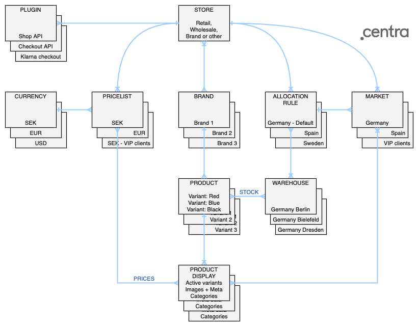

Centra is a natively multi-market (different products or pricing to different customer segments), multi-currency, multi-pricelist and multi-language system. Combined, this flexibility of Centra enables serving a global market from a single Centra instance, and serving individual customer segments with tailored offers for both products and prices, including campaigns and discounts. It is also possible to control what products are visible and/or offered for sale in different markets, and implement local pricing strategies that are independent of language and currency selection. Non-geographical markets can also be defined, e.g., VIP customers, an affiliate influencer’s followers, or employees.

### Store

Store is the basic logical entity in Centra. By default, each Centra instance is created with two stores, Retail and Wholesale, but it is possible to add more. This is useful for customers who want to serve multiple stores (for example, different brands and/or types of products) using a single Centra instance. Each Store contains a number of options controlling behaviour of orders, shipments, customers, invoices, stock, notification e-mails and payments.

Defining a store requires specifying default Pricelist, default Market and selecting locales. Additionaly, each store should be tied to at least one Allocation Rule. Finally, Store can have multiple plugins enabled, which control functions like APIs, payment and shipping methods, data feeds (Facebook, Instagram, Google Merchant etc.) or e-mails.

### Market

Markets divide your store into logical entities, which can be based on Geo-locations (one market per each country the store goods are offered in), or business needs (e.g. "VIP" market offerring goods at limited prices to VIP customers). Products in each market can have different prices, discounts and use different currencies, they also can have completely separate Product Displays, resulting in a different ways the same Products are shown in each Market. Products stock levels are shown based on the configured Allocation Rule.

Markets also control which campaigns and vouchers are available, which shipping options are available, and which Allocation Rule is used to display stock level.

Market can be set by:
* (Prio 1) Store API `PUT /markets/switch`
* (Prio 2) Saved cookie
* (Prio 3) Geo-IP based location
* (Prio 4) Fallback to Store's default Market

### Locale

Locale defines the user's language. For items that are translatable, like custom product attributes, locale controls which translation will be returned via API.

Locale can be set by:
* (Prio 1) Store API `PUT /languages/switch`
* (Prio 2) Geo-IP based location
* (Prio 3) Fallback to Store's default Locale

### Currency

Each currency used in the Store is defined by its ISO code, ISO number, number of decimals and decimal point. You can also specify a prefix, suffix and denominator. These settings are used for display purposes only, they do not affect how the prices are calculated.

### Pricelist

Pricelists control how much your products cost in each Currency and in each Store. Since Pricelists connects to a Product Display, and not the Product itself, Product price can be different in each configured store. Product without a price will be shown, but is not purchasable, which means it cannot be added to a selection.

You can only configure one Pricelist per one Store per one geo-location. This means you cannot have two EUR pricelists selected for geo-location "Spain". However, you can still configure Pricelists using the same Currency for different Markets, for example one SEK Pricelist set for geo-location "Sweden" and one SEK Pricelist with no geo-location connected to Market "VIP clients".

Pricelist can be set by:
* (Prio 1) Store API `PUT /countries/switch`
* (Prio 2) Geo-IP based location
* (Prio 3) Fallback to Store's default Pricelist

### Brand

Since Centra was built mostly to support fashion, Brand is one of the basic (though not obligatory) property of a Product. Brand can be used to group products or to filter API results. Additionally, Brand can be selected as active in zero or more Stores. This will have impact on Showroom FrontEnd - Products without an activated Brand will not be shown.

### Product

A Product is stored in a hierarchical structure, in which the Product is broken down into Variants and Sizes. The Product represents a certain design. Variants are different versions of the same product, typically different colors. Sizes are the different sizes you can buy the style in. This product structure enables very efficient product information management. 

Most information is stored on the Product level, where you find the Folder, Collection and all basic information such as Country of Origin, HS Code and Material Composition. All products have at least one Variant and all Variants have at least one Size, even if it is a one-size product.

The Variant level focuses on media (images) and a few attributes, notably color.

Besides actual size, the Size level stores GTINs (UPC or EAN codes). Stock inventory is stored on the Size level, as the size represents the physical item that exists in a warehouse. 

### Product Display

A Display is, just like a display in a brick-and-mortar store, one or more related items for sale that is arranged and presented in a way that might trigger a purchase. An item for sale might be included in more than one Display. You might for example have a unisex item included both in a Display in the Women’s and Men’s department. When you query the API for what to show on a category page, you will get a set of Displays back, and when you query the API for what to show on a product page, you will get a single Display.

### Warehouse

A Warehouse in Centra is where stock is stored. Warehouse is defined by its name and priority. Each Warehouse can belong to one or more Allocation Rules. When stock is added, either via API, by importing a CSV or via stock editor, it always needs to be added to one of the Warehouses.

### Allocation Rule

Consists of one or more warehouses sorted by priority. One Allocation Rule can belong to multiple markets, but two groups cannot belong to the same market. With the help of a Allocation Rules, you will set for which markets and stores specific warehouses is used for. Each market has exactly one default Allocation Rule.

### Plugin

Plugins are configured in each store separately, and enable additional functionality. For exaxmple: API plugins (Shop API, Checkout API, Showroom API, etc.) enable API access to a Store. Feed plugins (Facebook, Instagram, Google Merchant, etc.) enable data feeds integrations. Payment methods (Klarna, PayPal, Adyen) allow you to add multiple checkout and payment options. Shipping methods enable integrations with shipping and packing services. E-mail triggers (Voyado, MailChimp, Rulemailer) enable advanced e-mail handling, with customer groups, additional formatting and newsletters handling.

Click to learn more about [Plugins](/plugins).
