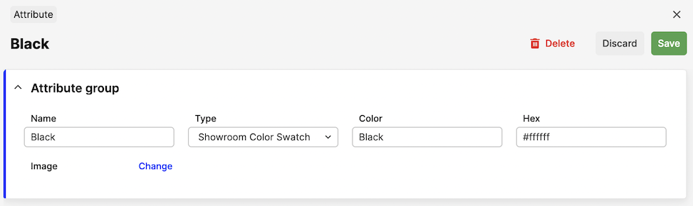
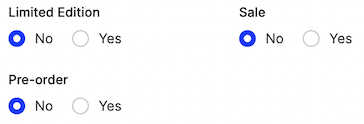
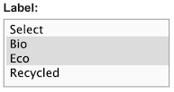
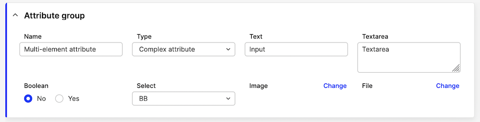
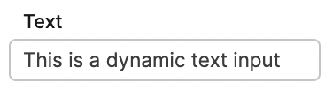

## Custom Attributes

This is how you set up the custom attributes for product, variants, orders and customers.

The following structure is used in the `config.php` to define custom attributes on products, variants, accounts and orders. Attributes allow you to create arbitrary fields that will be available in the API and exports. There are different types of attributes.

The API-outputs defined below are using the Shop API, some differences might apply to other APIs, which will be defined in the corresponding API reference.

### Mapped attributes

The normal attribute on a product or variant is one which is mapped to an attribute object which can contain meta-data. There is a reason for this, for example: if you have a specific Color-attribute that contains the name, hex-code and image of the color. You do not want to upload these values every time, so an attribute is then created, which you then link to the products that should have the color.

The structure looks something like this:

```php
   <?php
   $usr_conf['ATTRIBUTE_TYPES'] = [
       'sh_swatch' => [
         'desc' => 'Showroom Color Swatch',
         'readonly' => true,
         'group' => 'variation',
         'elements' => [
             'color' => ['desc' => 'Image', 'type' => 'image', 'size' => '60x60'],
             'color_text' => ['desc' => 'Color', 'type' => 'textarea']
         ],
       ]
   ];
```

You can then create a new Showroom Color Swatch-attribute under `CATALOG / ATTRIBUTES`:



When this attribute is saved, this attribute option will be listed under the `Showroom Color Swatch`-title in the variant-section of the product:


In the API, the values will come out like this:

```json
   {
      "countryOfOriginName": "",
      "sh_swatch": {
        "color": {
          "type": "image",
          "url": "https://.../client/dynamic/attributes/image_9471.jpg",
          "width": "60",
          "height": "60",
          "mimeType": "image/jpeg"
        },
        "color_text": "#8b0000"
      },
      "markets": {
         "...": "..."
      }
   }
```

### Dynamic attributes

Dynamic attributes are in comparison to mapped attributes not linked to any pre existing attribute, but do have specific data for the specific products. This data needs to be set for each product instead of linking to an existing attribute. The difference between mapped and dynamic is that dynamic uses `"readonly": false` for the attribute.

[notice-box=info]
It used to be that if you had `"readonly": false` on the attribute, only the element with the `text` key would be visible in the API. This meant that if you needed multiple elements you needed multiple attributes as well. To keep with the previous behavior, this is still the case for single-element attributes. For dynamic attributes with multiple elements, every `element` will now be returned in the API as `[attribute-name]-[element-name]`.
[/notice-box]

```php
   <?php
   $usr_conf['ATTRIBUTE_TYPES'] = [
       'limited_edition' => [
         'desc' => 'Limited Edition',
         'group' => 'product',
         'readonly' => false,
         'elements' => [
             'text' => ['desc' => 'Limited Edition', 'type' => 'boolean',
                 'options' => [[1,'Yes'],[0,'No']]
             ],
         ],
       ],
       'promo' => [
         'desc' => 'Promotion',
          'group' => 'product',
          'readonly' => false,
          'elements' => [
              'sale' => ['desc' => 'Sale', 'type' => 'boolean',
                  'options' => [[1,'Yes'],[0,'No']]],
              'preorder' => ['desc' => 'Pre-order', 'type' => 'boolean',
                  'options' => [[1,'Yes'],[0,'No']]]
          ],
        ],
   ];
```

These will show up on the product directly with a `Yes / No`-option:



And in the API, it will show up like this:

```json
...
"limited_edition": "1",
"promo_sale": "1",
"promo_preorder": "1",
...
```

[notice-box=info]
Please note that when the option you've selected is `0/false` the property will not show up in the API at all.
[/notice-box]

### Attribute groups

The `group` on the attribute inside the `config.php` specifies where the attribute should be placed. The following groups exist today:

<!--
```eval_rst
.. list-table::
   :header-rows: 1

   * - Group
     - Description

   * - ``product``
     - Listed under General Attributes on all Products.

   * - ``variation``
     - Listed under each Variant on all Products.

   * - ``order``
     - Listed on each Order.

   * - ``customer``
     - Listed under each Customer.

   * - ``account``
     - Listed under each Account (B2B).

   * - ``sizechart``
     - Listed under each size in a sizechart.
```
-->
| **Group** | **Description** |
| --- | --- |
| `product` | Listed under General Attributes on all Products. |
| `variation` | Listed under each Variant on all Products. |
| `order` | Listed on each Order. |
| `customer` | Listed under each Customer. |
| `account` | Listed under each Account (B2B). |
| `sizechart` | Listed under each size in a sizechart. |

### Attribute element types

Element-type is inside the `elements`-property for the attribute `config.php`:

```php
   <?php
   $usr_conf['ATTRIBUTE_TYPES'] = [
       'limited_edition' => [
         'desc' => 'This is the attribute',
         'group' => 'product',
         'elements' => [
             'text' => ['desc' => 'This is the element-type', 'type' => 'boolean',
                 'options' => [[1,'Yes'],[0,'No']]
             ],
         ],
       ],
   ];
```

The following element types exist today. Not all of them are supported for the Dynamic attributes (which are shown inline on each product/variant), so the support for the different options are listed below:

```eval_rst
.. list-table::
   :header-rows: 1

   * - Type
     - Description
     - Support
     - Options

   * - ``input``
     - .. figure:: images/attribute-input.png
     - Mapped/Dynamic
     - Set class of the input (double the size of the input): ``'class' => 'double'``

   * - ``textarea``
     - .. figure:: images/attribute-textarea.png
     - Mapped/Dynamic
     - Set class of the textarea: ``'class' => 'double'``

   * - ``readonly``
     - .. figure:: images/attribute-readonly.png
     - Dynamic
     - Allows a field without the ability to edit it. Used for showing up IDs or things that should not be changed.

   * - ``boolean``
     - .. figure:: images/attribute-boolean.png
     - Mapped/Dynamic
     - Options for the radio inputs (default is always 0): ``'options' => [[1,'Yes'],[0,'No']]``

   * - ``select``
     - .. figure:: images/attribute-select.png
     - Mapped/Dynamic
     - Default selected is always first option, so keep it as ``[0,'Select']``.

       Like this: ``'options' => [[0,'Select'],['1','AAA'],['2','BBB']]``

   * - ``image``
     - .. figure:: images/attribute-image.png
     - Mapped
     - Size of the image: ``'size' => '600x400'``

       Allowed image formats: ``'jpg','jpeg','png','gif','svg'``

   * - ``file``
     - .. figure:: images/attribute-file.png
     - Mapped
     - No options available.
```

#### Attributes with multi-select value

Selectable mapped attributes can be configured so that multiple values can be selected at once. This is achieved by adding parameter `'multi' => true` to the attribute. For example, a multi-choice `Label` attribute can be configured like this:

```php
    'label' => [
        'desc' => 'Label',
        'group' => 'variation',
        'readonly' => true,
        'multi' => true,
        'elements' => [
            'value' => [
                'desc' => 'Label description',
                'type' => 'text'
            ],
        ],
    ],
```

In Centra, the attribute will look like this:



Its values will be returned as an object in API response:

```json
 "label": {
     "3": "Eco",
     "1": "Bio"
 },
```

### API-output

The API-output differs between Dynamic and Mapped attributes.

**Mapped attributes** will always have a parent element named as the attribute-key. This is how the elements look like from the mapped attributes:

```php
   <?php
   $usr_conf['ATTRIBUTE_TYPES'] = [
     'attribute_field' => [
         'desc' => 'This is the attribute',
         'group' => 'product',
         'readonly' => true,
         'elements' => [
             'text' => ['desc' => 'Text', 'type' => 'input'],
             'textarea' => ['desc' => 'Textarea', 'type' => 'textarea'],
             'boolean' => ['desc' => 'Boolean', 'type' => 'boolean',
                 'options' => [[1,'Yes'],[0,'No']]
             ],
             'select' => ['desc' => 'Select', 'type' => 'select',
                 'options' => [[0,'Select'],['aa','AA'],['bb','BB']]
             ],
             'image' => ['desc' => 'Image', 'type' => 'image', 'size' => '600x400'],
             'file' => ['desc' => 'File', 'type' => 'file']
         ],
     ],
   ];
```



This is how the response from the API looks like:

```json
   {
     "attribute_field": {
       "text": "Text",
       "textarea": "Textarea",
       "boolean": "1",
       "select": "bb",
       "image": {
         "type": "image",
         "url": "https://.../client/dynamic/attributes/image1_4265_png.jpg",
         "width": "600",
         "height": "400",
         "mimeType": "image/jpeg"
       },
       "file": {
         "type": "file",
         "url": "https://.../client/dynamic/attributes/6/image1.png"
       }
     }
   }
```

**Dynamic attributes** however, will be listed inline on the product inside the API.

[notice-box=info]
Remember that only the element with the key `text` will be shown and only if the value is not `0/false`.
[/notice-box]

```php
   <?php
   $usr_conf['ATTRIBUTE_TYPES'] = [
       'attribute_name' => [
         'desc' => 'This is the attribute',
         'group' => 'product',
         'readonly' => false,
         'elements' => [
             'text' => ['desc' => 'Text', 'type' => 'input'],
         ],
       ],
   ];
```



This is how it looks like in the API:

```json
   {
     "attribute_name": "This is the text"
   }
```

The [dynamic attribute element types](#attribute-element-types) supported are all returning simple strings, so they look the same as per above.
