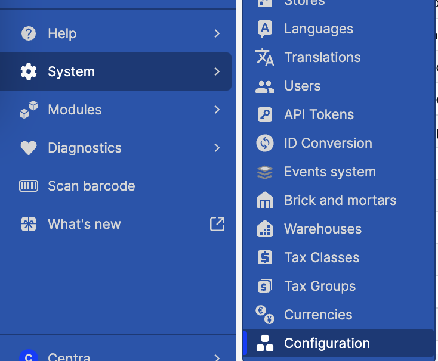
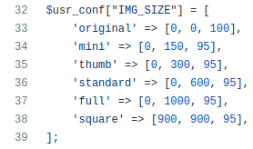
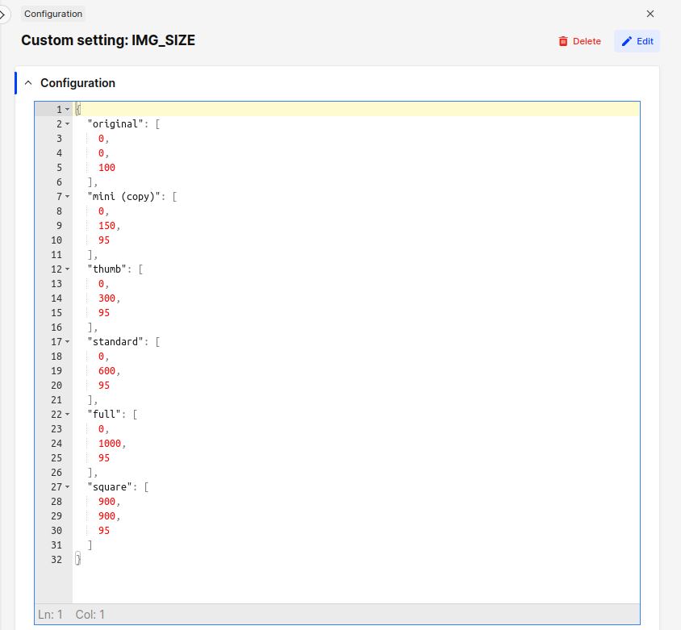
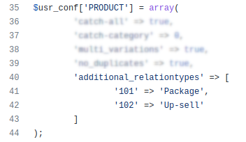
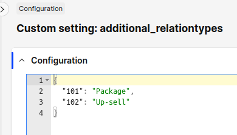
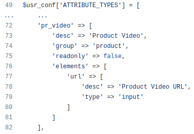
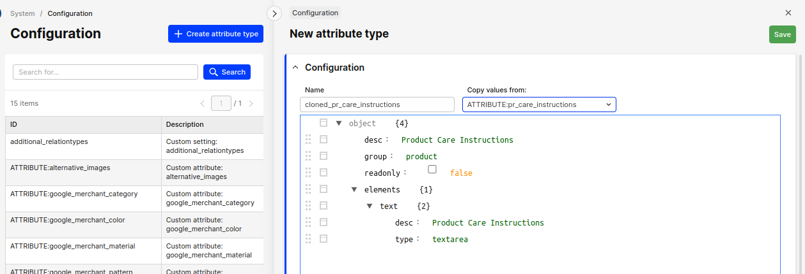

## Custom client configuration

Important parts of client configuration have been moved to the Centra backend panel. Instead of writing to the `config.php` file, one can now edit relevant configuration sections with a JSON editor.

### How to access the new configs

Go to System => Config.

If you can’t see it, it may be because:  
* It hasn’t been enabled on this instance yet. This option is in beta and is controlled by a feature flag at this moment, so you can ask to turn it on for a given instance. We will do it on demand until further notice.  
* You are not logged in as a full-access admin.  
* This is not a QA instance.

### The new config update process

0. (One time) Use a shared Slack channel to let us know you want to turn this feature on.  
1. Do config changes in a QA instance.  
2. Test the changes in the QA instance.  
3. Notify us that the config should be copied to production.

Later, we will introduce some changes to the process, so it will become full self-service. You will be publishing a version of the configuration in QA and picking it up in production instances. Also, configs will be versioned and changes will be listed in the backend.

### Image sizes

There are some predefined image sizes, and you can add custom ones, just like before.

Old config:  

New config:  

### Custom relation types

[https://docs.centra.com/fe-development/fe-elements#custom-relation-types-for-product-displays](Learn how to configure custom display relations in our FE guide).

Relation types should have been moved from the `PRODUCT` section to a separate entry.

Old config:  

New config:  

### Custom attribute types

[https://docs.centra.com/overview/custom-attributes](Learn how to configure custom attributes).

Every attribute type definition is editable separately. The configuration structure remains the same.

Old config:  

New config:  

You may notice that there is no `Edit` button on some attributes. These are not custom types, but belong to plugins. For example, if you have a Google Merchant or Facebook Feed plugin, you will see six attributes they define.

#### Modifying attributes

You can update and delete existing attribute definitions, and add new ones.

Attribute type names are restricted to letters, digits, underscore `_` and minus sign `-`. You cannot change the type name, but you can clone an existing attribute into a new one. Just click on the `Create attribute type` button and pick an existing attribute type to duplicate, then edit this copy.

## Broke something?

Just let us know, and we will restore all configs to the state defined in the client’s repository. Only remember that the synchronization is uni-directional.
