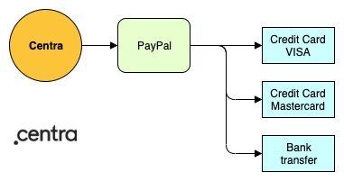
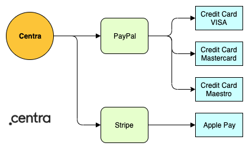

Centra does not integrate directly with any payment methods (like Mastercard). Instead, Centra integrates with Payment Service Providers (PSPs), who in turn integrate with payment methods. There are two advantages of this approach: as a client of Centra, you can support dozens of payment methods with only one or a few agreements with PSPs, while we at Centra don’t need to maintain integrations with dozens of payment methods. 

## Common PSP configurations

#### Scenario 1 - single PSP (recommended)

In many cases it is sufficient to only use one PSP, as long as it covers all payment methods that will be used in your store. For example, PayPal will allow you to accept payments using each of the most popular credit cards or using a bank transfer.

#### Scenario 2 - multiple PSPs (recommended if required)

In case a single PSP does not cover all required payment methods, it is often seen that two or more payment plugins are configured. For example, you can use PayPal to cover card payments, and add Stripe checkout to accept Apple Pay payments as well.

#### Scenario 3 - PSP in PSP (not recommended unless necessary)

It is possible to configure PyaPal to work internally as an additional payment method inside Klarna Checkout. However, this complex setup is prone to errors, so it is only recommended if forced by contractual agreements with the PSPs.

[notice-box=info]
Each payment plugin can be restricted to specific Markets, Pricelists or Countries. For example, you can configure separate PayPal plugins for EU and the US, each of them enabled for payment methods popular in those markets.
[/notice-box]

## Payment Service Providers and their supported payment methods

Key payment services providers supported by Centra are: Adyen, Klarna, PayPal and Stripe.

[notice-box=alert]
Sorry, this chapter is still under construction. Please check again later, or contact us directly to get more information.
[/notice-box]

<!--
|  | Adyen | Klarna | PayPal | Stripe |
|---|---|---|---|---|
| Credit card - Mastercard | ✓ | ✓ | ✓ | ✓ |
| Credit card - Visa | ✓ | ✓ | ✓ | ✓ |
| Credit card - Maestro | ✓ | ✓ | ✓ | ✓ |
| Credit card - Amex | ✓ | ✓ | ✓ | ✓ |
| Bank transfer |  |  |  |  |
| Apple Pay |  |  |  | ✓ |
| Google Pay |  |  |  |  |
| Swish | ✓ |  |  |  |
| Alipay | ✓ |  |  |  |
| UnionPay | ✓ |  |  |  |
| WeChat Pay | ✓ |  |  |  |
| Trustly | ✓ |  |  |  |
| Buy now, pay later |  | ✓ |  |  |
| BLIK |  |  |  |  |
| Sofort | ✓ |  |  |  |
| Open Banking | ✓ |  |  |  |
| Ideal NL |  | ✓ |  |  |
-->
