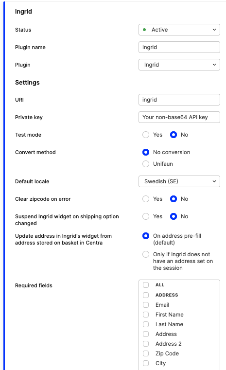
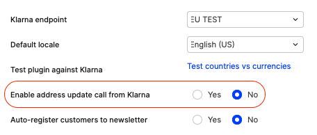

Ingrid is a shipping platform that can be used together with Centra in order to present your shoppers with rich shipping options, including a number of delivery providers, address searching, support for free shipping vouchers and more.

## Setting up the Ingrid plugin in Centra

To set up the Ingrid plugin, head to SYSTEM->STORES and choose the store you want to use Ingrid in. The minimum requirements for the plugin to work are the following:

1. A private key in the proper format (non-base64 encoded) is supplied,
2. A default locale is selected,
3. The plugin is active.

Also make sure that you are setting the `Test-Mode` option accordingly.

The settings in the plugin affect the integration in the following way:

- **Test-Mode**: If set to `yes` Centra will connect to Ingrid's `stage` environment, if set to `no` Centra will connect to Ingrid's `production` environment.
- **Convert method**: A legacy option to convert the shipping method codes from Ingrid into the codes used by the 3PL, this is however handled in Ingrid's admin nowadays.
- **Default Locale**: The locale (language) the widget will be shown in by default, if a proper locale is set on the selection Centra will tell Ingrid to try to use the selection's language instead. If Ingrid doesn't support the locale on the selection, the default locale will be used.
- **Suspend Ingrid widget on shipping option changed**: If set to `yes` Ingrid's widget will be put into a "loading state" whenever the shipping option is changed by the user until Centra has recevied the update. It is important that your front end picks up those changes and resumes the widget when ready.
- **Update address in Ingrid's widget from address stored on basket in Centra**: Centra will always try to populate the Ingrid widget with the selection address if Centra has received it before Ingrid, however other address updates will depend on this setting.
  - If set to `On address prefill (default)` the address the widget uses to present the shipping options will be updated from Centra on the [PUT /payment-fields endpoint](https://docs.centra.com/swagger-ui/?api=CheckoutAPI#/4.%20selection%20handling%2C%20checkout%20flow/put_payment_fields)
  - If set to `Only if Ingrid does not have an address for the session` - prevents the [PUT /payment-fields endpoint](https://docs.centra.com/swagger-ui/?api=CheckoutAPI#/4.%20selection%20handling%2C%20checkout%20flow/put_payment_fields) from updating the address in the Ingrid session.
- **Required fields**: Until all required fields are filled out on Centra's selection, Centra won't try to create a session towards Ingrid. Required checkout fields can be configured in the Checkout API plugin settings. No selected fields means none are required (default).
- **Pricelist restrict**: Only use this plugin instance for the selected pricelist(s), empty means it's available for all.
- **Market restrict**: Only use this plugin instance for the selected market(s), empty means it's available for all.
- **Country restrict**: Only use this plugin instance for the selected shipping countries, empty means it's available for all.
- **Locale restrict**: Only use this plugin instance for the selected locale(s), empty means it's available for all.



## Which functionality from Ingrid does Centra implement?

In Centra's implementation with Ingrid's SIW API, Ingrid is responsible for:

- Presenting a widget in the checkout,
- The widget allows you to select the desired shipping option for your order.
- Allowing Centra to save data, saved as _Custom attributes_ on the order, needed for the merchant to be able to fulfill the order correctly based on the selected options.

## What happens "behind the scenes" between Centra and Ingrid?

Ingrid is initiated the first time for the selection when the following criteria are met:

- The Ingrid plugin is configured on the same store the selection belongs to and activated,
- You have added items to your selection,
- The requirements of locale, market, pricelist and country configured in the plugin are satisfied.

When the Ingrid session is initialized Centra will save the ID of the session, and update the shipping price according to the setup in Ingrid.

### When does Centra update Ingrid?

- All item changes will be communicated to Ingrid if Centra has an active Ingrid session for the selection, as well as voucher changes.
- Centra will update the shipping cost of the selection with the cost returned by Ingrid after the update.
- Address updates on the selection are only sent to Ingrid if they are made by the [PUT payment-fields](https://docs.centra.com/swagger-ui/?api=CheckoutAPI#/4.%20selection%20handling%2C%20checkout%20flow/put_payment_fields) endpoint in Centra's CheckoutAPI (or [PUT /selections/{selection}/checkout-fields](https://docs.centra.com/swagger-ui/?api=ShopAPI#/default/put_selections__selection__checkout_fields) in ShopAPI) and if the `Update address in Ingrid's widget from address stored on basket in Centra:` option in the Ingrid plugin is set to `On address pre-fill (default)`. This is to prevent Centra from overriding any choice made in the Ingrid widget by the user, which could cause a change of Shipping option, depending on the setup. If Centra already has address data at the time when the Ingrid session is created, this will be sent to Ingrid (since there is nothing to override).
- On country / state change.
- All data is sent to Ingrid after the order is placed in Centra, including the final cart and customer address. Centra saves the data returned from Ingrid as `Custom Attributes` on the order.

[notice-box=info]
NOTE: If Ingrid didn't have any address data previously on the session this can cause Ingrid to return a different shipping option, depending on the setup in Ingrid, than previously selected on the session. However since the order is already placed the price won't be updated.
[/notice-box]

### When does Ingrid update Centra?

- On events from the widget forwarded to Centra from the frontend partner (see Frontend Implementation).
- Centra always updates shipping price based on what Ingrid respond when Centra updates Ingrid.

## Frontend implementation

### General considerations when implementing Ingrid in the Checkout

Depending on the layout and PSP offerings in your Checkout there are a few things to consider when implementing the Ingrid widget.

The approach Centra takes is to try to respect the choices made in the widget to our best ability.

#### Scenario 1: Multi stage Checkout

This is when the checkout is divided into steps where you first need to complete the previous step before being able to continue to the next step.
The steps can be:

1. Enter your address,
2. Load Ingrid widget,
3. Load the payment.

In this scenario the Ingrid plugin usually requires the `zip code` (via [PUT payment-fields](https://docs.centra.com/swagger-ui/?api=CheckoutAPI#/4.%20selection%20handling%2C%20checkout%20flow/put_payment_fields)) to have been entered before it tries to initialize the Ingrid session.
Since the payment is initiated after Ingrid, which has already received the address data, the payment service provider is up to date with the shipping price from Ingrid.

NOTE: if another address than the one provided in `PUT /payment-fields` is sent in the `POST /payment` call in step 3, Centra will _NOT_ send the new address to Ingrid.

#### Scenario 2: Address form + Ingrid, showing at the same time

In this scenario you are likely to run into missmatches in the address between Ingrid and Centra since people might not enter the address in Ingrid when they see the address field.
If the address is entered in Ingrid there should be a `centra_checkout_callback` event triggered containing the address data, which will override the `address` data in Centra. The address form should be updated with this information, if it's not already filled out.

#### Scenario 3: "Address after payment" (PayPal / KCO / Qliro) + Ingrid showing at the same time

If you have PayPal enabled as your payment method and the plugin is configured as `Override Shipping Address: No` the address data will be taken from the address the customer added into PayPal. For Klarna Checkout, if any address has been entered into Ingrid, we will try to prefill Klarna Checkout with the data we've already received, however this might not populate it sometimes if you have the cookie and getting the address prefilled by them in the widget.

This might also cause address mismatches between Ingrid and Centra since there is little control over what the client enters in the widgets when set in this mode.

One more setting which can be useful in this scenario is `Enable address update call from Klarna`. This is sometimes required when Centra reliably needs to get the full address from Klarna. In simple scenarios, the address entry and payment processing can be all processed inside the Klarna widget, and Centra is only later informed about the result of the payment after the authorization is complete. However, there are two use cases when enabling this setting is recommended:
- If you're using PayPal inside Klarna, especially when `Override shipping address` setting is enabled, Centra will need to be informed about address change coming from PayPal to Klarna
- If you have any tax rules based on zip codes (city/county tax), Centra needs the full address from Klarna in order to apply the right tax rules



## Problems that can occur

### Different address in Ingrid and Centra

When the customer has completeled the payment flow Centra will send the final address address to Ingrid to finalize the session on their end, Ingrid will then return the final shipping option depending on that address and the choice the customer has made on the session.

The logic is the following:

- If the choice is a pickup option type and a pickup location has been chosen it will not change,
- If it's a home delivery option and the chosen carrier is not available in the region sent to Ingrid by Centra, Ingrid will return the default shipping option in that region.

[notice-box=info]
Ingrid is aware of this and informs the customers in their onboarding that it can happen
[/notice-box]

### Sending updates from Ingrid's widget to Centra

The Ingrid widget exposes a client side API for reacting to changes that happen in the widget.

In both Checkout API and Shop API Centra provides a `centraCheckoutScript` which wraps these and exposes them as Events that you should listen to and forward to Centra. This script is exposed as `selection.centraCheckoutScript` in CheckoutAPI and as `centraCheckoutScript` in the SelectionResponse in ShopAPI. If this script is present in the response you should embed it into the DOM on your Checkout page. After this you can access it via `window.CentraCheckout`

[notice-box=alert]
Important: Make sure that the widget you are interacting with has loaded properly before trying to initiate it, since the widget's exposed object on the browser's window must be present.
[/notice-box]

In addition to that you need to register an eventListener for `centra_checkout_callback`, where the callback should forward the `event.detail` data to [PUT payment-fields](https://docs.centra.com/swagger-ui/?api=CheckoutAPI#/4.%20selection%20handling%2C%20checkout%20flow/put_payment_fields).

```javascript
const sendEventToCentra = async (e) => {
  const res = await api.paymentFields.paymentFieldsUpdate(e.detail.detail, {
    token: getToken(),
    cancelToken: "paymentField-request",
  });
  window.CentraCheckout.resume(e.detail.additionalFields.suspendIgnore);
};

document.addEventListener("centra_checkout_callback", sendEventToCentra);
```

## Reflecting backend updates in the Ingrid widget

As Centra sends all cart updates to Ingrid the widget needs to know when it should load the lastest data from its backend. The same API that exposes the event listeners also provides a mechanism for suspending it and resuming the widget while a backend update happens: `window.centraCheckout.suspend()` and `window.centraCheckout.resume()` which should be called before and after a call to Centra has been made that modifies the cart.

Cart modifications are the following:

- Modifying the order items (changing quantity / removing) in the checkout,
- Adding a "cross-sell product" to cart in the checkout,
- Adding / removing a voucher in the checkout,
- Updating the address via [PUT payment-fields](https://docs.centra.com/swagger-ui/?api=CheckoutAPI#/4.%20selection%20handling%2C%20checkout%20flow/put_payment_fields), if the address form is used to initiate a payment widget.

Example:

```javascript

const itemUpdate = async (item, quantity) => {
    window.centraCheckout.suspend();
    await api.lines.linesUpdate(
        {
    		item,
    		quantity
        },
        token: getToken(),
    );
    window.centraCHeckout.resume();
}
```
## Limitations

### Subscriptions

Ingrid v1 integration does not support subscriptions.
When a subscription is added to the basket, the Ingrid v1 widget will not load in the checkout. This is designed to prevent any interference or conflicts between the widget and the subscription management process.
