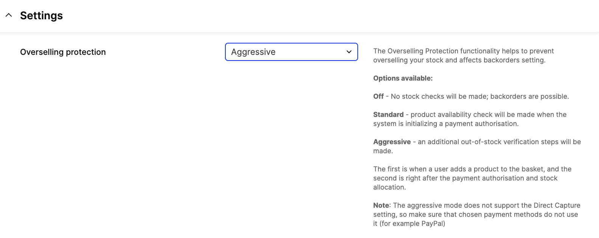

## How to turn on overselling prevention

The Overselling Prevention functionality helps to prevent overselling your stock and affects backorders setting.
In Store Setting you can find overselling prevention configuration.



Options available:
* **Off** - No stock checks will be made; backorders are possible.
* **Standard** - Product availability check will be made when the system is initializing a payment authorisation.
* **Aggressive** - Additional out-of-stock verification steps will be made.
The first is when a user adds a product to the basket, and the second is right after the payment authorisation and stock allocation.

[notice-box=alert]
The aggressive mode does not support the Direct Capture setting, so make sure that chosen payment methods do not use it (for example PayPal)
[/notice-box]

## How does it work?

The additional stock check is performed during given stages:

### **Add item to selection (aggressive mode only)**

When overselling prevention mode is set to aggressive, stock will be checked in all endpoints for add/modify items in basket.

[notice-box=info]
Overselling prevention will remove missing stock from basket and add `unavailable` data to response if requested items are missing.
[/notice-box]

**Shop API Endpoints:**
* `POST /selections/{selectionId}/items/{item}`
* `POST /selections/{selectionId}/lines/{lineId}/quantity/{q}`
* `PUT /selections/{selectionId}/lines/{lineId}/quantity/{q}`

**Checkout API Endpoints:**
* `POST items/{item}`
* `PUT /lines/{line}/quantity/{q}`
* `POST /lines/{line}/quantity/{q}`

**Responses:**

When only part of requested items is out of stock `HTTP 200 OK` will be returned with `unavailable` data.
```json
{
  "unavailable": [
    {
      "item": "1-1",
      "product": "1",
      "originalQuantity": 5,
      "unavailable": 5,
      "available": 0
    }
  ]
}
```

When all requested items are out of stock `HTTP 410 Gone` will be returned with `unavailable items` error.
```json
{
  "errors": {
    "stock": "unavailable items"
  },
  "unavailable": [
    {
      "item": "1-1",
      "product": "1",
      "originalQuantity": 5,
      "unavailable": 5,
      "available": 0
    }
  ]
}
```

### Initialize payment `POST /payment` (standard and aggressive mode)

**Responses:**
When any requested items are out of stock `HTTP 410 Gone` will be returned with `unavailable items` error.
```json
{
  "errors": {
    "stock": "unavailable items"
  },
  "unavailable": [
    {
      "item": "1-1",
      "product": "1",
      "originalQuantity": 5,
      "unavailable": 4,
      "available": 1
    }
  ]
}
```

### Payment authorisation `POST /payment-result` (aggressive mode only)
[notice-box=info]
Overselling prevention in payment result works for now in Adyen Drop-in and Stripe Checkout.
[/notice-box]

[notice-box=alert]
If any item in selection has missing stock, payment will be cancelled and basket items updated. 
To finalize the order new payment initialization has to be called `POST /payment`.
[/notice-box]

**Responses:**
When any requested items are out of stock `HTTP 410 Gone` will be returned with `unavailable items` error.
```json
{
  "errors": {
    "stock": "unavailable items"
  },
  "unavailable": [
    {
      "item": "1-1",
      "product": "1",
      "originalQuantity": 5,
      "unavailable": 2,
      "available": 3
    }
  ],
  "cancellation": {
    "grandTotalPrice": "200.00 SEK",
    "grandTotalPriceAsNumber": 200,
    "currency": "SEK"
  }
}
```
