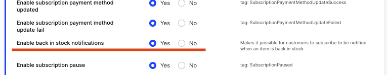

## What is required to enable Back in stock?

An E-mail trigger plugin with Back in stock support

## How does Back in stock feature work?

### Subscribing

Customers can subscribe to products using both [Shop API](https://docs.centra.com/swagger-ui/?api=ShopAPI&urls.primaryName=ShopAPI#/6.%20customer%20handling/post_back_in_stock_subscription) and [Checkout API](https://docs.centra.com/swagger-ui/?api=CheckoutAPI#/6.%20customer%20handling/post_back_in_stock_subscription) store fronts. This information is then forwarded to the provider used. 

Required information
* E-mail: which e-mail to notify. when Checkout API is used, this can be left out if customer has logged in.
* Item: the item to be notified about.
* ShipTo: country and if available state. since  we allow for different warehouses to serve different parts of the world we need to know where the customer is so we only notify when item is available in this region. 

Optional:
* Language: the language to use. When using Checkout API it will be taken from session if not provided.

### Getting notified

When stock is added in Centra we will check if the modified item has any susbcribers waiting for notification and if so we tell the provider how much stock is available which allows them to send an appropriate amount of notifications.

## E-mail providers with support for back in stock

### Rule

#### Configure

* Setup the E-mail trigger plugin for "Rulemailer v4"
* Provide an API key 
* Set "Enable back in stock notifications" to "yes"

#### How to use

When a subscriber requests to be notified of an item the tag `Rule - Waiting For Product Alert`  will be applied, and then when stock is updated and the subscriber should be notified the tag is replaced with `Rule - Product Alert Triggered`, theese tags can be used to setup automation for notifying your subscribers. Refer to Rule documentation for details.

The fields that are available as localised will be separate fields named as the normal field followed by an `_` and the language ISO 639-1 code. If the product has not yet been translated to this language this field will contain the unlocalised product name, making it always safe to use the localised field so long as the language remains active in Centra.

Example: 
> If you have German localisation configured and set in centra the field `DisplayName_de` will be available and will contain the german localised version of the display name. If you also have Spanish as language but have not yet added localisation for this the field `DisplayName_es` will be available and contain the same text as the `DisplayName` field.

#### Available Fields

| Field name | Contains | Localized? |
|---|---|---|
| DisplayName | Display name | yes |
| DisplayUri | Display URI | yes |
| Brand | Brand name | no |
| DisplayImage | first image for display in selected size, without domain | no |
| Variant | Variant name | yes |
| Excerpt | Short description | yes |
| Description | Description | yes |
| SKU | Product number + Variant number | no |
| SizeSKU | Size SKU | no |
| EAN | GTIN (EAN/UPC) | no |
| Size | Size name | no |
| PriceInRegion | Item price in subscribers region + currency, formated as defined in centra | no |
| PriceInRegionAmount | ietm price for subscribers region as a number | no |
| CurrencyInRegion | currency ISO code for subscribers region |
