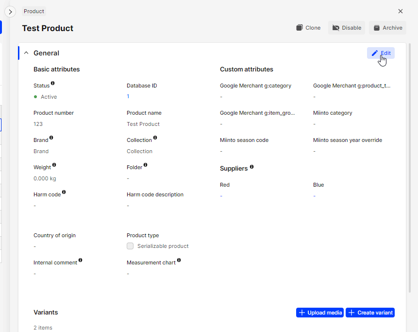

## Caching schemes for Checkout API

- Client-side caching: Caching is done on the client side, typically in the browser, 
to reduce network traffic and improve performance by storing responses from the server and reusing them when possible.

- Server-side caching: Caching is done on the server side, using a cache layer in front of the application server,
to reduce the number of requests to the backend and improve response times.

- Edge caching: Caching is done at the network edge, such as a CDN, to reduce latency and offload traffic from the origin server.

- Hybrid caching: Combination of client-side, server-side, and edge caching for optimal performance and scalability.

Each of these caching schemes has its own advantages and trade-offs.

### Use webhooks for cache invalidation

Webhooks can be used for cache invalidation by sending a request to a cache server whenever a change occurs in the data source,
which triggers the cache server to invalidate its cached version of the data and retrieve a fresh copy. 
This allows for real-time updates to be reflected on the cached data without the need for manual intervention or scheduled cache refreshes.

#### Example flow
1. Edit product name in AMS

2. Payload received at configured webhook url

```http
POST /configured/webhook/url HTTP/1.1
Host: your-backend.eu
Content-Length: 36
Accept: */*
Content-Type: application/x-www-form-urlencoded
X-Centra-Signature: t=1676025421,v1=fd2fbb2453344f4cc5eb0e56ba12db7f4727981a7d33c50e0c08eac5bbe93d2a
Accept-Encoding: gzip

payload=%7B%22products%22%3A%5B%221%22%5D%7D
```

Raw parsed data:
```json
{"products":["1"]}
```

3. Payload from this webhook can be directly used in `POST /products` to get the updated data:
Response:
```json
...,
"products": [
    {
        "product": "1",
        "name": "Test",
        ...,
    }
],
...
```

#### Webhook repeating explained

Webhook retrying refers to the process of attempting to resend a failed webhook request multiple times, 
in case the first attempt failed due to a temporary error, such as a network issue or a server timeout. 
The retrying mechanism is typically implemented in the webhook sender, 
and it works by resending the same request to the receiver endpoint after a specified interval, 
until either the request is successfully delivered or the maximum number of retries is reached.
The retrying logic can be configured to adjust the retry interval, the number of retries,
and the conditions for determining if a retry is necessary. 
Retrying helps to ensure that important data is not lost and that the receiver can receive the latest updates in a timely manner.

##### How to enable webhook repeating in Centra:
- go to webhook plugin settings
- enable `Number of retries after failure` setting

More on it [here](/plugins/centra-webhook).

### Mechanism for rebuilding the whole cache

A mechanism to rebuild the whole cache may be necessary in scenarios where the cache becomes stale 
or invalid due to network issues preventing the reception of webhooks, leading to outdated data being served. 
This can result in inconsistencies in the data that is being served, which can lead to incorrect or unexpected results.
A mechanism to rebuild the cache from scratch, also known as cache rebuilding, 
can address this issue by allowing the cache to be recreated from the original data source.

Cache rebuilding can be triggered manually, such as through an administrative interface, or automatically, 
such as through a scheduled task or when certain conditions are met, such as the detection of stale data 
or a failure of the webhook mechanism. This ensures that the cache remains fresh and consistent with the underlying data,
even in the face of network issues or other unexpected events.

It's worth mentioning that **Centra's webhook implementation does not guarantee that all webhooks will be delivered 
and does not guarantee the specific order of those webhooks**.  For this reason it is necessary to prepare a mechanism 
for whole cache rebuilt. The rebuilt might take some time and for that time the old cache should be used, 
until the rebuild is done. Then after completion the out-of-date cache should be swapped for an up-to-date one.

### Requirement of caching for larger clients

Caching is required for large datasets because it helps to reduce the load on the data source 
and improve the performance of the system by storing a copy of the data in memory. 
When a request is made for data, the cache can be quickly checked to see if the requested information is already stored. 
If it is, the cached data can be returned without having to retrieve the information from the original data source, 
which can be time-consuming, especially for large datasets.

Caching can significantly improve the response times for applications that deal with large datasets,
as it eliminates the need for constant trips to the data source, 
and reduces the amount of data that needs to be transferred over the network.
By reducing the amount of data that needs to be transmitted and processed, 
caching can also help to reduce the load on the underlying systems, 
which can improve the overall stability and reliability of the system.

Although theoretically possible to use Checkout API directly from the end-customer's browser,
for medium to large clients additional caching layer is a must.

### How caching can avoid limiting the API requests in the future?

Caching can help to avoid limiting the number of API requests by reducing the number of requests made to the API. 
Many APIs have rate limits that restrict the number of requests that can be made within a specified time period. 
This is done to prevent overloading the API server and to ensure that the API remains available to all users.

By caching the API responses, subsequent requests for the same data can be served from the cache, 
instead of making a new request to the API. This reduces the number of API requests and helps to avoid exceeding 
the API's rate limits. Additionally, serving data from the cache can also improve the response time, 
as it eliminates the need to wait for a response from the API server. 
This can improve the user experience and make the application more responsive.

Caching can also help to conserve bandwidth, as it reduces the amount of data that needs to be transmitted over the network.
This can be especially important for applications that rely on API data and need to make frequent requests. 
By reducing the number of API requests, caching can help to ensure that the application remains within 
the API's rate limits and that the API data remains available and reliable.

Although Checkout and Shop APIs are not rate limited right now we might add that limitation in the near future 
and then the caching will be a requirement. Implementing the caching of your own can help you prepare for any future
API rate limiting that will be imposed.

## Webhook handling

Webhook handler should only be responsible for receiving, validating and saving the webhook request.
The actual recaching should be done asynchronously.

Separating the recaching from the webhook handler can help to ensure that the webhook handler is working correctly 
and that the recaching is being triggered as expected.

Overall this approach can improve the scalability, reliability, and maintainability of your system.

To do that you should:
- As fast as you can after receiving the webhook:
  - log it
  - verify
  - enqueue a job for the recache
- Process jobs in separate process than webhook handler

Be sure to **throttle webhook job processing to avoid future API limiting**.
This will help prevent overloading the API server and ensure the stability and reliability of the system.

## Proxying Checkout API request

Proxying is the process of routing API requests through an intermediary server before they reach the API server.
The intermediary server acts as a proxy between the client and the API server, 
forwarding the API requests on behalf of the client and returning the responses to the client.

The benefits of using a proxy for API requests include:
- Caching
- Security
- Load balancing
- Rate limiting
- Filtering

### Accessing data unavailable in direct web browser calls

Proxying API requests can be used to expand the API request response by adding additional data to the response
before it is returned to the client. This can be accomplished by having the proxy server modify the API request, 
adding additional parameters or modifying existing parameters, before forwarding the request to the API server. 
The proxy server can then add the additional data to the API response before returning it to the client.

For example, a proxy server can be used to add information such as metadata, user information, 
or additional data sources to the API response. This can be useful for adding context to the response 
or for integrating data from multiple sources into a single API response.

Expanding the API response through proxying can also be useful for transforming the response data into
a different format or structure. This can be useful for frontend that require a specific format 
or structure for the API response, without requiring changes to the API server.

### Exposing shared secret

Making the shared key that is used for authentication and authorization publicly accessible must be avoided 
at all costs because it can have serious security implications.

Shared secrets are used to grant access to protected resources and to verify the identity of the client. 
If a shared secret is exposed, it can be used by unauthorized entities to gain access to the protected resources, 
potentially leading to data theft, manipulation, or other malicious activity.

This is why **you should never use Shop API or Integration API directly in browser** as this will lead to exposing the shared secret, 
unless requests are proxied by your backend. 

When we confirm exposing a shared secret (i.e. by detecting a direct browser usage) we will revoke the questioned key, rendering it useless for the intended purpose. 
This can result in downtime, loss of data, and other adverse effects.

Secret rotation will be required in such case.

### Rotating the secret

Secret rotation helps reduce the risk of a shared secret being compromised. 

By rotating secrets regularly, you reduce the amount of time that a secret is in use and increase the likelihood
that any compromise will be detected and addressed before it can cause significant harm. 
This helps to ensure the continued security and reliability of your system.

Additionally, rotating secrets can help to mitigate the risk of exposure due to misconfiguration or human error, 
such as leaving a secret in a public repository or in a codebase that is accessible to unauthorized parties. 
By rotating secrets, you limit the exposure of any given secret, reducing the potential impact of a security breach.

## Pagination

Pagination is a technique used to divide a large dataset into smaller, manageable chunks, or "pages". 
It is important to use it because it allows to efficiently retrieve and process large amounts of data without
overwhelming the API server or the client's own processing capabilities.

APIs often deal with large amounts of data, such as lists of products, images, or other information. 
Retrieving all of this data at once can cause performance issues for both the API server and the client, 
as it can result in slow response times, increased network traffic, and increased memory usage.
In some occasions it can also trigger server side failures due to memory exhaustion.

Pagination solves this problem by allowing the API to return only a portion of the data at a time.
The client can then request additional pages of data as needed. This reduces the amount of data that needs 
to be transmitted and processed at any given time, improving performance and reducing the risk of errors or failures.
It allows the client to retrieve only the data it needs and to process the data in a way that is most efficient for their use case.

Pagination is prerequisite in product listing, otherwise the responses might miss products or return errors.

Example paginated request to `POST /products`:
```json
{
    "market": 1,
    "limit": 50,
    "skipFirst": 250
}
```

### Keep limits low

It is recommended to use low limits when paginating for several reasons:
- Performance: it reduces the amount of data that needs to be transmitted and processed at any given time, 
improving the performance of the API server and client.
- Scalability: it allows the API to scale to handle larger amounts of data and clients without sacrificing performance or efficiency.
- User experience: Low limits allow the client to retrieve data in small, manageable chunks, 
improving the user experience and reducing the risk of errors or timeouts.
- Error handling: In the event of an error or timeout, low limits allow the client to easily resume data retrieval
from the last successful page, reducing the need for manual error handling.

You should always specify a reasonable page limit (<u>**surely not</u> `99999`**). 
**We might enforce the maximum number of elements per page in the future**.

### Keep response size small

There is no strict limit to the maximum size of a REST API response,
but it is generally recommended to keep response sizes small to improve performance and avoid timeouts.