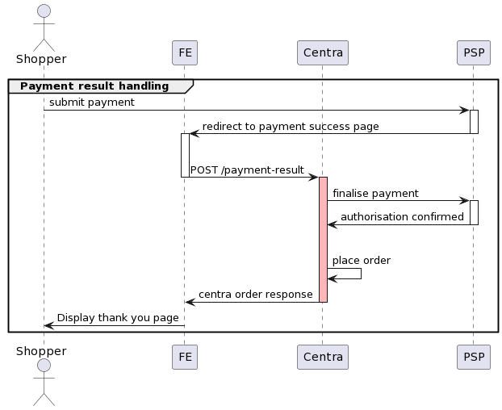

This guide aims to explain the proper use of the `POST /payment-result` endpoint in the Checkout API or Shop API, which is called after payment has been submitted by the customer in the checkout. 
It also aims to ensure understanding of potential risks posed by improper implementation and minimizing their impact.

### POST /payment-result

This endpoint is called from frontend side on the success page as a result of a redirect from the Payment Service Provider after the customer has submitted a payment successfully.
Using this endpoint correctly is crucial as it triggers the successful completion of the payment process and order placement in Centra. 

### Preventing updates during processing result of the payment
It's important to note that following the completion of the payment process, all kinds of updates to the selection must be prevented due to their potential to introduce inconsistencies between the state of the selection in Centra and state of the order on PSP side.
The time slot during which updates should be prevented is marked red on the below diagram.

For instance, a situation may arise where a customer leaves the payment success page before the response from `POST /payment-result` request is back, triggering for example one of the following scenarios:

- update of the selection's country to a different one than the one used in the checkout
- update of the selection's currency to a different one than the one used in the checkout
- update of the selection's shipping method to a default one which was different than the one used in the checkout

All of these scenarios introduce risk of altering the order total in Centra and causing a discrepancy between state of the order on PSP side and state of the order in Centra.
This could ultimately result in the undesirable outcome of charging the customer without properly placing an order in Centra.
