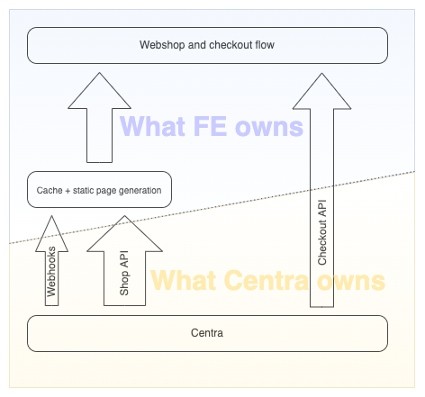

## Why does Centra provide two different webshop APIs

Shop API is our original webshop API, designed in the times when the Internet was older. Stateless REST APIs were taking over, and no one really understood the need to go stateful, respecting the context of the webshop user.

Few years later we realised that stateless is not great in the world where you try your best to save up on bandwidth, while you're also exposing too much unnecessary data to too many actors. We therefore wrote Checkout API, which was stateful and more byte-conservative, which gave us great options to optimise your API responses based on the context of your selection.

Today we find ourselves in a new Internet, where static page generation and smart caching are very much desired, and we realised that stateful Checkout API is not always the best solution to feed the middle-ware servers with data, where the output of the API depends on the context of the shopper. Once again, we realise that an API that serves all available data, always, actually posesses a true value when it comes to fetching all required data, like when you're building your caches.

## The high-level concept of a hybrid FE solution

In short:  
* Shop API builds the shop's backend, the backbone of your front end  
* Checkout API builds the shop's checkout experience, from entering the website to a successful checkout (or at least a [Cart Abandonment](/plugins/cartabandonment) email)  
* Centra Webhooks are used to only trigger updates of relevant data  

[notice-box=info]
In case of a network or application failure, remember to always include a mechanism to completely re-build your middle-ware cache from scratch. Use it as a failsafe after unplanned outages, where individual webhooks might have been lost.
[/notice-box]

## The one big thing in common

Both Shop and Checkout APIs use the same `product` IDs (which are [display item IDs](/fe-development/fe-elements#why-do-i-see-different-product-ids-in-the-centra-backend-and-in-checkout-api), meaning the product variants activated on a store display. These are the same IDs that are returned by the [Centra Webhook plugin](/plugins/centra-webhook) activated in a `Checkout API` mode. Therefore, same webhook events can be used by both APIs, for both back-end (Shop API) and front-end (Checkout API) functions.

Same `product` and `item` IDs are used by [/products](https://docs.centra.com/swagger-ui/?api=CheckoutAPI#/5.%20product%20catalog/post_products) and [/items](https://docs.centra.com/swagger-ui/?api=CheckoutAPI#/2.%20selection%20handling%2C%20cart/post_items__item_) endpoints in both Shop and Checkout APIs.

## Characteristics of Checkout API

    + Newer Centra REST webshop API  
    + Stateful  
    + Returns only data relevant for session  
    + Small API response sizes  
    + Includes all most recent webshop functions  

    - Difficult to poll multiple markets / pricelists /
warehouses / languages at once  
    - Building a cache / static page generation
requires multiple API calls per each product  

## Characteristics of Shop API

    - Older Centra REST webshop API  
    - Stateless  
    - Returns all data, always  
    - Large API response sizes  
    - Not all latest webshop functions available  

    + By design returns products in all markets /
pricelists / warehouses / languages at once  
    + Building a cache / static page generation
requires much fewer number of API calls  

Basically, in Shop API each [GET /products/{productId}](https://docs.centra.com/swagger-ui/?urls.primaryName=ShopAPI#/default/get_products__product_) API call returns product data
in every market / pricelist / warehouse / language



### Known limitations of Shop API

Current known problems:  
    - Minimal data returned for each `relatedProducts`, 
requiring one API call per each product ID  
    - Unable to fetch multiple product IDs at once
