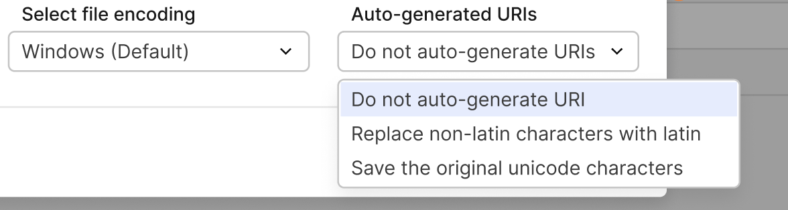

URI (Uniform Resource Locator) provides a standard way to identify and locate resources on the Internet.  In Centra URIs are used to get access to the following resources:

- Brands
- Campaigns
- Categories
- Collections
- Product Displays
- Localization

URIs can be changed and used to improve SEO optimization.

In Centra users can manipulate URIs using AMS or APIs.

### URIs in AMS

- Creating (Editing) URI in Centra:

In Centra, for creating(editing) a Brand user can go to:  `GENERAL / BRANDS`  
There user can fill Brands name, URI, and other fields.

URI can contain Unicode characters(without smiles) light form of transformation will be applied.

[notice-box=info]
If a URI is not provided, Centra will try to generate one:

The brand name will be used for generating URI.

All unnecessary special signs will be removed

Non-Latin characters will be removed.
[/notice-box]

- Localization URIs in Centra

In Centra URis for products can be updated per translations `System / Translations / Product`

Also, translations can be imported with generating URIs on the go, when a URI is not provided.



- ‘Do not auto-generate URIs’ is selected — no URI is auto-generated for translated `displays/categories`  
- ‘Replace non-latin characters with latin’ is selected - the URI is generated with latin characters for translated displays and categories → generated based on names (translated display name, category)  
- ‘Save the original unicode characters’ is selected - the URI is auto-generated with unicode characters for translated displays and categories → generated based on names (translated display name, category)

### URIs in API(GQL)

[notice-box=info]
GQL Integration API works in a bit different way: We validate input. If a request contains no valid characters, validation will fail. For such reason in request, there should be:
```
userErrors { message path }
userWarnings { message path }
```
[/notice-box]

Example GQL mutation for creating Product Display with URI:

```gql
mutation createDisplay {
  createDisplay(input: {
    product: {id: 1}
    store: {id: 1}
    status: ACTIVE
    name: "Pchnąć w tę Łódź jeża"
    #uri: "シऌēźç"
  }){
    display {
      id
      name
      uri
    }
    userErrors { message path }
    userWarnings { message path }
  }
}
```
