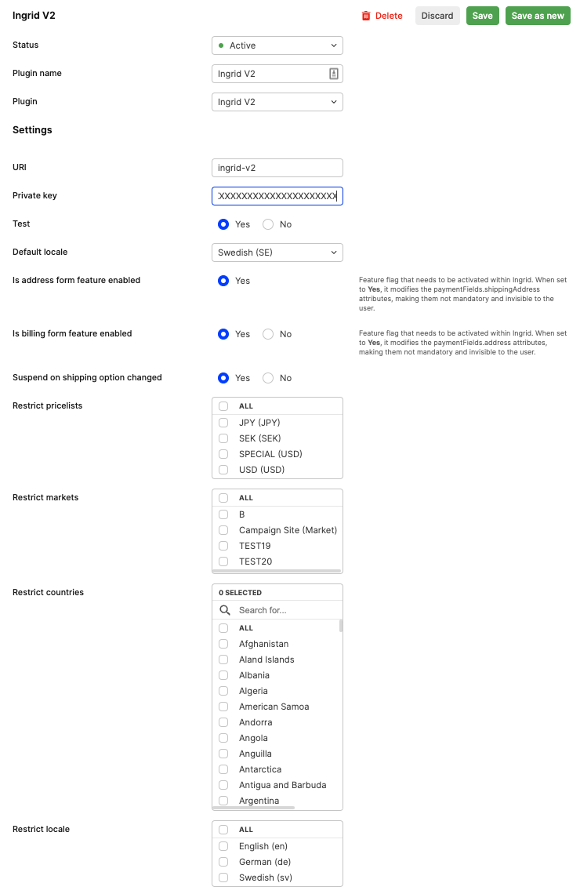

Ingrid is a shipping platform that can be used together with Centra in order to present your shoppers with rich shipping options, including a number of delivery providers, address searching, support for free shipping vouchers and more.
In version 2 of Ingrid integration, it also comes with an optional address form feature which is used for collecting customer addresses and customer information required for delivery processing purposes. 
Built-in address form is designed to handle and validate regional address formats. 

## Setting up the Ingrid plugin in Centra

To set up the Ingrid plugin, head to SYSTEM->STORES and choose the store you want to use Ingrid in. The minimum requirements for the plugin to work are the following:

1. A private key in the proper format (non-base64 encoded) is supplied,
2. A default locale is selected,
3. The plugin is active.

Also make sure that you are setting the `Test-Mode` option accordingly.

The settings in the plugin affect the integration in the following way:

- **Test**: If set to `yes` Centra will connect to Ingrid's `stage` environment, if set to `no` Centra will connect to Ingrid's `production` environment.
- **Default Locale**: The locale (language) the widget will be shown in by default, if a proper locale is set on the selection Centra will tell Ingrid to try to use the selection's language instead. If Ingrid doesn't support the locale on the selection, the default locale will be used.
- **Is address feature enabled**: Enabled by default. If set to `yes` Ingrid's widget will present address form for the customer to provide their address and information required for delivery processing purposes. Updates of the address information are send to Centra using Centra CheckoutScript that is a handler of client side events.
- **Suspend Ingrid widget on shipping option changed**: If set to `yes` Ingrid's widget will be put into a "loading state" whenever the shipping option is changed by the user until Centra has recevied the update. It is important that your front end picks up those changes and resumes the widget when ready.
- **Update address in Ingrid's widget from address stored on basket in Centra**:
  [notice-box=info]
  Search address will not be used when address form is enabled (`Is address feature enabled=yes`). Following setting is only relevant when address form feature is disabled.
  [/notice-box]
  Centra will always try to populate the Ingrid widget with the selection address if Centra has received it before Ingrid, however other address updates will depend on this setting.
    - If set to `On address pre-fill (default)` the address the widget uses to present the shipping options will be updated from Centra on the [PUT /payment-fields endpoint](https://docs.centra.com/swagger-ui/?api=CheckoutAPI#/4.%20selection%20handling%2C%20checkout%20flow/put_payment_fields)
    - If set to `Only if Ingrid does not have an address set on the session` - prevents the [PUT /payment-fields endpoint](https://docs.centra.com/swagger-ui/?api=CheckoutAPI#/4.%20selection%20handling%2C%20checkout%20flow/put_payment_fields) from updating the address in the Ingrid session.
- **Restrict pricelists**: Only use this plugin instance for the selected pricelist(s), empty means it's available for all.
- **Restrict markets**: Only use this plugin instance for the selected market(s), empty means it's available for all.
- **Restrict countries**: Only use this plugin instance for the selected shipping countries, empty means it's available for all.
- **Restrict locale**: Only use this plugin instance for the selected locale(s), empty means it's available for all.



Functionality of integration between Centra and Ingrid's Delivery Checkout v2 API:

- Presenting a widget in the checkout
- Optionally displaying address form and collecting customer addresses (enabled by default)
- The widget allows customer to select the preferred shipping option for the order
- Centra handles server side session with Ingrid via Delivery Checkout v2 API and saves completed Ingrid session attributes as Custom attributes on the order, needed for the merchant to be able to fulfill the order correctly based on the selected options

## Integration workflow

### Session initialization prerequisites

1. The Ingrid v2 plugin is configured on the same store the selection belongs to and activated
2. Selection is not empty and has at least one line
3. The requirements of locale, market, pricelist and country configured in the plugin are fulfilled

Centra will save the ID of the initialized Ingrid session, and update the shipping price according to the setup in Ingrid.

### When does Centra update Ingrid?

- All selection item and voucher updates are send as Ingrid session updates from Centra 
- Centra will update the shipping cost of the selection with the cost returned by Ingrid after the update.
- Address updates on the selection are only sent to Ingrid if they are made by the [PUT payment-fields](https://docs.centra.com/swagger-ui/?api=CheckoutAPI#/4.%20selection%20handling%2C%20checkout%20flow/put_payment_fields) endpoint in Centra's CheckoutAPI (or [PUT /selections/{selection}/checkout-fields](https://docs.centra.com/swagger-ui/?api=ShopAPI#/default/put_selections__selection__checkout_fields) in ShopAPI) and if the `Update address in Ingrid's widget from address stored on basket in Centra:` option in the Ingrid plugin is set to `On address pre-fill (default)`. This is to prevent Centra from overriding any choice made in the Ingrid widget by the user, which could cause a change of Shipping option, depending on the setup. If Centra already has address data at the time when the Ingrid session is created, this will be sent to Ingrid (since there is nothing to override).
- When Ingrid address form is updated and events are forwarded from Frontend to Centra
- On country / state change.
- All data is sent to Ingrid after the order is placed in Centra, including the final cart and customer address. Centra saves the data returned from Ingrid as `Custom Attributes` on the order.

### When does Ingrid update Centra?

- On events from the widget forwarded to Centra from the frontend partner (see Frontend Implementation).
- Centra always updates shipping price based on what Ingrid respond when Centra updates Ingrid.

## Frontend implementation

#### Scenario 1: Address form feature in Ingrid enabled

1. Load Ingrid widget on the frontend
2. Customer fills in address in the widget or address is pre-filled by Ingrid automatically if it was stored in Ingrid's address book in the past
3. Address update is sent to Centra 

In this configuration address from Ingrid will be the one that is saved on the order in Centra.

#### Scenario 2: Address form feature in Ingrid enabled + "Address after payment" (Paypal / KCO / Qliro)

In `Address after payment` mode which is explained [here](https://docs.centra.com/fe-development/payments/handling-0-payments) the address on the order in Centra is the one that is filled in by customer in the PSP widget.
For Paypal this would be the customer's address coming from Paypal, for other solutions like KCO or Qliro, if any address has been entered to Ingrid - Centra will try to pre-fill PSP widget with address information.


[notice-box=alert]
Operating in this mode can cause different addresses on the order in Centra and Ingrid, as there is usually no way to control customer's input in the PSP widget's address form.
(with the exception of Qliro's `Lock customer information` option)
[/notice-box]

The example flow is following:

1. Ingrid widget is loaded on the frontend
2. Customer fills in address in the widget or address is pre-filled by Ingrid automatically if it was stored in Ingrid's address book in the past
3. Address update is sent from Ingrid to Centra (via client side events and Centra CheckoutScript)
4. Centra initiates KCO session and pre-fills address coming from Centra
5. Customer submits the address in KCO
6. Customer finalizes the payment in KCO
7. Order lands in Centra with address information from KCO

In this configuration address is propagated in following way: Ingrid -> Centra -> KCO
Note that if customer changes the address in KCO, then this updated address from Klarna will be the one visible on Centra order.

### Sending updates from Ingrid's widget to Centra

The Ingrid widget exposes a client side API for reacting to changes that happen in the widget.

In both Checkout API and Shop API Centra provides a `centraCheckoutScript` which wraps these and exposes them as Events that you should listen to and forward to Centra. This script is exposed as `selection.centraCheckoutScript` in CheckoutAPI and as `centraCheckoutScript` in the SelectionResponse in ShopAPI. If this script is present in the response you should embed it into the DOM on your Checkout page. After this you can access it via `window.CentraCheckout`

[notice-box=alert]
Important: Make sure that the widget you are interacting with has loaded properly before trying to initiate it, since the widget's exposed object on the browser's window must be present.
[/notice-box]

In addition to that you need to register an eventListener for `centra_checkout_callback`, where the callback should forward the `event.detail` data to [PUT payment-fields](https://docs.centra.com/swagger-ui/?api=CheckoutAPI#/4.%20selection%20handling%2C%20checkout%20flow/put_payment_fields).

```javascript
const sendEventToCentra = async (e) => {
  const res = await api.paymentFields.paymentFieldsUpdate(e.detail.detail, {
    token: getToken(),
    cancelToken: "paymentField-request",
  });
  window.CentraCheckout.resume(e.detail.additionalFields.suspendIgnore);
};

document.addEventListener("centra_checkout_callback", sendEventToCentra);
```

## Reflecting backend updates in the Ingrid widget

As Centra sends all cart updates to Ingrid the widget needs to know when it should load the lastest data from its backend. The same API that exposes the event listeners also provides a mechanism for suspending it and resuming the widget while a backend update happens: `window.centraCheckout.suspend()` and `window.centraCheckout.resume()` which should be called before and after a call to Centra has been made that modifies the cart.

Cart modifications are the following:

- Modifying the order items (changing quantity / removing) in the checkout,
- Adding an "upsell product" to cart in the checkout,
- Adding / removing a voucher in the checkout,
- Updating the address via [PUT payment-fields](https://docs.centra.com/swagger-ui/?api=CheckoutAPI#/4.%20selection%20handling%2C%20checkout%20flow/put_payment_fields), if the address form is used to initiate a payment widget.

Example:

```javascript

const itemUpdate = async (item, quantity) => {
    window.centraCheckout.suspend();
    await api.lines.linesUpdate(
        {
    		item,
    		quantity
        },
        token: getToken(),
    );
    window.centraCHeckout.resume();
}
```
