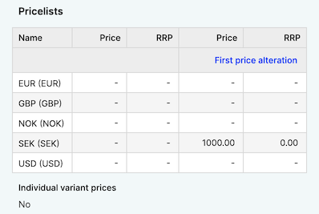
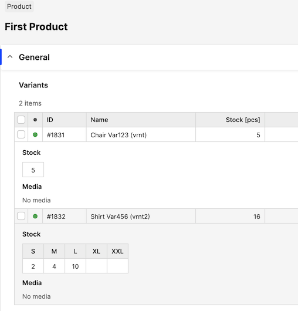

In Centra, we strongly believe GraphQL is the future of the APIs, just like REST is the present and SOAP is the past. For that reason, we've been putting a lot of effort into building our GQL API into what we think one day will be the _last_ integration API you will ever need.

[notice-box=info]
Centra GraphQL API is stable and can be used in production environments. It is also actively developed, so more features are added constantly. We recommend you to sign up for our Newsletter to be notified about updates. Let us know if there's any specific functionality you need with priority and we will look into it. You can always see the latest additions in the [GraphQL API changelog](https://docs.centra.com/graphql/#changelog).
[/notice-box]

## GraphQL API introduction

All queries, mutations and examples are documented in [GraphQL Integration API reference](/api-references/graphql-integration-api).

GraphQL is used to Send a query to Centra API and get exactly what you need, nothing more and nothing less. GraphQL queries always return predictable results. Apps using GraphQL are fast and stable because they control the data they get, not the server.

## Quick note about API tokens

GraphQL is different from other Centra APIs, especially when it comes to authentication. Whereas the SOAP and REST APIs used shared API secret password to authenticate, identical for every API consumer, GQL authentication is based on personal API tokens. Each Production token should be assigned to a specific user name or an API function, and have only enough permissions to run the designed function. In QA, you are welcome to create test tokens will all permissions, but that is _only_ allowed for development purposes. Every time you make a GQL API call, the API response will include a full list of permissions that were used by this call. With this information, once you're done with testing, you can create a Production token with _minimal_ required permissions and re-test.

It is _not allowed_ to use a full-permissions API tokens in Production. This is simply not safe, as GraphQL gives you granular access to almost every part of Centra. It's also not allowed to share your tokens with others - every Centra admin user can create a new test token in a matter of seconds. Centra monitors the usage of those API tokens, so if you abuse those rules, we might contact you and ask that you address it.

For more information about generating and using API tokens, see the [authorization chapter of our GraphQL API docs](/api-references/graphql-integration-api/authorization).

***

# Cookbook

## Connection test - fetch Stores

[https://docs.centra.com/graphql/query.html#stores](https://docs.centra.com/graphql/query.html#stores)

Before you proceed, follow the instructions above to obtain your own API token. In QA, you can start with an all-permissions token for yourself. To test the connection, we will fetch info about your Stores, since even an empty Centra setup will have at least one configured. This is a read only operation, nothing bad can happen.

[notice-box=alert]
Never use the integration you build towards a production Centra environment before it is thoroughly tested and verified to be working as intended!
[/notice-box]

#### Request

```sh
curl "${BASE_URL}/graphql" \
	    -X POST \
	    -H "Cookie: graphql-access=${ACCESS_TOKEN}" \
	    -H "Content-Type: application/json" \
	    -d '{"query": "{ stores{ id name } }"}'
```

Pretty:

```gql
query getStores {
  stores {
    id
    name
  }
}
```

#### Response

```json
{
  "data": {
    "stores": [
      {
        "id": 1,
        "name": "Retail Store"
      },
      {
        "id": 2,
        "name": "Wholesale"
      }
    ]
  },
  "extensions": {
    "complexity": 121,
    "permissionsUsed": [
      "Store:read"
    ]
  }
}
```

As you can see, not only does GQL API return _precisely_ the data you asked for, nothing more, it also tells you which permissions were used, so that you know precisely how to configure your Prod API token in the future.

## Markets - create and read

[https://docs.centra.com/graphql/query.html#markets](https://docs.centra.com/graphql/query.html#markets)

Markets in Centra decide which Products are visible to the API consumer. [Click here to learn more](https://docs.centra.com/overview/centra-overview#market).

### Creating a new Market

Currently, adding countries to a Market is only available in DTC (Retail) stores.

#### Request

```gql
mutation createMarket {
    createMarket(input: {
        name: "First Market"
      	store: {id: 1}
      	comment: "comment"
        addCountries: [
          {id: 125}
        ]
    }) {
        userErrors {
            message path
        }
        market {
            ...marketFields
        }
    }
}

fragment marketFields on Market {
  id
  name
  comment
  campaigns {
    id
    name
  }
  displays {
    id
    name
  }
  allocationRule {
    id
    name
  }
  store {
    id
    name
  }
  assignedToCountries {
    id
  }
}
```

#### Response

```json
{
  "data": {
    "createMarket": {
      "userErrors": [],
      "market": {
        "id": 29,
        "name": "First Market",
        "comment": "comment",
        "campaigns": [],
        "displays": [],
        "allocationRule": null,
        "store": {
          "id": 1,
          "name": "Retail Store"
        },
        "assignedToCountries": [
          {
            "id": 125
          }
        ]
      }
    }
  },
  "extensions": {
    "complexity": 164,
    "permissionsUsed": [
      "Market:write",
      "Market:read",
      "Market.comment:read",
      "Campaign:read",
      "Display:read",
      "AllocationRule:read",
      "Store:read",
      "Country:read"
    ],
    "appVersion": "v0.27.0"
  }
}
```

### Fetching Markets

#### Request

Fetching a specific Market:

```gql
query singleMarket {
  market(id: 29) {
    ...marketFields
  }
}
```

Fetching multiple Markets:

```gql
query multipleMarkets {
  markets {
    ...marketFields
  }
}
```

#### Response

```json
{
  "data": {
    "market": {
      "id": 29,
      "name": "First Market",
      "comment": "comment",
      "campaigns": [],
      "displays": [],
      "allocationRule": null,
      "store": {
        "id": 1,
        "name": "Retail Store"
      },
      "assignedToCountries": [
        {
          "id": 125
        }
      ]
    }
  },
  "extensions": {
    "complexity": 53,
    "permissionsUsed": [
      "Market:read",
      "Market.comment:read",
      "Campaign:read",
      "Display:read",
      "AllocationRule:read",
      "Store:read",
      "Country:read"
    ],
    "appVersion": "v0.27.0"
  }
}
```

Please note, reading Markets and reading Market Countries use different permissions. Remember, if your integration doesn't need to know about Market countries, there's no reason to enable that permission in your integration token setup.

### Updating a Market

The market can be updated with updateMarket mutation. name must be unique, but only across markets for the specified store.

#### Request

```gql
mutation updateMarket {
    updateMarket(id: 29, input: {
        name: "update"
      	addCountries: [{id: 122}]
      	removeCountries: [{id: 125}]
    }) {
        userErrors {
            message path
        }
        market {
            ...marketFields
        }
    }
}
```

#### Response

```json
{
  "data": {
    "updateMarket": {
      "userErrors": [],
      "market": {
        "id": 29,
        "name": "update",
        "comment": "comment",
        "campaigns": [],
        "displays": [],
        "allocationRule": null,
        "store": {
          "id": 1,
          "name": "Retail Store"
        },
        "assignedToCountries": [
          {
            "id": 122
          }
        ]
      }
    }
  },
  "extensions": {
    "complexity": 164,
    "permissionsUsed": [
      "Market:write",
      "Market:read",
      "Market.comment:read",
      "Campaign:read",
      "Display:read",
      "AllocationRule:read",
      "Store:read",
      "Country:read"
    ],
    "appVersion": "v0.27.0"
  }
}
```

## Folders - read and create

[https://docs.centra.com/graphql/query.html#folders](https://docs.centra.com/graphql/query.html#folders)

Folders are a way to categorise your Products in Centra. Different than Categories, Folders are meant for internal use only. They are also generic for all the Stores you have configured in your Centra, while Categories are configured per-store.

### Creating a new folder

#### 1st folder - Request

Top-level folder.

```gql
mutation addFolder {
  createFolder(input:{
    name: "First folder",
    parent: null
  }){
    folder{
      id
      name
      isTopFolder
    }
  }
}
```

#### 1st folder - Response

```json
{
  "data": {
    "createFolder": {
      "folder": {
        "id": 1,
        "name": "First folder",
        "isTopFolder": true
      }
    }
  },
  "extensions": {
    "complexity": 121,
    "permissionsUsed": [
      "Folder:write",
      "Folder:read"
    ]
  }
}
```

#### 2nd folder - Request

Child folder.

```gql
mutation addFolder {
  createFolder(input:{
    name: "Second folder",
    parent: {id: 1}
  }){
    folder{
      id
      name
      isTopFolder
    }
  }
}
```

#### 2nd folder - Response

```json
{
  "data": {
    "createFolder": {
      "folder": {
        "id": 2,
        "name": "Second folder",
        "isTopFolder": false
      }
    }
  },
  "extensions": {
    "complexity": 121,
    "permissionsUsed": [
      "Folder:write",
      "Folder:read"
    ]
  }
}
```

### Fetching folders

You can fetch the Folders themselves, or use this query to find the Products in specific folders.

Remember, this is just an example. You can use other [FolderFilter](https://docs.centra.com/graphql/folderfilter.html) inside the `where` clause, and use any other [StringMatch](https://docs.centra.com/graphql/stringmatch.html) when searching by name, for example.

#### Request

```gql
query getFolders{
  folders(where: { name: { contains: "First" } }) {
    id
    name
    isTopFolder
    products{
      ...basicProductFields
    }
  }
}

fragment basicProductFields on Product {
  id
  name
  status
  productNumber
  harmonizedCommodityCode
  harmonizedCommodityCodeDescription
  internalComment
  isBundle
  isSerializableProduct
  createdAt
  updatedAt
}
```

#### Response

We just added this Folder, so it has no Products yet.

```json
{
  "data": {
    "folders": [
      {
        "id": 1,
        "name": "First folder",
        "isTopFolder": true,
        "products": []
      }
    ]
  },
  "extensions": {
    "complexity": 121,
    "permissionsUsed": [
      "Folder:read",
      "Folder.Product:read"
    ]
  }
}
```

## Brands - read and create

[https://docs.centra.com/graphql/query.html#brands](https://docs.centra.com/graphql/query.html#brands)

A Brand is a general attribute on product level where you can store the product’s brand. Each product can only belong to a single brand.

### Creating a new brand

In order to fully use a brand, you should enable it in one or more of your Stores.

#### Request

```gql
mutation addBrand {
  createBrand(input: {
    name: "My Brand",
  	uri: "my-brand",
    addToStores: { id: 1 } }
  ) {
    brand {
      id
      name
    }
    userErrors {
      message
      path
    }
  }
}
```

#### Response

```json
{
  "data": {
    "createBrand": {
      "brand": {
        "id": 1,
        "name": "My Brand"
      },
      "userErrors": []
    }
  },
  "extensions": {
    "complexity": 121,
    "permissionsUsed": [
      "Brand:write",
      "Brand:read"
    ]
  }
}
```

### Fetching brands

#### Request

```gql
query getBrands {
  brands(where: { name: { contains: "My Brand" } } )
  {
    id
    name
  }
}
```

#### Response

```json
{
  "data": {
    "brands": [
      {
        "id": 1,
        "name": "My Brand"
      }
    ]
  },
  "extensions": {
    "complexity": 121,
    "permissionsUsed": [
      "Brand:read"
    ]
  }
}
```

## Collections - read and create

[https://docs.centra.com/graphql/query.html#collections](https://docs.centra.com/graphql/query.html#collections)

Collections are mainly a concept seen in fashion, e.g. this could be a spring-summer Collection like `AW21` or `SS22`. If products aren’t set by season and you are selling other appliances, this could e.g. be “Kitchen”. It’s mainly used as a filter option in both Centra and the Centra Showroom.

### Creating a new collection

#### Request

```gql
mutation addCollection {
  createCollection(input: {
    name: "Collection 1",
    status: ACTIVE
  }) {
    collection {
      id
      name
      status      
    }
    userErrors {
      message
      path
    }
  }
}
```

#### Response

```json
{
  "data": {
    "createCollection": {
      "collection": {
        "id": 1,
        "name": "Collection 1",
        "status": "ACTIVE"
      },
      "userErrors": []
    }
  },
  "extensions": {
    "complexity": 121,
    "permissionsUsed": [
      "Collection:write",
      "Collection:read"
    ]
  }
}
```

### Fetching collections

#### Request

```gql
query getCollections {
  collections(where: { name: { contains: "Col" } } )
  {
    id
    name
  }
}
```

#### Response

```json
{
  "data": {
    "collections": [
      {
        "id": 1,
        "name": "Collection 1"
      }
    ]
  },
  "extensions": {
    "complexity": 121,
    "permissionsUsed": [
      "Collection:read"
    ]
  }
}
```

## Product Size Charts - read and create

[https://docs.centra.com/graphql/query.html#sizeCharts](https://docs.centra.com/graphql/query.html#sizeCharts)

Size charts define the sizes of each Product Variant in Centra. Creating them should be a one-time action, which you should perform before importing Products into your Centra. Once assigned to a Variant, size chart can not be changed. If a size is used by a variant, especially if those belong to an existing order, you will not be able to remove them for historical (or even legal) reasons.

### Fetching existing size charts and sizes

#### Request

```gql
query getSizeChartsAndSizes {
  sizeCharts{
    id
    name
    sizes {
      id
      name
    }
  }
}
```

#### Response

```json
{
  "data": {
    "sizeCharts": [
      {
        "id": 1,
        "name": "One Size",
        "sizes": [
          {
            "id": 1,
            "name": "One Size"
          }
        ]
      },
      {
        "id": 2,
        "name": "S-XXL",
        "sizes": [
          {
            "id": 2,
            "name": "S"
          },
          {
            "id": 3,
            "name": "M"
          },
          {
            "id": 4,
            "name": "L"
          },
          {
            "id": 5,
            "name": "XL"
          },
          {
            "id": 6,
            "name": "XXL"
          }
        ]
      }
    ]
  },
  "extensions": {
    "complexity": 121,
    "permissionsUsed": [
      "SizeChart:read"
    ]
  }
}
```

### Creating new size charts

Here's how you can create a simple 1- or 2-dimensional size chart.

#### Request: One-size chart

```gql
mutation addSizeChart {
  createSizeChart(
    input: {
      name: "One Size"
      dividerSymbol: "x"  
      horizontalLabels: ["One Size"]
      verticalLabels: []
      displayUnit: ""
      displayDividedBy: 0
    }
  ) {
    sizeChart {
      id
      name
      sizes {id name}
      horizontalLabels
      verticalLabels
      dividerSymbol
    }
    userErrors {
      message
      path
    }
  }
}
```

#### Response: One-size chart

```json
{
  "data": {
    "createSizeChart": {
      "userErrors": [],
      "sizeChart": {
        "id": 1,
        "name": "One Size",
        "sizes": [
          {
            "id": 1,
            "name": "One Size"
          }
        ],
        "horizontalLabels": [
          "One Size"
        ],
        "verticalLabels": null,
        "dividerSymbol": "x"
      }
    }
  },
  "extensions": {
    "complexity": 121,
    "permissionsUsed": [
      "SizeChart:write",
      "SizeChart:read"
    ]
  }
}
```

#### Request: SML chart

```gql
mutation addSizeChart {
  createSizeChart(
    input: {
      name: "Shirts SML"
      dividerSymbol: "x"  
      horizontalLabels: ["S", "M", "L"]
      verticalLabels: []
      displayUnit: ""
      displayDividedBy: 0
    }
  ) {
    sizeChart {
      id
      name
      sizes {id name}
      horizontalLabels
      verticalLabels
      dividerSymbol
    }
    userErrors {
      message
      path
    }
  }
}
```

#### Response: SML chart

```json
{
  "data": {
    "createSizeChart": {
      "userErrors": [],
      "sizeChart": {
        "id": 2,
        "name": "Shirts SML",
        "sizes": [
          {
            "id": 2,
            "name": "S"
          },
          {
            "id": 3,
            "name": "M"
          },
          {
            "id": 4,
            "name": "L"
          }
        ],
        "horizontalLabels": [
          "S",
          "M",
          "L"
        ],
        "verticalLabels": null,
        "dividerSymbol": "x"
      }
    }
  },
  "extensions": {
    "complexity": 121,
    "permissionsUsed": [
      "SizeChart:write",
      "SizeChart:read"
    ]
  }
}
```

#### Request: Any size chart

```gql
mutation addSizeChart {
  createSizeChart(
    input: {
      name: "Any size chart"
      dividerSymbol: "x"  
      horizontalLabels: ["X", "Y", "Z"]
      verticalLabels: ["A", "B"]
      displayUnit: ""
      displayDividedBy: 0
    }
  ) {
    sizeChart {
      id
      name
      sizes {id name}
      horizontalLabels
      verticalLabels
      dividerSymbol
    }
    userErrors {
      message
      path
    }
  }
}
```

#### Response: Any size chart

```json
{
  "data": {
    "createSizeChart": {
      "userErrors": [],
      "sizeChart": {
        "id": 3,
        "name": "Any size chart",
        "sizes": [
          {
            "id": 5,
            "name": "XxA"
          },
          {
            "id": 6,
            "name": "XxB"
          },
          {
            "id": 7,
            "name": "YxA"
          },
          {
            "id": 8,
            "name": "YxB"
          },
          {
            "id": 9,
            "name": "ZxA"
          },
          {
            "id": 10,
            "name": "ZxB"
          }
        ],
        "horizontalLabels": [
          "X",
          "Y",
          "Z"
        ],
        "verticalLabels": [
          "A",
          "B"
        ],
        "dividerSymbol": "x"
      }
    }
  },
  "extensions": {
    "complexity": 121,
    "permissionsUsed": [
      "SizeChart:write",
      "SizeChart:read"
    ]
  }
}
```

### Modifying size charts (not recommended)

It's usually better and cleaner to create a new size chart, instead of modifying existing ones, especially if they are used in existing records, like orders and shipments.

[TBD]

### Removing size charts

If you have to. It's better than adjusting existing charts, usually.

#### Request

```gql
mutation deleteSizeChart {
  removeSizeChart(
    id: 3
  ) {
    userErrors {
      message
      path
    }
  }
}
```

#### Response

No errors means no problem. :)

```json
{
  "data": {
    "removeSizeChart": {
      "userErrors": []
    }
  },
  "extensions": {
    "complexity": 121,
    "permissionsUsed": [
      "SizeChart:write"
    ]
  }
}
```

## Product Measurement Charts - read and create

[https://docs.centra.com/graphql/query.html#measurementCharts](https://docs.centra.com/graphql/query.html#measurementCharts)

Measurement charts are used to display the measurements of your products. While Size Charts define product sizes (S, M, L, XL, XXL), measurement charts are used to define their measurements, in specific units, for each size. For example, measuremement chart for trousers can consist of leg and waist size, defined in cm or inches, for each defined size.

### Creating a new measurement chart

In this example, we will create a measurements table for our shirt product, defining what measurements each sizes (S, M, L) have.

#### Request

```gql
mutation addMeasurementChart {
  createMeasurementChart(
    input: {
      name: "Shirts"
      horizontalLabels: ["S", "M", "L"]
      verticalLabels: ["Chest", "Sleeve"]
      displayUnit: "cm"
      values: [
        {horizontalLabel: "S", verticalLabel: "Chest", value: "80"},
        {horizontalLabel: "S", verticalLabel: "Sleeve", value: "55"},
        {horizontalLabel: "M", verticalLabel: "Chest", value: "85"},
        {horizontalLabel: "M", verticalLabel: "Sleeve", value: "58"},
        {horizontalLabel: "L", verticalLabel: "Chest", value: "90"},
        {horizontalLabel: "L", verticalLabel: "Sleeve", value: "60"}
      ]
    }
  ) {
    measurementChart {
      id
      name
      horizontalLabels
      verticalLabels
      displayUnit
      contentJSON
    }
    userErrors {
      message
      path
    }
  }
}
```

#### Response

```json
{
  "data": {
    "createMeasurementChart": {
      "measurementChart": {
        "id": 5,
        "name": "Shirts",
        "horizontalLabels": [
          "S",
          "M",
          "L"
        ],
        "verticalLabels": [
          "Chest",
          "Sleeve"
        ],
        "displayUnit": "cm",
        "contentJSON": "{\"Chest\":{\"S\":\"80\",\"M\":\"85\",\"L\":\"90\"},\"Sleeve\":{\"S\":\"55\",\"M\":\"58\",\"L\":\"60\"}}"
      },
      "userErrors": []
    }
  },
  "extensions": {
    "complexity": 112,
    "permissionsUsed": [
      "MeasurementChart:write"
    ]
  }
}
```

### Deleting a measurement chart

Just like with other resources - you can only delete a measurement chart when it's not in use. Still, if you created your chart wrong, it's better to remove it and start over, instead of modifying it.

#### Request

```gql
mutation deleteMeasurementChart {
  removeMeasurementChart(id: 5) {
    userErrors {
      message
      path
    }
  }
}
```

#### Response

```json
{
  "data": {
    "removeMeasurementChart": {
      "userErrors": []
    }
  },
  "extensions": {
    "complexity": 112,
    "permissionsUsed": [
      "MeasurementChart:write"
    ]
  }
}
```

## Warehouses - read and create

[https://docs.centra.com/graphql/query.html#warehouses](https://docs.centra.com/graphql/query.html#warehouses)

[Warehouses](/overview/stock#warehouses-and-allocation-rules) are the logical entities holding product Stock. Warehouse stock items connect directly to each variant size.

### Fetching existing warehouses

Once you've filtered which Warehouses you are interested in, you can fetch any data you need about each of the Warehouses returned. To see other ways of filtering Warehouses, see [WarehouseFilter definition](https://docs.centra.com/graphql/warehousefilter.html) in our documentation.

#### Request

```gql
query getWarehouses {
  warehouses(where: { name: { contains: "Retail" } }, sort: [id_ASC]) {
    id
    name
    status
  }
}
```

#### Response

```gql
{
  "data": {
    "warehouses": [
      {
        "id": 3,
        "name": "Retail",
        "status": "ACTIVE"
      }
    ]
  },
  "extensions": {
    "complexity": 121,
    "permissionsUsed": [
      "Warehouse:read"
    ]
  }
}
```

### Creating a new warehouse

[TBD]

## Adding Product 1

[https://docs.centra.com/graphql/query.html#products](https://docs.centra.com/graphql/query.html#products)

Just the basic Product, without Variants (yet) and no size chart selected.

#### Request

```gql
mutation addProduct {
  createProduct(input: {
    name: "First Product"
    status: ACTIVE
    productNumber: "Prod123"
    brand: { id: 1 }
    collection: { id: 2 }
    folder: { id: 1 }
    countryOfOrigin: { code: "DE" }
    harmonizedCommodityCode: "HCC123"
    harmonizedCommodityCodeDescription: "Harm Code Description"
  }) {
    product { 
      id
      name
      status
      productNumber
      brand { name }
      collection { name }
      folder { name }
      harmonizedCommodityCode
      harmonizedCommodityCodeDescription
    }
    userErrors {
      message
      path
    }
  }
}
```

#### Response

```json
{
  "data": {
    "createProduct": {
      "product": {
        "id": 1,
        "name": "First Product",
        "status": "ACTIVE",
        "productNumber": "Prod123",
        "brand": {
          "name": "Base Brand"
        },
        "collection": {
          "name": "AW21"
        },
        "folder": {
          "name": "Shop"
        },
        "harmonizedCommodityCode": "HCC123",
        "harmonizedCommodityCodeDescription": "Harm Code Description"
      },
      "userErrors": []
    }
  },
  "extensions": {
    "complexity": 121,
    "permissionsUsed": [
      "Product:write",
      "Product:read",
      "Product.Brand:read",
      "Product.Collection:read",
      "Product.Folder:read"
    ]
  }
}
```

## Adding Product 1 Variant 1: A chair

This is a one-size product - which is the size chart you should use for any product variant that doesn't have multiple sizes.

#### Request

```gql
mutation createVariant {
  createProductVariant(input: {
    product: { id: 1 }
    name: "First Product"
    status: ACTIVE
    variantNumber: "Var123"
    internalName: "vrnt"
    unitCost: {   # MonetaryValueInput
      value: 41
      currencyIsoCode: "EUR"
    }
    sizeChart: { id: 1 }
  }) {
    productVariant {
      id
    }
    userErrors {
      message
      path
    }
  }
}
```

#### Response

```json
{
  "data": {
    "createProductVariant": {
      "productVariant": {
        "id": 1
      },
      "userErrors": []
    }
  },
  "extensions": {
    "complexity": 121,
    "permissionsUsed": [
      "ProductVariant:write",
      "ProductVariant:read"
    ]
  }
}
```

## Activating sizes of Product 1 Variant 1: A chair

Once the Product and Variant is created, and the size chart selected, you need to add (activate) the desired variant sizes. This is required, since in Centra you don't need to use _all_ the configured sizes - for instance, you can configure a XXS-XXL size chart and choose it for a product variant, but only activate sizes S-L.

#### Request

You already know your Variant and Size IDs - Centra generated them when you created them. For every variant size you can configure size number (previously known as SKU) and/or GTIN (or EAN) number.

```gql
mutation createOneSize {
  createProductSize(
    input: {
      productVariant: { id: 1 },
      size: { id: 1 },
      gtin: "EAN000111",
      sizeNumber: "111"
    }
  ) {
    productSize {
      id
      GTIN
      sizeNumber
    }
    userErrors {
      message
      path
    }
  }
}
```

#### Response

As you can see, new `productSize` ID is generated. These are the sizes generated _for this specific variant_, they will be uniquely connected to Stock levels in your Warehouse.

```json
{
  "data": {
    "createProductSize": {
      "productSize": {
        "id": 279,
        "GTIN": "EAN000111",
        "sizeNumber": "111"
      },
      "userErrors": []
    }
  },
  "extensions": {
    "complexity": 121,
    "permissionsUsed": [
      "ProductVariant:write",
      "ProductSize:read"
    ]
  }
}
```

## Adding Product 1 Variant 2: A sweater

This example creates or updates a product – in this case a sweater. In our example it will only have a single Variant, which is available in sizes S, M and L.

The only difference from the previous example is using the second size chart this time.

#### Request

```gql
mutation createVariant {
  createProductVariant(input: {
    product: { id: 1 }
    name: "First Product"
    status: ACTIVE
    variantNumber: "Var456"
    internalName: "vrnt2"
    unitCost: {   # MonetaryValueInput
      value: 60
      currencyIsoCode: "EUR"
    }
    sizeChart: { id: 2 }
  }) {
    productVariant {
      id
    }
    userErrors {
      message
      path
    }
  }
}
```

#### Response

```json
{
  "data": {
    "createProductVariant": {
      "productVariant": {
        "id": 2
      },
      "userErrors": []
    }
  },
  "extensions": {
    "complexity": 121,
    "permissionsUsed": [
      "ProductVariant:write",
      "ProductVariant:read"
    ]
  }
}
```

## Activating sizes of Product 1 Variant 2: A sweater

This is a multi-size Variant, each size needs to be activated separately.

#### Request

You can also match the size by name, instead of an ID. Repeat those mutations for sizes M and L.

```gql
mutation createMultipleSizes {
  createProductSize(
    input: {
      productVariant: { id: 2 },
      size: { name: "S" },
      gtin: "EAN123456789S",
      sizeNumber: "789S"
    }
  )
  {
    productSize {
      id
      GTIN
      sizeNumber
    }
    userErrors {
      message
      path
    }
  }
}
```

#### Response

```json
{
  "data": {
    "createProductSize": {
      "productSize": {
        "id": 281,
        "GTIN": "EAN123456789S",
        "sizeNumber": "789S"
      },
      "userErrors": []
    }
  },
  "extensions": {
    "complexity": 121,
    "permissionsUsed": [
      "ProductVariant:write",
      "ProductSize:read"
    ]
  }
}
```

## Adding Product 3: A bundle

Bundles consist of multiple sections, of which each can be selected from a pre-selected list of variants. It can have pre-defined price, or calculate the bundle price based on the selected variants' prices. In the more complex, flexible bundles, the amount of the products in each section can differ, too.

Each bundle only has one Variant by design. It also needs to be activated on a Display, just like any other Variant. Stock of each Bundle is calculated based on the contained section variants' stock amounts.

[TBD]

#### Request

```gql
query something {
	placeholder
}
```

#### Response

```gql
query something {
	placeholder
}
```

### Assigning a measurement chart to a product

When creating or editing a Product, you can assign a measurement chart to it.

#### Request

```gql
mutation editProduct {
  updateProduct(id: 1, input: {
      measurementTable: {
          inherited: false
          measurementChart: {id: 6}
      }
  }) {
    product { 
      id
      name
      status
      productNumber
      brand { name }
      collection { name }
      folder { name }
      measurementTable{ chart { name } }
    }
    userErrors {
      message
      path
    }
  }
}
```

#### Response

```json
{
  "data": {
    "updateProduct": {
      "product": {
        "id": 1,
        "name": "First Product",
        "status": "ACTIVE",
        "productNumber": "Prod123",
        "brand": {
          "name": "My Brand"
        },
        "collection": {
          "name": "AW20"
        },
        "folder": {
          "name": "Shirts"
        },
        "measurementTable": {
          "chart": {
            "name": "Shirts"
          }
        }
      },
      "userErrors": []
    }
  },
  "extensions": {
    "complexity": 112,
    "permissionsUsed": [
      "Product:write",
      "Product:read",
      "Product.Brand:read",
      "Product.Collection:read",
      "Product.Folder:read",
      "Product.MeasurementTable:read"
    ]
  }
}
```

### Un-assigning a measurement chart from a product

To do this, simply pass `null` as the chart ID.

#### Request

```gql
mutation editProduct {
  updateProduct(id: 1, input: {
      measurementTable: {
          inherited: false
          measurementChart: {id: null}
      }
  }) {
    product { 
      id
      name
      status
      productNumber
      brand { name }
      collection { name }
      folder { name }
      measurementTable{ chart { name } }
    }
    userErrors {
      message
      path
    }
  }
}
```

#### Response

```json
{
  "data": {
    "updateProduct": {
      "product": {
        "id": 1,
        "name": "First Product",
        "status": "ACTIVE",
        "productNumber": "Prod123",
        "brand": {
          "name": "My Brand"
        },
        "collection": {
          "name": "AW20"
        },
        "folder": {
          "name": "Shirts"
        },
        "measurementTable": null
      },
      "userErrors": []
    }
  },
  "extensions": {
    "complexity": 112,
    "permissionsUsed": [
      "Product:write",
      "Product:read",
      "Product.Brand:read",
      "Product.Collection:read",
      "Product.Folder:read",
      "Product.MeasurementTable:read"
    ]
  }
}
```

## Product display - create, read and modify

The Display is an abstract concept of Centra. You can think about it as a presentation layer for your products. Beyond the product data itself, it provides much more useful information to show on a product page. Since displays are configured per Store, you can choose to present your product in a different way in each Store - with separate URIs, different categories, market visibility, etc.

### Common display fields

Here’s a list of available fields for Displays. If you’re not familiar with some of them, please take a look at [Creating displays article in our Support Docs](https://support.centra.com/centra-sections/general/catalog/creating-a-display).

```gql
fragment displayFields on Display {
    # basic fields
    id
    name
    status
    uri
    minimumOrderQuantity
    orderQuantityDenominator
    description
    shortDescription
    metaTitle
    metaDescription
    metaKeywords
    comment
    tags
    updatedAt

    # relations
    categories { id name }
    canonicalCategory { id name }
    displayItems { id productVariant { id name } }
    localized {
        language { id name }
        translations { value field }
    }
    markets { id name }
    media { id }
    prices { id }
    campaignVariants { id }
    product { id name }
    productVariants { id name }
    related { id }
    store { id name }
    taxGroup { id name}
}
```

We will use the same code fragment in the examples that follow.

### Fetching displays

There are two ways of listing existing displays.  

The first one is a displays query with classic pagination:

```gql
query listDisplays {
    displays(limit: 10) {
        ...displayFields
    }
}
```

The second one is using a cursor connection:

```gql
query scrollDisplays {
    displayConnection(first: 10) {
        edges {
            node {
                ...displayFields
            }
        }
        pageInfo {
            hasNextPage
            endCursor
        }
    }
}
```

[notice-box=info]
The concept of relay connections is new and only available in GraphQL API. If you wish to learn more on how to use this feature, see: https://relay.dev/graphql/connections.htm
[/notice-box]

### Creating a display

Display type has pretty a lot of parameters and most of them can be provided while creating one. Fortunately, most of them are optional, so in order to create a basic display you can use such a simple mutation:

```gql
mutation create {
    createDisplay(input: {
        name: "New display!"
        status: ACTIVE
        store: {id: 1}
        product: {id: 12}
    }) {
        userErrors {
            message path
        }
        display {
            ...displayFields
        }
    }
}
```

You can also specify a lot more as you can see in the input type below:

```gql
input DisplayCreateInput {
    # basic required fields
    store: StoreInput!
    product: ProductInput!
    name: String!
    status: Status!

    # basic optional fields
    "If not provided, it will be auto-generated based on display name."
    uri: String
    minimumOrderQuantity: Int
    orderQuantityDenominator: Int
    description: String
    shortDescription: String
    metaTitle: String
    metaDescription: String
    metaKeywords: String
    comment: String
    tags: [String!]

    # relations to other types
    canonicalCategory: CategoryInput
    addCategories: [CategoryInput!]
    addMarkets: [MarketInput!]
    addProductMedia: [ProductMediaAddInput!]
    addProductVariants: [ProductVariantAddInput!]
    taxGroup: TaxGroupInput
}
```

### Activating a product variant on a display

This is how you control which of the product variants should be enabled on the display:

```gql
mutation addVariantsToDisplay {
  updateDisplay(
    id: 345
    input: { addProductVariants: { productVariant: { id: 1913 } } }
  ) {
    userErrors {
      message
      path
    }
    display {
      ...displayFields
    }
  }
}
```

### Updating a display

To update a display you can use updateDisplay mutation:

```gql
mutation update {
    updateDisplay(id: 1 input: {
        # ... fields to be updated
    }) {
        userErrors {
            message path
        }
        display {
            ...displayFields
        }
    }
}
```

Similarly to create mutation, `updateDisplay` has a lot of possible parameters to be updated with a few differences.

```gql
input DisplayUpdateInput {
    name: String
    status: Status
    uri: String    # If empty string is provided, it will be auto-generated based on display name
    minimumOrderQuantity: Int
    orderQuantityDenominator: Int
    description: String
    shortDescription: String
    metaTitle: String
    metaDescription: String
    metaKeywords: String
    comment: String
    tags: [String!]

    canonicalCategory: CategoryInput
    addCategories: [CategoryInput!]
    removeCategories: [CategoryInput!]
    addMarkets: [MarketInput!]
    removeMarkets: [MarketInput!]
    addProductMedia: [ProductMediaAddInput!]
    removeProductMedia: [ProductMediaInput!]
    addProductVariants: [ProductVariantAddInput!]
    removeProductVariants: [ProductVariantInput!]
    taxGroup: TaxGroupInput
}
```

## Product weight - read and modify

Historically, weight has always been configured on the Product level in the Centra AMS. However, since different sizes of products can reasonably have different weights, we also expose it on the Size level. In the future, we will add the option to differentiate between sizes' weights.

### Fetching product weight

To make things easier, Centra exposes weight in 3 fields - weight value, weight unit and formatted value.

#### Request

```gql
query getWeight {
  product(id: 1) {
    id
    name
    weight {
      ...weightFields
    }
    variants {
      id
      name
      productSizes {
      description
        weight {
          ...weightFields
        }
      }
    }
  }
}

fragment weightFields on Weight {
  value
  unit
  formattedValue
}
```

#### Response

```json
{
  "data": {
    "product": {
      "id": 1,
      "name": "First product",
      "weight": {
        "value": 1,
        "unit": "KILOGRAMS",
        "formattedValue": "1.000 kg"
      },
      "variants": [
        {
          "id": 1,
          "name": "First variant",
          "productSizes": [
            {
	      "description": "One Size",
              "weight": {
                "value": 1,
                "unit": "KILOGRAMS",
                "formattedValue": "1.000 kg"
              }
            }
          ]
        }
      ]
    }
  },
  "extensions": {
    "complexity": 112,
    "permissionsUsed": [
      "Product:read",
      "Product.ProductVariant:read"
    ]
  }
}
```

### Changing product weight

#### Request

```gql
mutation updateWeight {
  updateProduct(id: 1, input: {
    weight: {
      value: 3
      unit: KILOGRAMS
    }
  }) {
    userErrors {
      message
      path
    }
    product {
      weight {
        ...weightFields
      }
    }
  }
}

fragment weightFields on Weight {
  value
  unit
  formattedValue
}
```

#### Response

```json
{
  "data": {
    "product": {
      "id": 1,
      "name": "First product",
      "weight": {
        "value": 3,
        "unit": "KILOGRAMS",
        "formattedValue": "1.000 kg"
      },
      "variants": [
        {
          "id": 1,
          "name": "First variant",
          "productSizes": [
            {
              "weight": {
                "value": 3,
                "unit": "KILOGRAMS",
                "formattedValue": "1.000 kg"
              }
            }
          ]
        }
      ]
    }
  },
  "extensions": {
    "complexity": 112,
    "permissionsUsed": [
      "Product:read",
      "Product.ProductVariant:read"
    ]
  }
}
```

## Pricelists - read and create

When Products are added, you need to add them to Pricelists and set a price if you want them to be purchasable. Setting a price is one of the actions that also works on the inactive Products, allowing you to set up the Products before activating them for sale.

### Fetching existing Pricelists

Once you've filtered which Pricelists you are interested in, you can fetch any data you need about each of the Pricelist returned. To see other ways of filtering Pricelists, see [PricelistFilter definition](https://docs.centra.com/graphql/pricelistfilter.html) in our documentation.

#### Request

```gql
query getPricelists {
  pricelists(where: { name: { contains: "SEK" } }, sort: [id_ASC]) {
    ...pricelistCustomDetails
  }
}

fragment pricelistCustomDetails on Pricelist {
  id
  name
  status
}
```

#### Response

```gql
{
  "data": {
    "pricelists": [
      {
        "id": 1,
        "name": "SEK",
        "status": "ACTIVE"
      },
      {
        "id": 3,
        "name": "VIP-SEK",
        "status": "ACTIVE"
      }
    ]
  },
  "extensions": {
    "complexity": 121,
    "permissionsUsed": [
      "Pricelist:read"
    ]
  }
}
```

### Creating or modifying a Pricelist

You can create it with any status, connected to any Stores and optionally select country codes of countries which should geo-locate to this Pricelist by default.

#### Request - create pricelist

```gql
mutation CreatePricelist {
  createPricelist(input: {
    name: "Test pricelist SEK"
    status: INACTIVE
    store: {
      id: 1
    }
    currencyIsoCode: "SEK"
    defaultShippingOption: {
      id: 1
    },
    addCountries: [
      {
        code: "SE"
      }
    ]
  }) {
    pricelist {
      id
      name
      status
      store { id name type }
      currency { code }
      assignedToCountries { id name }
      defaultShippingOption { id name }
    }
    userErrors { message path }
  }
}
```

#### Response

```json
{
  "data": {
    "createPricelist": {
      "pricelist": {
        "id": 36,
        "name": "Test pricelist SEK",
        "status": "INACTIVE",
        "store": {
          "id": 1,
          "name": "Retail Store",
          "type": "DIRECT_TO_CONSUMER"
        },
        "currency": {
          "code": "SEK"
        },
        "assignedToCountries": [
          {
            "id": 6,
            "name": "Sweden"
          }
        ],
        "defaultShippingOption": {
          "id": 1,
          "name": "SEK"
        }
      },
      "userErrors": []
    }
  },
  "extensions": {
    "complexity": 125,
    "permissionsUsed": [
      "Pricelist:write",
      "Pricelist:read",
      "Store:read",
      "Country:read",
      "ShippingOption:read"
    ],
    "appVersion": "v0.16.1"
  }
}
```

#### Request - update

Use to activate the new pricelist, for instance.

```gql
mutation UpdatePricelist {
  updatePricelist(id: 36, input: {
    status: ACTIVE
  }) {
    pricelist {
      id
      name
      status
      store { id name type }
      currency { code }
      assignedToCountries { id name }
      defaultShippingOption { id name }
    }
    userErrors { message path }
  }
}
```

#### Response

```json
{
  "data": {
    "updatePricelist": {
      "pricelist": {
        "id": 36,
        "name": "Test pricelist SEK",
        "status": "ACTIVE",
        "store": {
          "id": 1,
          "name": "Retail Store",
          "type": "DIRECT_TO_CONSUMER"
        },
        "currency": {
          "code": "SEK"
        },
        "assignedToCountries": [
          {
            "id": 6,
            "name": "Sweden"
          }
        ],
        "defaultShippingOption": {
          "id": 1,
          "name": "SEK"
        }
      },
      "userErrors": []
    }
  },
  "extensions": {
    "complexity": 125,
    "permissionsUsed": [
      "Pricelist:write",
      "Pricelist:read",
      "Store:read",
      "Country:read",
      "ShippingOption:read"
    ],
    "appVersion": "v0.16.1"
  }
}
```

#### Request - delete

You can only delete a pricelist when it's not in use.

```gql
mutation DeletePricelist {
  deletePricelist(id: 36) {
    userErrors { message path }
  }
}
```

#### Response

```json
{
  "data": {
    "deletePricelist": {
      "userErrors": []
    }
  },
  "extensions": {
    "complexity": 111,
    "permissionsUsed": [
      "Pricelist:write"
    ],
    "appVersion": "v0.16.1"
  }
}
```

### Creating or modifying price alterations

Price Alterations allow you to create temporary prices for products sold in your Wholesale (B2B) stores. You can only have one active price alteration object per store.

#### Request - create

To start with, let's create an inactive alteration:

```gql
mutation CreatePriceAlteration {
  createPriceAlteration(
    input: {
      name: "First price alteration"
      status: INACTIVE
      store: {
        id: 2
      }
      startDate: "2022-03-29T00:00:00+0000"
    }
  ) {
    priceAlteration {
      id
      name
      startDate
      status
      store { id }
      deliveryWindows { id }
    }
    userErrors { message path }
  }
}
```

#### Response - create

```json
{
  "data": {
    "createPriceAlteration": {
      "priceAlteration": {
        "id": 1,
        "name": "First price alteration",
        "startDate": "2022-03-29",
        "status": "INACTIVE",
        "store": {
          "id": 2
        },
        "deliveryWindows": []
      },
      "userErrors": []
    }
  },
  "extensions": {
    "complexity": 123,
    "permissionsUsed": [
      "Price:write",
      "Price:read",
      "Store:read",
      "DeliveryWindow:read"
    ],
    "appVersion": "unknown"
  }
}
```

#### Request - update

We can update alterations to change any of its setup, like changing the status to `ACTIVE`:

```gql
mutation UpdatePriceAlteration {
  updatePriceAlteration(
    id: 1
    input: {
      status: ACTIVE
    }
  ) {
    priceAlteration { id
      name
      startDate
      status
      store {
        id
      }
      deliveryWindows {
        id
      }
    }
    userErrors { message path }
  }
}
```

#### Response - update

```json
{
  "data": {
    "updatePriceAlteration": {
      "priceAlteration": {
        "id": 1,
        "name": "First price alteration",
        "startDate": "2022-03-29",
        "status": "ACTIVE",
        "store": {
          "id": 2
        },
        "deliveryWindows": []
      },
      "userErrors": []
    }
  },
  "extensions": {
    "complexity": 123,
    "permissionsUsed": [
      "Price:write",
      "Price:read",
      "Store:read",
      "DeliveryWindow:read"
    ],
    "appVersion": "unknown"
  }
}
```

### Adding time-altered prices to B2B products

Once the store, pricelist and products are configured, you can add their temporary prices to your price alteration objects:

#### Request

```gql
mutation SetAlteredPrices {
  setAlteredPrices(input: {
    priceAlteration: {
      id: 1
    },
    pricelist: {
      id: 21
    },
    productPrices: [
      {
        product: {
          id: 1
        }
        price: {
          value: 1000
          currencyIsoCode: "SEK"
        }
      }
    ]
  }){
    priceAlteration {
      id
    }
    pricelist {
      id
    }
    products {
      id name
    }
    userErrors {
      message path
    }
  }
}
```

#### Response

```json
{
  "data": {
    "setAlteredPrices": {
      "priceAlteration": {
        "id": 1
      },
      "pricelist": {
        "id": 21
      },
      "products": [
        {
          "id": 1,
          "name": "First Product"
        }
      ],
      "userErrors": []
    }
  },
  "extensions": {
    "complexity": 123,
    "permissionsUsed": [
      "Price:write",
      "Price:read",
      "Pricelist:read",
      "Product:read"
    ],
    "appVersion": "unknown"
  }
}
```

### Reading time-altered B2B prices

If current datetime is after the start of the price alteration, pricelist prices will be overridden and altered prices will be returned.

#### Request

```gql
query PriceAlteration {
  priceAlteration(id: 1) {
    name
    startDate
    status
    store { id }
    prices(where: { pricelistId: 21, productId: 1 }) {
      id
      price { formattedValue }
      recommendedRetailPrice { formattedValue }
      pricelist { id, name }
      product { id, name }
      productVariant { id, name}
    }
  }
}
```

#### Response

```json
{
  "data": {
    "priceAlteration": {
      "name": "First price alteration",
      "startDate": "2022-03-29",
      "status": "ACTIVE",
      "store": {
        "id": 2
      },
      "prices": [
        {
          "id": 4,
          "price": {
            "formattedValue": "1 000.00 SEK"
          },
          "recommendedRetailPrice": null,
          "pricelist": {
            "id": 21,
            "name": "SEK"
          },
          "product": {
            "id": 1,
            "name": "First Product"
          },
          "productVariant": {
            "id": 2,
            "name": "First Product"
          }
        }
      ]
    }
  },
  "extensions": {
    "complexity": 122,
    "permissionsUsed": [
      "Price:read",
      "Store:read"
    ],
    "appVersion": "unknown"
  }
}
```

This checks out with the AMS prices displayed on the product displays:



## Fetching Products

Now that Products, Variants and Sizes are created, let's see how the full product looks like. Fetching a product list is best done with pagination and using a reasonable limit - probably between 20 and 100 products per page.

```gql
query productList(
  $status: [ProductStatus!]! = [INACTIVE, ACTIVE]
  $page: Int! = 1
) {
  products(
    where: { status: $status }
    sort: [updatedAt_DESC]
    limit: 10
    page: $page
  ) {
    ...basicProductFields
    variants{
      ...basicVariantFields
      productSizes{
        ...basicSizeFields
      }
    }
  }

  counters {
    products(where: { status: $status })
  }
}

fragment basicProductFields on Product {
  id
  name
  status
  productNumber
  harmonizedCommodityCode
  harmonizedCommodityCodeDescription
  internalComment
  isBundle
  isSerializableProduct
  harmonizedCommodityCode
  harmonizedCommodityCodeDescription
  createdAt
  updatedAt
}

fragment basicVariantFields on ProductVariant {
  id
  name
  status
  variantNumber
  internalName
  unitCost {
    value
    currency {
      code
    }
    formattedValue
  }
  updatedAt(format: "Y-m-d\\TH:i:sO")
}

fragment basicSizeFields on ProductSize {
  id
  description
  sizeNumber
  GTIN
}
```

#### Response

In GraphQL API, SKU field is read-only, it's combined of `productNumber` + `variantNumber` + `sizeNumber`.

```json
{
  "data": {
    "products": [
      {
        "id": 1,
        "name": "First Product",
        "status": "ACTIVE",
        "productNumber": "Prod123",
        "harmonizedCommodityCode": "HCC123",
        "harmonizedCommodityCodeDescription": "Harm Code Description",
        "internalComment": null,
        "isBundle": false,
        "isSerializableProduct": false,
        "createdAt": "2021-12-31T13:44:23+0100",
        "updatedAt": "2022-01-03T11:43:56+0100",
        "variants": [
          {
            "id": 1,
            "name": "First Product",
            "status": "ACTIVE",
            "variantNumber": "Var123",
            "internalName": "vrnt",
            "unitCost": {
              "value": 41,
              "currency": {
                "code": "EUR"
              },
              "formattedValue": "41.00 EUR"
            },
            "updatedAt": "2022-01-03T11:44:02+0100",
            "productSizes": [
              {
                "id": 279,
                "description": "One Size",
                "sizeNumber": "789S",
                "GTIN": "EAN123456789S",
                "SKU": "Prod123Var123789S"
              }
            ]
          },
          {
            "id": 2,
            "name": "First Product",
            "status": "ACTIVE",
            "variantNumber": "Var456",
            "internalName": "vrnt2",
            "unitCost": {
              "value": 60,
              "currency": {
                "code": "EUR"
              },
              "formattedValue": "60.00 EUR"
            },
            "updatedAt": "2022-01-03T11:44:06+0100",
            "productSizes": [
              {
                "id": 280,
                "description": "S",
                "sizeNumber": "789S",
                "GTIN": "EAN123456789S",
                "SKU": "Prod123Var456789S"
              },
              {
                "id": 281,
                "description": "M",
                "sizeNumber": "789M",
                "GTIN": "EAN123456789M",
                "SKU": "Prod123Var456789M"
              },
              {
                "id": 282,
                "description": "L",
                "sizeNumber": "789L",
                "GTIN": "EAN123456789L",
                "SKU": "Prod123Var456789L"
              }
            ]
          }
        ]
      }
    ],
    "counters": {
      "products": 1
    }
  },
  "extensions": {
    "complexity": 121,
    "permissionsUsed": [
      "Product:read",
      "Product.InternalComment:read",
      "Product.ProductVariant:read",
      "ProductVariant.InternalName:read"
    ]
  }
}
```

## Product Stock fetching and update

[https://docs.centra.com/graphql/stock.html](https://docs.centra.com/graphql/stock.html)

Once Products with Variants are Sizes are activated with Displays, and the Warehouses exist, you can start adding stock amounts of your products in each warehouse. Once those are connected into groups in Warehouses -> Allocation Rules, they will be automatically returned as Stock for customers connecting from specific Markets, closing the part of the configuration required to have your Products available in your Store.

Remember, by default Centra expects you to send your physical stock - the amount you have physically in your warehouse. We will calculate the availability based on the existing un-fulfilled orders or incoming Supplier Orders, and serve back the FTA - Free to Allocate - stock amount. This is the amount you can sell right now.

### Fetching Product Stock

You can list the stock values using this query:

#### Request

Stock is stored on the Size level, so you can access it using a `products` call similar to previous examples. Note the `stockTotals` section, which requires additional permissions.

```
query productList(
  $status: [ProductStatus!]! = [INACTIVE, ACTIVE]
  $page: Int! = 1
) {
  products(
    where: { status: $status }
    sort: [updatedAt_DESC]
    limit: 10
    page: $page
  ) {
    ...basicProductFields
    variants {
      ...basicVariantFields
      productSizes {
        ...basicSizeFields
        stockTotals {
          availableQuantity
          physicalQuantity
          demandQuantity
          allocatedQuantity
          unshippedQuantity
          onDeliveryQuantity
          linkedIncomingQuantity
          unlinkedIncomingQuantity
        }
      }
    }
  }

  counters {
    products(where: { status: $status })
  }
}
fragment basicProductFields on Product {
  id
  name
  status
  productNumber
  harmonizedCommodityCode
  harmonizedCommodityCodeDescription
  internalComment
  isBundle
  isSerializableProduct
  harmonizedCommodityCode
  harmonizedCommodityCodeDescription
  createdAt
  updatedAt
}
fragment basicVariantFields on ProductVariant {
  id
  name
  status
  variantNumber
  internalName
  unitCost {
    value
    currency {
      code
    }
    formattedValue
  }
  updatedAt(format: "Y-m-d\\TH:i:sO")
}
fragment basicSizeFields on ProductSize {
  id
  description
  sizeNumber
  GTIN
  SKU
}
```

With this you can get the the list of product variants and the amount of different stock types per the variant’s size. If you want to find out what theses types represent, click on the type to read it’s description:
* [availableQuantity](/overview/glossary#available-now-stock)
* [physicalQuantity](/overview/glossary#physical-stock)
* [demandQuantity](/overview/glossary#demand-stock)
* [allocatedQuantity](/overview/glossary#allocated-stock)
* [unshippedQuantity](/overview/glossary#unshipped-stock)
* [onDeliveryQuantity](/overview/glossary#on-delivery-stock)
* [linkedIncomingQuantity](/overview/glossary#linked-stock)
* [unlinkedIncomingQuantity](/overview/glossary#unlinked-stock)

You can manage your stock by adding, removing, or moving it to a different warehouse. Below you will find example mutations that allow that.

### Adding product stock

#### Request

For these types of mutations you will have to specify the warehouse, product variant and the variant’s size you want to effect as well as state the deliveredQuantity which is the value of stock you want to add or remove. Using `intoWarehouse` input param ensures that we will add the stock values.

One size:

```gql
mutation addStockOneSize {
  changeStock (
    input: {
      intoWarehouse: {id: 3}
      description: "New stock"
      productVariants: [
        {
          productVariant: {id: 1}
          unitCost: {
            value: 41
            currencyIsoCode: "EUR"
          }
          sizeChanges: {
            size: {id: 1}   # One Size
            deliveredQuantity: 5
          }
        }
      ]
    }
  ) {
    stockChange {id}
    userErrors {message}
  }
}
```

SML sizes (repeat for each size):

```gql
mutation addStock {
  changeStock (
    input: {
      intoWarehouse: {id: 3}
      description: "New stock"
      productVariants: [
        {
          productVariant: {id: 2}
          unitCost: {
            value: 41
            currencyIsoCode: "EUR"
          }
          sizeChanges: {
            size: {name: "S"}
            deliveredQuantity: 2
          }
        }
      ]
    }
  ) {
    stockChange {id}
    userErrors {message}
  }
}
```

#### Response

```json
{
  "data": {
    "changeStock": {
      "stockChange": {
        "id": 4284
      },
      "userErrors": []
    }
  },
  "extensions": {
    "complexity": 121,
    "permissionsUsed": [
      "StockChange:write",
      "WarehouseDelivery:read"
    ]
  }
}
```

### Removing product stock

Similar to the above, this time we're manipulating stock `outFromWarehouse`, which ensures its deletion

#### Request

```
mutation removeStock {
  changeStock (
    input: {
      outFromWarehouse: { id: 1 }
      description: "Remove stock"
      productVariants: [
        {
          productVariant: {id: 1}
          unitCost: {
            value: 41
            currencyIsoCode: "EUR"
          }
          sizeChanges: {
            size: {id: 1}   # One Size
            deliveredQuantity: 5
          }
        }
      ]
    }
  ) {
    stockChange {id}
    userErrors {message}
  }
}
```

#### Response

```json
{
  "data": {
    "changeStock": {
      "stockChange": {
        "id": 4284
      },
      "userErrors": []
    }
  },
  "extensions": {
    "complexity": 121,
    "permissionsUsed": [
      "StockChange:write",
      "WarehouseDelivery:read"
    ]
  }
}
```

### Moving stock between warehouses

Here we combine both `outFromWarehouse` and `intoWarehouse` to migrate the existing stock amounts between two warehouses.

[notice-box=alert]
You will be able to move the specified `deliveredQuantity` value only if it does not exceed the available `freeToAllocateQuantity` of the variant in the given warehouse.
[/notice-box]

#### Request

```
mutation moveStock {
  changeStock(
    input: {
      outFromWarehouse: { id: 1 }
      intoWarehouse: { id: 2 }
      description: "Remove stock"
      productVariants: [
        {
          productVariant: { id: 2459 }
          unitCost: { value: 41, currencyIsoCode: "EUR" }
          sizeChanges: {
            size: { id: 2 } # One Size
            deliveredQuantity: 1
          }
        }
      ]
    }
  ) {
    stockChange {
      id
    }
    userErrors {
      message
    }
  }
}
```

#### Response

```json
{
  "data": {
    "changeStock": {
      "stockChange": {
        "id": 4284
      },
      "userErrors": []
    }
  },
  "extensions": {
    "complexity": 121,
    "permissionsUsed": [
      "StockChange:write",
      "WarehouseDelivery:read"
    ]
  }
}
```

### Set absolute stock values

In case your integration doesn’t have a way of calculating differences for partial updates, you can set the absolute values: either a “free to allocate” (FTA) or physical ones. This scenario is less secure than the ones above (based on differences), because some allocations may happen in Centra before the external system knows about them. So, if this is the only option, you can update stock with the mutation below.

#### Request

```gql
mutation absoluteStock {
  setStock(input: {
    warehouse: {id: 1}
    description: "A typical stock update"
    stockQuantityType: PHYSICAL
    productVariants: [
      {
        productVariant: {id: 1445}
        sizeStockLevels: [
          {size: {name: "XL"}, quantity: 10},
        ]
      }
    ]
  }) {
    userErrors {
      message
      path
    }
    stockChanges {
      id
    }
  }
}
```

[notice-box=alert]
Caution: neither `stockOffset` from `ProductVariant`, nor `threshold` from `Warehouse` objects are included in FTA calculation, neither in queries nor mutations. If an integration needs to respect these values, for example to match FTA returned by Checkout API, it should subtract the threshold/offset itself.
[/notice-box]

After you're done, you can verify the stock levels in Centra AMS:



## Custom Attributes - read and write

[Custom Attributes](/overview/custom-attributes) are used to extend Product / Variant information in Centra. They can be defined in the `config.php` file and later used in Centra AMS and the APIs. Click here to see some [examples](/overview/custom-attributes#examples).

### Fetching Products and Variants with custom attributes

In this guide, we will only cover Product- and Variant-level attributes. For this example, I will use almost identical API call as in [fetching products](#fetching-products), but this time we will add fragment `attributes`, which can be used to read details of attributes of different types. Great thing about this fragment is that it can be used exactly the same way on both Product and Variant level (Centra doesn't have custom size-level attributes).

#### Request

```gql
query productList(
  $status: [ProductStatus!]! = [ACTIVE]
  $page: Int! = 1
) {
  products(
    where: { status: $status }
    sort: [updatedAt_DESC]
    limit: 10
    page: $page
  ) {
    ...basicProductFields
    ...attributes
    variants {
      ...basicVariantFields
      ...attributes
      productSizes {
        ...basicSizeFields
      }
    }
  }

  counters {
    products(where: { status: $status })
  }
}

fragment basicProductFields on Product {
  id
  name
  status
  productNumber
  harmonizedCommodityCode
  harmonizedCommodityCodeDescription
  internalComment
  isBundle
  isSerializableProduct
  harmonizedCommodityCode
  harmonizedCommodityCodeDescription
  createdAt
  updatedAt
}

fragment basicVariantFields on ProductVariant {
  id
  name
  status
  variantNumber
  internalName
  unitCost {
    value
    currency {
      code
    }
    formattedValue
  }
  updatedAt(format: "Y-m-d\\TH:i:sO")
}
fragment basicSizeFields on ProductSize {
  id
  description
  sizeNumber
  GTIN
  SKU
}

fragment attributes on ObjectWithAttributes {
  attributes {
    type {
      name
      isMapped
    }
    description
    objectType
    elements {
      key
      description
      kind
      ... on AttributeStringElement {
        value
      }
      ... on AttributeChoiceElement {
        isMulti
        selectedValue
        selectedValueName
      }
      ... on AttributeFileElement {
        url
      }
      ... on AttributeImageElement {
        url
        width
        height
        mimeType
      }
    }
  }
}
```

#### Response

Please note attributes `Long External Product Name` on the Product level and `Showroom Color Swatch` on the Variant level. Also, additional permissions are required to run this query.

```json
{
  "data": {
    "products": [
      {
        "id": 1,
        "name": "First Product",
        "status": "ACTIVE",
        "productNumber": "Prod123",
        "harmonizedCommodityCode": "HCC123",
        "harmonizedCommodityCodeDescription": "Harm Code Description",
        "internalComment": null,
        "isBundle": false,
        "isSerializableProduct": false,
        "createdAt": "2021-12-31T13:44:23+0100",
        "updatedAt": "2022-01-03T13:03:17+0100",
        "attributes": [
          {
            "type": {
              "name": "pr_long_name",
              "isMapped": false
            },
            "description": "Long External Product Name",
            "objectType": "Product",
            "elements": [
              {
                "key": "text",
                "description": "Long External Product Name",
                "kind": "INPUT",
                "value": "Test 123"
              }
            ]
          }
        ],
        "variants": [
          {
            "id": 1,
            "name": "Chair",
            "status": "ACTIVE",
            "variantNumber": "Var123",
            "internalName": "vrnt",
            "unitCost": {
              "value": 41,
              "currency": {
                "code": "EUR"
              },
              "formattedValue": "41.00 EUR"
            },
            "updatedAt": "2022-01-03T12:35:25+0100",
            "attributes": [
              {
                "type": {
                  "name": "sh_swatch",
                  "isMapped": true
                },
                "description": "Showroom Color Swatch",
                "objectType": "ProductVariant",
                "elements": [
                  {
                    "key": "desc",
                    "description": "Color",
                    "kind": "INPUT",
                    "value": "Blue"
                  },
                  {
                    "key": "hex",
                    "description": "Hex",
                    "kind": "INPUT",
                    "value": "#0000FF"
                  },
                  {
                    "key": "image",
                    "description": "Image",
                    "kind": "IMAGE",
                    "url": "https://sandbox.centraqa.com/client/dynamic/attributes/centra-logo_2064_png.jpg",
                    "width": 50,
                    "height": 50,
                    "mimeType": "image/jpg"
                  }
                ]
              }
            ],
            "productSizes": [
              {
                "id": 279,
                "description": null,
                "sizeNumber": "789S",
                "GTIN": "EAN123456789S",
                "SKU": "Prod123Var123789S"
              }
            ]
          },
          {
            "id": 2,
            "name": "Shirt",
            "status": "ACTIVE",
            "variantNumber": "Var456",
            "internalName": "vrnt2",
            "unitCost": {
              "value": 60,
              "currency": {
                "code": "EUR"
              },
              "formattedValue": "60.00 EUR"
            },
            "updatedAt": "2022-01-03T12:35:33+0100",
            "attributes": [],
            "productSizes": [
              {
                "id": 280,
                "description": "S",
                "sizeNumber": "789S",
                "GTIN": "EAN123456789S",
                "SKU": "Prod123Var456789S"
              },
              {
                "id": 281,
                "description": "M",
                "sizeNumber": "789M",
                "GTIN": "EAN123456789M",
                "SKU": "Prod123Var456789M"
              },
              {
                "id": 282,
                "description": "L",
                "sizeNumber": "789L",
                "GTIN": "EAN123456789L",
                "SKU": "Prod123Var456789L"
              }
            ]
          }
        ]
      }
    ],
    "counters": {
      "products": 1
    }
  },
  "extensions": {
    "complexity": 112,
    "permissionsUsed": [
      "Product:read",
      "Product.InternalComment:read",
      "Product.Attribute:read",
      "Product.ProductVariant:read",
      "ProductVariant.InternalName:read",
      "ProductVariant.Attribute:read",
      "Attribute:read"
    ]
  }
}
```

### Fetching pre-defined mapped attributes

Mapped custom attributes are different, in that we first define their values in Catalog -> Attributes, and then select those on the product/variant. This means that instead of an attribute value we should send the mapped attribute ID, which will be common for every product/variant it's selected on.

#### Request

For this example I have created an attribute called `Product materials` and pre-defined 3 values of this attribute in Centra -> Catalog -> Attributes.

```gql
query getMappedAttributes{
  mappedAttributes(where: {typeName: {equals: "pr_materials"}}){
    id
    name
    description
    objectType
    type { name }
    elements{
      key
      description
      kind
      ... on AttributeStringElement {
        value
      }
    }
  }
}
```

#### Response

```json
{
  "data": {
    "mappedAttributes": [
      {
        "id": 7,
        "name": "Wood",
        "description": "Product materials",
        "objectType": "Product",
        "type": {
          "name": "pr_materials"
        },
        "elements": [
          {
            "key": "text",
            "description": "Material description",
            "kind": "INPUT",
            "value": "Wood"
          }
        ]
      },
      {
        "id": 8,
        "name": "Steel",
        "description": "Product materials",
        "objectType": "Product",
        "type": {
          "name": "pr_materials"
        },
        "elements": [
          {
            "key": "text",
            "description": "Material description",
            "kind": "INPUT",
            "value": "Steel"
          }
        ]
      },
      {
        "id": 9,
        "name": "Plastic",
        "description": "Product materials",
        "objectType": "Product",
        "type": {
          "name": "pr_materials"
        },
        "elements": [
          {
            "key": "text",
            "description": "Material description",
            "kind": "INPUT",
            "value": "Plastic"
          }
        ]
      }
    ]
  },
  "extensions": {
    "complexity": 232,
    "permissionsUsed": [
      "Attribute:read"
    ]
  }
}
```

### Setting/modifying custom attributes values

Here's how you can modify the `Long External Product Name` attribute on our test Product, while at the same time selecting two pre-existing values for `Product materials` attribute.

#### Request

Fragment `attributes` is identical to previous examples.

```gql
mutation setProductAttribute {
  assignAttributes(input: {
    objectType: Product
    objectId: 1
    mappedAttributes: [
      {
        attributeTypeName: "pr_materials"
        attributeId: 7
      }
      {
        attributeTypeName: "pr_materials"
        attributeId: 9
      }
    ]
    dynamicAttributes: [
      {
        attributeTypeName: "pr_long_name"
        attributeElementKey: "text"
        attributeElementValue: "A very, very long name, indeed!"
      }
    ]
  }) {
    userErrors {
      message
      path
    }
    object {
      ...on Product {
        id
        name
        createdAt
        updatedAt
      }
      ...attributes
    }
  }
}

fragment attributes on ObjectWithAttributes {
  attributes {
    type {
      name
      isMapped
    }
    description
    objectType
    elements {
      key
      description
      kind
      ... on AttributeStringElement {
        value
      }
      ... on AttributeChoiceElement {
        isMulti
        selectedValue
        selectedValueName
      }
      ... on AttributeFileElement {
        url
      }
      ... on AttributeImageElement {
        url
        width
        height
        mimeType
      }
    }
  }
}
```

#### Response

```json
{
  "data": {
    "assignAttributes": {
      "userErrors": [],
      "object": {
        "id": 1,
        "name": "First Product",
        "createdAt": "2022-03-09T12:22:26+0100",
        "updatedAt": "2022-03-11T15:33:17+0100",
        "attributes": [
          {
            "type": {
              "name": "pr_long_name",
              "isMapped": false
            },
            "description": "Long External Product Name",
            "objectType": "Product",
            "elements": [
              {
                "key": "text",
                "description": "Long External Product Name",
                "kind": "INPUT",
                "value": "A very, very long name, indeed!"
              }
            ]
          },
          {
            "type": {
              "name": "pr_materials",
              "isMapped": true
            },
            "description": "Product materials",
            "objectType": "Product",
            "elements": [
              {
                "key": "text",
                "description": "Material description",
                "kind": "INPUT",
                "value": "Wood"
              }
            ]
          },
          {
            "type": {
              "name": "pr_materials",
              "isMapped": true
            },
            "description": "Product materials",
            "objectType": "Product",
            "elements": [
              {
                "key": "text",
                "description": "Material description",
                "kind": "INPUT",
                "value": "Plastic"
              }
            ]
          }
        ]
      }
    }
  },
  "extensions": {
    "complexity": 232,
    "permissionsUsed": [
      "Attribute:write",
      "Product.Attribute:read",
      "Attribute:read"
    ]
  }
}
```

### Modifying and/or un-selecting custom attributes

You can the `unassignAttributes` mutation in order to clear the `Long External Product Name` attribute on our test Product, or de-select the previously chosen values. Remember, when un-assigning a dynamic text value, you just need to tell Centra which attribute to clear. For pre-selected mapped attributes, you must tell Centra which specific values you'd like to de-select.

#### Request

```gql
mutation unsetProductAttribute {
  unassignAttributes(input: {
    objectType: Product
    objectId: 1
    mappedAttributes: [
      {
        attributeTypeName: "pr_materials"
        attributeId: 7
      }
      {
        attributeTypeName: "pr_materials"
        attributeId: 9
      }
    ]
    dynamicAttributes: [
      {
        attributeTypeName: "pr_long_name"
        attributeElementKey: "text"
      }
    ]
  }) {
    userErrors {
      message
      path
    }
    object {
      ...on Product {
        id
        name
        createdAt
        updatedAt
      }
      ...attributes
    }
  }
}

fragment attributes on ObjectWithAttributes {
  attributes {
    type {
      name
      isMapped
    }
    description
    objectType
    elements {
      key
      description
      kind
      ... on AttributeStringElement {
        value
      }
      ... on AttributeChoiceElement {
        isMulti
        selectedValue
        selectedValueName
      }
      ... on AttributeFileElement {
        url
      }
      ... on AttributeImageElement {
        url
        width
        height
        mimeType
      }
    }
  }
}
```

#### Response

```json
{
  "data": {
    "unassignAttributes": {
      "userErrors": [],
      "object": {
        "id": 1,
        "name": "First Product",
        "createdAt": "2022-03-09T12:22:26+0100",
        "updatedAt": "2022-03-11T15:54:32+0100",
        "attributes": []
      }
    }
  },
  "extensions": {
    "complexity": 232,
    "permissionsUsed": [
      "Attribute:write",
      "Product.Attribute:read"
    ]
  }
}
```

### Modifying custom attributes through updateProduct mutation

Alternatively to what's described above, you can also set and un-set attribute values using the `updateProduct` mutation:

#### Request - set

```gql
mutation setAttributesOnProduct {
  updateProduct(id: 1, input: {
    assignMappedAttributes: [
      {
        attributeTypeName: "pr_materials"
        attributeId: 7
      }
      {
        attributeTypeName: "pr_materials"
        attributeId: 9
      }
    ]
  }) {
    userErrors {
      message
      path
    }
  }
}
```

#### Request - unset

```gql
mutation unsetAttributesOnProduct {
  updateProduct(id: 1, input: {
    unassignMappedAttributes: [
      {
        attributeTypeName: "pr_materials"
        attributeId: 7
      }
      {
        attributeTypeName: "pr_materials"
        attributeId: 9
      }
    ]
  }) {
    userErrors {
      message
      path
    }
  }
}
```

## Product / Variant / Display translations - read and write

You need to know a few items before you can add translations:

### Get languages list

#### Request

```gql
query languages {
  languages(where: {isAvailableForLocalization: true}) {
    id
    name
    languageCode
    countryCode
    isActive
  }
}
```

#### Response

Remember, the list of IDs will vary depending on which languages were added and in which order.

```json
{
  "data": {
    "languages": [
      {
        "id": 5,
        "name": "German",
        "languageCode": "de",
        "countryCode": "DE",
        "isActive": true
      },
      {
        "id": 2,
        "name": "Swedish",
        "languageCode": "sv",
        "countryCode": "SE",
        "isActive": true
      }
    ]
  },
  "extensions": {
    "complexity": 232,
    "permissionsUsed": [
      "Language:read"
    ],
    "appVersion": "v0.26.0"
  }
}
```

### Find your Product / Variant / Display IDs

#### Request

```gql
query findProduct {
  products (where: {name: {contains: "Test Product"}}) {
    id
    name
    variants {
      id
      name
    }
    displays {
      id
      name
    }
  }
}
```

#### Response

```json
{
  "data": {
    "products": [
      {
        "id": 4204,
        "name": "Test Product",
        "variants": [
          {
            "id": 7861,
            "name": "Test Variant"
          }
        ],
        "displays": [
          {
            "id": 222,
            "name": "Test Product Display"
          }
        ]
      }
    ]
  },
  "extensions": {
    "complexity": 232,
    "permissionsUsed": [
      "Product:read",
      "ProductVariant:read",
      "Display:read"
    ],
    "appVersion": "v0.26.0"
  }
}
```

### Find out which fields on Product / Variant / Display are translatable

#### Request

```gql
query productTranslations {
  product(id: 4204) {
    name
    ...translations
  }
}

query variantTranslations {
  productVariant(id: 7861) {
    name
    ...translations
  }
}

query displayTranslations {
  display(id: 222) {
    name
    uri
    ...translations
  }
}

fragment translations on Localizable {
  localized {
    language { id, languageCode, countryCode }
    translations {
      field
      value
    }
  }
}
```

#### Response

Example for Display translations:

```json
{
  "data": {
    "display": {
      "name": "Test Product",
      "uri": "test-product-uri",
      "localized": [
        {
          "language": {
            "id": 5,
            "languageCode": "de",
            "countryCode": "DE"
          },
          "translations": [
            {
              "field": "name",
              "value": null
            },
            {
              "field": "uri",
              "value": null
            },
            {
              "field": "metaDescription",
              "value": null
            },
            {
              "field": "metaKeywords",
              "value": null
            },
            {
              "field": "metaTitle",
              "value": null
            },
            {
              "field": "shortDescription",
              "value": null
            },
            {
              "field": "description",
              "value": null
            },
            {
              "field": "attributes.prd_meta_title.text",
              "value": null
            },
            {
              "field": "attributes.prd_short_description.text",
              "value": null
            }
          ]
        },
        {
          "language": {
            "id": 2,
            "languageCode": "sv",
            "countryCode": "SE"
          },
          "translations": [
            {
              "field": "name",
              "value": null
            },
            {
              "field": "uri",
              "value": null
            },
            {
              "field": "metaDescription",
              "value": null
            },
            {
              "field": "metaKeywords",
              "value": null
            },
            {
              "field": "metaTitle",
              "value": null
            },
            {
              "field": "shortDescription",
              "value": null
            },
            {
              "field": "description",
              "value": null
            },
            {
              "field": "attributes.prd_meta_title.text",
              "value": null
            },
            {
              "field": "attributes.prd_short_description.text",
              "value": null
            }
          ]
        }
      ]
    }
  },
  "extensions": {
    "complexity": 232,
    "permissionsUsed": [
      "Display:read",
      "Localization:read",
      "Language:read"
    ],
    "appVersion": "v0.26.0"
  }
}
```

[notice-box=info]
Please note how every translation field returns `null`. This means that this field doesn't have any translations yet, and when fetched, default English text will be returned instead of the translation.
[/notice-box]

### Adding a translation - display example

Now that we have the language and display IDs, and we know which fields are translatable, we can add the actual translations.

#### Request

```gql
mutation addOrEditTranslations {
  localize(input: {
    objectType: Display
    objectId: 222
    language: { id: 5 }
    translations: [
      { field: "name", value: "Name auf deutsch" },
      { field: "uri", value: "german-display-uri" },
    ]
  }) {
    userErrors {
      message
      path
    }
    localizedObject {
      ...translations
    }
  }
}
```

#### Response

```json
{
  "data": {
    "display": {
      "name": "Key-Point Boot",
      "uri": "key-point-boot-3202156",
      "localized": [
        {
          "language": {
            "id": 5,
            "languageCode": "de",
            "countryCode": "DE"
          },
          "translations": [
            {
              "field": "name",
              "value": "Name auf deutsch"
            },
            {
              "field": "uri",
              "value": "german-display-uri"
            },
            {
              "field": "metaDescription",
              "value": null
            },
            {
              "field": "metaKeywords",
              "value": null
            },
            {
              "field": "metaTitle",
              "value": null
            },
            {
              "field": "shortDescription",
              "value": null
            },
            {
              "field": "description",
              "value": null
            },
            {
              "field": "attributes.prd_meta_title.text",
              "value": null
            },
            {
              "field": "attributes.prd_short_description.text",
              "value": null
            }
          ]
        },
        {
          "language": {
            "id": 2,
            "languageCode": "sv",
            "countryCode": "SE"
          },
          "translations": [
            {
              "field": "name",
              "value": null
            },
            {
              "field": "uri",
              "value": null
            },
            {
              "field": "metaDescription",
              "value": null
            },
            {
              "field": "metaKeywords",
              "value": null
            },
            {
              "field": "metaTitle",
              "value": null
            },
            {
              "field": "shortDescription",
              "value": null
            },
            {
              "field": "description",
              "value": null
            },
            {
              "field": "attributes.prd_meta_title.text",
              "value": null
            },
            {
              "field": "attributes.prd_short_description.text",
              "value": null
            }
          ]
        }
      ]
    }
  },
  "extensions": {
    "complexity": 232,
    "permissionsUsed": [
      "Display:read",
      "Localization:read",
      "Language:read"
    ],
    "appVersion": "v0.26.0"
  }
}
```

To remove translations of any field, simply send in `{ field: "name", value: null }`.

<!--
#### Request

```gql

```

#### Response

```json

```
-->
