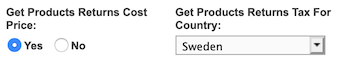
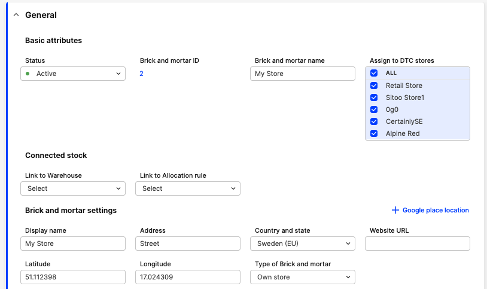
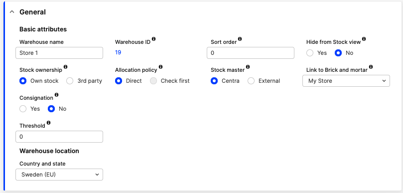
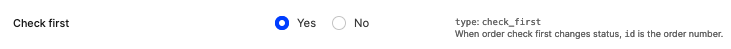
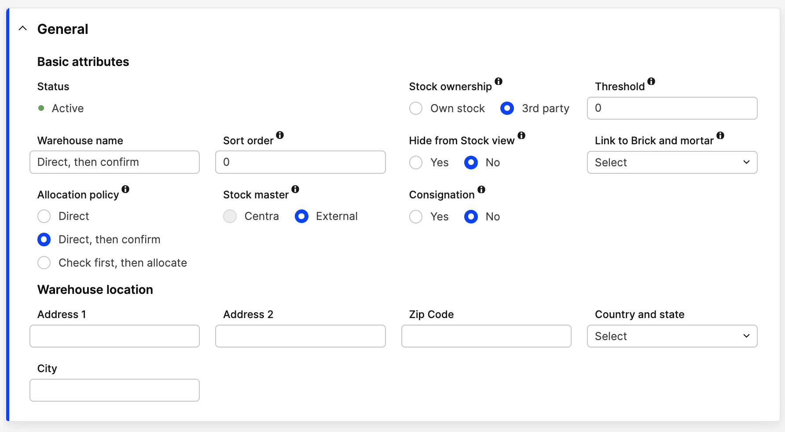
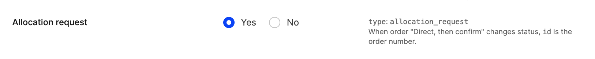

Connecting your Centra store with a Point of Sale system can be done using the Order API. It's relatively similar to how the WMS integrations work, with the main exception being that the sale is made outside of Centra. Some customers can even decide not to create the PoS orders in Centra at all.

### Overview

In general, PoS system integration will use Order API endpoints to fetch products and prices and update the existing stock accordingly. If you choose to create an order in Centra, stock will be updated automatically.

### Prerequisites

To implement a PoS integration using the Order API, you need access to Centra with a configured Order API endpoint. Please note that you would need to authorize with the secret key configured in the Centra Order API settings.

[notice-box=alert]
Warning: Never use the integration you build towards a production Centra environment before it is thoroughly tested and verified to be working as intended!
[/notice-box]

### Initial configuration

For PoS system integration, the following Order API plugin configuration is recommended:



First setting will allow you to easily calculate profit. Second will apply a tax amount appropriate to the country of sale. Due to the difference in tax rules around the world, you will need to configure one API endpoint per every country in which you have points of sale.

### Fetching products

This API call allows you to look for products by their SKU, EAN or internal `productId`, with options to filter them by created/modified date and limit the number of results. In response you will receive a list of products with details such as their name, brand, collection, categories, status (active or not) and product prices in each pricelist.
More information: [Order API - Get products](https://docs.centra.com/reference/stable/order-api/get-products)

#### Example request

`GET http://customer.centra.com/api/order-api/products/?ean=5901144123590`

#### Example response

```json
{
    "status": "ok",
    "products": [
        {
            "sku": "123",
            "variantId": 1475,
            "variantSku": "999",
            "sizeSku": "",
            "brand": null,
            "collection": null,
            "product": "Test Product",
            "productId": 1,
            "variant": "White",
            "size": "One Size",
            "sizeComment": "",
            "stockItemId": 116,
            "ean": "1233421127",
            "upc": null,
            "weight": 0,
            "weightUnit": "kg",
            "countryOfOrigin": "",
            "harmCode": "",
            "harmDescription": "",
            "active": 1,
            "createdAt": "2023-11-28 09:24:15",
            "name": "Test Product",
            "description": "",
            "shortDescription": "",
            "comment": "",
            "metaTitle": "",
            "metaDescription": "",
            "metaKeywords": "",
            "folder": "",
            "categories": [
                "Shop"
            ],
            "categoryName": "Shop",
            "images": [],
            "prices": [
                {
                    "id": "19",
                    "price": 100,
                    "pricelist": "SEK",
                    "currency": "SEK",
                    "campaigns": []
                },
                {
                    "id": "20",
                    "price": 10,
                    "pricelist": "USD",
                    "currency": "USD",
                    "campaigns": []
                }
            ],
            "store": "Retail"
        }
    ]
}
```

### Fetching stock

With the use of [Order API - Get stock](https://docs.centra.com/reference/stable/order-api/get-stock) endpoint, you can fetch the amount of items available for purchase. You can search by productId, SKU or EAN, and in return you will get, among other details:

```json
{
  "physicalStock": 499,
  "allocatedStock": 7,
  "availableStock": 492
}
```

You'll want to use `availableStock` value, since `allocatedStock` is already reserved to other existing orders, and will be deducted from `physicalStock` once those are shipped. To learn more about stock statuses, see [Example stock levels and definitions](/overview/stock/#example-stock-levels-and-definitions).

If a product has multiple sizes, the API will return the stock values for each of the product sizes separately.

More information: [Order API - Get stock](https://docs.centra.com/reference/stable/order-api/get-stock)

#### Example request

`GET http://customer.centra.com/api/order-api/stock/?ean=5901144123590`

#### Example response

```json
{
  "status": "ok",
  "products": [
    {
      "sku": "123",
      "variantId": 1475,
      "variantSku": "999",
      "sizeSku": "",
      "brand": null,
      "collection": null,
      "product": "Test Product",
      "productId": 1,
      "variant": "White",
      "size": "One Size",
      "sizeComment": "",
      "stockItemId": 116,
      "ean": "1233421127",
      "upc": null,
      "weight": 0,
      "weightUnit": "kg",
      "countryOfOrigin": "",
      "harmCode": "",
      "harmDescription": "",
      "active": 1,
      "createdAt": "2023-11-28 09:24:15",
      "categoryName": null,
      "physicalStock": 53,
      "allocatedStock": 44,
      "availableStock": 9
    }
  ]
}
```

### Updating stock

Once the purchase is done, you need to update the physical stock levels in Centra so that you don't oversell your stock. **Remember**: This endpoint works by allowing you to set the stock amount of a specific product to the **new** value, **not** deduct the amount that you're just now selling. In other words, if the `physicalStock` was 499, and the customer is buying 5 items, you'll want to update the stock to 494.

[notice-box=alert]
Centra will not allow you to update the `physicalStock` below what's already reserved for other orders (`allocatedStock`). If you attempt to do that, Centra will set the quantity to the lowest possible value without affecting any other orders.
[/notice-box]

The `product` in the call body needs to uniquely identify product, variant and size, so you can either use a combination of `productSku`, `variantSku` and `sizeSku`, or use EAN number instead.

More information: [Order API - Update stock](https://docs.centra.com/reference/stable/order-api/update-stock)

#### Example request

`POST http://customer.centra.com/api/order-api/stock/`

```json
{
  "products": [
    {
      "product": "5901144123590",
      "quantity": 494
    }
  ]
}
```

#### Example response

```json
{
  "status":"ok"
}
```
On error:

```json
{
  "status": "no",
  "msg": "Some of the products were not updated",
  "errors": {
    "productsNotFound": [
      "9876543210123",
      "5432167890123"
    ]
  }
}
```

## Buy online ship from store

With "Buy online, ship from store" we make it possible to place orders in the webshop which are packed and shipped by a store.

### Setup

To set up "Buy online, ship from store" in Centra it is required to set up a brick and mortar and a warehouse for each store that can accept orders. To get this data our  [GraphQL API](/api-references/graphql-integration-api) can be used

#### Brick and Mortar

The Brick and Mortar entry contains information about the store.




#### Check first, then allocate
##### Warehouse

The warehouse should be connected to your brick and mortar and allocation policy needs to be set as Check first, then allocate. Which to Centra means that the stock quantities are unreliable and need to be verified before the order is handled. It is also required that this warehouse is updated with the store's stock values.



##### Webhooks

To get notified of new orders to ship from what stores, the [Centra webhook API](/plugins/centra-webhook) needs to be set up. Make sure to set it up with Integration API version and ensure that Check first is set to Yes.

  

##### Getting information about "Buy online, ship from store" orders

Webhooks is how you will receive information about "Buy online, ship from store" orders, webhooks will be sent when orders are created, accepted, rejected, or time out. The same order can send the same action multiple times depending on setup.

In each of the payloads `id` refers to the order number which can be used in the Order API. `action` has information about what happened and `data` has more data depending on the `action`

##### Create

Create events are emitted when we expect a store to pick up and ship the order. The webhook contains the `id` for each Check first policy warehouse that is allowed to ship the order and the date at which it will time out. In case of many warehouses, the order will be allocated and sent by whichever warehouse accepts the order first.

```json
{
    "events": [
        {
            "type": "check_first",
            "action": "create",
            "date": "2021-01-11 16:21:00.552288",
            "id": 19,
            "data": {
                "warehouses": [
                    {
                        "warehouseId": 2,
                        "expirationAt": "2021-01-11T15:21:00+01:00"
                    },
                    {
                        "warehouseId": 3,
                        "expirationAt": "2021-01-12T16:21:00+01:00"
                    },
                    {
                        "warehouseId": 4,
                        "expirationAt": "2021-01-12T16:21:00+01:00"
                    }
                ]
            }
        }
    ]
}
```

##### Rejected
Rejected events are emitted whenever the Check first warehouse has been canceled on an order.
This can happen either when an individual store rejects the order [by the Order Api](/api-references/order-api/api-reference/update-check-first) or when the "Resume" button is pressed on a check first order from AMS.
If all are rejected the order will proceed to be processed as a regular order.

```json
{
  "events": [
    {
      "type": "check_first",
      "action": "rejected",
      "date": "2021-01-11 16:21:08.356543",
      "id": 20,
      "data": {
        "warehouseId": 3
      }
    },
    {
      "type": "check_first",
      "action": "rejected",
      "date": "2021-01-11 16:21:08.773921",
      "id": 20,
      "data": {
        "warehouseId": 4
      }
    }
  ]
}
```

##### Accepted
Accepted events are emitted when an order is accepted by a check-first [by the Order Api](/api-references/order-api/api-reference/update-check-first).

After an order is accepted it can not be accepted by any other check-first, and they are automatically rejected.
```json
{
  "events": [
    {
      "type": "check_first",
      "action": "accepted",
      "date": "2021-01-11 16:20:17.752285",
      "id": 18,
      "data": {
        "warehouseId": 4
      }
    }
  ]
}
```

##### Timeout

Timeout events are emitted after a check-first warehouse times out for an order, at the date specified in the [Create](#create) call.

After this time it is no longer possible to accept the order using this warehouse.

```json
{
  "events": [
    {
      "type": "check_first",
      "action": "timeout",
      "date": "2021-01-11 16:20:00.757946",
      "id": 18,
      "data": {
        "warehouseId": 2
      }
    }
  ]
}
```

##### Processing "Buy online, ship from store" orders

##### Rejecting order

If the store is unable to ship the order they should reject it as quickly as possible, so it can move on to the default fulfillment process as fast as possible. Rejection is done by calling the [Order API update Check first, then allocate endpoint](/api-references/order-api/api-reference/update-check-first). No further action is needed, and if all stores reject the order it will be shipped as a normal order.


##### Accepting the order

If the store is able to ship the order, it needs to make a call to [Order API update Check first, then allocate endpoint](/api-references/order-api/api-reference/update-check-first).

Upon error, the order should not be shipped. Errors can happen if the store was too slow and a timeout happened, or if another store accepted the order first.

Upon success, the order should be shipped, and the appropriate actions to create and mark the order as shipped in Centra should be taken.

#### Direct, then confirm allocation
##### Warehouse

The warehouse should be set as "Direct, then confirm", which to Centra means that stock quantities are potentially unreliable and allocation needs to be confirmed before the order is handled. It is also required that this warehouse is updated in real time with the store's stock values. You may connect the “Direct, then confirm” warehouse to your brick and mortar store.



##### Fetching allocation requests with Order API

Information about allocation requests can be fetched using Order API. The endpoint [Get allocation requests of an order](/api-references/order-api/api-reference/get-allocation-requests) can be used to get information about the allocation requests for a specific order.

`GET <base>/*base*/orders/*id*/allocation-requests HTTP/1.1`

```json
  { 
    "status": "ok",
    "allocation_requests": [
        {
            "id": 1141,
            "status": "sent",
            "warehouseId": 27,
            "expirationDate": "2024-02-14T16:02:25+01:00",
            "order": {
                "id": "5cdb865329d982314aab6c5b84ac1201",
                "number": 1103
            },
            "lines": [
                {
                    "lineId": 1484,
                    "quantity": 1,
                    "stockItemId": 121
                },
                {
                    "lineId": 1485,
                    "quantity": 1,
                    "stockItemId": 120
                },
                {
                    "lineId": 1486,
                    "quantity": 2,
                    "stockItemId": 116
                }
            ],
            "createdAt": "2024-02-13T16:02:25+01:00",
            "warehouseName": "Store 1"
        }
    ]
}
```

##### Webhooks

To get notified of new orders to ship from stores the [Centra webhook API](/plugins/centra-webhook) needs to be set up. Make sure to set it up with type `Integration API` and ensure that "Allocation request" is set to “Yes”.



##### Getting information about "Buy online, ship from store" orders

Webhooks is how you receive the information about "Buy online, ship from store" orders. 

Webhooks will be sent when orders are `created` or `outdated`. The same order can send the same action multiple times depending on setup.

##### Create
Create events are emitted when we expect a store to pick up and ship an order. The webhook contains the Id for each ‘Direct, then confirm” warehouse that is allowed to ship the order and the date at which it will time-out.  In case of multiple warehouses sharing the priority the one confirming the allocation request first will get to send the order.

```json
{
  "events": [
    {
      "type": "allocation_request",
      "action": "create",
      "date": "2023-12-29 09:44:11.505407",
      "id": 2131231241249,
      "data": {
        "status": "allocated",
        "warehouseId": 9,
        "expirationDate": {
          "date": "2023-12-29 10:44:11.384563",
          "timezone_type": 3,
          "timezone": "Europe\/Stockholm"
        },
        "order": {
          "id": "367482b8c68dd399db65637ce0208940",
          "number": 67
        },
        "lines": {
          "102": {
            "lineId": 102,
            "quantity": 1,
            "stockItemId": 19
          },
          "103": {
            "lineId": 103,
            "quantity": 1,
            "stockItemId": 19
          }
        }
      }
    }
  ]
}

```
`id` - Allocation request ID

`action` - The action for the allocation request. Can be:`create`, `update`

`date` - The date for the allocation reques

`data.warehouseId` - The id of the warehouse that is confirming allocation request

`data.status` - The status of the warehouse operation. Can be: `allocated` - items are allocated from this warehouse, request is sent, `timed-out` - allocation request reached expiration date, items are re-allocated, request still can be confirmed (if the allocation flow has not yet reached the end), `sent` - request was sent, but products are allocated from another warehouse. If this warehouse will confirm the request, re-allocation will be done if there is sufficient stock at the moment of confirmation. `outdated` - allocation request is outdated, please ignore it

`data.expirationDate` - Object, that contains date time for the allocation request expiration

`data.order.id` - Selection id for the order in Centra

`data.order.number` - Order number in Centra

`data.lines[].lineId` - Order line ID in Centra

`data.lines[].quantity` - Order item quantity

`data.lines[].stockItemId` - Order stock item ID

##### Timeout

When `Direct, then confirm` warehouse times out for an order (or part of the order), at the date specified in the [Create](#create) call. At this moment, allocated items will be released back to FTA (free to allocate) in this warehouse and allocation will move to the next warehouse in the rule that can fulfill the order demand (partially or fully). Timed out requests can still be accepted, if there is sufficient stock left in the warehouse, another warehouse has not yet confirmed the allocation and the entire flow has not reached the end.

##### Processing "Buy online, ship from store" orders

##### Rejecting the allocation

If the store is unable to ship the order/ requested part of the order they should reject it as quickly as possible, so it can move on to the next warehouse set in allocation rule as fast as possible. Rejection is done by calling the [Order API update Allocation request endpoint](/api-references/order-api/api-reference/update-allocation-request). No further action is needed, and if all stores reject the order it may be fully or partially backordered and require an action from a Centra admin user in AMS (reallocate to another warehouse manually or cancel the order/ part of the order and notify the client).

##### Confirming the allocation

If the store is able to ship the order, it needs to make a call to [Order API update allocation request endpoint](/api-references/order-api/api-reference/update-allocation-request).

Upon error, the order should not be shipped. Errors can happen if the store was too slow and the entire allocation flow has reached the end, hence all previous requests are outdated, or if another store accepted the order first.

Upon success, the order should be shipped, and the appropriate actions to create and mark the order as shipped in Centra should be taken.
