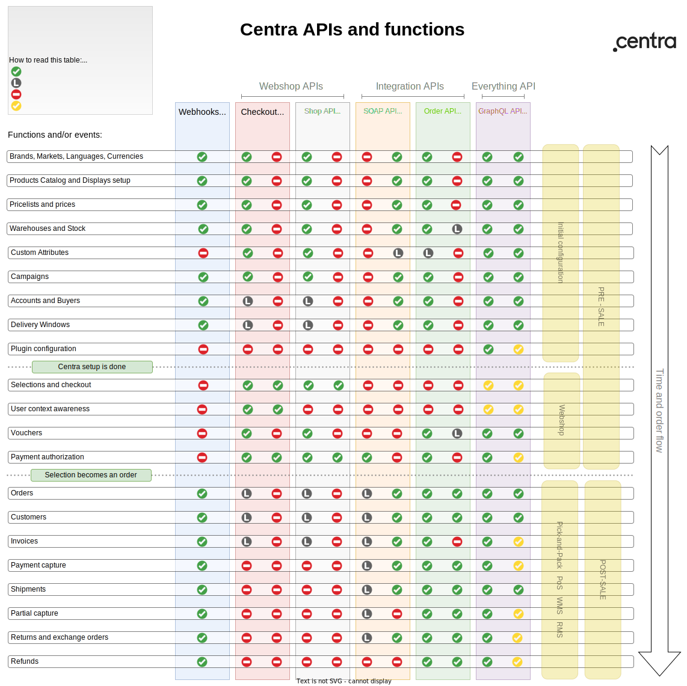

Centra has a few different APIs used for different purposes. This documentation explains the functions and use cases that are covered by all the different APIs used to connect to Centra.

## Choosing the right API for your integration

Here are some examples which you can consider when planning your integration with Centra. If none of those covers your use case, let us know and we will advise!

### [REST] DTC webshop API (Checkout API)

If you are building a front end for your brand or DTC store, either as a website or a mobile app, you should probably look into using Checkout API. It's our hybrid webshop API, able to operate both in Client and Server mode, giving you access to products catalog, prices, payments, checkout, shipping options, vouchers, anything you need to build a webshop. To read more about building a front end using Checkout API, visit [Creating Front End for Centra store](/fe-development) section.

#### Shop API [deprecated]

Shop API is an older, soon to be deprecated webshop API, which only works in authenticated Server mode. It operates directly on selections (instead of sessions), is not aware of the end-user context, and is less capable performance-wise, since it doesn't use ES cache internally, like Checkout API does.

[notice-box=info]
Checkout API is highly recommended for any new implementations. Shop API will be deprecated in the near future.
[/notice-box]

### [REST] Integration API (Order API)

If your integration takes care of orders *after* they are created in Centra, you can be interested in using Order API. It covers lots of functions, like [WMS integrations](/guides/wms-integration), Return Management Systems, Stock management, etc. For those orders you may want to update existing Orders, create and modify Shipments, read or manipulate Stock, or read/create/update Returns. You also have access to Customer data and the [Supplier Module](https://support.centra.com/centra-sections/modules/supplier-module). With the right API plugin config, you will also be able to insert Orders directly into Centra (e.g. when migrating from another e-commerce platform), or manipulate Vouchers (e.g. generating cloned vouchers for your influencers). To learn more, see [Order API reference](/api-references/order-api).

Order API was originally built as a pick-and-pack service integration API, with a lot of functionality added over the years. It is, however, very far from being feature-complete. For this reason we are developing GraphQL API.

### [GQL] GraphQL Integration API

This is designed to be the last integration API we will ever need. It gives you granular access to almost all parts of Centra, including the parts previously available only from the backend UI. The only limit is your imagination.

Currently, GraphQL works mostly in read-only mode, but we are adding new functionality (including write parts) with every Centra version. Once fully developed, it will deprecate Order API, and possibly SOAP API as well. To learn more, see [GraphQL Integration API](/api-references/graphql-integration-api).

### [SOAP] ERP system integrations

Many customers use the ERP systems, like Navision, to store the master of the data for Products, Customers, Pricelists and so on. If you need to integrate to those systems, you may be interested in our [SOAP API](/api-references/soap-integration-api). Since in this case Centra works in a slave mode, this is currently the only API that allows you to modify Centra Products, Pricelists, Shipping, Invoices, etc. We very rarely add new features to this API, but we also have comprehensive docs covering most of use cases required when working with an ERP system. They are all described in our [ERP integration guide](/guides/erp-integration).

### [REST] Subscription API (deprecated)

This API was replaced by the [new subscriptions functionality](/fe-development/subscriptions).

## Centra APIs vs functions

### Existing Limitations

Order API can be used to update stock values, but only for one Warehouse in each plugin instance.

Order API only supports attributes on `product` and `variant` level. They are only returned through the `GET /products` endpoint.

SOAP API only supports custom attributes built into existing plugins, like Ingrid. It does not support custom attributes defined in the customer config.

Checkout API has limited support for Wholesale stores. We can recommend Centra Showroom for your B2B store, if you'd like.

Shop API has limited support for Wholesale stores. It has also be noted that this API is legacy, not recommended for new implementations.

Order API can be used to create very basic vouchers, or to clone voucher templates previously defined in the Centra AMS.

Checkout API can only be used to view the historical orders of currently logged in user. As a webshop API, it doesn't have access to other orders unrelated to the shopper.

Checkout API can only be used to view the historical orders of currently logged in user. It has also be noted that this API is legacy, not recommended for new implementations.

With SOAP, each event should only be fetched once, synced with the ERP and then marked as done in Centra. After that, you can no longer fetch it from Centra directly, unless there's been changes that need to be synced to the ERP as well.
