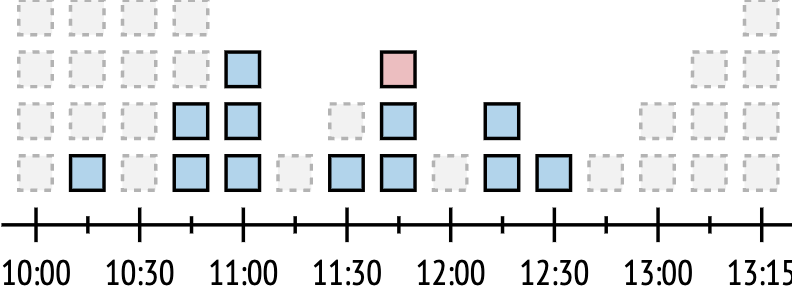

### I am hitting the rate limits, what should I do?:

Here are some tips to avoid hitting the rate limits. The most important ones are:
* First and foremost: try to reduce query complexity as much as possible. The easiest way to do this is to only select fields that are necessary, especially for nested objects and lists of them, as they are the most expensive in terms of complexity. Query complexity is always visible in the API response in the `extensions` object. Sometimes it is possible to even use another query to remove a level of nesting. An example of this can be found below.
* Retry with delay according to `Retry-After` header – it contains the timestamp of when you can resume your requests. Sending more requests before that timestamp will trigger the rate limiting again. Remember that the status code for such response is 429.
* Smoothen out the rate of requests, because sudden spikes will be most likely blocked. This especially applies if you send requests asynchronously, which enables sharper load spikes.
And more tips on how to optimize your API usage:
* Use `rateLimits` query to gather information about your current rate limiting status.
* Requests that result in user errors (ideally warnings too) should be handled appropriately in order to prevent spamming the API with erroneous requests that deplete the limit for nothing.
* If there is some data that is accessed frequently but not changed often (for example, markets, stores, countries, pricelists, product catalog), cache it to save requests for managing frequently changing data (for example, orders).

<details open>
  <summary>A more complex example of reducing the query complexity</summary>

  Let’s say we have a query like this, which fetches orders for accounts

```gql
query ordersForAccount {
  accounts {
    id
    orders {
      ...
    }
  }
}
```

As we can see, it contains a nested list, which significantly increases query complexity, especially if you want to get a lot of details about the order in nested objects.

We can remove one level of nesting by cleverly using query filters, this way the query becomes:

```gql
query ordersForAccount {
  orders(where: {notNull: ["accountId"]}) {
    ...on WholesaleOrder {
      account {
        id
      }
    }
  
    ...
  }
}
```

This requires additional in-memory grouping on the integration side, but makes the query much less complex (potentially more than 100 times so!).
</details>

### I am following all guidelines and still hitting rate limits, what should I do?

Please get in touch with us via Slack or partner channel. We will investigate your API usage and make a decision about whether to increase limits or assist in further optimization. The best way is to register as our partner and enroll in the certification program: [become a partner](https://centra.com/#BecomePartnerModal)

### Why do rate limits exist?

Rate limiting is a way to control the rate at which requests are sent to our API. The main goal is to distribute the server load evenly across the timeline. Often integrations are implemented in a way that creates load spikes on the servers. Every spike can lead to out-of-memory issues, extremely long response times, server crashes, etc. Having rate limits prevents those issues from occuring.

### Rate limits in Centra’s Integration API

Currently, we limit requests based on 3 things (in the given timeframe):
* Total number of requests
* Sum of query complexities of those requests
* Total number of mutations among those requests

The first one is pretty obvious – we want to avoid too many requests to the server, so we limit their number. The second one makes sense if we remember that more complex query generally requires more time and resources to be processed, so even if there aren’t too many requests made, if they are complex, they will be rejected over time. The third one is introduced because mutations, despite being simple in terms of complexity score, put much more significant load on the infrastructure, so it was decided to limit the number of mutations that can be performed generally.

Having those 3 things means we also have 3 buckets per timeframe to limit based on these things. “Pricing“ is pretty straightforward: for request count and mutations `1 request = 1 token`, for complexity score `1 complexity point = 1 token`.

Currently, there are 2 timeframes: 10 seconds and 1 hour. The first one ensures that no sudden short-term burst can overwhelm the server. The second one ensures that there is no prolonged pressure on the server.

It is very easy to detect which requests are limited by this mechanic, because the response has status code `429 Too Many Requests`. Furthermore, it contains a `Retry-After` header that points at a timestamp at which it is possible to try again without being blocked.

### The `rateLimits` query

In order to be transparent about the way we rate limit requests and to help API users plan their load accordingly, a query was introduced to share all necessary data about rate limiting buckets:

```gql
query {
  rateLimits {
   type
   intervalSeconds
   quota
   usedQuota
   remainingQuota
  }
}
```

It requires no permissions and the result returned is an array of 6 (currently) objects, which represent rate limiting windows of all types and lengths. Now let’s go over each field in those objects:
* `type` – type of the window, represented as an enum RateLimitType and can have 3 possible values: `REQUEST_COUNT`, `QUERY_COMPLEXITY`, `MUTATION_COUNT`. These values represent 3 aforementioned types of rate limiting we have in the API.
* `intervalSeconds` – length of the window in seconds, represented as an enum `RateLimitInterval` and can have 2 possible values: `TEN_SECONDS` and `ONE_HOUR`. These values represent 2 aforementioned lenghts of rate limiting windows we have in the API.
* `quota` – size of the bucket, available token quota to spend on requests in given timeframe.
* `usedQuota` – how many tokens are missing from the bucket as a result of requests.
* `remainingQuota` – how many tokens remain in the bucket and are available for consumption.

[notice-box=info]
It's easy to see that `quota = usedQuota + remainingQuota`
[/notice-box]

[notice-box=alert]
Keep in mind that this query is also rate limited as it consumes time and resources
[/notice-box]

An example response for a fresh instance would be like this:

```gql
{
  "data": {
    "rateLimits": [
      {
        "type": "REQUEST_COUNT",
        "intervalSeconds": "TEN_SECONDS",
        "quota": 20,
        "usedQuota": 1,
        "remainingQuota": 19
      },
      {
        "type": "REQUEST_COUNT",
        "intervalSeconds": "ONE_HOUR",
        "quota": 10000,
        "usedQuota": 1,
        "remainingQuota": 9999
      },
      {
        "type": "QUERY_COMPLEXITY",
        "intervalSeconds": "TEN_SECONDS",
        "quota": 150000,
        "usedQuota": 10,
        "remainingQuota": 149990
      },
      {
        "type": "QUERY_COMPLEXITY",
        "intervalSeconds": "ONE_HOUR",
        "quota": 20000000,
        "usedQuota": 10,
        "remainingQuota": 19999990
      },
      {
        "type": "MUTATION_COUNT",
        "intervalSeconds": "TEN_SECONDS",
        "quota": 100,
        "usedQuota": 0,
        "remainingQuota": 100
      },
      {
        "type": "MUTATION_COUNT",
        "intervalSeconds": "ONE_HOUR",
        "quota": 1000,
        "usedQuota": 0,
        "remainingQuota": 1000
      }
    ]
  },
  "extensions": {
    "complexity": 10,
    "permissionsUsed": [],
    "appVersion": "v0.37.4"
  }
}
```

### How does rate limiting work?

There are many ways to implement such a feature, but all they have in common is that they try to limit the number of requests that can be performed in a given time window. In our case, the best fit is a token bucket algorithm. It roughly works like this:
* There is a bucket that contains tokens with a set capacity; it can be represented in any way and structure depending on the implementation;
* The bucket is at full capacity at the beginning;
* Allowing a request consumes one or more tokens, depending on the scenario;
* If the bucket contains enough tokens, the request is allowed and tokens are consumed; otherwise, it's denied;
* New tokens are added to the bucket at a constant rate (e.g. 1 token every second);
* If the bucket is at full capacity, newly added tokens are discarded.

The below diagram shows a token bucket of size 4 that is filled with a rate of 1 token per 15 minutes:



Reading it from left to right, at 10:15 there was only one request, and it was topped up in the next timeframe. At 10:45 there were two requests, so the next window has the two remaining plus one available token. At 11:00 all three remaining tokens were used, and one token was replenished at 11:15. At 11:30, this token was used and one was replenished. At 11:45, another token was added to the bucket, but as we can see, a third request is denied because the bucket does not have enough tokens at this point, thus protecting the server from another load spike.
