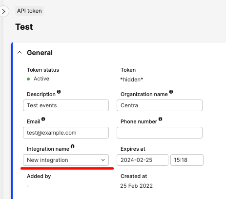

## What is the event system

[notice-box=info]
For now, the system is enabled on servers on demand, and only available in QA environments. Please contact your CSM/PSM to enable it and for further information. The Integration API queries and AMS page are always available, but events are not generated until the system is enabled internally.
[/notice-box]

Integration GraphQL API exposes a stream of events to the interested parties. When anything in Centra is changed, there will be events you can listen to. This will allow you to:  
* know what changed since your last synchronization, so that you can fetch only changed data selectively,  
* avoid periodical polling for new data of each type.

For example, when a new order is created by Checkout API or from any other source, there will be an event of “object type” `Order` and “change type” `CREATED`, and your integration will see it as soon as the events are fetched by the new query `events` (see below).

The object type means “what was changed”. It’s an object you can fetch using a GQL query. The full list of available object types is defined in the [EventObjectType](https://docs.centra.com/graphql/eventobjecttype.html) enum.

The change type is “how it was changed”. The list of change types is the [EventChangeType](https://docs.centra.com/graphql/eventchangetype.html) enum. While `CREATED`, `UPDATED`, and `DELETED` are self-explanatory, it’s worth telling more about the others:  
* `COMPLETED` - only a few objects can have this type, those that have “Completed” status: Order, Shipment, Return, PurchaseOrder, PurchaseDelivery. When these objects move to the Completed status, technically, it’s an update, but since there is a special logic for them, we provide a new change type.  
* `DEPENDENT_DATA_CHANGED` - this type is caused by indirect changes: when an entity itself is not changed, but another entity that has a logical connection got some updates. For example, a change in ProductMedia (an image is updated) will also trigger a Product, connected ProductVariant, and Display which have this media.

## Differences from the SOAP queue

For those who are familiar with our SOAP API queue, it might be important to know the differences between them:  
* SOAP API supports a limited set of objects, while the new Events system supports all of them,  
* SOAP API returns events data in a predefined, non-configurable way, the Events system is built in the GQL API that gives all the advantages of GQL,  
* The Events system is more granular in terms of change types,  
* In the Events system, you have full control over what you want to populate the queue with,  
* SOAP API provides only one way of filtering the events: by market. In the new system, there are more fields to filter by: market, store, object type, change type.  

## How to enable the system

For now, the system is enabled on servers on demand. Please contact your CSM/PSM to enable it. The Integration API queries and AMS page are always available, but events are not generated until the system is enabled internally.

After it’s enabled, you need to prepare your API token.

Event queues are connected to an integration. It’s defined for your API token on the API tokens page. The integration should reflect the name and purpose of the integration this token is a part of. For example, "Migration from SOAP" or "Google feed generation".



Please note, you can have multiple tokens with the same integration name. In this case, these tokens will share the same event queue.

Also, your token should have two new permissions: `Event:read` and `Event:write`.

## How to use it

There are four steps:  
* Set listeners  
* Fetch events  
* Process events (on your end)  
* Confirm events  

### Set listeners

Management of the listeners is performed by [setEventListeners](https://docs.centra.com/graphql/mutation.html#setEventListeners) and [unsetEventListeners](https://docs.centra.com/graphql/mutation.html#unsetEventListeners). Example:

```gql
mutation setEventListeners {
  setEventListeners(input: [
    # No "changeTypes" means all types
    {objectType: Product}
    {objectType: Order}
    {objectType: Return, changeTypes: [CREATED, COMPLETED]}
    {objectType: AdminUser, changeTypes: [DELETED]}
    {objectType: ProductVariant, changeTypes: [DELETED, DEPENDENT_DATA_CHANGED]}
  ]) {
    eventListeners {
      objectType
      changeTypes
      createdAt
      updatedAt
    }
    userErrors {
      message
      path
    }
    userWarnings {
      message
      path
    }
  }
}
```

After executing this mutation, your integration will be subscribed to the listed types. It means, when these objects are affected, the queue will receive new events of these object and change types.

If you send this mutation with different change types, it won’t override the existing one, but only add new change types. For example, a new call:

```gql
mutation setEventListeners {
  setEventListeners(input: [
    {objectType: AdminUser, changeTypes: [CREATED]}
  ]) {
    *same as above*
  }
}
```

...will only add `CREATED` to the list of change types, so it will include `DELETED` and `CREATED`. The other object types will remain unchanged.

If you are no longer interested in receiving updates on some object or change types, use `unsetEventListeners`. Please note, it will result in deleting all queued events of these types.

```gql
mutation unsetEventListeners {
  unsetEventListeners(input: [
    # It will unsubscribe from CREATED only
    {objectType: AdminUser, changeTypes: [CREATED]}
    # It will unsubscribe from all change types, 
    # meanining the object type will completely be deleted from the queue
    {objectType: Return}
  ]) {
    # It will return affected, but not deleted listeners
    eventListeners {
      objectType
      changeTypes
      createdAt
      updatedAt
    }
    userErrors {
      message
      path
    }
    userWarnings {
      message
      path
    }
  }
}
```

The mutations are idempotent, you can execute them as many times as you want.

To know what your integration is subscribed to, use the `eventListeners` query:

```gql
query eventListeners {
  eventListeners {
    integrationName
    objectType
    changeTypes
    createdAt
    updatedAt
  }
}
```

### Fetch events

Use the new `events` query to get new _not confirmed_ events. The query always returns the oldest events.

After they are processed, they must be confirmed by calling the `confirmEvents` mutation (the fourth step). Otherwise, the repetitive calls of the query will be returning the same events.

You can filter by object type and change type for all types of events, and additionally filter by store and market for events that are related to them. If a token is restricted to a given store, events related to other stores will not be visible to it.

An example of receiving Product events:

```gql
fragment eventFields on Event {
  id    
  objectType
  changeType
  objectReference
  createdAt
  store {id}
  market {id}
}

query productEvents {
  events(where: {objectType: [Product]}) {
    ...eventFields
    object {
      __typename
      # Use fragments to get data of the object
      ...on Product {
        id
        status
        productNumber
      }
    }
  }
}
```

Pay attention to `__typename__` - this is a special GQL field that contains a name of a type of a given event. In the example above, it will be `Product` and `Collection` accordingly. It might be helpful to determine what exact types you fetch to add the fragments for them.

If you want to receive all the events in a single query, you can use aliases to differentiate the data of objects. Otherwise, there will be name collisions.

```gql
query eventsInSingleQuery {
  events {
    ...eventFields
    object {
      __typename
      ...on Product {
        productId: id
        productStatus: status
        productNumber
      }
      ...on Collection {
        collectionId: id
        collectionStatus: status
        collectionName: name
      }
    }
  }
}
```

Also, you can use multiple queries inside one call. This solution is slower, but if the receiving fields are not expensive (like stock levels or many nested objects), the difference should not be significant compared to the previous examples.

```gql
query multipleQueries {  
  productEvents: events (where: {objectType: [Product]}) {
    ...eventFields
    object {
      ...on Product {
        id
        status
        productNumber
      }
    }
  }  
  collectionEvents: events (where: {objectType: [Collection]}) {
    ...eventFields
    object {
      ...on Collection {
        id
        status
        name
      }
    }
  }
}
```

An example of filters:

```gql
query completedEventsOfSpecificStoreAndMarket {
  events(
    where: {
      objectType: [Order, Shipment, Return], 
      changeType: [COMPLETED], 
      storeId: 1, 
      marketId: 2
    }
    limit: 200
  ) {
    ...eventFields
    objectOrder: object {
      ...on Order {
        id
      }
    }
    objectShipment: object {
      ...on Shipment {
        id
      }
    }
    objectReturn: object {
      ...on Return {
        id
      }
    }
  }
}
```

Please note, `object` is always the current state of a given object, not a historical view at the moment this event was registered.

Also, `object` will be `null` for deleted objects (`changeType: DELETED`).

How often you should fetch the events depends on your needs and server capabilities. In some cases, it can once a few minutes or hours, but we don’t recommend running it every couple of seconds. Once a minute, most likely, won’t significantly affect server performance. If you’re not sure about the frequency, please contact us.

### Process events

This is what you do on your end after fetching the events: cache invalidation, synchronization with 3rd parties, static page generation, etc.

### Confirm events

Once you processed events, you must confirm it by the mutation:

```gql
mutation confirmEvents {
  confirmEvents(input: {
    # IDs are from the `events` query above (event.id)
    eventsIds: [1, 2, 3, 100]
  }) {
    userErrors {
      message 
      path
    }
    userWarnings {
      message 
      path
    }
  }
}
```

[notice-box=alert]
It is extremely important to confirm the processed events. Any missed event will be stuck in the queue forever, and if you don't do this at all, the query to get events will always return only old events. If you didn’t do any processing (e.g. an invalid or test order), you still should confirm the event.
[/notice-box]

In terms of performance, it’s better to send events in batches (as in the example). The easiest way is to just provide the same list of IDs fetched by the `events` query. If you received 72 events by the query, just put these 72 events into `confirmEvents`. It’s also important to confirm the events even in case of errors on your side. For example, if you successfully processed 35 events out of the 72 you fetched, you should confirm these 35, and the rest will be kept in the queue.

Please pay great attention to this stage, we saw many cases when careless implementation or ignoring it at all led to broken integrations.
