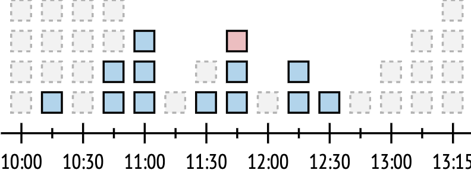

### What is rate limiting?

Rate limiting is a way to control the rate at which requests are sent to our API. It is done to prevent DoS attacks and abuse of the API. There are many ways to implement such a feature, but all they have in common is that they try to limit the number of requests that can be performed in a given time window. In our case, the best fit is a token bucket algorithm. It roughly works like this:  
* There is a bucket that contains tokens with a set capacity; it can be represented in any way and structure depending on the implementation;
* The bucket is at full capacity at the beginning;
* Allowing a request consumes one or more tokens, depending on the scenario;
* If the bucket contains enough tokens, the request is allowed and tokens are consumed; otherwise, it's denied;
* New tokens are added to the bucket at a constant rate (e.g. 1 token every second);
* If the bucket is at full capacity, newly added tokens are discarded.

The below diagram shows a token bucket of size 4 that is filled with a rate of 1 token per 15 minutes:



Reading it from left to right, at 10:15 there was only one request, and it was topped up in the next timeframe. At 10:45 there were two requests, so the next window has the two remaining plus one available token. At 11:00 all three remaining tokens were used, and one token was replenished at 11:15. At 11:30, this token was used and one was replenished. At 11:45, another token was added to the bucket, but as we can see, a third request is denied because the bucket does not have enough tokens at this point, thus protecting the server from another load spike.

### Rate limits in Centra GraphQL API

Currently, we limit requests based on 3 things (in the given timeframe):  
* Total number of requests
* Sum of query complexities of those requests
* Total number of mutations among those requests

The first one is pretty obvious – we want to avoid too many requests to the server, so we limit their number. The second one makes sense if we remember that more complex query generally requires more time and resources to be processed, so even if there aren’t too many requests made, if they are complex, they will be rejected over time. The third one is introduced because mutations, despite being simple in terms of complexity score, put much more significant load on the infrastructure, so it was decided to limit the number of mutations that can be performed generally.

Having those 3 things means we also have 3 buckets per timeframe to limit based on these things. “Pricing“ is pretty straightforward: for request count and mutations `1 request = 1 token`, for complexity score `1 complexity point = 1 token`.

Currently, there are 2 timeframes: 10 seconds and 1 hour. The first one ensures that no sudden short-term burst can overwhelm the server. The second one ensures that there is no prolonged pressure on the server.

It is very easy to detect which requests are limited by this mechanic, because the response has status code `429 Too Many Requests`. Furthermore, it contains a `Retry-After` header that points at a timestamp at which it is possible to try again without being blocked.

### The `rateLimits` query

In order to be transparent about the way we rate limit requests and to help API users plan their load accordingly, a query was introduced to share all necessary data about rate limiting buckets:

```gql
query {
  rateLimits {
   type
   intervalSeconds
   quota
   usedQuota
   remainingQuota
  }
}
```

It requires no permissions and the result returned is an array of 6 (currently) objects, which represent rate limiting windows of all types and lengths. Now let’s go over each field in those objects:
* `type` – type of the window, represented as an enum `RateLimitType` and can have 3 possible values: `REQUEST_COUNT`, `QUERY_COMPLEXITY`, `MUTATION_COUNT`. These values represent 3 aforementioned types of rate limiting we have in the API.
* `intervalSeconds` – length of the window in seconds, represented as an enum RateLimitInterval and can have 2 possible values: `TEN_SECONDS` and `ONE_HOUR`. These values represent 2 aforementioned lenghts of rate limiting windows we have in the API.
* `quota` – size of the bucket, available token quota to spend on requests in given timeframe.
* `usedQuota` – how many tokens are missing from the bucket as a result of requests.
* `remainingQuota` – how many tokens remain in the bucket and are available for consumption.

[notice-box=info]
It's easy to see that quota = usedQuota + remainingQuota
[/notice-box]

[notice-box=alert]
Keep in mind that this query is also rate limited as it consumes time and resources
[/notice-box]

An example response for a fresh instance would be like this:

```gql
{
  "data": {
    "rateLimits": [
      {
        "type": "REQUEST_COUNT",
        "intervalSeconds": "TEN_SECONDS",
        "quota": 20,
        "usedQuota": 1,
        "remainingQuota": 19
      },
      {
        "type": "REQUEST_COUNT",
        "intervalSeconds": "ONE_HOUR",
        "quota": 10000,
        "usedQuota": 1,
        "remainingQuota": 9999
      },
      {
        "type": "QUERY_COMPLEXITY",
        "intervalSeconds": "TEN_SECONDS",
        "quota": 150000,
        "usedQuota": 10,
        "remainingQuota": 149990
      },
      {
        "type": "QUERY_COMPLEXITY",
        "intervalSeconds": "ONE_HOUR",
        "quota": 20000000,
        "usedQuota": 10,
        "remainingQuota": 19999990
      },
      {
        "type": "MUTATION_COUNT",
        "intervalSeconds": "TEN_SECONDS",
        "quota": 100,
        "usedQuota": 0,
        "remainingQuota": 100
      },
      {
        "type": "MUTATION_COUNT",
        "intervalSeconds": "ONE_HOUR",
        "quota": 1000,
        "usedQuota": 0,
        "remainingQuota": 1000
      }
    ]
  },
  "extensions": {
    "complexity": 10,
    "permissionsUsed": [],
    "appVersion": "v0.37.4"
  }
}
```

### Rate limiting guidelines

Here are some tips to avoid unnecessary bucket depletions and stressing the API:
* First and foremost, remember: The rate limits are used to prevent abuse and ensure the performance and stability of the system. We believe it's better for some of your queries to fail, rather than risk overloading the entire server and affecting other running integrations. Therefore, if you hit the rate limits, you should see it first as a good reason to look into optimising your queries and mutations. Optimising them might seem difficult at first, but it will save you a lot of problems in the future.
* Plan Your API Requests: Before making any API requests, plan your queries and mutations carefully to ensure that they are necessary and efficient. Avoid making unnecessary or redundant requests, and group multiple requests into a single query or mutation whenever possible.
* Minimize Query Complexity: GraphQL APIs often have limits on the complexity of queries to prevent excessive resource usage. To minimize query complexity, avoid deeply nested queries and mutations, and use aliases to avoid duplicate fields in your queries. Query complexity is always visible in the API response in the `extensions` object.
* Use pagination (or better - Relays): When requesting large amounts of data, use pagination or relay connections to limit the number of results returned per request. This can help reduce the complexity of the query and avoid hitting rate limits.
* Try not to spike: It is encouraged to smoothen out the rate of requests, because sudden spikes would likely be blocked.
* Analyse your own usage: Use `rateLimits` query to gather useful data about API usage. Keep track of your API usage and monitor the rate limits to ensure that you are not exceeding them. Use tools such as GraphQL Playground or GraphiQL to test your queries and mutations and check the response headers for rate limit information.
* Take your time: When running large batch jobs, introduce wait times between requests to avoid hitting rate limits. For example, you can add a sleep function in your code to pause execution between requests.
* Don't re-try too quick: It is encouraged to wait until there are enough tokens to make a request in case it is blocked by the rate limiter. The timestamp when API becomes available is located under `Retry-After` header.
* Don't repeat errors: Requests that result in user errors (ideally all types of errors) should be handled appropriately in order to prevent spamming the API with erroneous requests that deplete the limit for nothing.
* Cache it if you can: If there is some data that is accessed frequently but not changed often (for example, markets, stores, countries, pricelists), caching API responses can help reduce the number of requests and minimize the impact of rate limits. Use a caching solution such as Redis or Memcached to cache responses and set appropriate cache headers to ensure that cached responses are not stale.
* Test carefully before releasing to Production: If you need to run large batch jobs that require a large number of requests, it is important to plan for how long the job will take and provide users with appropriate feedback. For example, you can provide a progress bar or estimate the remaining time to completion. Additionally, it is important to not query or mutate data that is already up to date, but instead focus on the delta, or the changes that have occurred since the last update. This can help reduce the number of requests and minimize the impact of rate limits.

### I am following all guidelines and still hitting rate limits, what should I do?

Please get in touch with us via Slack or partner channel. We will investigate your API usage and make a decision about whether to increase limits or assist in further optimization.
