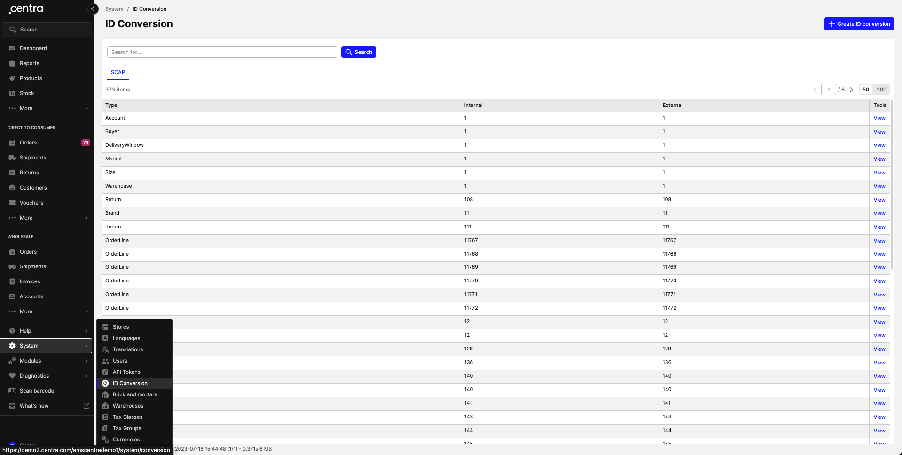
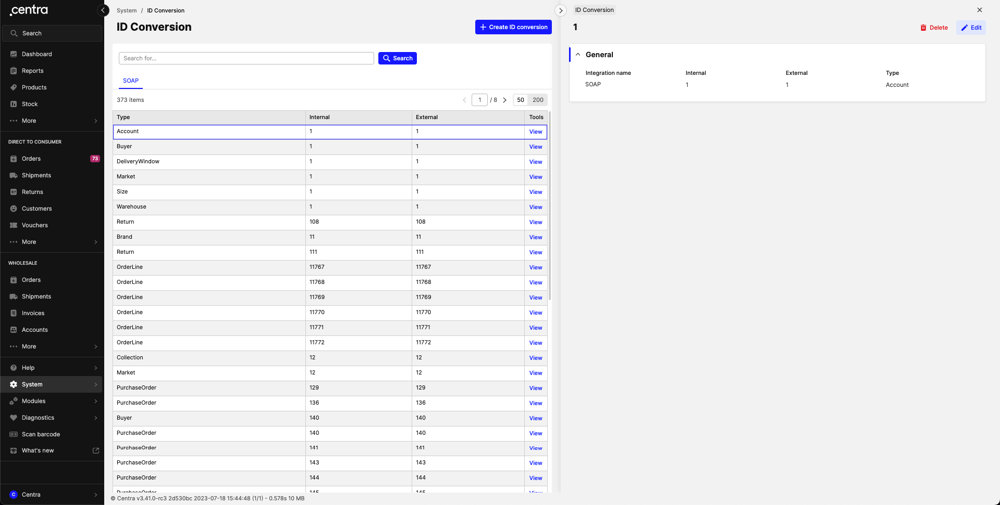
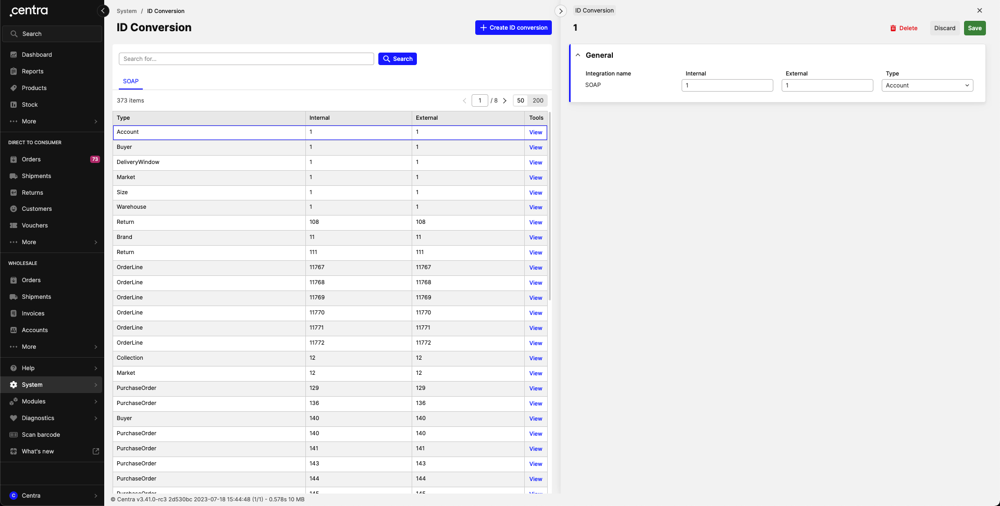
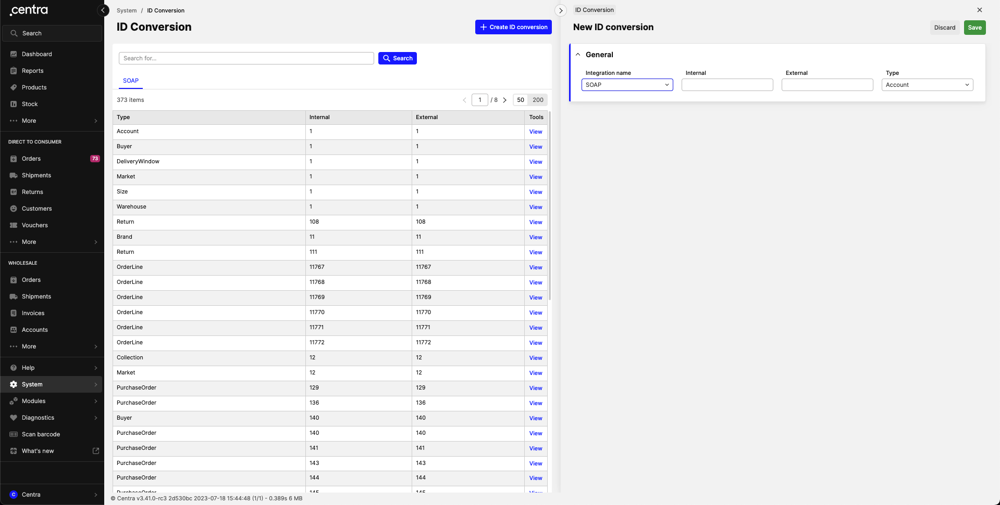

### Introduction
To make an integration as easy as possible to build and maintain, the Integration API enables interactions with Centra based on IDs in any external integration. This means the integration only has to be aware of its own IDs and not of Centra's IDs. This is very similar to how ID conversion works in SOAP API and other modules, however, we extended it to be manageable through the Integration API directly as part of the Centra core. It also allows to support any custom integrations that are not Centra modules.

IDs and the ID conversion table are hence a fundamental part of this API.

The ids are always in the `externalId` field in the input and are used to uniquely identify orders, products, customers, and other data objects for each integration. The full list of supported types can be found [here](https://docs.centra.com/graphql/idconversionentryobjecttype.html).

The ID conversion table translates back and forth between Centra’s internal IDs and the IDs you chose on your side.

When data originates from Centra; for example from orders, you will always get Centra’s internal numeric ID. For orders, this is the order number.

When data originates from an external system, for example, products, you can pick any unique `externalId` you prefer when you send the data to Centra. This is when the ID conversion table comes into effect; Centra will create a mapping from your ID to Centra’s internal numeric ID in the conversion table, and all data you see in the Integration API will always use the ID you picked.

For example; you create a product. Once a product is created, you can create an ID conversion entry mapping its Centra ID to `externalId` of your choice and then update the product using that ID and/or use it for other operations (like creating product variants).

You can view and edit the conversion table in the Centra interface and also the Integration API.

[notice-box=info]
You’ll need a valid token assigned to a corresponding integration in order to use this feature in the Integration API.
[/notice-box]

### What is an external ID exactly?
An external ID is a string that is used to identify an object on the external side. It is a string that is no longer than 255 characters and is composed of UTF-8 characters. Keep in mind that it is not required to have any special meaning, unlike EAN/SKU/etc., it can be literally any string within given boundaries (but of course, you can use EAN/SKU/etc for identification if you want). We don’t set any boundaries on purpose (except for sizes, their format is rigid) so that you have all the freedom in building your integration with Centra!

### What is an internal ID?
An internal ID is an identifier used by Centra to identify objects internally. It is a positive integer. The only exception is an order which can be identified using a hash string, but it also has a number. Unlike external IDs, these are created by Centra and you cannot change them. The Integration API will convert all external IDs provided in the input into internal IDs to resolve referenced objects.

[notice-box=warning]
There are certain uniqueness rules for ID conversion: for a given integration and object type, any two entries cannot have the same external ID and/or internal ID. For the Integration API entry management, any new entries that collide with the existing ones will overwrite them! Creating/editing in AMS will trigger validation errors if there are any collisions.
[/notice-box]

### Managing conversion table using AMS
We have created a view in the AMS so that you can manage your ID conversions for all of your integrations in one place! To access it, you need to navigate to **System → ID conversion**.



_ID conversion section_

There is a tab per integration that is enabled. In order to view a single conversion, click on **Tools → View**.



_Single conversion entry view_

There are buttons to edit a single conversion and delete it, just like for most of other sections in Centra.



_Editing a conversion entry_

There is also a button to create a new ID conversion entry.



_Creating a new conversion entry_

### Managing conversion table using the Integration API
It is also possible to manage conversion table entries through the Integration API directly. In order to do it, you’ll need a valid token with an integration name matching the one you want to manage ID conversion for. In order to set new ID conversions, you need to use `setIdConversions` mutation:

```GraphQL
mutation {
 setIdConversions(input: {
  objectType: Market
  internalId: 1
  externalId: "A"
 }){
  entries {
   id
   externalId
   internalId
   objectType
   integrationName # will be equal to your token's integration name
  }
  userErrors { message path }
  userWarnings { message path }
 }
}
```
[notice-box=info]
Keep in mind that this is a batch action, meaning that you can set multiple ID conversions in one request by providing an array of inputs
[/notice-box]

[notice-box=info]
This mutation is idempotent, meaning that no matter how many times this mutation is executed with the same payload, the result will be the same. This means that accidentally sending duplicate requests will not break anything.
[/notice-box]

You can view the end result with a query `idConversions`:

```GraphQL
query AllConversions {
  idConversions {
   id
   internalId
   externalId
   objectType
   integrationName
  }
}

query JustTheMarketOne {
  idConversions(where: { objectType: Market, externalId: {equals: "A"} }) {
   id
   internalId
   externalId
   objectType
   integrationName
  }
}
```

In order to unset some ID conversions you don’t want to use anymore, you need to use `unsetIdConversions` mutation. You can use either the conversion entry’s own ID or internal/external ID paired with a type:

```GraphQL
mutation {
 unsetIdConversions(input: [
  {
    idConversion: { id: <id_of_the_entry> }
    objectType: Market
  }
  # OR
  {
    idConversion: { internalId: 1 }
    objectType: Market
  }
  # OR
  {
    idConversion: { externalId: "A" }
    objectType: Market
  }
 ]){
  userErrors { message path }
  userWarnings { message path }
 }
}
```

### Automatic ID conversion for sizes
In Centra, sizes are a vital part of the product catalog setup. We provide assistance in setting up size ID conversions so that your integration can start using their external IDs immediately. When you execute `createSizeChart` mutation, ID conversion entries are created for each size in this size chart (and for every integration). The automatically generated external IDs have a format `SizeChart.name|Size.name`, for example, `Shoe sizes|42`, so that you can conveniently identify your size by chart and its name in the chart. Conversions are automatically updated with `updateSizeChart` mutation and deleted with `deleteSizeChart` mutation.

[notice-box=warning]
Note that we enforce this format and it will be validated on the API side
[/notice-box]

### Frequently asked questions
#### I want to assign an external ID to an object when I use the “create“ mutation (for example `createAccount`).  How can I do it?
Currently, you can’t. An exception is `createSizeChart` , where conversions for `Size` objects are created automatically. If you want to assign an external ID to a freshly created object, use either AMS view or `setIdConversions` mutation.

#### If I delete an object, will all corresponding ID conversion entries be deleted as well?
Invalid references will be deleted on a regular basis, and in case of sizes – immediately. You can also delete them manually or re-assign the external ID to another object either through AMS or the Integration API mutations.

#### I use a valid external ID that is visible in the conversion table, but I still get the “Could not find … with ID …“ error. What should I do?
Most likely, the internal ID points to a non-existing object, for example, it could have been deleted previously. Update your conversion entries and try again. Also, in case your token is restricted to a store, check if the entity belongs to it. If the issue persists, contact us.

#### I already use the Integration API and use only Centra IDs to identify objects. Will my integration break if I’m not using external IDs?
No, it’s an entirely optional feature, you can still use Centra IDs if you have built your integration this way.