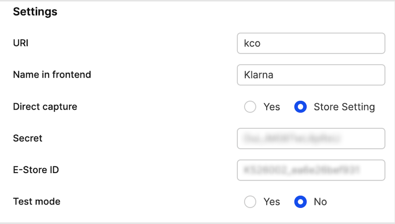
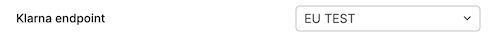
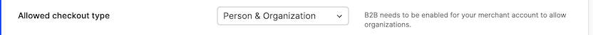
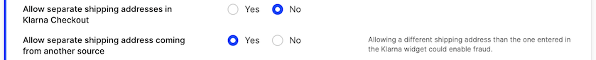
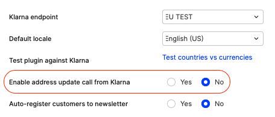
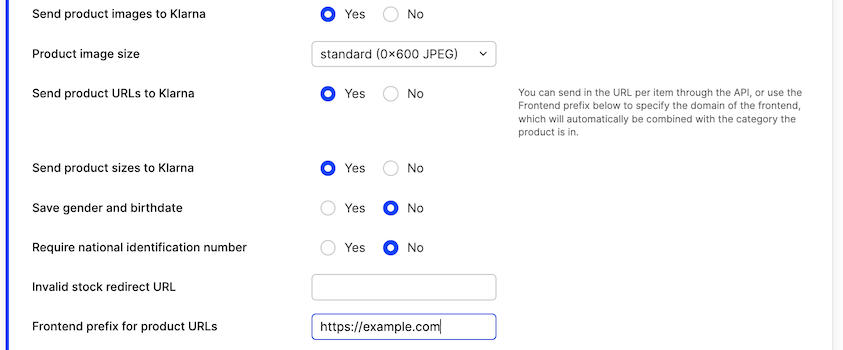
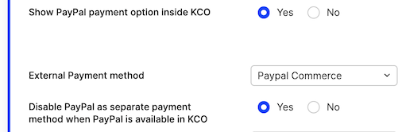
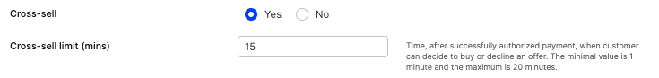

Klarna is a popular payment provider which allows payments with credit and debit cards, as well as "Buy now, pay within 14 days" type of purchase. Here's all the information that you'll need to start using this plugin.

[notice-box=alert]
`Klarna Checkout v3` is the currently recommended Klarna plugin. If you're using the old `Klarna` plugin or `KCOv2`, consider upgrading to the latest version.
[/notice-box]

### Gather information from Klarna Checkout

You need the following data:

1. The E-Store ID for your Klarna store.
2. The Shared Secret for your Klarna store.
3. What region your account in Klarna is setup in, either EU or NA.

### Create the plugin in Centra

Add `Klarna Checkout v3` to your store you want to use it for. Insert the data gathered above and place it in the following fields:

You can start testing the plugin using Test-Mode. Remember to also make sure the Endpoint of the plugin points to your region, and use `EU TEST` or `NA TEST` if you want to use the Test-Mode:

### Setup options

There are a lot of options in the Klarna Checkout plugin.

#### Allow organizations to place orders

By enabling "Organization" you can allow businesses to also place orders using Klarna Checkout: 

#### Allow separate shipping address

This allows the shipping address to be separate from what is used in Klarna.

[notice-box=alert]
Only enable this if you are validating fraud outside of Klarna, as Klarna does not cover fraudulent orders if you bypass their shipping address for the customer.
[/notice-box]

#### Enable address update call from Klarna

This is sometimes required when Centra reliably needs to get the full address from Klarna. In simple scenarios, the address entry and payment processing can be all processed inside the Klarna widget, and Centra is only later informed about the result of the payment after the authorization is complete. However, there are two use cases when enabling this setting is recommended:

- If you're using PayPal inside Klarna, especially when Override shipping address setting is enabled, Centra will need to be informed about address change coming from PayPal to Klarna
- If you have any tax rules based on zip codes (city/county tax), Centra needs the full address from Klarna in order to apply the right tax rules

#### Send product images and URLs

You can enable product images and URLs to be sent to Klarna. Select the preferred image size to send to Klarna.

If you want URLs to the products, you can either provide the URL to the product when the product is added to the selection in the APIs, your you can define a `Frontend prefix` which will be combined with the category URI and display URI of the product from Centra.

#### Add external payment methods to Klarna

We currently only support Paypal to be added as an external payment option.

Since you can have multiple Klarna Checkout plugins based on different regions, each plugin you have created connects to a another specific payment plugin. This means, if you need Klarna Checkout to use different Paypal payment plugins for different regions, you need to create market/pricelist/country restricted plugins for Klarna that connects to different Paypal plugins.

You can also make sure that Paypal does not show up as a separate payment, if it will be used inside Klarna Checkout.

[notice-box=info]
When using Klarna Checkout in test mode, you need to make sure the PayPal plugin you're using with it is configured to "Sandbox mode". Once your testing is done, you can disable test/sandbox mode on both plugins.
[/notice-box]

#### Geo-restrictions

As with all payment plugins if you want to pricelist/market/country restrict the plugin you have the ability to select this in the bottom of the setup.

### Cross-sell
[notice-box=info]
Cross-sell option allows customers to buy more products or services from your store in one transaction.
[/notice-box]

This enables Klarna Cross-sell

Klarna Cross-sell `time limit` - time in minutes after which the cross-sell will not be possible. 
* Default value is 30 minutes
* Minimum value is 1 minute
* Maximum value is 20 minutes

When cross-sell `time limit` runs out, Centra sends Order Confirmation email to the customer.

#### Customization of Klarna Checkout widget

You are able to customize colors in Klarna Checkout widget - you are able to set colors of
* background of a button - setting "Color Button"
* text inside a button - setting "Color Button Text"
* background of a checkbox - setting "Color Checkbox"
* checkmark in a checkbox - setting "Color Checkbox Checkmark"
* headers - setting "Color Header"
* links - setting "Color Link"

#### Testing

To test the flow, you first need to make sure the `Test-Mode` is enabled and that the `Klarna Endpoint` points to either `EU TEST` or `NA TEST` based on your Klarna Region setup.

[notice-box=alert]
You will need to disable test-mode for the plugin in Centra when you run it in production.
[/notice-box]

You can then use the [sample data provided by Klarna](https://docs.klarna.com/resources/test-environment/sample-data) to place test orders.

#### Required configuration

To make sure that your Klarna Checkout v3 plugin will work, please make sure that the following configuration fields are filled:
- E-Store ID
- Secret 
- Klarna Endpoint
- Default Locale
- Terms & Conditions-URL
