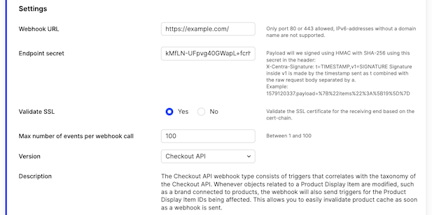
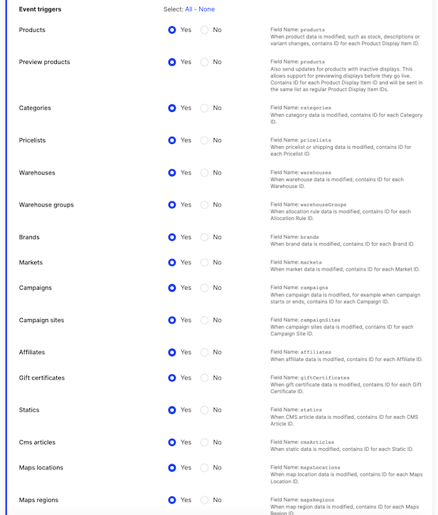

The Centra Webhook plugin allows you to create webhooks for certain events whenever data changes in Centra. This allows you to be notified and fetch data only when it is actually added or modified.

#### How do webhooks work in Centra

Webhooks in Centra are triggered by events. An event is any change happening in Centra - a new order comes in, a product description is changed, new product displays are added to a category - those are all events. If your webhook plugin is active and registers to those types of events (`Order`, `Product`, `Category`), Centra will generate an apropriate webhook and send it to your URL defined in the plugin. This way different webhook plugins can be used to handle different functions, and be used by different integrations.

Technically speaking, webhooks are simple HTTPS POST messages, containing info about a number of IDs and their types. By default, Centra will attempt to send the webhook for 5 seconds before timing out and re-trying. You can configure your webhooks to try re-sending that webhook up to 3 times, each time with increasing delay. If that still fails, Centra will assume your server or network is down, give up on sending that webhook and move to the next one in queue.

This is why, in addition to relying on webhooks to fetch resources from Centra only when necessary, you should also build a "fetch everything" function meant to restore the data after a network or application failure. After the data is synced, you can switch back to only fetching new or updated resources when receiving webhooks.

### Setup

You can find the webhook plugin under Webhooks in the plugin list.

These are the settings available for the webhook:



We only allow the Webhook notification to be posted to HTTP or HTTPS using the ports 80 and 443.

You are allowed to set an Endpoint-secret to be able to validate that the webhooks are originating from Centra, you're also able to decide if we should validate your SSL-certificate or not.

Other options:
* `Max number of events per webhook call` defines how many separate Centra events can be packed into a single webhook. Default: 100  
* `Timeout in seconds` defines for how many seconds Centra will wait until timing out and giving up on sending each webhook  
* `Number of retries after failure` defines whether or not Centra should attempt to re-send webhooks after a timeout. Disabled by default

### Webhook versions

#### Checkout API

This was the first version released, aimed for when using the CheckoutAPI. The data inside the events sent as webhooks if formatted to simplify integration with the Checkout API.

The Checkout API webhook type consists of triggers that correlates with the taxonomy of the Checkout API. Whenever objects related to a Product Display Item are modified, such as a brand connected to products, the webhook will also send triggers for the Product Display Item IDs being affected. This allows you to easily invalidate product cache as soon as a webhook is sent.

Example:

```json
{
  "products": [
    "12412",
    "12413",
    "12414",
    "12415",
    "12426",
    "12518"
  ],
  "brands": [
    "5"
  ]
}
```

If a product is not available or used at all in the store the plugin is installed on, there will be no webhook call at all. This makes it possible to use multiple stores and only get webhook events for the products in the store the plugin is installed in.

Checkout API webhooks currently support events of the following types:
* Product (webhook name: `products`)
* Inactive Product (`products`)
* Category (`categories`)
* Pricelist (`pricelists`)
* Warehouse (`warehouses`)
* Allocation rule (`warehouseGroups`)
* Brand (`brands`)
* Market (`markets`)
* Campaign (`campaigns`)
* Campaign Site (`campaignSites`)
* Affiliate (`affiliates`)
* Gift Certificate (`giftCertificates`)
* Static (`statics`)
* CMS Article (`cmsArticles`)
* Maps Location (`mapsLocations`)
* Maps Region (`mapsRegion`)

#### Integration API

Second version of the webhook is meant to be used with a wide range of integration APIs, which handle orders after they come into Centra. 

Integration API webhooks currently support events of the following types:
* Order (webhook name: `order`)
* Shipment (`shipment`)
* Customer (`customer`)
* Account (`account`)
* Return (`return`)

Example:

```json
{
  "events": [
    {
      "type": "order",
      "action": "update",
      "date": "2021-01-29 14:40:58.628033",
      "id": 2735
    },
    {
      "type": "shipment",
      "action": "create",
      "date": "2021-01-29 14:40:58.628119",
      "id": 1902
    },
    {
      "type": "shipment",
      "action": "good_to_go",
      "date": "2021-01-29 14:40:58.628239",
      "id": 1902
    }
  ]
}
```

### Event triggers

In the webhook plugin set up, there's a list with event triggers that you can select. We will only send webhook notifications for the events you have subscribed to.



For each event trigger there's a "Field Name", this is the key used in the payload as you will see below.

### Format

The webhook is sent as a regular POST-request using a urlencoded `payload`-parameter containing the JSON, like this:

```http
POST /url HTTP/1.1
Host: example.com
X-Centra-Signature: t=15798...
Content-Type: application/x-www-form-urlencoded

payload=%7B%22products%22%3A...
```

The format of the webhook looks like this:

```json
{
  "products": ["52"],
  "categories": ["14", "16"],
  "anotherType": ["1"]
}
```

The webhook can send multiple updates for multiple types at the same time. It will always send an array of ID:s for each type. The key inside the JSON correlates with the "Field Name" in each event trigger in the webhook set up to receive.

Some modifications in Centra will trigger multiple types at the same time. If you for example sort products inside a category, when the new order is saved, the webhook will contain both the products that got their sorting changed, but also the category the sorting was changed in, like this:

```json
{
  "products": ["1","6","7"],
  "categories":["1"]
}
```

This allows you to write logic in your end depending on how you cache your data. In this case, you might want to recache the whole category, by fetching all products inside the category:

```sh
curl -X POST -H "Content-type: application/json" \
  -d '{"categories":["1"]}' \
  "https://example.centra.com/api/checkout/products"
```

### Signature verification

The endpoint secret inside the webhook plugin settings is used to generate a signature header called `X-Centra-Signature`. This signature can be used to validate that the webhook is actually sent by Centra and no one else.

This signature header contains two parameters, like this:

`t=1579866370,v1=340a5be9321ad1b83dec05455650b6e174797a7267f48703ccdb7f251a8ba6c9`

The timestamp is used to make sure a replay attack cannot be done, if someone would be able to get a valid signature. The `v1` contains a **HMAC-SHA256** based on the timestamp and the request body separated with a dot `.`.

You can parse this header value by splitting it on `,` and then splitting each value with `=`. The key `v1` contains the signature of the following values (with a dot `.` as the separator):

`{timestamp}.{requestBody}`

This means, if your endpoint signature was: `test123`, the timestamp inside `t` was `12345678` and the request body would look like this:

`payload=%7B%22x%22%3A%22test%22%7D`

The signature would be made of:

`12345678.payload=%7B%22x%22%3A%22test%22%7D`

And the header would look like this:

```text
X-Centra-Signature: t=12345678,
  v1=0b9cd84f5d583e5e1aadfb9f160aa8080b51d5b85ff85808d6b75bdac356c549
```
