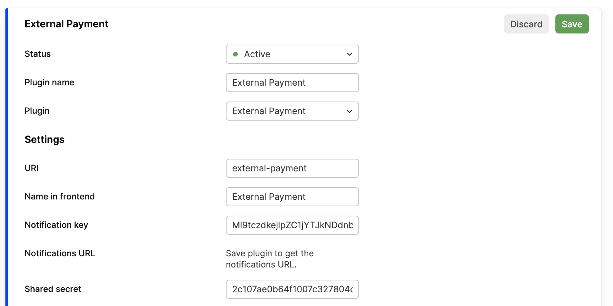
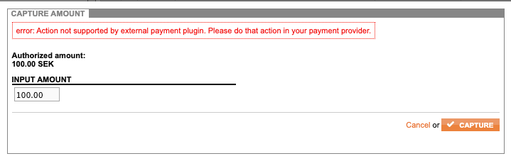

# External payment plugin

External payment plugin allows you to integrate Payment Service Providers of your choice that are not supported by Centra. It is intended to be used along with Checkout API, however requests finalizing payments should be handled server-side as payload signature using shared secret is required.

## Setup

External payment plugin settings look like this:




To set up External Payment Plugin you need to provide all the basic plugin information like Name, Name in Frontend, URI and:
- Notification key - auto-generated value used to authorize authorization and capture notifications to endpoint visible under `Notifications URL`.
  Must be stored server-side and not revealed to third parties.


- Shared secret - auto-generated value used to sign payload send to endpoints finalizing the payment when External Payment Plugin is used.
  Must be stored server-side and not revealed to third parties.

## Flow

The integration with Payment Service Provider, order creation and management must be done outside of Centra. Results of payment authorization and capture from redirects and push notifications should be forwarded to Centra to proper endpoints.


- Customer goes to checkout. Centra API gets a `GET /selection`


- `external-payment` method is found and can be selected for checkout


- `POST /payment` request is made with 	`"paymentMethod": "external-payment"` which on success responds with following data:

    ```json
    {
      "token": "abcd1234efgh12340ba6142228334aaf4",
      "action": "external",
      "selection": "4f1211119567211c441d86e19fbd7114"
    }
    ```
You should store the `selection` field value. It needs to be included in signature payload when finalizing the payment.

## Order finalization:

There are 2 ways described below to provide information about successful or failed authorization or capture.
In both ways you need to provide the signature which is base64 encoded HMAC SHA256 signature. The payload is signed using shared secret configurable in External Payment Plugin settings in Centra AMS.

The first request (either POST `/payment-result` or push notification) with successful (`success=true`) authorization triggers order creation. If the first authorization to arrive is a failed one it will be accepted by Centra and shown on the order transcation history later, when the order is created.

[notice-box=warning]There is no way to provide or update the customer address using requests finalizing the payment.
Centra needs to know the customer address before. Not providing the address before might result in invalid orders with empty address.[/notice-box]


###1. Checkout API `POST /payment-result`:

This endpoint is intended for receiving authorization information. It can be called only once with successful authorization per order.

####Request:

    ```json
    {
      "paymentMethodFields": {
          "selection": "selection",
          "signature": "signature",
          "currency": "SEK",
          "amount": "100.00",
          "timestamp": timestamp,
          "transactionReference": "transactionReference",
          "success": true/false,
          "transaction": {
              "key": "value"
          }
      }
    }
    ```

| Field | Type | Comment |
| ----- | ---- | ------- |
| `selection` | string | Selection id returned at `POST /payment` call |
| `signature` | string | Base64 encoded signed payload (details below) |
| `currency` | string | Currency code (ISO 4217) |
| `amount` | string | Numeric string with dot as decimal separator |
| `timestamp` | int | Signature unix timestamp in UTC |
| `transactionReference` | string | Transaction identifier from  PSP|
| `success` | boolean | Successful or failed result of payment authorization|
| `transaction` | object | All the transaction details that were received from PSP|

####Signature

The signature is a base64 encoded HMAC SHA256 hash.
Example code using JavaScript and CryptoJS library:
```javascript
btoa(CryptoJS.HmacSHA256($payload, secret).toString(CryptoJS.digest));
```

##### Signature payload fields (separated by colon):
Signature payload fields must be provided in following order, separated by colon:
- selection id (received in `POST /payment call`)
- amount
- currency
- timestamp
- transactionReference
- success

payload: `selectionId:amount:currency:timestamp:transactionReference:success`

####Response:

On `success=true` it will respond with HTTP status 201 and order object. The order will be created in Centra backend. `(note: only one such call per order is allowed)
`

On `success=false` Centra will store the information about failed authorization and will respond with HTTP status 412. The order is not created yet.

example error response:

```json
{
    "token": "123412341234b11b35328200afd1234",
    "errors": {
        "paymentMethod": "failed"
    },
    "messages": [
        "Mismatched currency: USD, basket currency: SEK"
    ]
}
```


###2. Push notification send to `Notification URL ` visible in the plugin settings

####Request:

    ```json
    {
      "selection": "selection",
      "signature": "signature",
      "currency": "SEK",
      "amount": "100.00", 
      "timestamp": timestamp,
      "transactionReference": "transactionReference",
      "success": true/false,
      "intent": "auth",
      "transaction": {
          "key": "value"
      }
    }
    ```

| Field | Type | Comment |
| ----- | ---- | ------- |
| `selection` | string | Selection id returned at `POST /payment` call |
| `signature` | string | Base64 encoded signed payload (details below) |
| `currency` | string | Currency code (ISO 4217) |
| `amount` | string | Numeric string with dot as decimal separator, e.g. "100.00" |
| `timestamp` | int | Signature unix timestamp in UTC |
| `transactionReference` | string | Transaction identifier from  PSP|
| `success` | boolean | Successful or failed result of payment authorization|
| `intent` | string | Intent of a notification, possible values: auth/capture|
| `transaction` | object | All the transaction details that were received from PSP|


####Signature

The signature is a base64 encoded HMAC SHA256 hash.
Example code using JavaScript and CryptoJS library:
```javascript
btoa(CryptoJS.HmacSHA256($payload, secret).toString(CryptoJS.digest));
```

##### Signature payload fields (separated by colon):
Signature payload fields must be provided in following order, separated by colon:
- selection id (received in `POST /payment call`)
- amount
- currency
- timestamp
- transactionReference
- success
- intent

payload: `selectionId:amount:currency:timestamp:transactionReference:success:intent`

####Response:

If the push notification is accepted Centra will respond with HTTP status 200.

example response:
```json
{
    "success": true,
    "message": "OK"
}
```

Status other than 200 indicates that something went wrong. Either the sent data is corrupted or other error occured like some fields missing or invalid signature. This may result in payments not visible in Centra and orders not being accepted.
The message field of response object will contain the failure reason.

example response:
```json
{
    "success": false,
    "message": "Invalid intent: test"
}
```

[notice-box=warning]Only one successful (success=true) authorization and one successful (success=true) capture is allowed per order.[/notice-box]


## Captures and refunds:

Captures and refunds should be done manually in your PSP dashboard.

Captures and refunds triggered by Order API or AMS are forbidden for orders paid with External Payment Plugin and will result in following errors:





- Capturing shipments or trying to create refund via creating return in Order API are also not allowed for orders paid with External Payment Plugin:

example response:
```json
{
    "status": "no",
    "msg": "Action not supported by external payment plugin. Please do that action in your payment provider.",
    "order": 123
}
```
