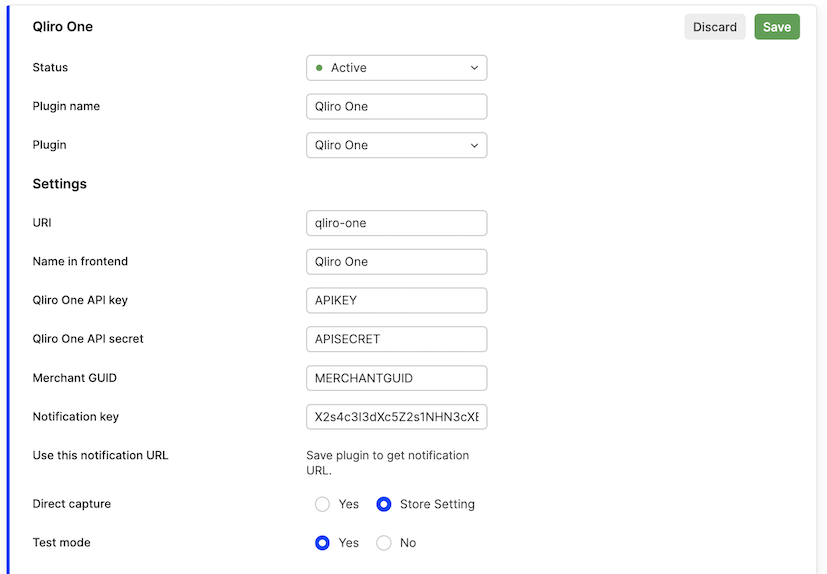
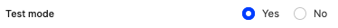
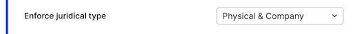
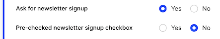
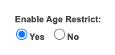
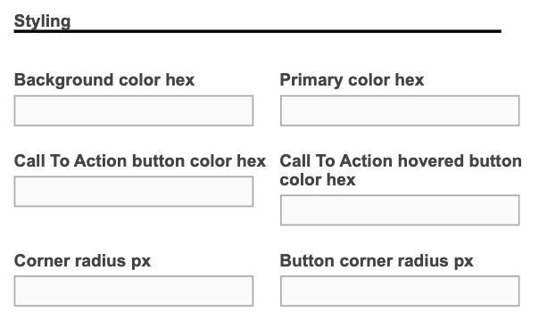

Qliro One is a popular payment provider which allows payments with credit and debit cards, as well as "Buy now, pay after receiving goods" type of purchase. Here's all the information that you'll need to start using this plugin.

### Gather information from Qliro One

You need the following data:

1. The API key for your Qliro store.
2. The Secret for your Qliro store.
3. Both `Merchant integrity policy-URL` and `Terms & Conditions-URL` are required and need to be valid URLs
4. Merchant GUID for your Qliro store - if you want to see links to Qliro Merchant panel.

### Create the plugin in Centra

Add `Qliro One` to your store you want to use it for. Insert the data gathered above and place it in the following fields:



#### Testing

To use plugin in Test mode and test against Qliro API sandbox set the following setting to "Yes":



[notice-box=alert]
You will need to disable test-mode for the plugin in Centra when you run it in production.
[/notice-box]

### Setup options

#### Notifications

Notification endpoints for all kinds of incoming notifications: customer checkout status, order management status and order validation are defined dynamically and provided for Qliro by the integration plugin.
There is no need to explicitly define them in plugin settings.

#### Require success validation

Optional order validation step fired when customer submits the order in the payment widget.  
It validates following data: 

- Customer identity (if option `Verify identity with BankID (SE only)` is used)
- Juridical type - whether the selected type is allowed by configuration
- Items availability

The result can be handled on frontend side, implementing callback `onPaymentDeclined()` which accepts decline reason as an argument. For more details please refer to Qliro documentation. 

#### Allow organizations to place orders

By enabling "Company" you can allow businesses to also place orders using Qliro One: 



#### Ask for newsletter signup

By enabling "newsletter signup" checkbox, it will be visible inside Qliro One widget. You can choose if it should be pre-checked or no.



#### Age restiction  

Age restriction setting allows to decide whether you want to provide `minimalCustomerAge` parameter on payment session initialization. Setting the value "Yes" enables an additional attribute on product level of type "Age limit" - visible in Catalog/Attributes setup.
If there is a product with age limit restriction in the basket, the `minimumCustomerAge` value will be sent to Qliro.



#### Verify identity with BankID - Sweden Only

Set to "Yes" if you want BankID to be required for customer to be able to complete purchase.

#### Customer information 

The payment widget can be prefilled with customer data coming from the selected source:

- basket shipping address
- basket billing address
- customer address

You can select if you want the address filled by customer in the payment widget to be used as the one visible on the order.

Setting `Use customer addresses from QliroOne` to "No" will ignore the address coming from the payment widget, so it should be used only when customer address information is collected in a separate form before proceeding to payment.

Configuration allows for preventing customers from changing the data that the payment widget is filled with on checkout initialization using "lock" settings.
Customer information can be locked partially or fully. 

#### Geo-restrictions

As with all payment plugins if you want to pricelist/market/country restrict the plugin you have the ability to select this in the bottom of the setup.

#### Customization of Qliro One widget

You are able to customize colors in Qliro One widget - you are able to set colors of
* Background color
* Primary color
* Call To Action button
* Call To Action hovered button

You are able to configure corner radius of
* General corner radius
* Button corner radius




#### API

When properly configured Qliro will be returned both in Checkout API and Shop API as available payment method:

```json
{
            "paymentMethod": "qliroone-payment",
            "name": "Qliro One",
            "paymentMethodType": "qliro",
            "supportsInitiateOnly": false,
            "providesCustomerAddressAfterPayment": true,
            "handlingCost": "0.00 SEK",
            "handlingCostAsNumber": 0
}
```

When Qliro is selected as payment method on the selection, then a POST /selection/payment is called and payment session is initialized.
If the request fails, the details can be found in `DIAGNOSTICS/DEBUG LOG`.
If payment session initialization was successful, the following response will be returned:

```json
{
  "token": "89d3744441706b51d9bc4ba157607203",
  "action": "form",
  "formType": "qliro",
  "formHtml": "<script type=\"text/javascript\">(function(w, g) { w[g] = {\r\ncheckoutWebAppBaseUrl: (...)"
}
```

The `formHtml` field should be used to render payment widget on frontend.
The customer will after finalizing be redirected back to the `paymentReturnPage` provided in the POST /payment-call.
The `paymentReturnPage` should then make a call with empty body to POST /payment-result - Centra backend will fetch the information about payment result from Qliro and respond with success or failure. 
The result will also arrive to Centra backend with the push notification from Qliro.


#### Updates to active sessions

###### CheckoutScript 
Qliro API allows for updates of the cart items during active payment session.
When the cart total is updated during active payment session, `centraCheckoutSript` should be used to suspend and resume the payment widget while Centra backend is sending updates towards Qliro API.
More information about `centraCheckoutScript` can be found [here](https://docs.centra.com/fe-development/checkoutscript)

###### Replacing payment widget

Replacing widget on frontend could be required when updates to payment session are not allowed or result in error. Centra will try to create new payment session in Qliro and 
will respond with `paymentHTML` field that contains the reloaded widget and `qliroReplaceSnippet` field indicating whether returned snippet should replace the existing one on the page.

```
"paymentHTML": "<script type="text/javascript">(function(w, g) { w[g] = {rncheckoutWebAppBaseUrl: "https://pago.qit.nu/checkout/webapp/",rncheckoutWebAppVersion: "1.74.0",rncheckoutWebApiBaseUrl: "https://pago.qit.nu/checkout/webapi/",rnqliroTermsUrl: "https://assets.qliro.com/terms/se/sv/terms/1/user_terms.pdf",rnorderId: "2830123",rncountry: "SE",rnlanguage:  (..........)",
"qliroReplaceSnippet": true,
```

Whenever the call updating the selection state in Centra is made the response should be checked for `qliroReplaceSnippet` field, for example: voucher application, manipulating quantity of
checkout cart item, updating customer's shipping address and so on. 

#### Frontend event listeners

After payment processing is initiated, updates to an active session in Qliro are not allowed.
To prevent modifying order in Centra after payment is initiated, frontend should make use of
`onPaymentProcess()` and lock the interaction with the checkout cart.

https://developers.qliro.com/docs/frontend-features/listeners

This needs to be done to prevent mismatch between Centra and Qliro by allowing updates in the checkout when payment was already initiated with a particular cart total.
