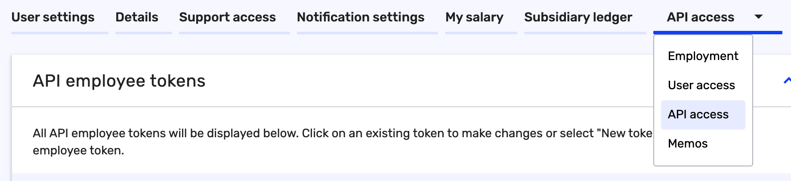
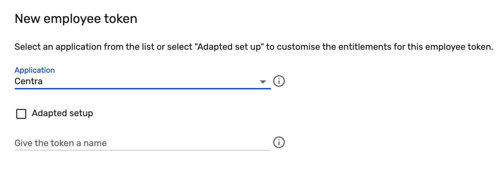
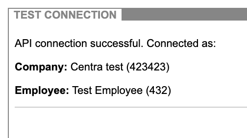

### Installation

To enable Tripletex module in Centra, you will need to create a user in Tripletex, or create an API-token for an existing user. The user needs to be allowed to create invoices and orders in Tripletex.

When you have created a user, you can go to the "API Access"-tab of the user and then click "New token":



Select Centra from the drop-down menu and give the token a name:



Now, copy the token you get and paste it in Centra under MODULES / Tripletex and CONFIG and select the "employee token". Click Save and then use the button called "Test connection" in the top right corner to verify your credentials:



If the information is correct, you have now connected Centra with Tripletex. All invoices ready to be sent to Tripletex will show up under "SYNC", and all sent invoices will be listed under "SENT". To sync back payments from Tripletex to Centra, you can use "Sync payments"-button in the top right corner. This will check all invoices against Tripletex and see if they have any registered payments for Centra to register.

All information about what was being sent or received and if there are any validation issues with the customer information will be listed in the start page of the Tripletex module, under "LOG".

### KID

To generate a proper [KID](https://tripletex.no/execute/docViewer?articleId=164&language=0&contextId=31544108) for the invoices, you need to insert the proper 4 digit "customer number" in the Tripletex CONFIG in Centra. The KID will be formatted like this:

```
16 characters in total:

9        = 1 digit
XXXX     = 4 digits, will contain the customer number
00       = 2 digits
XXXXXXXX = 8 digits, will contain the invoice number
X        = 1 digit, checksum for the whole KID
```

You get the KID from Tripletex when you have the proper connection set up with the bank. If you do not want to use KID, remove the `customer number` completely from Centra, and no KID will be generated.

### Ledger account mapping

To set up ledger account mapping, there are two settings depending on DTC (Direct-to-Consumer) or Wholesale. These mappings are made on country codes but also supports fallbacks for `EU` (Europe) and `WW` (World-wide).

The ledger account mapping will decide on the VAT percentage, so make sure you are mapping to the proper ledger accounts correlating with your VAT/Tax set up for those countries.

Both the "DTC ledger mapping" and the "Wholesale ledger mapping" works similarly. They look like this per default:

```
NO=0001
EU=0002
WW=0003
```

This means that invoices with country set as `Norway` will map to the ledger account `0001`. If the country code for the invoice is not found, it will check if the country belongs to Europe and use `EU`. If the country is not in Europe, or the `EU`-account is not set up, the fallback will be `WW` (World-wide).

### Additional settings

If you want Tripletex to send out emails whenever the invoices are synced to Tripletex, you can set "send invoice by email" in Centra to "yes". Since you are often syncing invoices after you have sent them out from Centra, this is default set to "no".

DTC-invoices will use the Customer ID as the customer ID in Tripletex, and Wholesale will use the Account ID as the Customer ID in Tripletex. If you're using both store types in Centra, we recommend setting either `dtc_customer_id_padding` or `wholesale_account_id_padding` so the numbers never conflict between DTC and Wholesale.

These two padding fields work like this:

* If `dtc_customer_id_padding` is empty, sending Customer ID `1234` will send `1234` as the customer ID to Tripletex.
* If `dtc_customer_id_padding` is `100000`, sending Customer ID `1234` will send `101234` as the customer ID to Tripletex.
* If `dtc_customer_id_padding` is `34240000`, sending Customer ID `1234` will send `34241234` as the customer ID to Tripletex.

If the Customer ID is higher than the amount of trailing zeroes in the padding field, Centra will give an error explaining that the ID does not fit in the padding. Make sure you're using a big enough padding for your account and customer IDs.
