Klaviyo is a CRM plugin in Centra. The core functionality is sending events to Klaviyo that can be used for transactional emails and email marketing automation with language based customization.
In your Klaviyo account, you can apply various advanced segmentation strategies based on event data and customer information that is synchronized from Centra to Klaviyo.

The recommended setup is a single Klaviyo account and single store plugin for all markets that are enabled in Centra. 

## Flow

1. You set up your Klaviyo account's API credentials (API key & API private key) and settings in Klaviyo store plugin. 
2. When store plugin is configured properly, Centra will start sending events to Klaviyo.
3. In Klaviyo account you can setup flows triggered off of the certain event types (metrics).

## Setup in Centra

Store plugin settings view in Centra AMS:

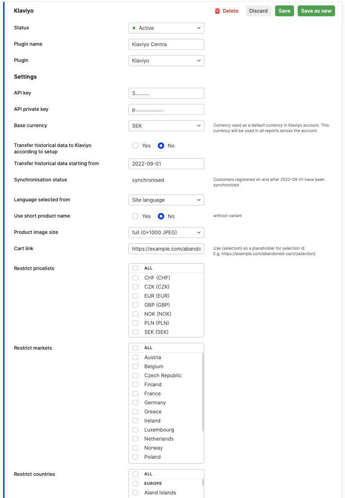

### API key & API private key

Copy the values of the API keys from [https://www.klaviyo.com/account#api-keys-tab](https://www.klaviyo.com/account#api-keys-tab) to store plugin configuration in Centra.

### Base currency

Currency used as a default currency in Klaviyo account. This currency will be used in all reports across the account.
All the synchronized events will also contain price values in customer currency so that they can be used in all sorts of email communication.

### Language selected from

- Delivery country - language will be matched based on customer's delivery country.
- Site language - language selected by customer or matched by geo ip in webshop

### Use short product name

Include variant name in product name.

### Product image size

Image size you want to send over to Klaviyo for all the products. Select a proper image size that works for your product catalog.

### Cart link
Cart link: should be set to the URL your webshop uses for cart abandonment, e.g. https://example.com/abandoned-cart/{selection}

### Newsletter

Newsletter lists to which customers will be opted in. Also, our integration will check this list in context of customer opt-out. In case of opt-out newsletter setting on customer profile in Centra will be updated.
Customer can opt-in (subscribe and resubscribe) through API, by newsletter endpoint, and while placing the order. As a Centra user, you can save customer profile with setting _Newsletter: Yes_.
You can create/find existing lists in Klaviyo Dashboard, under Audience -> Lists & Segments, type: Lists.

### Product page URL

If you want to use URLs to the products, you can either provide the URL to the product when the product is added to the selection in the APIs ([CheckoutAPI](https://docs.centra.com/swagger-ui/?api=CheckoutAPI&urls.primaryName=CheckoutAPI#/2.%20selection%20handling%2C%20cart/post_items__item_), [ShopAPI](https://docs.centra.com/swagger-ui/?api=ShopAPI&urls.primaryName=ShopAPI#/default/post_selections__selection__items__item_)), or you can define a `Product page URL` which will be combined with the display URI of the product from Centra. 
For product page URL and bundle product, we will use bundle URI for all items connected with bundle. We will replace `{display_uri}` part with correct display URI.
Example URL: https://example.com/product/{display_uri}.

[notice-box=info]
Parameter productUrl has higher priority than product page URL.
[/notice-box]

### Historical data export
Our integration allow you to export your data to Klaviyo. This action base on customer account, and customer account is main entrance to data. What does it mean? By choosing date in Transfer historical date starting from, you are choosing the date in history when the customer account was created. For example, from the image below, customer accounts newer than (or exactly this date) 01-09-2022 00:00:00 will be transferred to Klaviyo.

In the Synchronization status line, you will see current transfer status.

When synchronization is pending, you will not be able to set it up again. Synchronization settings are in read mode only:

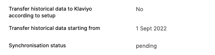

During data export, the following event types will be sent:
- Placed Order
- Ordered Product
- Confirmed Order
- Cancelled Order
- Refunded Order

### Product catalog synchronization
You are able to run catalog synchronization with Klaviyo account. To run synchronization, in Klaviyo plugin, change `Synchronize product catalog to Klaviyo` to `Yes` (default `No`) and save plugin. 

In the Product catalog synchronisation status line, you will see current transfer status.

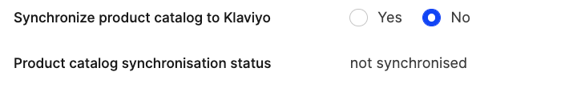

[notice-box=info]
Catalog synchronization cannot be run simultaneously with historical data export or during historical data import. Please wait until the end of historical data synchronization to be able to run catalog synchronization.
[/notice-box]

You can browse synchronized products in your Klaviyo account [here on your Klaviyo account](https://www.klaviyo.com/catalog/items).

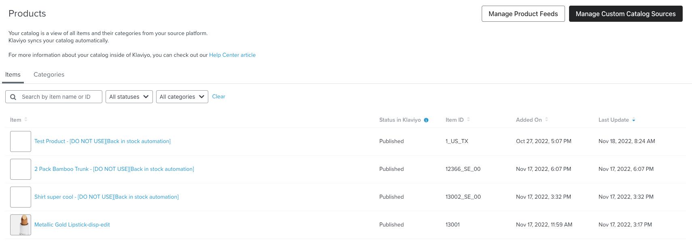

#### Catalog updates synchronization
We run updates synchronization right after saving the product in Centra, but this may take a while to see changes in Klaviyo catalog. 

#### BackInStock category of products

If you're using back in stock feature with Klaviyo plugin, virtual products might appear on your list with the following title format `{productName} - [DO NOT USE][Back in stock automation]`.
They also have a special category assigned - `BackInStock automation`
Those are products created merely for the purpose of back in stock subscription and are not supposed to be used in any emails using catalog lookup function, so you can ignore them.

[notice-box=info]
You can run full synchronization more than once if needed, but in general synchronization of changes should be handled automatically.
[/notice-box]

### Catalog product data reference

```json
{
    "external_id" : "1",
    "title" : "Test Product",
    "description" : "desc",
    "url" : "http://localhost/product/test-product",
    "image_thumbnail_url" : "http://localhost/client/dynamic//images/1_9adfeff6f2-red-amsbig.jpg",
    "image_full_url" : "http://localhost/client/dynamic/images/1_9adfeff6f2-red.jpg",
    "custom_metadata" : {
        "ProductName": {
            "default": "Test Product",
            "de": "Produkt testen"
        },
        "VariantName": {
            "default": "Red",
            "de": "Rot"
        },
        "Description": {
            "default": "Product description",
            "de": "Produkt bezeichnung"
        },
        "CanonicalCategory": {
            "sv": "Handla",
            "en": "Shop",
            "de": "Shop",
            "default": "Shop"
        },
        "Price": {
            "USD": 9.00,
            "SEK": 100,
            "JPY": 32400
        },
        "Brand": "Brand",
        "Collection": "Collection",
        "ProductType": "product"
    }
}
```

#### Top-level product id in product catalog

Top-level catalog product id is a display item identifier from Centra. This is also matching the id of the order items that are send along with events for all the metrics (e.g. `Placed Order` or `Ordered Product`).
Display item in Centra is a variant activated on a display, the concept is described in details [here](https://docs.centra.com/fe-development/fe-elements#why-do-i-see-different-product-ids-in-the-centra-backend-and-in-checkout-api).

### Back in stock subscriptions

In order to enable back in stock feature you need to perform initial product catalog synchronisation first.
Once it's done you can enable back in stock and access product catalog information in back in stock emails using catalog lookup feature.

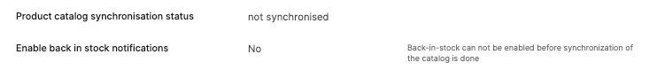

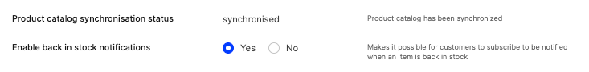

Back in stock requires frontend implementation against Checkout API or Shop API. The specification of endpoint is available in our swagger docs:
- [Back in stock in Checkout API](https://docs.centra.com/swagger-ui/?api=CheckoutAPI#/6.%20customer%20handling/post_back_in_stock_subscription)
- [Back in stock in Shop API](https://docs.centra.com/swagger-ui/?api=ShopAPI&urls.primaryName=ShopAPI#/6.%20customer%20handling/post_back_in_stock_subscription)

#### Back in stock flow
1. POST request towards Checkout API/Shop API
```json
POST https://centra-instance.com/api/checkout-api/back-in-stock-subscription
{   
    "item": "12366-23400",
    "shipTo": {
        "country": "SE"
    },
    "email": "test@email.com",
    "language": "sv"
}
```
2. Centra creates back in stock product

Back in stock products are assigned with a special category and are supposed to be used only for internal purposes of back in stock automation.
Concept of back in stock products is described in details [here](#backinstock-category-of-products).

Back in stock product identifier consists of multiple parts, which on the example of `12366_SE_00` are:
- 12366 - display item id in Centra, which is top-level product identifier in Klaviyo
- SE - ISO code of ship-to location country
- 00 - ISO code of ship-to location state (Sweden does not have states, placeholder `00` is used)

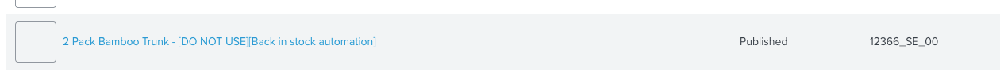

3. Centra creates back in stock variant

Variants are divided across ship-to locations supported in your retail store and across available sizes.
Variant identifier consists of multiple parts, which on the example of `12366_SE_00_23400` are:
- 12366 - display item id in Centra, which is top-level product identifier in Klaviyo
- SE - ISO code of ship-to location country
- 00 - ISO code of ship-to location state (Sweden does not have states, placeholder `00` is used)
- 23401 - size identifier in Centra

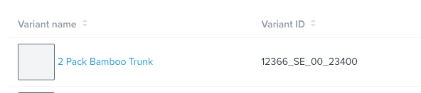


4. Centra sends customer's back in stock subscription towards variant

To see active back in stock subscriptions in Klaviyo go to [Back In Stock Report](https://www.klaviyo.com/catalog/reports/back-in-stock)

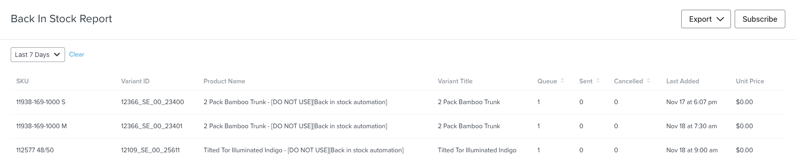

## Transactional emails

### Supported metrics

Metric types currently supported by Centra:

- `Reset Password`
- `Created Account`
- `Placed Order`
- `Ordered Product`
- `Confirmed Order`
- `Cancelled Order`
- `Shipping Update`
- `Refunded Order`
- `Gift Certificate`
- `Started Checkout`
- `Changed Subscription Status`
- `Failed Subscription Payment`
- `Failed Subscription Payment Update`
- `Successful Subscription Payment Update`

#### Sending sample data to Klaviyo

You can send sample events to Klaviyo directly from store plugin configuration in Centra by clicking on link presented on the screenshot below.
This will populate supported metrics listed above in your Klaviyo account and you will be able to browse sample data in the activity dashboard.

After synchronisation of sample data you can remove sample profile so that the data does not affect any reporting functionalities. 

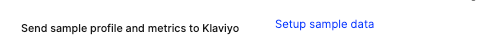


### Transactional flows configuration

In Klaviyo transactional and non-transactional automation is triggered off of the same metrics (events).
In order to setup transactional flows in Klaviyo refer to the [following guide](https://help.klaviyo.com/hc/en-us/articles/360003165732).
When plugin is activated, Centra will start sending all the supported types of metrics when events occur, but you can choose which ones you want to listen to in your flows setup on your Klaviyo account.

Extra metrics for manual resend email from Centra, with exactly the same data as regular ones, but requires own event type:

- `Placed Order - resend`
- `Confirmed Order - resend`
- `Cancelled Order - resend`
- `Shipping Update - resend`
- `Refunded Order - resend`
- `Gift Certificate - resend`

Listed metrics for the email resend purposes require additional email trigger configuration for email resending to work.
Resend metrics listed above will not impact flows and reporting based on regular metrics.

[notice-box=info]
When creating a flow for a certain metric in Klaviyo, tags need to be matching the tags listed above.
[/notice-box]

List of all the synchronised events is visible in your account's activity feed:

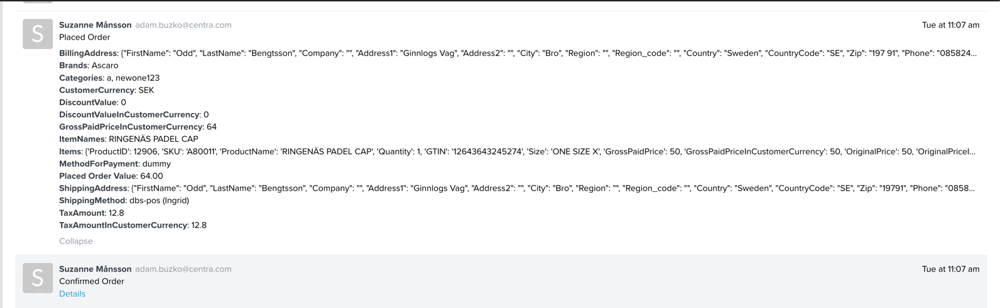

When at least one event with a certain metric is sent to Klaviyo, you can choose it from the dropdown in create flow view:

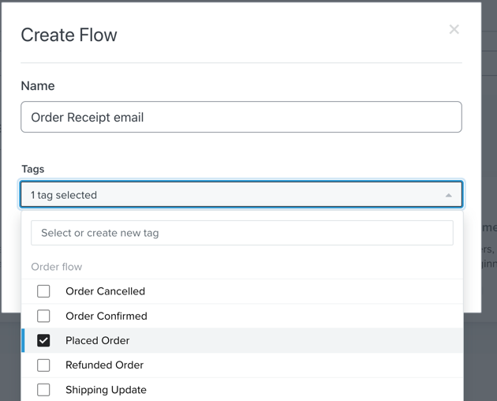


### Configuring email templates

In order to send transactional email content in the language of the customer you will need one email template per supported language. To make it work, proper conditions based on profile's language need to be added. 

Example flow for `Placed Order` event could look like this:

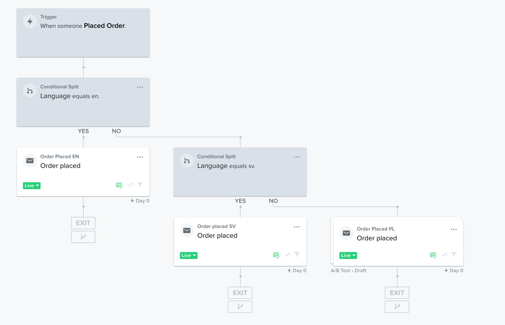

In the synchronised events data, Centra is sending prices both in base currency selected in Centra store plugin and in customer currency.
In the email template following variables should to be used in order to use prices in customer currency in the email communication:

Item level variables:

- `{{ item.GrossPaidPricePerUnitInCustomerCurrency }}` - item price per piece in customer currency
- `{{ item.GrossPaidPriceInCustomerCurrency }}` - price for item line in customer currency
- `{{ item.TaxAmountInCustomerCurrency }}` - tax amount per item in customer currency
- `{{ item.DiscountValueInCustomerCurrency }}` - discounted value in customer currency
- `{{ item.OriginalPriceInCustomerCurrency }}` - original price for item line in customer currency

Event level variables:

- `{{ event.GrossPaidPriceInCustomerCurrency }}` - order total in customer currency
- `{{ event.TaxAmountInCustomerCurrency }}` - order total in customer currency
- `{{ event.DiscountValueInCustomerCurrency }}`- discount total in customer currency

You can browse all the item and event level variables on the details of certain event in activity feed.

#### Catalog product data in template

To find full documentation about building email template in Klaviyo please check [Klaviyo template guide](https://help.klaviyo.com/hc/en-us/articles/4408802648731-Guide-to-Template-Tags-and-Variable-Syntax-new-editor-).

#### Localized product data

Our Klaviyo plugin allows you to send localized data with your emails.
Translated multi-language fields and multi-currency prices are send as JSON strings from which you can extract proper values using built in email template functions.
You can use static lookup (like `|lookup:"SEK"`) or more dynamic, based on variable (like `|lookup:customer_lang`)

```html

    
        Description: {{ catalog_item.metadata.Description|lookup:"default"}} <br />
        Title: {{ catalog_item.title }}<br /><br /><br />
        Price SEK: {{ catalog_item.metadata|lookup:"Price"|string_to_object|lookup:"SEK"}}<br />
        Product name in customer language: {{ catalog_item.metadata|lookup:"ProductName"|string_to_object|lookup:customer_lang}}<br /><br />
    

```

#### Back-in-stock example flow configuration

Catalog lookup tag can be also used to pull product data from catalog in back in stock emails. In order to fetch product information, [top-level product id](#top-level-product-id-in-product-catalog) needs to be extracted from VariantID.

Following snippet will split the compound VariantID like `12366_SE_00_23400` and use extracted top-level product id `12366` to fetch catalog product data.

```html


    <p>The {{ catalog_item.title }} Is Back!</p>


```

Example of usage:
```html


  <p>The {{ catalog_item.title }} Is Back!</p>
  <p>Custom description: {{ catalog_item.metadata.Description }}</p>


```

## Event data reference

#### Confirmed Order, Refunded Order
```json
{
    "$event_id": 102,
    "$value": 215,
    "CustomerCurrency": "EUR",
    "GrossPaidPriceInCustomerCurrency": "215.00",
    "TaxAmount": "43.00",
    "TaxAmountInCustomerCurrency": "43.00",
    "Categories": [
        "shop"
    ],
    "ItemNames": [
        "Test Product"
    ],
    "Brands": [
        "Brand"
    ],
    "DiscountValue": "0.00",
    "Items": [
        {
            "ProductID": "1-1",
            "SKU": "123456789",
            "ProductName": "Test Product",
            "Quantity": 2,
            "VariantName": "Blue jeans",
            "GrossPaidPrice": "200.00",
            "GrossPaidPriceInCustomerCurrency": "200.00",
            "OriginalPrice": "200.00",
            "OriginalPriceInCustomerCurrency": "200.00",
            "GrossPaidPricePerUnit": "100.00",
            "GrossPaidPricePerUnitInCustomerCurrency": "100.00",
            "ProductURL": "",
            "ImageURL": "http://localhost/client/dynamic/images/1_9adfeff6f2-red.jpg",
            "Categories": {
                "1": "shop"
            },
            "Brand": "Brand",
            "TaxAmount": "40.00",
            "TaxAmountInCustomerCurrency": "40.00",
            "TaxPercent": 25,
            "Discounted": false,
            "DiscountValue": "0.00",
            "DiscountValueInCustomerCurrency": "0.00",
            "ProductType": "product"
        }
    ],
    "BillingAddress": {
        "FirstName": "Jane",
        "LastName": "Doe",
        "Company": "Centra",
        "Address1": "Sveavägen 9",
        "Address2": "Address Two",
        "City": "Stockholm",
        "Region": "",
        "Region_code": "",
        "Country": "Sweden",
        "CountryCode": "SE",
        "Zip": "111 57",
        "Phone": "123456789",
        "Email": "test@centra.com"
    },
    "ShippingAddress": {
        "FirstName": "Jane",
        "LastName": "Doe",
        "Company": "Centra",
        "Address1": "Sveavägen 9",
        "Address2": "Address Two",
        "City": "Stockholm",
        "Region": "",
        "Region_code": "",
        "Country": "Sweden",
        "CountryCode": "SE",
        "Zip": "111 57",
        "Phone": "123456789",
        "Email": "test@centra.com"
    },
    "Shipping": {
        "Method": "pnl-bua (Ingrid)",
        "Service": "pnl-bua (Ingrid)",
        "Carrier": "",
        "CentraShippingMethod": "SEK",
        "Cost": "10.00",
        "CostInCustomerCurrency": "10.00",
        "TaxAmount": "2.00",
        "TaxAmountInCustomerCurrency": "2.00"
    },
    "MethodForPayment": "dummy"
} 
```

[notice-box=info]
ProductType variable in Item object can take one of two values: "product" or "bundle".
[/notice-box]

[notice-box=info]
Value of Shipping.Method field is concatenated string of Shipping.Service and Shipping.Carrier, when Shipping.Service and Shipping.Carrier fields are empty we use Shipping.CentraShippingMethod value.
Shipping.Service and Shipping.Carrier fields are present when shipment has been completed - value of these fields in most cases will be available on `Shipping Update` event.
[/notice-box]

[notice-box=info]
Additional shipping fields for Confirmed Order available when Ingrid shipping plugin is enabled and order was placed with this plugin.

```json
{
    [...],
    "Shipping": {
        [...],
        "IngridPickupPointAddress": "Grepgatan 40, 25448 Helsingborg, SE",
        "IngridExpectedDeliveryDate": "2022-11-09 - 2022-11-10",
        "IngridCarrier": "Instabox",
        "IngridProduct": "Instabox Express",
        "IngridShippingMethod": "isb-express"
    }
}
```
[/notice-box]

#### Placed Order

Placed Order event data structure is the same as for `Confirmed Order` and `Refunded Order` events but with extra field `OrderType`

```json
{
    [...],
    "OrderType": "One-time Purchase"
}
```
[notice-box=info]
OrderType variable in Item object can take one of three values:
- "One-time Purchase" (for one-time orders)
- "New Subscription" (for newly started subscriptions)
- "Recurring Subscription Payment" (for renewal or recurring orders for pre-existing subscriptions)

"New Subscription" type of order will contain additional properties with subscription information on items purchased in subscription model. See `Subscription orders` section for more information.
[/notice-box]

[notice-box=info]
Additional shipping fields available when Ingrid shipping plugin is enabled and order was placed with this plugin.

```json
{
    [...],
    "Shipping": {
        [...],    
        "IngridPickupPointAddress": "Grepgatan 40, 25448 Helsingborg, SE",
        "IngridExpectedDeliveryDate": "2022-11-09 - 2022-11-10",
        "IngridCarrier": "Instabox",
        "IngridProduct": "Instabox Express",
        "IngridShippingMethod": "isb-express"
    }
}
```
[/notice-box]

#### Started Checkout

Started Checkout event data structure is the same as for `Confirmed Order` and `Refunded Order` events but with extra field “AbandonedCartURL”

```json
{
    [...],
    "AbandonedCartURL": "https://example.com/abandoned-cart/{selection}"
}
```

#### Cancelled Order

Cancelled Order event data structure is the same as for `Confirmed Order` and `Refunded Order` events but with extra field “Reason”

```json
{
    [...],
    "Reason": "Size too small"
}
```

#### Shipping Update

```json
{
    "$event_id": "Shipped-113-1",
    "OrderId": 113,
    "ShipmentId": "Shipped-113-1",
    "UpdateType": "Shipped",
    "Items": [
        {
            "ProductID": 1,
            "SKU": "123456789",
            "ProductName": "Test Product",
            "Quantity": 1,
            "GTIN": "ABCDEFGHIJKL",
            "Size": "",
            "VariantName": "Red",
            "GrossPaidPrice": "100.00",
            "GrossPaidPriceInCustomerCurrency": "100.00",
            "OriginalPrice": "100.00",
            "OriginalPriceInCustomerCurrency": "100.00",
            "GrossPaidPricePerUnit": "100.00",
            "GrossPaidPricePerUnitInCustomerCurrency": "100.00",
            "ProductURL": "",
            "ImageURL": "http://localhost/client/dynamic/images/1_9adfeff6f2-red.jpg",
            "Categories": {
                "1": "shop"
            },
            "Brand": "Brand",
            "TaxAmount": "20.00",
            "TaxAmountInCustomerCurrency": "20.00",
            "TaxPercent": "25.00",
            "Discounted": false,
            "DiscountValue": "0.00",
            "DiscountValueInCustomerCurrency": "0.00",
            "ProductType": "product"
        }
    ],
    "ShippingAddress": {
        "FirstName": "Jane",
        "LastName": "Doe",
        "Company": "Centra",
        "Address1": "Sveavägen 9",
        "Address2": "Address Two",
        "City": "Stockholm",
        "Region": "",
        "Region_code": "",
        "Country": "Sweden",
        "CountryCode": "SE",
        "Zip": "111 57",
        "Phone": "123456789",
        "Email": "test@centra.com"
    },
    "ShippingMethod": "EUR",
    "ShippingService": "",
    "ShippingCarrier": "",
    "CentraShippingMethod": "SEK",
    "TrackingNumber": "ABC123",
    "TrackingUrl": "https://test-tracking-delivery.com/ABC123",
    "PackagesAmount": 1,
    "ShippingDate": "2022-09-28 15:12:57",
    "MethodForPayment": "Third Party Payment",
    "CustomerCurrency": "EUR",
    "GrossPaidPrice": "215.00",
    "GrossPaidPriceInCustomerCurrency": "215.00",
    "TaxAmount": "43.00",
    "TaxAmountInCustomerCurrency": "43.00", 
    "DiscountValue": "0.00",
    "DiscountValueInCustomerCurrency": "0.00",
    "ShippingCost": "0.00",
    "ShippingCostInCustomerCurrency": "0.00",
    "ShippingTaxAmount": "0.00",
    "ShippingTaxAmountInCustomerCurrency": "0.00",
    "OrderDate": "2022-11-11 21:37:00"
} 
```

[notice-box=info]
Value of ShippingMethod field is concatenated string of ShippingService and ShippingCarrier, when ShippingService and ShippingCarrier fields are empty we use CentraShippingMethod value.
ShippingService and ShippingCarrier fields are present when shipment has been completed - value of these fields in most cases will be available on `Shipping Update` event. 
[/notice-box]

[notice-box=info]
Additional shipment fields available when Ingrid shipping plugin is enabled and order was placed with this plugin.

```json
{
    [...]
    "IngridMethod": "pnl-bua",
    "IngridConvertedId": "PickupPoint",
    "IngridPickup": "123",
    "IngridDoorCode": "",
    "IngridDeliveryTime": "2022-11-11",
    "IngridCourierInstruction": "",
    "IngridPickupPointAddress": "Grepgatan 40, 25448 Helsingborg, SE",
    "IngridExpectedDeliveryDate": "2022-11-09 - 2022-11-10",
    "IngridCarrier": "Instabox",
    "IngridProduct": "Instabox Express",
    "IngridShippingMethod": "isb-express"
}
```
[/notice-box]

#### Gift Certificate

```json
{
    "$eventId": "123",
    "Name": "Some name",
    "Code": "Some_code",
    "Link": "https://test.com/",
    "Message": "Hello there!",
    "Date": "2022-01-01 00:00:00",
    "DueDate": "2022-01-01 00:00:00",
    "Description": "Your gift card!",
    "Friend": "Jane Doe",
    "$value": "100.00",
    "ValueInCustomerCurrency": "100.00",
    "CustomerCurrency": "EUR"    
}
```

#### Reset Password

```json
{
    "$event_id": "123",
    "PasswordResetLink": "https://localhost/password-reset?[...]"
}
```

#### Changed Subscription Status

```json
{
    "$event_id": "1-1666600262",
    "PaymentType": "cc",
    "PaymentDescription": "Mastercard",
    "ShippingCostInCustomerCurrency": 0,
    "Reason": "manual user change",
    "OldStatus": "active",
    "NewStatus": "active",
    "Subscription": {
        "SubscriptionId": 1,
        "CreatedAt": "2022-10-24 10:31:02",
        "IntervalType": "day",
        "IntervalValue": 30,
        "IntervalFormatted": "Every 30 days",
        "DiscountPercent": 0
    },
    "SubscriptionContractAddress": {
        "FirstName": "Jane",
        "LastName": "Doe",
        "Company": "",
        "Address1": "Sveavägen 9",
        "Address2": "",
        "City": "Stockholm",
        "Region": "",
        "RegionCode": "",
        "Country": "Sweden",
        "CountryCode": "SE",
        "Zip": "111 57",
        "Phone": "+4687203333",
        "Email": "support@centra.com"
    }
}
```

#### Failed Subscription Payment

```json
{
    "$event_id": "11-12-1666600262",
    "PaymentType": "cc",
    "PaymentDescription": "Mastercard",
    "ShippingCostInCustomerCurrency": 0,
    "Subscriptions": [
        {
            "SubscriptionId": 1,
            "CreatedAt": "2022-10-24 10:31:02",
            "IntervalType": "day",
            "IntervalValue": 30,
            "IntervalFormatted": "Every 30 days",
            "DiscountPercent": 0
        }
    ],
    "SubscriptionContractAddress": {
        "FirstName": "Jane",
        "LastName": "Doe",
        "Company": "",
        "Address1": "Sveavägen 9",
        "Address2": "",
        "City": "Stockholm",
        "Region": "",
        "RegionCode": "",
        "Country": "Sweden",
        "CountryCode": "SE",
        "Zip": "111 57",
        "Phone": "+4687203333",
        "Email": "support@centra.com"
    },
    "ManageSubscriptionPaymentMethodsUrl": "https://example.com/subscription/payment/?id=123"
}
```

#### Failed Subscription Payment Update and Successful Subscription Payment Update

```json
{
  "$event_id": "11-1666600262",
  "SubscriptionContractId": 11,
  "PaymentType": "cc",
  "PaymentDescription": "Mastercard",
  "ShippingCostInCustomerCurrency": 0,
  "Subscriptions": [
    {
      "SubscriptionId": 1,
      "CreatedAt": "2022-10-24 10:31:02",
      "IntervalType": "day",
      "IntervalValue": 30,
      "IntervalFormatted": "Every 30 days",
      "DiscountPercent": 0
    }
  ],
  "SubscriptionContractAddress": {
    "FirstName": "Jane",
    "LastName": "Doe",
    "Company": "",
    "Address1": "Sveavägen 9",
    "Address2": "",
    "City": "Stockholm",
    "Region": "",
    "RegionCode": "",
    "Country": "Sweden",
    "CountryCode": "SE",
    "Zip": "111 57",
    "Phone": "+4687203333",
    "Email": "support@centra.com"
  },
  "ManageSubscriptionPaymentMethodsUrl": "https://example.com/subscription/payment/?id=123"
}
```

## Subscription orders

`Placed Order` event supports 3 `OrderType` values:

- One-time Purchase (for one-time orders)
- New Subscription (for newly started subscriptions)
- Recurring Subscription Payment (for renewal or recurring orders for pre-existing subscriptions)

Only `OrderType` of value `New Subscription` contains additional subscription information included on event item level.
Item level boolean property `item.IsSubscription` can be used to dynamically render or skip additional `item.Subscription.*` properties containing subscription information.

Centra allows for combining subscription purchases with one time purchases in single checkout.
Example payload of `Placed Order` event created as a result of such combined checkout:
```json
{
    "OrderId": "123",
    "CustomerCurrency": "SEK",
    "GrossPaidPriceInCustomerCurrency": "200.00",
    "TaxAmount": "40.00",
    "TaxAmountInCustomerCurrency": "40.00",
    "Categories": [
        "shop"
    ],
    "ItemNames": [
        "Test Product"
    ],
    "Brands": [
        "Brand"
    ],
    "DiscountValue": "0.00",
    "DiscountValueInCustomerCurrency": "0.00",
    "Items": [
        {
            "ProductID": 1,
            "SKU": "123456789",
            "ProductName": "Test Product",
            "Quantity": 1,
            "GTIN": "ABCDEFGHIJKL",
            "Size": "",
            "VariantName": "Red",
            "GrossPaidPrice": "100.00",
            "GrossPaidPriceInCustomerCurrency": "100.00",
            "OriginalPrice": "100.00",
            "OriginalPriceInCustomerCurrency": "100.00",
            "GrossPaidPricePerUnit": "100.00",
            "GrossPaidPricePerUnitInCustomerCurrency": "100.00",
            "ProductURL": "",
            "ImageURL": "http://localhost/client/dynamic/images/1_9adfeff6f2-red.jpg",
            "Categories": {
                "1": "shop"
            },
            "Brand": "Brand",
            "TaxAmount": "20.00",
            "TaxAmountInCustomerCurrency": "20.00",
            "TaxPercent": "25.00",
            "Discounted": false,
            "DiscountValue": "0.00",
            "DiscountValueInCustomerCurrency": "0.00",
            "Subscription": {
                "NextOrderDate": "2022-11-12",
                "DiscountPercent": 0,
                "IntervalType": "month",
                "IntervalValue": 1,
                "IntervalFormatted": "every 1 month"
            },
            "IsSubscription": true
        },
        {
            "ProductID": 1,
            "SKU": "123456789",
            "ProductName": "Test Product",
            "Quantity": 1,
            "GTIN": "ABCDEFGHIJKL",
            "Size": "",
            "VariantName": "Red",
            "GrossPaidPrice": "100.00",
            "GrossPaidPriceInCustomerCurrency": "100.00",
            "OriginalPrice": "100.00",
            "OriginalPriceInCustomerCurrency": "100.00",
            "GrossPaidPricePerUnit": "100.00",
            "GrossPaidPricePerUnitInCustomerCurrency": "100.00",
            "ProductURL": "",
            "ImageURL": "http://localhost/client/dynamic/images/1_9adfeff6f2-red.jpg",
            "Categories": {
                "1": "shop"
            },
            "Brand": "Brand",
            "TaxAmount": "20.00",
            "TaxAmountInCustomerCurrency": "20.00",
            "TaxPercent": "25.00",
            "Discounted": false,
            "DiscountValue": "0.00",
            "DiscountValueInCustomerCurrency": "0.00"
        }
    ],
    "BillingAddress": {
        "FirstName": "Test Billing",
        "LastName": "Testson Billing",
        "Company": "",
        "Address1": "Address One",
        "Address2": "Address Two",
        "City": "Malmo",
        "Region": "",
        "Region_code": "",
        "Country": "Sweden",
        "CountryCode": "SE",
        "Zip": "12345",
        "Phone": "123456789",
        "Email": "hubert.strychalski@centra.com"
    },
    "ShippingAddress": {
        "FirstName": "Test Billing",
        "LastName": "Testson Billing",
        "Company": "",
        "Address1": "Address One",
        "Address2": "Address Two",
        "City": "Malmo",
        "Region": "",
        "Region_code": "",
        "Country": "Sweden",
        "CountryCode": "SE",
        "Zip": "12345",
        "Phone": "123456789",
        "Email": "hubert.strychalski@centra.com"
    },
    "Shipping": {
        "Method": "SEK",
        "Service": "",
        "Carrier": "",     
        "CentraShippingMethod": "SEK",
        "Cost": "0.00",
        "CostInCustomerCurrency": "0.00",
        "TaxAmount": "0.00",
        "TaxAmountInCustomerCurrency": "0.00"
    },
    "MethodForPayment": "Third Party Payment",
    "CreatedDate": "2022-10-12 12:52:03",
    "OrderType": "New Subscription",
    "$value": 200
}
```

[notice-box=info]
Value of Shipping.Method field is concatenated string of Shipping.Service and Shipping.Carrier, when Shipping.Service and Shipping.Carrier fields are empty we use Shipping.CentraShippingMethod value.
Shipping.Service and Shipping.Carrier fields are present when shipment has been completed - value of these fields in most cases will be available on `Shipping Update` event.
[/notice-box]

### Example flow trigger configuration with recurring orders support 

`OrderType` of values `One-time Purchase` and `Recurring Subscription Payment` are combined in the single flow as those do not contain any additional subscription information.

`OrderType` of value `New Subscription` is processed by separate flow because it contains additional subscription data.

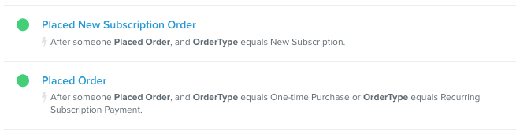

## Newsletter list subscription

When newsletter list is selected in store plugin settings Centra will push newsletter list subscriptions to Klaviyo when newsletter opt-in is received in Centra in one of the following ways:

- Checkout API/Shop API newsletter subscribe endpoints
- Newsletter field update on customer level
- Newsletter opt-in during checkout

Additionally, once a day global unsubscribes and selected list unsubscribes will be fetched from Klaviyo API and newsletter flag on customer level in Centra will be updated accordingly.

[notice-box=info]
Centra does not fetch newsletter list subscriptions that were made outside of Centra's control e.g. CSV import to Klaviyo based on data exported from another integration or direct integration to Klaviyo working ouside of Centra.

In order to keep the opt-in status in sync with Klaviyo we recommend sending customer newsletter subscriptions to Checkout API/Shop API newsletter endpoints:

- Checkout API: [swagger documentation](https://docs.centra.com/swagger-ui/?api=CheckoutAPI#/6.%20customer%20handling/post_newsletter_subscription)
- Shop API: [swagger documentation ](https://docs.centra.com/swagger-ui/?api=CheckoutAPI&urls.primaryName=ShopAPI#/default/post_customers__email__newsletter_subscription)
[/notice-box]

[notice-box=info]
Centra does not subscribe customers to selected newsletter list during historical data transfer. If you want to transfer newsletter subscriptions from Centra to Klaviyo in bulk, you can export newsletter list from Centra and import customers to newsletter list in Klaviyo using CSV import.
[CSV import in Klaviyo](https://help.klaviyo.com/hc/en-us/articles/115005078967-How-to-create-and-add-subscribers-to-a-new-list) allows to safely import newsletter list subscriptions without triggering any email communication. 
[/notice-box]

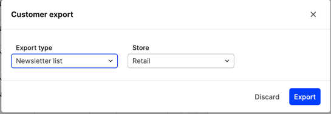

### Localized content in newsletter list campaigns

If you want to send out campaign emails for a list that contains customers with different languages you can either: 
1. Dynamically render localized content based on customer profile language using a single template.
2. Configure separate campaign with static template for each language on the list using segment exclusions.

Example for method 2: 

Segment excluding non-Swedish speaking customers:

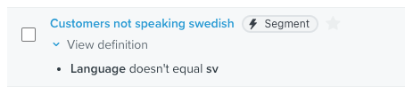

Campaign targeted for Swedish speaking customers:

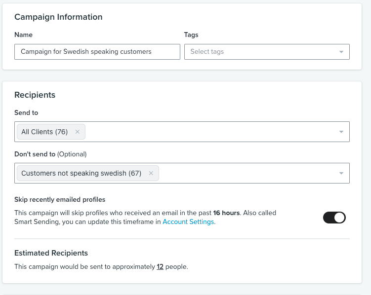

## Activity tracking

Although as headless platform, Centra does not control activity tracking through integration with Klaviyo it is still possible to send activity tracking events directly from the website.

You can track following events:
- Active on Site
- Added to Cart
- Viewed Product

For `Added to Cart` and `Viewed Product` events you should use the same top level product id that is used on events sent directly from Centra. You can find more information about it [here](#top-level-product-id-in-product-catalog).

For authorization public api key should be used. You can find details about activity tracking implementation in [Klaviyo documentation section](https://developers.klaviyo.com/en/v1-2/docs/guide-to-integrating-a-platform-without-a-pre-built-klaviyo-integration#javascript-track-api-for-onsite-metrics).

