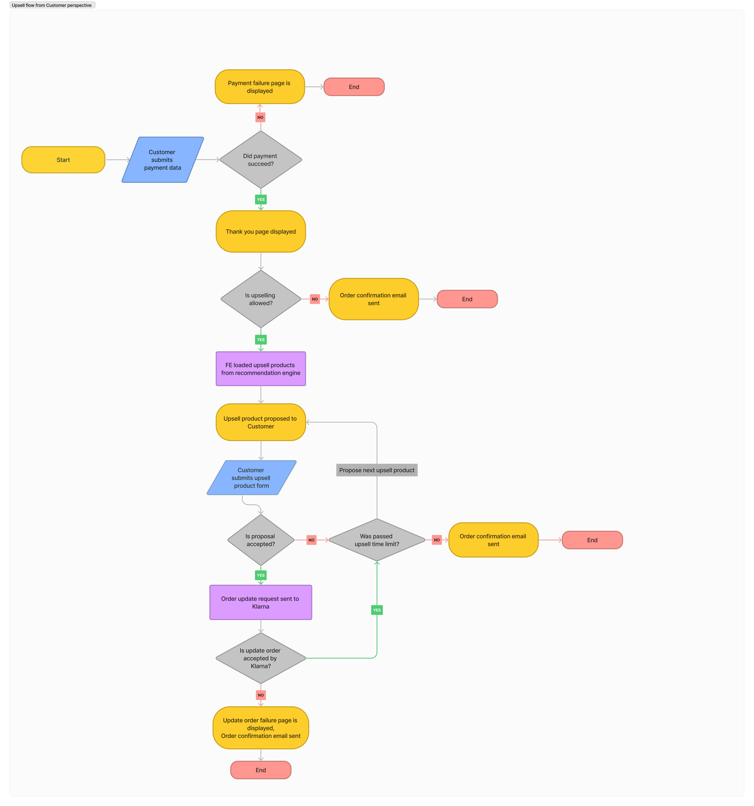
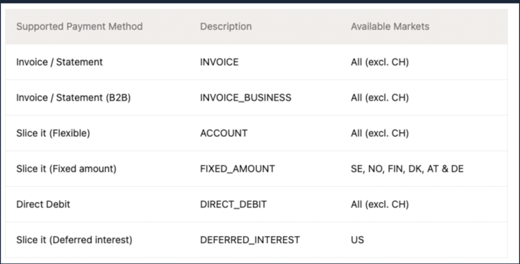

## Overview
Upsell is an effective marketing tactic used by many stores to increase sales and revenues.
It is a type of sales technique that encourages customers to purchase additional items when making a purchase. 
This feature allows customers to add products the order in one click, after they have already completed their checkout.

## What is required to enable Upsell?

Currently, Upsell feature available in CheckoutAPI and ShopAPI for [Klarna Checkout v3 plugin](/centra-sections/settings/plugins/klarnacheckoutv3)

Read how to enable Upsell feature for [Klarna Checkout v3 plugin](/centra-sections/settings/plugins/klarnacheckoutv3) 

## How does Upsell feature work?

Upsell feature allows to add additional products to the order in one click, after checkout is completed and without filling shipping address and payment details again.



1. Store customer finished checkout and was redirected to thank you page by payment provider
2. Your website calls `PUT /payment-result` response to the call contains object `upsell` which provides information whether payment provider supports upsell: 
    ```json
      {
        // ...
        "upsell": {
          "isAllowed":  true, // Is post purchase upselling allowed
          "timeLimit": 3 // Upsell time limit in minutes"
        }
        // ...
      }
    ```
3. If the order supports upsell you can offer the customer to add additional products to the order.
4. For adding upsell products to the order serve dedicated API endpoints in [Shop API](https://docs.centra.com/swagger-ui/?api=CheckoutAPI&urls.primaryName=ShopAPI) and [Checkout API](https://docs.centra.com/swagger-ui/?api=CheckoutAPI): `POST orders/{order}/items/{item}`
5. When upsell time out is over Centra sends Order Confirmation email to customer

### Which products can be added to order?
For upsell products work the same rules as for the products that can be added to basket.
The only exception - flexible bundles are not available for upselling.

### Centra AMS

#### Order with upsell products
Order lines that were added to Order through upsell are displayed in section “Order products“


Order history section contains information about upsell transactions. Previous auth transactions are “deprecated“ by adding suffix “-old“. Centra creates new auth transaction.


Order History section contains data about upsold products.


#### Order with failed upsell transaction
In case when Upsell transaction failed Centra:
- reverts Order to the state before adding new Line Item
- logs failed transaction
- logs data to Order history
- Order Receipt email is sent after upsell time out limit is over

[notice-box=info]
The previous successful transaction remains active and can be captured.
[/notice-box]


### Upsell feature using Klarna Checkout plugin

After a successful checkout webshop displays a list of products that the customer can add to the created order.

Increasing the order amount is not allowed for all payment methods, see below for details on when it is allowed. Any update to the order amount will override and replace the original order amount as well as any possible order lines you might have sent with the order.

Important note: Sometimes the increase might be rejected as we are not allowed to grant a customer an extended order amount. In these cases, the customer should be asked to place a new order in your shop for the new items. Be aware that increasing the order amount will trigger a second risk assessment on the customer, sometimes even a credit lookup.



Update the total order amount flow


More information read in documentation [Klarna. Update order amount](https://docs.klarna.com/order-management/pre-delivery/update-order-amount/) 