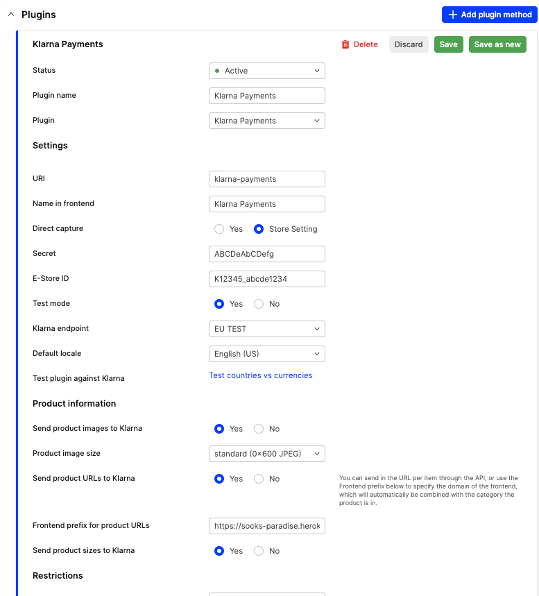
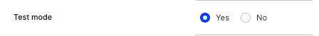
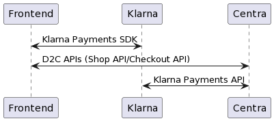
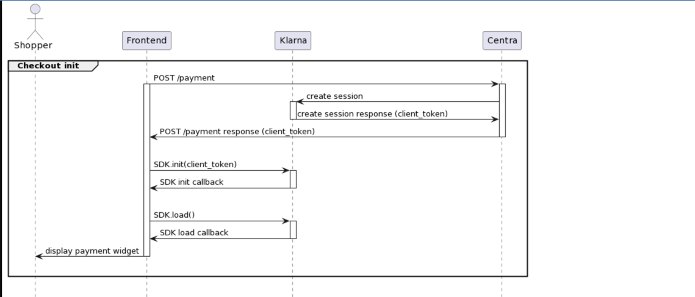
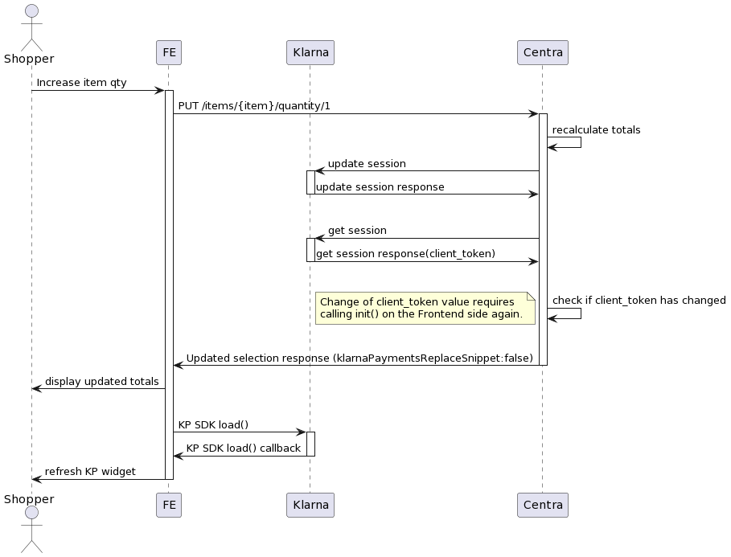
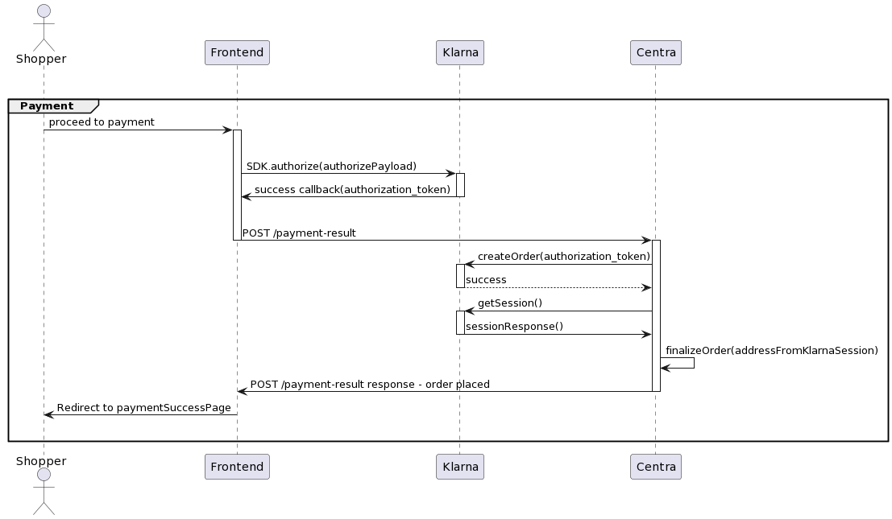

Klarna Payments is a PSP solution designed to incorporate Klarna's payment methods to existing checkout.
By integrating with Klarna Payments, merchants retain control over the checkout experience, while also offering customers the convenience of Klarna's payment options to finalize their purchases.

## Store plugin configuration 



### Required configuration

To ensure that Klarna Payments plugin is properly set up for testing fill in following configuration options:

- Status - set status to `Active`
- Plugin name - Name of the plugin
- Name in frontend - Name of the plugin returned by the API
- URI - Plugin identifier. Make sure that you're assigning a unique URI to the store plugin, especially if you're using multiple Klarna Payments plugins with plugin restrictions.
- Secret - Set up to your [MID](https://www.klarna.com/us/business/merchant-support/what-is-a-merchant-id/) configuration
- E-Store ID - Linked to your [MID](https://www.klarna.com/us/business/merchant-support/what-is-a-merchant-id/)
- Klarna endpoint - Should point towards proper region as per your [MID](https://www.klarna.com/us/business/merchant-support/what-is-a-merchant-id/) configuration

### Testing

For testing, set `Test mode` to `Yes`



### Available configuration options

- Default locale - Default locale sent to Klarna when payment session is initiated when Centra cannot match any locale on customer/basket level.
- Send product images to Klarna 
- Product image size
- Send product URLs to Klarna
- Frontend prefix for product URLs
- Send product sizes to Klarna

## Integration parties (APIs) SDK/Server side etc.



API references:
- [Klarna Payments API](https://docs.klarna.com/api/payments/)
- [Klarna Payments SDK](https://docs.klarna.com/klarna-payments/in-depth-knowledge/klarna-payments-sdk-reference/)
- [Centra Shop API](https://docs.centra.com/swagger-ui/?urls.primaryName=ShopAPI#/)
- [Centra Checkout API](https://docs.centra.com/swagger-ui/?urls.primaryName=CheckoutAPI)

## Authorisation flow

### Checkout initialization



1. `POST /payment` Shop API/Checkout API request
2. Centra creates session with Klarna and responds to Frontend with `client_token`
3. Frontend calls `SDK.init()` with `client_token` obtained from `POST /payment` response
4. Frontend calls `SDK.load()` and Klarna Payments widget is presented to the shopper in the proper container

### Handling updates in the checkout

This section refers to any kind of update that happens in the checkout, which means that session has been already initiated with Klarna Payments via `POST /payment` endpoint.
This includes:
- Item quantity updates
- Selection line updates
- Address updates
- Applying/removing voucher
- Selection country update



Once the session has been initiated with Klarna, on each selection response there will be an object at path `selection.pluginFields.klarnaPayments`
including all the fields that are required to display or reload the payment widget and start the authorisation process:

- `client_token` - Required to call `SDK.init(client_token)` that initiates SDK library
- `replaceSnippet` - Indicates whether SDK needs to be reinitialized by calling `SDK.init(client_token)` again
- `authorizePayload` - Payload required for the authorisation call [SDK.authorize(authorizePayload)](https://docs.klarna.com/klarna-payments/integrate-with-klarna-payments/step-2-check-out/22-get-authorization/#authorize-call). Authorization process itself will be described in details in the next section. 

Here's an example of `klarnaPayments` object on the selection response:

```json
{
    "selection": {
      "pluginFields": {
        "klarnaPayments": {
          "client_token": "eyJhbGciOiJSUzI1NiIsImtpZCI6IjgyMzA1ZWJjLWI4MTasasEtMzYzNy1..CbYhjSt---1dzmTgvo3vDRA",
          "replaceSnippet": false,
          "authorizePayload": {
            "purchase_country": "se",
            "purchase_currency": "sek",
            "locale": "sv-SE",
            "order_amount": 20000,
            "order_tax_amount": 4000,
            "order_lines": [
              {
                "name": "Brand Test Product Red",
                "quantity": 2,
                "reference": "123_1",
                "tax_rate": 2500,
                "total_amount": 20000,
                "total_discount_amount": 0,
                "total_tax_amount": 4000,
                "type": "physical",
                "unit_price": 10000
              }
            ],
            "billing_address": {
              "given_name": "Test Billing",
              "family_name": "Testson Billing",
              "email": "abc123@example.com",
              "street_address": "Address One",
              "street_address2": "Address Two",
              "postal_code": "12345",
              "city": "Malmo",
              "region": "",
              "phone": "123456789",
              "country": "SE"
            },
            "shipping_address": {
              "given_name": "Test Billing",
              "family_name": "Testson Billing",
              "email": "abc123@example.com",
              "street_address": "Address One",
              "street_address2": "Address Two",
              "postal_code": "12345",
              "city": "Malmo",
              "region": "",
              "phone": "123456789",
              "country": "SE"
            }
          }
        }
      }
    }
}
```

### Reinitialization of the payment widget

Once a Klarna Payments widget has been displayed on the checkout page, on every update to selection listen to `klarnaReplaceSnippet` field indicating whether the SDK needs to be reinitialized.
Following code snippet is an example of how to properly handle `klarnaReplaceSnippet` flag on the selection response.

```js
 function handleKlarnaReplaceSnippet(response) {
        const klarnaReplaceSnippet = response.selection.pluginFields.klarnaPayments.replaceSnippet;
        if (klarnaReplaceSnippet === false) {
            Klarna.Payments.load(
                {
                    container: '#payment-container',
                    payment_method_category: 'klarna'
                },
                function (res) {
                    console.log('Klarna Payments widget loaded without re-initialization');
                }
            );
        } else {
            document.getElementById('payment-container').innerHTML = ''; //clear old one entirely
            Klarna.Payments.init(
                {
                    client_token: response.selection.pluginFields.klarnaPayments.client_token
                }
            );
            Klarna.Payments.load(
                {
                    container: '#payment-container',
                    payment_method_category: 'klarna'
                },
                function () {
                    console.log('Klarna Payments widget loaded with re-initialization after client_token update');
                }
            );
        }
    }
```

### Authorization and order placement

[//]: # (Handling errors on authorization - accordingly to Klarna recommendations https://docs.klarna.com/klarna-payments/integrate-with-klarna-payments/step-2-check-out/22-get-authorization/#responses)



1. Customer proceeds to payment
2. Frontend calls `SDK.authorize(authorizePayload)` where `authorizePayload` is coming from the latest selection response `selection.pluginFields.klarnaPayments.authorizePayload`
3. `SDK.authorize()` callback is fired with `authorization_token` as a parameter
4. Shopper submits the payment in Klarna widget.

To properly handle user interaction with the widget on the Frontend side and error handling, refer to following Klarna guides:

- [User interaction during the call](https://docs.klarna.com/klarna-payments/integrate-with-klarna-payments/step-2-check-out/22-get-authorization/#authorize-call-user-interaction-during-the-call)
- [Responses](https://docs.klarna.com/klarna-payments/integrate-with-klarna-payments/step-2-check-out/22-get-authorization/#responses)

5. Frontend calls `POST /payment-result` Centra endpoint with `authorization_token` to finalize authorisation and place an order in Centra
   `POST payment-result`
```json
{
    "paymentMethodFields": {
        "authorization_token": "abcde2d-1234-567d-bfc9-27a3d0dc396c"
    }
}
```
6. Centra creates order in Klarna using `authorization_token` received from the Frontend - customer is charged at this moment
7. Centra responds to Frontend with order response and params from Klarna including `redirect_url`
8. Frontend reads `response.order.paymentMethodData.redirect_url` and redirects Shopper to paymentSuccessPage 


## Best practices

### Locking the checkout to prevent updates during ongoing API calls


## Onsite messaging
