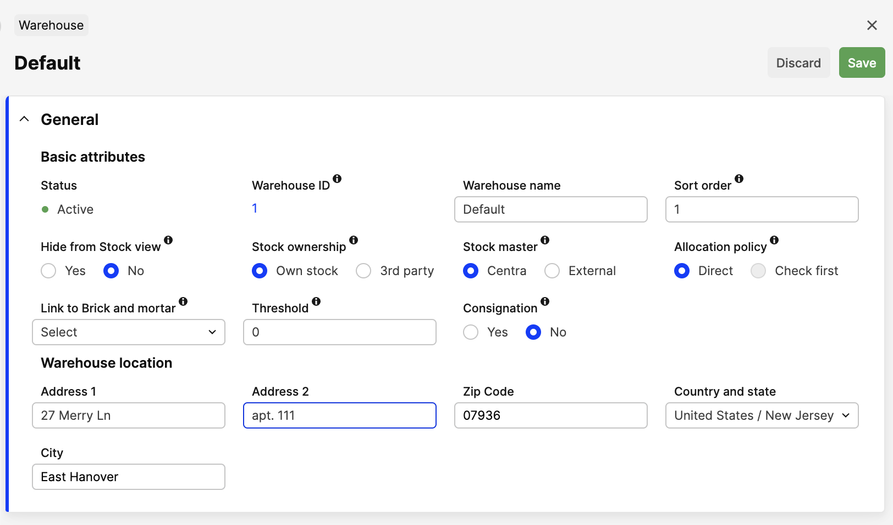
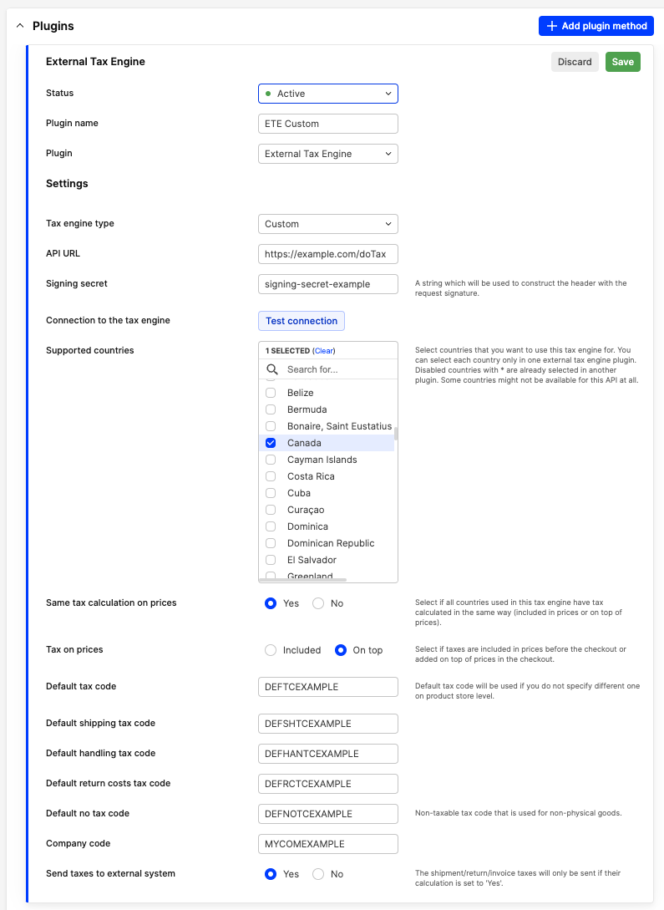
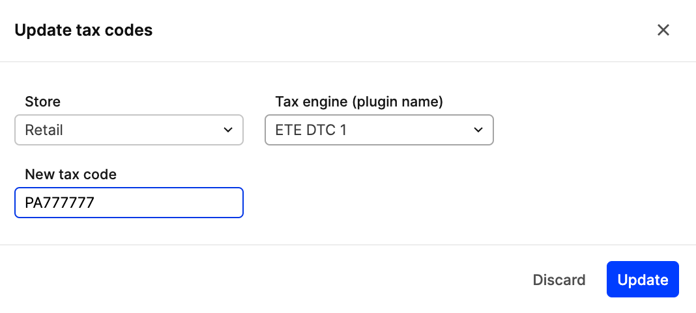
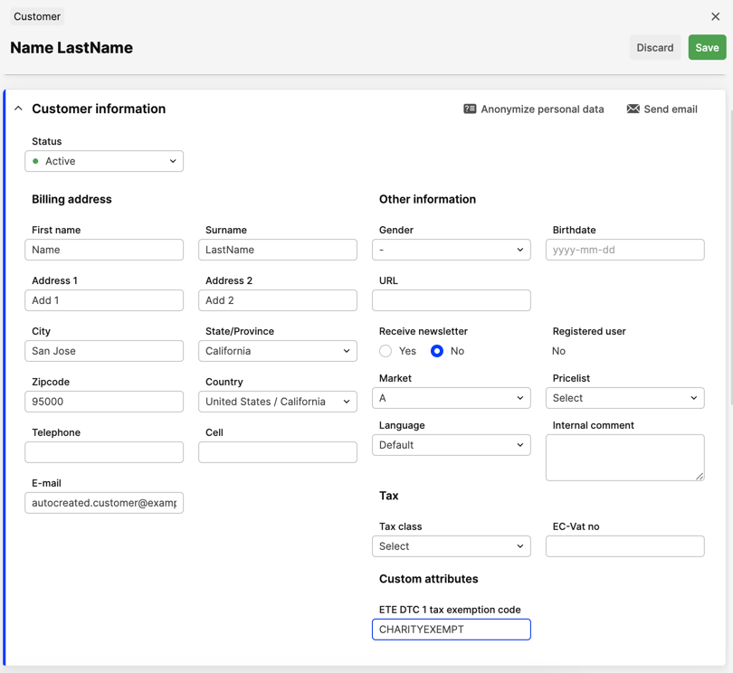

The custom tax engine plugin allows you to integrate external tax engine services of your choice that Centra does not
support out of the box. It is intended to be used along with Checkout API or on the AMS side in case of manual order 
creation. The external custom tax calculator will be called in various order lifecycle points (e.g. pre-checkout, 
on checkout, on shipping, etc.) to receive proper tax rates and apply them to the selection or the order.

## Setup

### Warehouse address

To calculate taxes for some countries (e.g. US, Canada, etc.) there is a requirement to have a warehouse address filled 
in. You need to specify the full address of the warehouse to calculate the tax correctly. You can fill in this data on 
the specific warehouse page.



### Plugin

Here is a sample of a custom tax engine plugin setup:



To set up the External tax engine (ETE) plugin, you need to provide all the basic information:
- `Plugin name` - the name used for some info displayed across the AMS (e.g. selectors, history entries)
- `Tax engine type` - should be `Custom`
- `API URL` - the endpoint Centra will send requests for tax calculation to.

[notice-box=alert]
Please note that this endpoint should be able to handle multiple types of payloads depending on the request type
(see [Request type concept](#request-type)).
[/notice-box]

- `Signing secret` - the string which will be used to construct the request signature header to make it possible 
to verify the validity of the request on your ETE side (see [Request signature concept](#request-signature)).

[notice-box=info]
You may see the plain value for the signing secret field on the plugin form, but don’t worry - we encrypt the field 
value on DB and store it safely.
[/notice-box]

- `Connection to the tax engine` - here you may check the connection to the API you specified above. See
[Test connection](#test-connection) to learn more about how the connection check works.
- `Supported countries` - there is a selector which defines the set of countries ETE should be called on. Order shipping 
address country selection triggers the check if ETE should be called, and calls it if the condition is fulfilled.
- `Same tax calculation on prices` - select if all countries used in this tax engine have tax calculated similarly 
(included in prices or on top of prices).
- `Tax on prices` - select if taxes are included in prices before the checkout or added on top of prices in the 
checkout.
- `Default tax code` - general fallback tax code will be sent on the basket line if you do not specify a different one 
on the product store level.
- `Default shipping tax code` - the shipping tax code will be sent on the basket line to calculate shipping costs' tax.
- `Default handling tax code` - the handling tax code will be sent on the basket line to calculate handling costs' tax.
- `Default return costs tax code` - the return costs tax code will be sent on the basket line to calculate return costs' 
tax.
- `Default no tax code` - the tax code for non-taxed non-physical goods, used for refunding the absolute money values 
including tax.

[notice-box=alert]
There is no way to set non-default shipping, handling, return cost and non-taxed codes now.
[/notice-box]

- `Send taxes to external system` - if selected, Centra will make requests to ETE not only for the tax calculation but 
for tax filing purposes. Those calls will have a separate request type, so you will know for sure when exactly the 
tax should be filed.

### Tax code batch assignment

There is a possibility to do a mass assignment of tax codes for products on the product catalog page. It has the `Update 
tax codes` batch action which allows the same tax code assignment for a batch of products on the store level.



### Customer exemption code assignment

There is a possibility to assign the custom exemption code for customer (in Retail) and for account (in Wholesale) to
provide more granular tax exemption experience for groups of customers. Entered exemption code will be sent in the 
payload so external tax service may define if customer/account is eligible for the exemption and apply it.



[notice-box=info]
In case you need to apply personal tax exemptions for certain users, you may check the
[Customer code definition](#customer-code-definition). However, a customer exemption code can also be used for such
purposes.
[/notice-box]

## Flow

At some points in the order lifecycle, it is required by Centra to make calls to the tax engine to calculate the proper 
tax amount. It may happen either pre-checkout (by filling in the shipping address, changing the number of order items, 
etc.) or post-checkout (adding/removing items from the order, warehouse changing on allocation, etc.).

In this case, Centra issues the request to ETE with order data (data set may vary depending on the request type) and 
waits for the response in some format (which also may vary depending on the same request type) to process it and apply 
the correct tax rules to the order. The way of defining which request and response formats should be used for which 
action is described below.

## Common request concepts

### Request type

By design, the plugin will send all tax calculation requests to the same endpoint specified in the plugin settings. 
However, the request body itself may contain a different set of fields depending on the request type (e.g. order 
calculation will have the full set of lines, but return calculation may require only some lines from the whole order 
with partial amount and quantity).

It means that custom ETE must be able to process different payloads and respond in different formats depending on the 
action that should be done. To define input and output formats correctly, Centra operates with `requestType` field value 
which indicates action should be done and schema set should be used to process the request properly.

| Request type                    | Description                                                                                                                                                                                                       | Request/response structure |
|---------------------------------|-------------------------------------------------------------------------------------------------------------------------------------------------------------------------------------------------------------------|----------------------------|
| `calculateTaxNoCommit`          | Calculate taxes for orders without the actual commit (it means no saving order data on the ETE side for further reporting to tax authorities). May be used on pre-checkout for the estimated tax calculation.     | `Order`                    |
| `calculateDeliveryTaxNoCommit`  | Calculate taxes for shipments without the actual commit (it means no saving shipment data on the ETE side for further reporting to tax authorities). Used on shipment creation for the estimated tax calculation. | `Delivery`                 |
| `calculateDeliveryTaxAndCommit` | Calculate taxes for shipments with the actual commit (with saving shipment data on the ETE side for further reporting to tax authorities). Used on shipment completion for the actual tax calculation.            | `Delivery`                 |
| `calculateReturnTaxNoCommit`    | Calculate taxes for returns without the actual commit (it means no saving return data on the ETE side for further reporting to tax authorities). Used on return creation for the estimated tax calculation.       | `Return`                   |
| `calculateReturnTaxAndCommit`   | Calculate taxes for returns with the actual commit (with saving return data on the ETE side for further reporting to tax authorities). Used on return completion for the actual tax calculation.                  | `Return`                   |
| `testTaxEngineConnection`       | Test the connection with the tax engine.                                                                                                                                                                          | `Test connection`          |

[notice-box=alert]
In case your external tax engine receives some unrecognizable payload (e.g. unknown request type, wrong data for 
required fields) or fails to calculate the tax for any reason - it should respond with a verbose 
[error](#error-response) and non-`2xx` response code, so Centra will be able to execute a proper fallback to 
the internal tax engine calculation.
[/notice-box]

[notice-box=alert]
You may receive the transaction with the committing type and same entity ID a few times. In this case, your tax engine 
should handle it properly and update the transaction committed before instead of responding with an error.
[/notice-box]

### Request signature

The request token is a hash value calculated with the `HMAC` method and hashing algorithm `sha512`. It uses the signing 
secret string from the plugin settings and JSON-encoded request body to calculate the header value.

To verify the request integrity, you need to construct the hash value in the same way with the same signing secret and 
compare the calculation result with the income header value.

Here is the example for header calculation in PHP, but a lot of languages have similar functions (or libraries 
supported) to calculate the hash value:

```php
private function calculateToken(array $payload, string $signingSecret): string
{
    return hash_hmac('sha512', json_encode($payload), $signingSecret);
}
```

If hashes are equal - it means that the request is valid and data is not corrupted, so it can be processed safely.

### Discount handling

Centra uses the approach of basket lines with negative values to handle discounts per line properly. It means that if 
you have a discount applied on selection, Centra will distribute it across the basket lines automatically and send you 
discount values per basket line with a negative amount for 2 reasons:
- to keep proper selection total sum calculation;
- to be able to calculate line discount tax value.

The discount line will have the same tax code as the item for which the discount is applied, and the line ID will be 
represented as the parent item ID + `-discount` postfix.

Here is the example, where line 1 is the main line, and line 2 is the discount applied to line 1:
```json
{
  "lines": [
      {
        "id": "133",
        "quantity": 1,
        "amount": 100,
        "taxCode": "code123",
        "taxIncluded": false,
        "addresses": {
          "shipFrom": {
            "country": "US",
            "postalCode": "07936",
            "state": "NJ",
            "city": "East Hanover",
            "line1": "27 Merry Ln",
            "line2": "apt. 111"
          },
          "shipTo": {
            "country": "US",
            "postalCode": "07936",
            "state": "NJ",
            "city": "East Hanover",
            "line1": "27 Merry Ln",
            "line2": "apt. 222"
          }
        },
        "sku": "Product123Variant456Size789",
        "description": "TestProduct1",
        "productNumber": "Product123"
      },
      {
        "id": "133-discount",
        "quantity": 1,
        "amount": -10,
        "taxCode": "code123",
        "taxIncluded": false,
        "addresses": {
          "shipFrom": {
            "country": "US",
            "postalCode": "07936",
            "state": "NJ",
            "city": "East Hanover",
            "line1": "27 Merry Ln",
            "line2": "apt. 111"
          },
          "shipTo": {
            "country": "US",
            "postalCode": "07936",
            "state": "NJ",
            "city": "East Hanover",
            "line1": "27 Merry Ln",
            "line2": "apt. 222"
          }
        },
        "sku": "Product123Variant456Size789",
        "description": "TestProduct1",
        "productNumber": "Product123"
      }
    ]
}
```
[notice-box=alert]
For proper tax information processing, Centra expects back the same line ID for both the product line and discount line 
as it has been sent in the payload. It will help to correctly connect the discount line to its product line.
[/notice-box]

### Additional costs handling

Additional costs (like shipping cost, handling cost, return cost, and return compensation (refund) cost) are using the 
similar approach to [how we handle discounts](#discount-handling), but each cost line may appear once in the 
order/shipment/return lines list. Also, each cost type have its own tax code defined on the plugin level, and some of 
the cost lines may appear only on some specific entities (e.g. return cost and return compensation cost may be applied 
for return only).

[notice-box=alert]
Additional cost lines will be presented on the payload only in case you define all additional cost tax codes on the
plugin. In case some additional cost code is empty, that additional cost line will not be sent in the `lines` array.
[/notice-box]

```json 
{
  "lines": [
    {
      "id": "shipping-delivery-{deliveryId}",
      "quantity": 1,
      "amount": 5,
      "taxCode": "shippingTaxCode",
      "taxIncluded": false,
      "addresses": {
        "shipTo": {
          "country": "US",
          "postalCode": "07936",
          "state": "NJ",
          "city": "East Hanover",
          "line1": "27 Merry Ln",
          "line2": "apt. 111"
        },
        "shipFrom": {
          "country": "US",
          "postalCode": "07936",
          "state": "NJ",
          "city": "East Hanover",
          "line1": "27 Merry Ln",
          "line2": "apt. 222"
        }
      },
      "sku": "shipping",
      "description": "Shipping costs"
    },
    {
      "id": "handling-delivery-{deliveryId}",
      "quantity": 1,
      "amount": 3,
      "taxCode": "handlingTaxCode",
      "taxIncluded": false,
      "addresses": {
        "shipTo": {
          "country": "US",
          "postalCode": "07936",
          "state": "NJ",
          "city": "East Hanover",
          "line1": "27 Merry Ln",
          "line2": "apt. 111"
        },
        "shipFrom": {
          "country": "US",
          "postalCode": "07936",
          "state": "NJ",
          "city": "East Hanover",
          "line1": "27 Merry Ln",
          "line2": "apt. 222"
        }
      },
      "sku": "handling",
      "description": "Handling costs"
    }
  ]
}
```

Additional cost line ID constructed by the following schema:

`cost type`-`entity type`-`entity id`

Possible cost types and entity types are explained in the tables below.

| Entity type | Description                             |
|-------------|-----------------------------------------|
| `order`     | This can be met on order calculation    | 
| `delivery`  | This can be met on shipment calculation | 
| `return`    | This can be met on return calculation   | 

| Additional cost type  | Description                                                                |
|-----------------------|----------------------------------------------------------------------------|
| `shipping`            | This applies if there is a shipping cost to tax                            | 
| `handling`            | This applies if there is a handling cost to tax                            | 
| `return-costs`        | This applies if there is a return cost to tax                              | 
| `return-compensation` | This applies if there is a return compensation (refund) cost to tax        | 
| `shipping-d`          | This can be met if there is a discount applied that affects shipping costs | 
| `handling-d`          | This can be met if there is a discount applied that affects handling costs | 

[notice-box=info]
Some amounts on additional cost lines may be negative, so your tax engine should not consider it as the wrong input. It 
depends both on the additional cost type and entity type.
[/notice-box]

[notice-box=alert]
For proper tax information processing, Centra expects back the same line ID for each additional cost line as it has been
sent in the payload. It will help to correctly connect the additional cost line to the entity.
[/notice-box]

### Customer code definition

The customer code is a string that may be used as a customer identifier for the definition of tax exemption on the 
external engine side. Centra transfers the customer’s code which you may associate with any kind of exemption in the 
process of tax calculation on your side, and return the exempted line(s) back to Centra to be processed.

Usually, Centra sends its customer ID as a string, e.g. `'77'`, so you may check which ID the customer has in Centra and 
build a connection between the customer and his exemption stored on your ETE side.

However, in the case of anonymous checkout on Centra, there is no customer ID available until the payment stage (it's 
the moment when we are creating the user in Centra even if the checkout is anonymous). But there are some points in 
order lifecycle before payment when we want to calculate some taxes, despite the customer is not existing yet.

At that moment, the customer code field will contain Centra basket ID instead of Centra customer ID. Centra basket ID is
quite a long and random string, so there are no chances it will match with some customer ID and trigger the exemption on
the ETE side.

### Company code definition

In case your tax engine supports a multi-company setup, you may want to specify explicitly for which company you want to
calculate the tax. For that purpose, Centra has a company code field on plugin level - a string that may be used as a 
company identifier for your external tax engine. According to the received code, your tax engine may book taxes on 
behalf of the legal entity you prefer.

### Test connection

There is a `Test connection` button that helps you to check if the connection with your service can be successfully
established. For some out-of-the-box tax engine types (like Avatax) the button works straight away. However, for custom 
external tax engine it will require some coding to be done on your side to make the button work since you need to accept 
and verify the payload, check request integrity, and maybe do some additional actions on your side (e.g. send some 
requests to external tax service under the hood if you use one).

You can check the details of what we are sending to your custom ETE, and which format we expect back, here: 
[Test connection request/response structure](#test-connection-requestresponse-structure).

### Request headers

Here is the list of headers we send with the request, all of them may be used for logging purposes and reported to
support for debugging purposes too.

| Header                | Type   | Comment                                                                                                                                                                                                                                                  |
|-----------------------|--------|----------------------------------------------------------------------------------------------------------------------------------------------------------------------------------------------------------------------------------------------------------|
| `X-Client-Id`         | string | Client instance ID, e.g. `boilerplate-dev`                                                                                                                                                                                                               |
| `X-Request-Id`        | string | Centra request ID, e.g. `1_1b4591cbd04624e5bce7b1d530adaabe`                                                                                                                                                                                             |
| `X-Correlation-Id`    | string | Centra correlation ID, e.g. `centra_1_1b4591cbd04624e5bce7b1d530adaabe`                                                                                                                                                                                  |
| `X-Request-Signature` | string | Contains the request signature string constructed with help of signing secret provided as a plugin setting. May be used to verify the origin of the request and the integrity of the request’s body. See more on [Request signature](#request-signature) |
| `User-Agent`          | string | Contains information regarding the Centra version used on request. Example: `Centra (https://centra.com), version: v3.33.1`                                                                                                                              |

### Error response

Error response structure is common for all entities, so it is listed only once here.

[notice-box=alert]
In case of an error, the response should have a non-`2xx` response code and a reasonable message for debugging purposes.
[/notice-box]

```json
{
  "error": {
    "message": "Unable to calculate tax."
  }
}
```

| Field     | Type   | Comment                             |
|-----------|--------|-------------------------------------|
| `message` | string | A message which indicates the error |

## Order request/response structure

### Request

#### Headers

See [Request headers](#request-headers).

#### Body

```json
{
  "data": {
    "requestType": "calculateTaxNoCommit",
    "taxEngine": "custom",
    "entityId": "12681d9bab682309c0fe60102d86d5d6",
    "customerCode": "50b9577bbe8f9",
    "transactionDate": "2023-04-07",
    "lines": [
      {
        "id": "133",
        "quantity": 1,
        "amount": 100,
        "taxCode": "code123",
        "taxIncluded": false,
        "addresses": {
          "shipFrom": {
            "country": "US",
            "postalCode": "07936",
            "state": "NJ",
            "city": "East Hanover",
            "line1": "27 Merry Ln",
            "line2": "apt. 111"
          },
          "shipTo": {
            "country": "US",
            "postalCode": "07936",
            "state": "NJ",
            "city": "East Hanover",
            "line1": "27 Merry Ln",
            "line2": "apt. 222"
          }
        },
        "sku": "Product123Variant456Size789",
        "description": "TestProduct1",
        "productNumber": "Product123"
      },
      {
        "id": "134",
        "quantity": 1,
        "amount": 200,
        "taxCode": "code456",
        "taxIncluded": false,
        "addresses": {
          "shipFrom": {
            "country": "US",
            "postalCode": "07936",
            "state": "NJ",
            "city": "East Hanover",
            "line1": "27 Merry Ln",
            "line2": "apt. 111"
          },
          "shipTo": {
            "country": "US",
            "postalCode": "07936",
            "state": "NJ",
            "city": "East Hanover",
            "line1": "27 Merry Ln",
            "line2": "apt. 222"
          }
        },
        "sku": "Product456Variant789Size012",
        "description": "TestProduct2",
        "productNumber": "Product456"
      }
    ]
  }
}
```

##### Order structure

| Field                              | Type                           | Comment                                                                                                                                                          |
|------------------------------------|--------------------------------|------------------------------------------------------------------------------------------------------------------------------------------------------------------|
| `requestType`                      | string                         | The request type indicates which type of calculation should be done on the ETE side, always equals to `calculateTaxNoCommit` for orders                          |
| `taxEngine`                        | string                         | Always equals `custom`                                                                                                                                           |
| `entityId`                         | string                         | Entity ID, here represents Centra basket ID                                                                                                                      |
| `customerCode`                     | string                         | Customer code, required primarily for tax exempt identification. For value explanation, see more on [Customer code definition](#customer-code-definition)        |
| `companyCode` (optional)           | string                         | Company code, used for transaction assigning to specific company in case of multi-company setup. See more on [Company code definition](#company-code-definition) |
| `customerExemptionCode` (optional) | string                         | Customer exemption code, used for tax exempt identification. See more on [Customer exemption code assignment](#customer-exemption-code-assignment)               |
| `transactionDate`                  | string, in `YYYY-MM-DD` format | Calculation date (current date by default but also may take past values, e.g. order creation date)                                                               |
| `lines`                            | array                          | Order lines for calculation                                                                                                                                      |

##### Line structure

| Field                      | Type                | Comment                                                                                                                                                                               |
|----------------------------|---------------------|---------------------------------------------------------------------------------------------------------------------------------------------------------------------------------------|
| `id`                       | string or integer   | Order line ID                                                                                                                                                                         |
| `quantity`                 | integer             | Quantity of items ordered                                                                                                                                                             |
| `amount`                   | float               | The sum of items' prices. Amount value may be negative in some cases (see more on [Discount handling](#discount-handling) or [Additional costs handling](#additional-costs-handling)) |
| `taxCode`                  | string              | Tax identifier, used to define the proper tax rate                                                                                                                                    |
| `taxIncluded`              | boolean             | Flag to indicate if line amount includes the tax value                                                                                                                                |
| `addresses`                | object of addresses | Shipping addresses information. The object may contain either `shipFrom` or `shipTo` address or both at the same time                                                                 |
| `sku` (optional)           | string              | Full item SKU (product + variant + size)                                                                                                                                              |
| `description` (optional)   | string              | Item description                                                                                                                                                                      |
| `productNumber` (optional) | string              | a.k.a. Product SKU                                                                                                                                                                    |

##### Address structure

| Field                   | Type   | Comment                      |
|-------------------------|--------|------------------------------|
| `country`               | string | Country ISO code (2 symbols) |
| `postalCode` (optional) | string | Postal code                  |
| `state` (optional)      | string | State ISO code (2 symbols)   |
| `city` (optional)       | string | City                         |
| `line1` (optional)      | string | Address line 1               |
| `line2` (optional)      | string | Address line 2               |

### Response

#### Success

```json
{
  "data": {
    "transactionId": "uniq-trans-id-123",
    "transactionType": "custom-operation-type-string",
    "totalTax": 19.18,
    "totalDiscount": null,
    "lines": [
      {
        "id": "133",
        "quantity": 1,
        "amount": 100,
        "taxableAmount": 96.5,
        "tax": 6.39,
        "taxIncluded": false,
        "rules": [
          {
            "taxId": "32b71e721c4fe0d80c922ed0e0badd3c",
            "taxName": "NJ STATE TAX",
            "taxableAmount": 96.5,
            "rate": 0.06625,
            "tax": 6.39
          }
        ]
      },
      {
        "id": "134",
        "quantity": 1,
        "amount": 200,
        "taxableAmount": 193,
        "tax": 12.79,
        "taxIncluded": false,
        "rules": [
          {
            "taxId": "32b71e721c4fe0d80c922ed0e0badd3c",
            "taxName": "NJ STATE TAX",
            "taxableAmount": 193,
            "rate": 0.06625,
            "tax": 12.79
          }
        ]
      }
    ]
  }
}
```

##### Order structure

| Field             | Type          | Comment                                                                                                                                                                                                                                                                                                                            |
|-------------------|---------------|------------------------------------------------------------------------------------------------------------------------------------------------------------------------------------------------------------------------------------------------------------------------------------------------------------------------------------|
| `transactionId`   | string        | Calculation result ID assigned by external tax calculator                                                                                                                                                                                                                                                                          |
| `transactionType` | string        | Type of calculated action assigned by external tax calculator. May be any string that will help you to indicate which operation has been done on your tax engine side (like order/delivery/return calculation, committed or not committed). You can either specify your own type or send back the type you received in the request |
| `totalTax`        | float         | Total tax value                                                                                                                                                                                                                                                                                                                    |
| `totalDiscount`   | float or null | Total discount value                                                                                                                                                                                                                                                                                                               |
| `lines`           | array         | Tax info per order line                                                                                                                                                                                                                                                                                                            |

##### Line structure

| Field           | Type    | Comment                                                                     |
|-----------------|---------|-----------------------------------------------------------------------------|
| `id`            | string  | Order line ID                                                               |
| `quantity`      | integer | Quantity of items ordered                                                   |
| `amount`        | float   | The sum of items' prices                                                    |
| `taxableAmount` | float   | Line amount value that should be taxed (may not equal the full line amount) |
| `tax`           | float   | Calculated tax value for all line items                                     |
| `taxIncluded`   | boolean | Flag to indicate if line amount includes tax value                          |
| `rules`         | array   | An array of tax rules applied to the current line                           |

##### Rule structure

| Field           | Type   | Comment                                                                                             |
|-----------------|--------|-----------------------------------------------------------------------------------------------------|
| `taxId`         | string | Tax rule identifier. Should be the same for equal rule types for proper grouping on the Centra side |
| `taxName`       | string | Name of the tax rule                                                                                |
| `taxableAmount` | float  | Line amount value that should be taxed by current rule (may not equal the full line amount)         |
| `rate`          | float  | Tax rate value, absolute (should be contained between 0 and 1)                                      |
| `tax`           | float  | Calculated tax value for the current line and rule                                                  |

#### Error

See [Error response](#error-response).

## Delivery request/response structure

### Request

#### Headers

See [Request headers](#request-headers).

#### Body

```json
{
  "data": {
    "requestType": "calculateDeliveryTaxNoCommit",
    "taxEngine": "custom",
    "entityId": "31-1",
    "customerCode": "100",
    "transactionDate": "2023-04-15",
    "lines": [
      {
        "id": "1122",
        "quantity": 1,
        "amount": 100,
        "taxCode": "code123",
        "taxIncluded": false,
        "addresses": {
          "shipFrom": {
            "country": "US",
            "postalCode": "07936",
            "state": "NJ",
            "city": "East Hanover",
            "line1": "27 Merry Ln",
            "line2": "apt. 111"
          },
          "shipTo": {
            "country": "US",
            "postalCode": "07936",
            "state": "NJ",
            "city": "East Hanover",
            "line1": "27 Merry Ln",
            "line2": "apt. 222"
          }
        },
        "sku": "Product123Variant456Size789",
        "description": "TestProduct1",
        "productNumber": "Product123"
      },
      {
        "id": "1123",
        "quantity": 1,
        "amount": 200,
        "taxCode": "code456",
        "taxIncluded": false,
        "addresses": {
          "shipFrom": {
            "country": "US",
            "postalCode": "07936",
            "state": "NJ",
            "city": "East Hanover",
            "line1": "27 Merry Ln",
            "line2": "apt. 111"
          },
          "shipTo": {
            "country": "US",
            "postalCode": "07936",
            "state": "NJ",
            "city": "East Hanover",
            "line1": "27 Merry Ln",
            "line2": "apt. 222"
          }
        },
        "sku": "Product456Variant789Size012",
        "description": "TestProduct2",
        "productNumber": "Product456"
      }
    ]
  }
}
```

##### Delivery structure

| Field                              | Type                                                                            | Comment                                                                                                                                                          |
|------------------------------------|---------------------------------------------------------------------------------|------------------------------------------------------------------------------------------------------------------------------------------------------------------|
| `requestType`                      | string, one of: `calculateDeliveryTaxNoCommit`, `calculateDeliveryTaxAndCommit` | The request type indicates which type of calculation should be done on the ETE side                                                                              |
| `taxEngine`                        | string                                                                          | Always equals `custom`                                                                                                                                           |
| `entityId`                         | string                                                                          | Entity ID, here represents Centra shipment ID                                                                                                                    |
| `customerCode`                     | string                                                                          | Customer code, required primarily for tax exempt identification. For value explanation, see more on [Customer code definition](#customer-code-definition)        |
| `companyCode` (optional)           | string                                                                          | Company code, used for transaction assigning to specific company in case of multi-company setup. See more on [Company code definition](#company-code-definition) |
| `customerExemptionCode` (optional) | string                                                                          | Customer exemption code, used for tax exempt identification. See more on [Customer exemption code assignment](#customer-exemption-code-assignment)               |
| `transactionDate`                  | string, in `YYYY-MM-DD` format                                                  | Calculation date (current date by default but also may take past values, e.g. shipment creation date or shipment completion date)                                |
| `lines`                            | array                                                                           | Shipment lines for calculation                                                                                                                                   |

##### Line structure

| Field                      | Type                | Comment                                                                                                                                                                               |
|----------------------------|---------------------|---------------------------------------------------------------------------------------------------------------------------------------------------------------------------------------|
| `id`                       | string or integer   | Shipment line ID                                                                                                                                                                      |
| `quantity`                 | integer             | Quantity of items shipped                                                                                                                                                             |
| `amount`                   | float               | The sum of items' prices. Amount value may be negative in some cases (see more on [Discount handling](#discount-handling) or [Additional costs handling](#additional-costs-handling)) |
| `taxCode`                  | string              | Tax identifier, used to define the proper tax rate                                                                                                                                    |
| `taxIncluded`              | boolean             | Flag to indicate if line amount includes the tax value                                                                                                                                |
| `addresses`                | object of addresses | Shipping addresses information. The object may contain either `shipFrom` or `shipTo` address or both at the same time                                                                 |
| `sku` (optional)           | string              | Full item SKU (product + variant + size)                                                                                                                                              |
| `description` (optional)   | string              | Item description                                                                                                                                                                      |
| `productNumber` (optional) | string              | a.k.a. Product SKU                                                                                                                                                                    |

##### Address structure

| Field                   | Type   | Comment                      |
|-------------------------|--------|------------------------------|
| `country`               | string | Country ISO code (2 symbols) |
| `postalCode` (optional) | string | Postal code                  |
| `state` (optional)      | string | State ISO code (2 symbols)   |
| `city` (optional)       | string | City                         |
| `line1` (optional)      | string | Address line 1               |
| `line2` (optional)      | string | Address line 2               |

### Response

#### Success

```json
{
  "data": {
    "transactionId": "uniq-trans-id-456",
    "transactionType": "delivery-custom-operation-type-string",
    "totalTax": 19.18,
    "totalDiscount": null,
    "lines": [
      {
        "id": "1122",
        "quantity": 1,
        "amount": 100,
        "taxableAmount": 96.5,
        "tax": 6.39,
        "taxIncluded": false,
        "rules": [
          {
            "taxId": "32b71e721c4fe0d80c922ed0e0badd3c",
            "taxName": "NJ STATE TAX",
            "taxableAmount": 96.5,
            "rate": 0.06625,
            "tax": 6.39
          }
        ]
      },
      {
        "id": "1123",
        "quantity": 1,
        "amount": 200,
        "taxableAmount": 193,
        "tax": 12.79,
        "taxIncluded": false,
        "rules": [
          {
            "taxId": "32b71e721c4fe0d80c922ed0e0badd3c",
            "taxName": "NJ STATE TAX",
            "taxableAmount": 193,
            "rate": 0.06625,
            "tax": 12.79
          }
        ]
      }
    ]
  }
}
```

##### Delivery structure

| Field             | Type          | Comment                                                                                                                                                                                                                                                                                                                            |
|-------------------|---------------|------------------------------------------------------------------------------------------------------------------------------------------------------------------------------------------------------------------------------------------------------------------------------------------------------------------------------------|
| `transactionId`   | string        | Calculation result ID assigned by external tax calculator                                                                                                                                                                                                                                                                          |
| `transactionType` | string        | Type of calculated action assigned by external tax calculator. May be any string that will help you to indicate which operation has been done on your tax engine side (like order/delivery/return calculation, committed or not committed). You can either specify your own type or send back the type you received in the request |
| `totalTax`        | float         | Total tax value                                                                                                                                                                                                                                                                                                                    |
| `totalDiscount`   | float or null | Total discount value                                                                                                                                                                                                                                                                                                               |
| `lines`           | array         | Tax info per shipment line                                                                                                                                                                                                                                                                                                         |

##### Line structure

| Field           | Type    | Comment                                                                     |
|-----------------|---------|-----------------------------------------------------------------------------|
| `id`            | string  | Shipment line ID                                                            |
| `quantity`      | integer | Quantity of items shipped                                                   |
| `amount`        | float   | The sum of items' prices                                                    |
| `taxableAmount` | float   | Line amount value that should be taxed (may not equal the full line amount) |
| `tax`           | float   | Calculated tax value for all line items                                     |
| `taxIncluded`   | boolean | Flag to indicate if line amount includes tax value                          |
| `rules`         | array   | An array of tax rules applied to the current line                           |

##### Rule structure

| Field           | Type   | Comment                                                                                             |
|-----------------|--------|-----------------------------------------------------------------------------------------------------|
| `taxId`         | string | Tax rule identifier. Should be the same for equal rule types for proper grouping on the Centra side |
| `taxName`       | string | Name of the tax rule                                                                                |
| `taxableAmount` | float  | Line amount value that should be taxed by current rule (may not equal the full line amount)         |
| `rate`          | float  | Tax rate value, absolute (should be contained between 0 and 1)                                      |
| `tax`           | float  | Calculated tax value for the current line and rule                                                  |

#### Error

See [Error response](#error-response).

## Return request/response structure

### Request

#### Headers

See [Request headers](#request-headers).

#### Body

```json
{
  "data": {
    "requestType": "calculateReturnTaxAndCommit",
    "taxEngine": "custom",
    "entityId": "31-1-2",
    "parentEntityId": "31-1",
    "customerCode": "100",
    "transactionDate": "2023-04-17",
    "taxationDate": "2023-04-15",
    "lines": [
      {
        "id": "15",
        "quantity": 1,
        "amount": -100,
        "taxCode": "code123",
        "taxIncluded": false,
        "addresses": {
          "shipFrom": {
            "country": "US",
            "postalCode": "07936",
            "state": "NJ",
            "city": "East Hanover",
            "line1": "27 Merry Ln",
            "line2": "apt. 111"
          },
          "shipTo": {
            "country": "US",
            "postalCode": "07936",
            "state": "NJ",
            "city": "East Hanover",
            "line1": "27 Merry Ln",
            "line2": "apt. 222"
          }
        },
        "sku": "Product123Variant456Size789",
        "description": "TestProduct1",
        "productNumber": "Product123"
      },
      {
        "id": "16",
        "quantity": 1,
        "amount": -200,
        "taxCode": "code456",
        "taxIncluded": false,
        "addresses": {
          "shipFrom": {
            "country": "US",
            "postalCode": "07936",
            "state": "NJ",
            "city": "East Hanover",
            "line1": "27 Merry Ln",
            "line2": "apt. 111"
          },
          "shipTo": {
            "country": "US",
            "postalCode": "07936",
            "state": "NJ",
            "city": "East Hanover",
            "line1": "27 Merry Ln",
            "line2": "apt. 222"
          }
        },
        "sku": "Product456Variant789Size012",
        "description": "TestProduct2",
        "productNumber": "Product456"
      }
    ]
  }
}
```

##### Return structure

| Field                              | Type                                                                        | Comment                                                                                                                                                          |
|------------------------------------|-----------------------------------------------------------------------------|------------------------------------------------------------------------------------------------------------------------------------------------------------------|
| `requestType`                      | string, one of: `calculateReturnTaxNoCommit`, `calculateReturnTaxAndCommit` | The request type indicates which type of calculation should be done on the ETE side                                                                              |
| `taxEngine`                        | string                                                                      | Always equals `custom`                                                                                                                                           |
| `entityId`                         | string                                                                      | Entity ID, here represents Centra return ID                                                                                                                      |
| `parentEntityId`                   | string                                                                      | Parent entity ID, here represents Centra shipment ID                                                                                                             |
| `customerCode`                     | string                                                                      | Customer code, required primarily for tax exempt identification. For value explanation, see more on [Customer code definition](#customer-code-definition)        |
| `companyCode` (optional)           | string                                                                      | Company code, used for transaction assigning to specific company in case of multi-company setup. See more on [Company code definition](#company-code-definition) |
| `customerExemptionCode` (optional) | string                                                                      | Customer exemption code, used for tax exempt identification. See more on [Customer exemption code assignment](#customer-exemption-code-assignment)               |
| `transactionDate`                  | string, in `YYYY-MM-DD` format                                              | Calculation date (current date by default but also may take past values, e.g. return creation date or return completion date)                                    |
| `taxationDate`                     | string, in `YYYY-MM-DD` format                                              | Taxation date (date when the shipment has been completed, required for proper tax value calculation for return)                                                  |
| `lines`                            | array                                                                       | Return lines for calculation                                                                                                                                     |

[notice-box=alert]
`taxationDate` should be used in tax calculation for items that are returned to make sure the same tax rules and rates 
are applied, and that refund value will not be undertaxed or overtaxed. `transactionDate` here serves as the actual date
when the return has been initiated. 
[/notice-box]

##### Line structure

| Field                      | Type                | Comment                                                                                                                                                                                                                                             |
|----------------------------|---------------------|-----------------------------------------------------------------------------------------------------------------------------------------------------------------------------------------------------------------------------------------------------|
| `id`                       | string or integer   | Return line ID                                                                                                                                                                                                                                      |
| `quantity`                 | integer             | Quantity of items returned                                                                                                                                                                                                                          |
| `amount`                   | float               | The sum of items' prices. Amount value may be positive, e.g. because of discount returns (see more on [Discount handling](#discount-handling)) or additional cost application (see more on [Additional costs handling](#additional-costs-handling)) |
| `taxCode`                  | string              | Tax identifier, used to define the proper tax rate                                                                                                                                                                                                  |
| `taxIncluded`              | boolean             | Flag to indicate if line amount includes the tax value                                                                                                                                                                                              |
| `addresses`                | object of addresses | Shipping addresses information. The object may contain either `shipFrom` or `shipTo` address or both at the same time                                                                                                                               |
| `sku` (optional)           | string              | Full item SKU (product + variant + size)                                                                                                                                                                                                            |
| `description` (optional)   | string              | Item description                                                                                                                                                                                                                                    |
| `productNumber` (optional) | string              | a.k.a. Product SKU                                                                                                                                                                                                                                  |

##### Address structure

| Field                   | Type   | Comment                      |
|-------------------------|--------|------------------------------|
| `country`               | string | Country ISO code (2 symbols) |
| `postalCode` (optional) | string | Postal code                  |
| `state` (optional)      | string | State ISO code (2 symbols)   |
| `city` (optional)       | string | City                         |
| `line1` (optional)      | string | Address line 1               |
| `line2` (optional)      | string | Address line 2               |

### Response

#### Success

```json
{
  "data": {
    "transactionId": "uniq-trans-id-789",
    "transactionType": "return-custom-operation-type-string",
    "totalTax": -19.18,
    "totalDiscount": null,
    "lines": [
      {
        "id": "15",
        "quantity": 1,
        "amount": -100,
        "taxableAmount": -96.5,
        "tax": -6.39,
        "taxIncluded": false,
        "rules": [
          {
            "taxId": "32b71e721c4fe0d80c922ed0e0badd3c",
            "taxName": "NJ STATE TAX",
            "taxableAmount": -96.5,
            "rate": 0.06625,
            "tax": -6.39
          }
        ]
      },
      {
        "id": "16",
        "quantity": 1,
        "amount": -200,
        "taxableAmount": -193,
        "tax": -12.79,
        "taxIncluded": false,
        "rules": [
          {
            "taxId": "32b71e721c4fe0d80c922ed0e0badd3c",
            "taxName": "NJ STATE TAX",
            "taxableAmount": -193,
            "rate": 0.06625,
            "tax": -12.79
          }
        ]
      }
    ]
  }
}
```

##### Return structure

| Field             | Type          | Comment                                                                                                                                                                                                                                                                                                                            |
|-------------------|---------------|------------------------------------------------------------------------------------------------------------------------------------------------------------------------------------------------------------------------------------------------------------------------------------------------------------------------------------|
| `transactionId`   | string        | Calculation result ID assigned by external tax calculator                                                                                                                                                                                                                                                                          |
| `transactionType` | string        | Type of calculated action assigned by external tax calculator. May be any string that will help you to indicate which operation has been done on your tax engine side (like order/delivery/return calculation, committed or not committed). You can either specify your own type or send back the type you received in the request |
| `totalTax`        | float         | Total tax value                                                                                                                                                                                                                                                                                                                    |
| `totalDiscount`   | float or null | Total discount value                                                                                                                                                                                                                                                                                                               |
| `lines`           | array         | Tax info per return line                                                                                                                                                                                                                                                                                                           |

##### Line structure

| Field           | Type    | Comment                                                                     |
|-----------------|---------|-----------------------------------------------------------------------------|
| `id`            | string  | Return line ID                                                              |
| `quantity`      | integer | Quantity of items returned                                                  |
| `amount`        | float   | The sum of items' prices                                                    |
| `taxableAmount` | float   | Line amount value that should be taxed (may not equal the full line amount) |
| `tax`           | float   | Calculated tax value for all line items                                     |
| `taxIncluded`   | boolean | Flag to indicate if line amount includes tax value                          |
| `rules`         | array   | An array of tax rules applied to the current line                           |

##### Rule structure

| Field           | Type   | Comment                                                                                             |
|-----------------|--------|-----------------------------------------------------------------------------------------------------|
| `taxId`         | string | Tax rule identifier. Should be the same for equal rule types for proper grouping on the Centra side |
| `taxName`       | string | Name of the tax rule                                                                                |
| `taxableAmount` | float  | Line amount value that should be taxed by current rule (may not equal the full line amount)         |
| `rate`          | float  | Tax rate value, absolute (should be contained between 0 and 1)                                      |
| `tax`           | float  | Calculated tax value for the current line and rule                                                  |

#### Error

See [Error response](#error-response).

## Test connection request/response structure

### Request

#### Headers

See [Request headers](#request-headers).

#### Body

```json
{
  "data": {
    "requestType": "testTaxEngineConnection",
    "taxEngine": "custom"
  }
}
```

##### Test connection request structure

| Field         | Type   | Comment                                    |
|---------------|--------|--------------------------------------------|
| `requestType` | string | Always equals to `testTaxEngineConnection` |
| `taxEngine`   | string | Always equals `custom`                     |

### Response

#### Success

[notice-box=success]
A successful request body will be ignored, so it's enough for your ETE to respond with a `2xx` response code with no or
empty body.
[/notice-box]

```json
{}
```

#### Error

See [Error response](#error-response).
