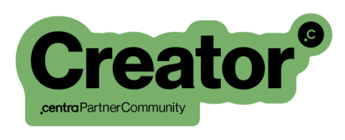
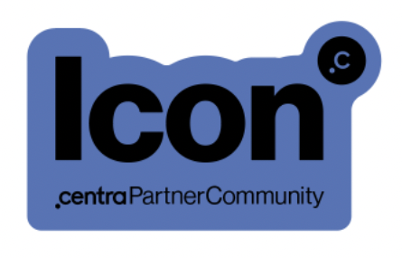
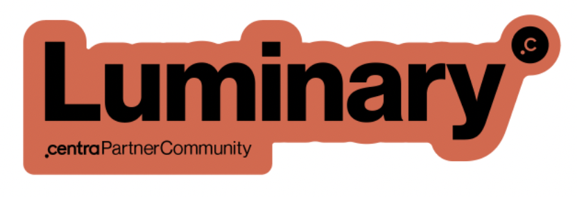

### Become a certified Centra partner!

Do you want to become a pro Centra integrator and prove to the rest of the world that you are? Let us invite you to our certification program, and once you're trained you will receive special Centra badges and bonuses!

To get ready for catching the certificate for FE Partner agencies, make sure you've read our [FE development guide](/fe-development/fe-elements).

If you'd like to join the legacy club of SOAP integrators, train through the [SOAP integration guide](/guides/erp-integration).

If you're interested in learning GraphQL, start with out [PIM guide](/guides/pim-gql-integration). It has a lot of ready-to-use examples you can run against your own Centra environment. We have even [more examples here](/api-references/graphql-integration-api/examples).

### Certification levels and benefits

Lorem ipsum

| **Certification level** | **What's required** | **What we offer** |
| --- | --- | --- |
| Centra beginner | Complete introduction webinars | Slack support |
|  | At least one common customer is live | Check-up meetings every 6 months |
|  | At 2-3 common customers are live | Check-up meetings every 3 months |
|  | At 5 customers are live | Check-up meetings every 1 month |

### Closest incoming webinar dates

| Webinar topic | Webinar date | Target audience |
| --- | --- | --- |
| Centra fundamentals | 13.09.2022 | All Centra users, mostly non-technical |
| Integration APIs - SOAP | 19.09.2022 | Integration/SOAP developers |
| Integration APIs - GraphQL | 20.09.2022 | Integration/GQL developers |
| Building a webshop using Checkout API | 21-22.09.2022 | FE developers, optionally project managers (mostly technical) |
