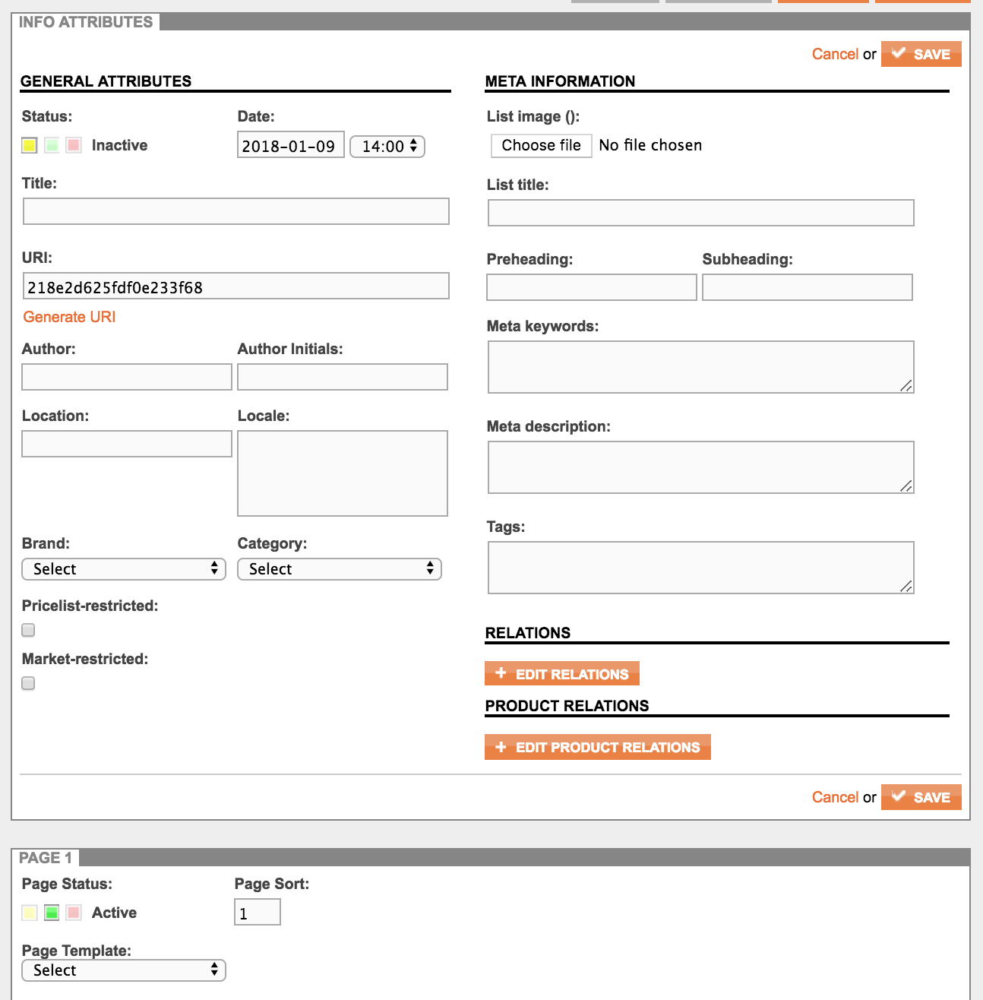
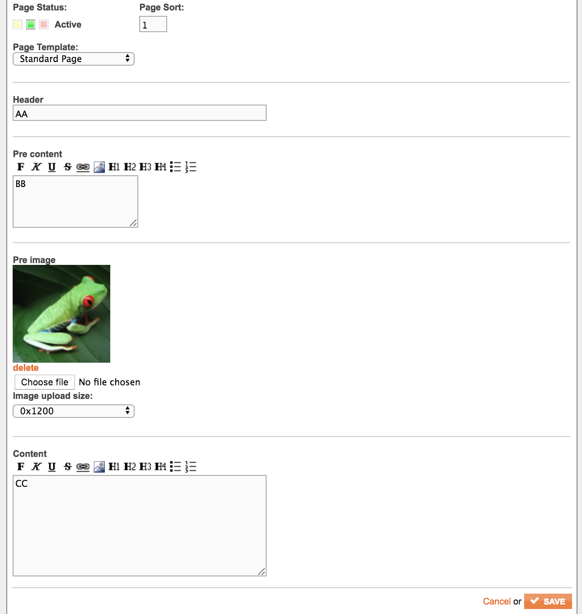

# CMS overview

Centra includes a lightweight CMS module that can be optionally activated. The CMS is fully headless and can be useful for applications when it is desirable to avoid having to integrate a full-scale CMS. The lightweight CMS is well-aligned to the e-commerce functionality in Centra and offers full multi-language support, but it does not support different editor roles or content version management.

This is how you set up the CMS-settings for your store.

The Centra CMS is based on a structure divided into the following tree:

```eval_rst
.. list-table::
   :widths: auto

   * - **Sections**

     - The different :ref:`sections <sections>` contain a collection of articles. A section can be reused across stores but it's often preferred to have sections set up specific to one store.

       .. list-table::
          :widths: auto

          * - **Articles**

            - Each section contains multiple :ref:`articles <articles>`.

              .. list-table::
                 :widths: auto

                 * - **Parts**

                   - Each article has multiple :ref:`parts <parts>`.

                     One part can have different sorts of :ref:`Part templates <part-templates>`.

                     .. list-table::
                        :widths: auto

                        * - **Slots**

                          - A part template can have multiple :ref:`slots <slots>`.

                            Each slot has different :doc:`Slot properties </guides/cms/slot-properties>`.
```

All these different levels are dynamic and can handle multiple properties.

The structure is based on this concept:

* You can have multiple sections, and in each section you can have multiple articles.
* You can have multiple parts in an article, and each part has a template.
* Each template can have multiple slots, and each slot has different settings depending on the slot type.

Then, we have a few different types of slots:

* [articlerelation](cms-articlerelation-property)
* [boolean](cms-boolean-property)
* [campaign](cms-campaign-property)
* [date](cms-date-property)
* [file](cms-file-property)
* [files](cms-files-property)
* [handpicked](cms-handpicked-property)
* [image](cms-image-property)
* [option](cms-option-property)
* [origin](cms-origin-property)
* [slideshow](cms-slideshow-property)
* [text](cms-textfield-property)
* [textfield](cms-textfield-property)

```eval_rst
.. _sections:
```
## Sections

This is the core structure of sections:

```eval_rst
.. code-block:: php
   :linenos:

   <?php
   $usr_conf['CMS_CONF']['SECTIONS'] = [
     "info" => ['BLOG ENTRY', 'BLOG', 'settings' => []],
     "news" => ['PAGE', 'PAGES', 'settings' => []],
   ];
```

For each section, the `key` for each element (ex: `info` and `news`) is the ID of the section. The array consists of the following data:

```eval_rst
.. list-table::
   :header-rows: 1

   * - Index
     - Description
     - Example

   * - ``0``
     - Section in singular.
     - ``PAGE``

   * - ``1``
     - Section in plural.
     - ``PAGES``

   * - ``setting``
     - :ref:`Section settings <section-settings>` for this section.
     - ``['template'=>'default_template', 'parts'=>1]``
```

```eval_rst
.. _section-settings:
```
### Section settings

The section settings define how the section should look, like and behave. The following settings are possible to set per section:

```eval_rst
.. list-table::
   :widths: auto

   * - ``parts``

       .. type:: int/boolean
          :required: false

     - Default ``true``. Max amount of parts allowed per article for this section.

       * ``true`` means unlimited.
       * ``2`` means two parts allowed.
       * ``0`` means no parts at all.

   * - ``template``

       .. type:: string
          :required: false

     - Default empty. Default template selected when creating a new article.

       Template with ID ``default-template`` will be selected per default when:

       ``'template' => 'default-template'``

   * - ``hide_forms``

       .. type:: array
          :required: false

     - Default empty. The ability to hide article fields. ``[key]=>true/false`` where ``key`` is the name of the field.

       This will hide the ``tags`` and the ``image``-field:

       ``'hide_forms' => ['art_tags' => true, 'art_mediasrc' => true]``

```

```eval_rst
.. _articles:
```
## Articles

The default view when creating articles inside a section looks like this:



The following keys and API-fields correspond to the image above. The `key`-field can be used for section settings to hide fields in the section. The API-field is what you get when querying the API.

```eval_rst
.. list-table::
   :widths: auto
   :header-rows: 1

   * - Field
     - key
     - API-field
     - Description

   * - **Title**
     - ``art_title``
     - ``"title": ""``
     - The title of the article.

   * - **Tags**
     - ``art_tags``
     - ``"tags": []``
     - List of tags connected to the article.

   * - **List image**
     - ``art_mediasrc``
     - ``"listImage": "https://..."``
     - Listing image for this article.

   * - **Category**
     - ``art_category``
     - ``"categories": []``
     - Product categories connected to this article.

   * - **Brand**
     - ``art_brand``
     - ``"brands": []``
     - Product brands connected to this article.

   * - **Author**
     - ``art_author``
     - ``"authorName": ""``
     - Name of the author for this article.

   * - **Location**
     - ``art_author_location``
     - ``N/A``
     - Location field for the author.

   * - **Preheading**
     - ``art_preheading``
     - ``"preHeading": ""``
     - Content before the header. Could also be used for other meta data.

   * - **Subheading**
     - ``art_subheading``
     - ``"subHeading": ""``
     - Content after the header. Could also be used for other meta data.

   * - **Meta keywords**
     - ``art_meta_keywords``
     - ``"metaKeywords": ""``
     - Meta keyword field for the article.

   * - **Meta description**
     - ``art_meta_description``
     - ``"metaDescription": ""``
     - Meta description field for the article.

   * - **Relations**
     - ``art_relations``
     - ``"relatedArticles": []``
     - List of articles related to this article.

   * - **Parts**
     -
     - ``"parts": []``
     - List of the parts for the article.

```


```eval_rst
.. _parts:
```
## Parts

Each part in an article can have a status (being enabled or not), a sort and a template set. Each part looks like this in the API:

```eval_rst
.. code-block:: json
   :linenos:

   {
     "template": "category_page",
     "slots": [
     ]
   }
```

```eval_rst
.. _part-templates:
```
## Part Templates

Part templates are set in the config using `['CMS_CONF']['TEMPLATES']` in `config.php`:

```eval_rst
.. code-block:: php
   :linenos:

   <?php
   $usr_conf['CMS_CONF']['TEMPLATES'] = [
    "info_item" => [
     "template" => "info_item",
     "name" => "Standard Page",
     "slots" => [
      [
        "name" => "header",
        "type" => "textfield",
        "desc" => "Header",
      ],
      [
        "name" => "pre_content",
        "type" => "text",
        "desc" => "Pre content",
        "class" => "",
      ],
      [
        "name" => "pre_image",
        "type" => "image",
        "desc" => "Pre image",
      ],
      [
        "name" => "content",
        "type" => "text",
        "desc" => "Content",
        "class" => "double",
      ],
     ]
    ],
   ];
```

In this case, this template will look like this:



And in the API, the data will look like this:

```eval_rst
.. code-block:: json
   :linenos:

   {
     "slots": {
       "header": {
         "slot": "header",
         "type": "textfield",
         "text": "AA"
       },
       "pre_content": {
         "slot": "pre_content",
         "type": "text",
         "text": "BB"
       },
       "pre_image": {
         "slot": "pre_image",
         "type": "image",
         "url": "https://demo.centracdn.net/client/dynamic/articles/costa-rican-frog_8712.jpg",
         "width": "280",
         "height": "210",
         "linkToUrl": null,
         "title": null,
         "description": "",
         "descriptionRaw": null,
         "class": null,
         "sizes": {
           "0": {
             "url": "https://demo.centracdn.net/client/dynamic/articles/costa-rican-frog_8712.jpg",
             "width": "280",
             "height": "210"
           },
           "medium": {
             "url": "https://demo.centracdn.net/client/dynamic/articles/medium-costa-rican-frog_8712.jpg",
             "width": "0",
             "height": "1200"
           },
           "original": {
             "url": "https://demo.centracdn.net/client/dynamic/articles/original-costa-rican-frog_8712.jpg",
             "width": 0,
             "height": 0
           }
         }
       },
       "content": {
         "slot": "content",
         "type": "text",
         "text": "CC"
       }
     }
   }
```

```eval_rst
.. _slots:
```
## Slots

The standard fields for each slot that needs to exist in the config, are `name`, `desc` and `type`.

For example:

```eval_rst
.. code-block:: php
   :linenos:

   [
     "name" => "pre_content",
     "type" => "text",
     "desc" => "Pre content",
   ],
```

Will create a simple text field, and the key `pre_content` and the description `Pre content` will show up as the title inside the Centra CMS.

You can select different types of [Slot properties](/guides/cms/slot-properties) for each slot.
