# Slot properties

There are multiple different slot types, and some of them can be configured.

```eval_rst
.. _cms-textfield-property:
```
## Type: textfield / text

Text and textfield slots are used to either have a regular one-line text or a textarea that supports HTML and multiple lines. Great for larger texts, headers and blog posts.

Regular text field, single line:<br />
`
  "type" => "textfield",
`

Large textarea, multi line:<br />
`
  "type" => "text",
`

```eval_rst
.. list-table::
   :header-rows: 1

   * - Property
     - Description
     - Options

   * - ``class``
     - Sets different classes being used on the textarea.

       You can use a combination of them to make it both wide and high.
     - ``empty`` will default settings
       ``double`` will be twice as wide
       ``triple`` will be three times as wide
       ``bigger`` will be double the height
```

### Example in config

```eval_rst
.. code-block:: php
   :linenos:

   [
     "name" => "header_title",
     "desc" => "Header title",
     "type" => "text",
     "class" => "",
   ],
   [
     "name" => "header_text",
     "desc" => "Text in header",
     "type" => "text",
     "class" => "double",
   ],
```

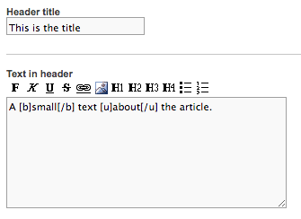

### API-output

```eval_rst
.. code-block:: json
   :linenos:

   "header_title": {
     "slot": "header_title",
     "type": "textfield",
     "text": "This is the title"
   },
   "header_text": {
     "slot": "header_text",
     "type": "text",
     "text": "A <strong>small</strong> text <u>about</u> the article."
   },
```

```eval_rst
.. _cms-image-property:
```
## Type: image

Image slot is used if only one image is needed. The image dimensions are set up using the <a href="#image-size-settings">image size-settings</a> array. The name of the image slot will try to match a size inside the image size-array. The image slot itself has the following properties:

```eval_rst
.. list-table::
   :header-rows: 1

   * - Property
     - Description

   * - ``position``

       .. type:: boolean

     - If the position field should be visible or not.

   * - ``link``

       .. type:: boolean

     - If the link field should be visible or not.

   * - ``title``

       .. type:: boolean

     - If the title field should be visible or not.

   * - ``text``

       .. type:: boolean

     - If the text field should be visible or not.

```

### Example in config

```eval_rst
.. code-block:: php
   :linenos:

   [
     "name" => "pre_image",
     "type" => "image",
     "desc" => "Pre image",
     "position" => true,
     "link" => true,
     "title" => true,
     "text" => true,
   ],
```

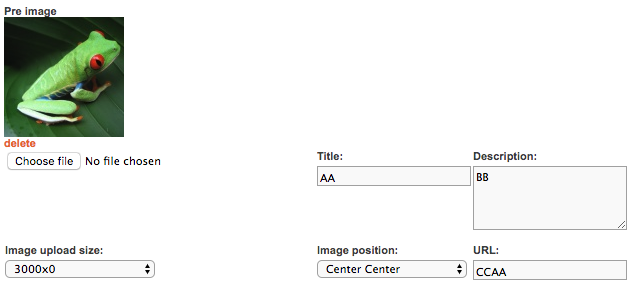

### API-output

```eval_rst
.. code-block:: json
   :linenos:

   {
     "pre_image": {
       "slot": "pre_image",
       "type": "image",
       "url": "https://demo.centracdn.net/client/dynamic/articles/costa-rican-frog_3398.jpg",
       "width": "100",
       "height": "75",
       "linkToUrl": "CCAA",
       "title": "AA",
       "description": "BB",
       "descriptionRaw": "BB",
       "position": "center center",
       "class": null,
       "sizes": {
         "0": {
           "url": "https://demo.centracdn.net/client/dynamic/articles/costa-rican-frog_3398.jpg",
           "width": "100",
           "height": "75"
         },
         "medium": {
           "url": "https://demo.centracdn.net/client/dynamic/articles/medium-costa-rican-frog_3398.jpg",
           "width": "1500",
           "height": "1200"
         },
         "large": {
           "url": "https://demo.centracdn.net/client/dynamic/articles/large-costa-rican-frog_3398.jpg",
           "width": "3000",
           "height": "0"
         },
         "original": {
           "url": "https://demo.centracdn.net/client/dynamic/articles/original-costa-rican-frog_3398.jpg",
           "width": 0,
           "height": 0
         }
       }
     }
   }
```

### Image size settings

Images share a list of different sizes that the images will be resized to. The image types are defined by a key, which is the same key for each slot. The image size-settings are placed in the config in the following field:

```eval_rst
.. code-block:: php
   :linenos:

   $usr_conf['CMS_CONF']['IMG_SIZES'] = [
    'other_image' => [
     [
      [1880, 700, 70]
     ]
    ],
    'pre_image' => [
     [
      [280, 0, 0, true],
      'medium' => [0, 1200, 0, true]
     ],
     [
      [100, 0, 0, true],
      'medium' => [1500, 1200, 0],
      'large' => [3000, 0, 0]
     ],
    ],
   ];
```

What this means is basically, if a slot has the name `pre_image`, it will have the following drop-down:

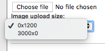

If the second one is selected (`3000x0`), and a PNG-file `3000x2250` there will be three images:

* image-name_1234.png (100x75)
* medium-image-name_1234.jpg (1500x1200)
* large-image-name_1234.jpg (3000x2250)

The first index in the size list is the "standard" image, the one without a prefix-key. The list of sizes in the CMS shows the largest size so you know at least what you need to upload to make it look nice.

These are the indexes supported per image:

```eval_rst
.. list-table::
   :widths: auto
   :header-rows: 1

   * - Index
     - Description
     - Values

   * - ``0``
     - Width
     - * ``0`` dynamic
       * ``123`` width will be 123

   * - ``1``
     - Height
     - * ``0`` dynamic
       * ``123`` height will be 123

   * - ``2``
     - Quality
     - * ``0`` lossless (filesize unchanged)
       * ``50`` Quality 50

       Recommended quality between ``92`` and ``98``.

   * - ``3``
     - Allow transparency
     - Default ``0``

       * ``1`` Allow transparency, image will be PNG if there is transparency in the image.
       * ``0`` Image will always be JPG (non transparent)
```

This means that a slot can have an option for the user to select different sizes for the images, but the system can still set restrictions for the images being uploaded. If you set the indexes all to `0` the image will be untouched. This is great if you want to upload an animated .gif for example: `'gif' => [0, 0, 0]`

```eval_rst
.. _cms-slideshow-property:
```
## Type: slideshow

Slideshow is used when multiple images should be present. They work similar to the `image`-slot and are also using the <a href="#image-size-settings">image size-settings</a>.

### Example in config

This is set inside the <a href="#image-size-settings">image-settings</a>:

```eval_rst
.. code-block:: php
   :linenos:

   'campaign_images' => [
     [
       [500, 500, 92],
       'medium' => [1000, 1000, 92]
     ],
     [
       [2000, 2000, 92],
       'large' => [3000, 3000, 92]
     ],
   ],
```

And this in the template:

```eval_rst
.. code-block:: php
   :linenos:

   [
    "name" => "campaign_images",
    "type" => "slideshow",
    "desc" => "Select images for the campaign header",
   ],
```

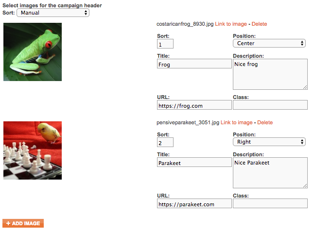

### API-output

```eval_rst
.. code-block:: json
   :linenos:

   {
     "campaign_images": {
       "slot": "campaign_images",
       "type": "slideshow",
       "images": [
         {
           "url": "https://demo.centracdn.net/client/dynamic/articles/costaricanfrog_8930.jpg",
           "width": "500",
           "height": "500",
           "size": "500x500",
           "sort": "1",
           "position": "center",
           "title": "Frog",
           "description": "Nice frog",
           "descriptionRaw": "Nice frog",
           "linkToUrl": "https://frog.com",
           "class": ""
         },
         {
           "url": "https://demo.centracdn.net/client/dynamic/articles/pensiveparakeet_3051.jpg",
           "width": "500",
           "height": "500",
           "size": "500x500",
           "sort": "2",
           "position": "right",
           "title": "Parakeet",
           "description": "Nice Parakeet",
           "descriptionRaw": "Nice Parakeet",
           "linkToUrl": "https://parakeet.com",
           "class": ""
         }
       ]
     }
   }
```

```eval_rst
.. _cms-handpicked-property:
```
## Type: handpicked

Handpicked is used to select specific products that should be provided as a list to be used inside the article. If `variants` is set to `true`, the publisher will be able to select what variant that should be shown, or else all variants in the product display will be listed.

### Example in config

```eval_rst
.. code-block:: php
   :linenos:

   [
     "name" => "campaign_products",
     "type" => "handpicked",
     "desc" => "Select products",
     "variants" => true,
   ],
```


### API-output

```eval_rst
.. code-block:: json
   :linenos:

   {
     "campaign_products": {
       "slot": "campaign_products",
       "type": "products",
       "products": {
         "1": {
           "product": "1",
           "name": "Test Product",
           "slotDescription": "Info about product 1",
           "categoryUri": "/shop/",
           "sortOrder": 0
         },
         "53": {
           "product": "53",
           "name": "Another Discounted Test Product",
           "slotDescription": "Nice purple product",
           "categoryUri": "/",
           "sortOrder": 1
         }
       }
     }
   }
```

### handpicket-place products

There's a special function if you have an image and want to place products on specific coordinates on the image.

You enable this, by pointing to the image-slot inside the handpicked-slot:

```eval_rst
.. code-block:: php
   :linenos:

   [
     "name" => "single_image",
     "type" => "image",
     "desc" => "Image",
   ],
   [
    "name" => "campaign_products",
     "type" => "handpicked",
     "desc" => "Select products",
     "variants" => true,
     "place_products" => "single_image",
   ],
```

This will make it possible to select a "Place Products"-button that will show up under the handpicked products:

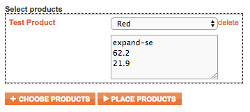
<br />
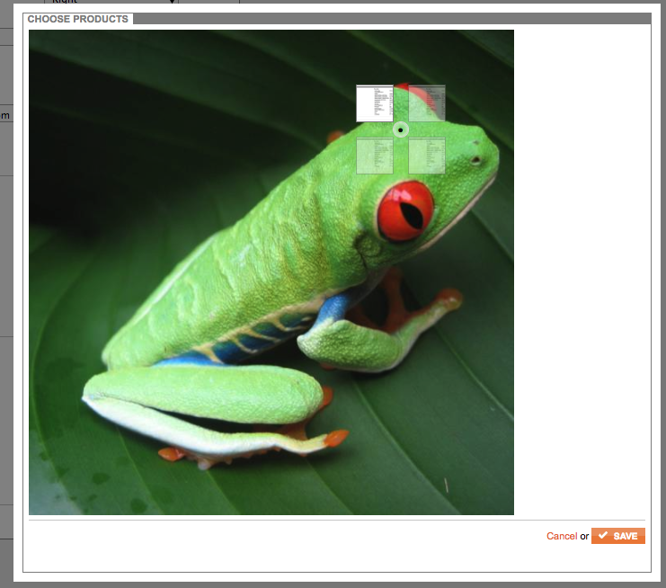

The coordinates will be inside the description-field and look like this in the API:

### API-output

```eval_rst
.. code-block:: json
   :linenos:

   {
     "campaign_products": {
       "slot": "campaign_products",
       "type": "products",
       "products": {
         "1": {
           "product": "1",
           "name": "Test Product",
           "slotDescription": "expand-se\r\n62.2\r\n21.9\r\n",
           "categoryUri": "/shop/",
           "sortOrder": 0
         }
       }
     }
   }
```

The format of `slotDescription` using "Place Products" is:

```eval_rst
.. code-block:
   :linenos:

   position
   x (in %)
   y (in %)
```

`position` can have the following values: `expand-nw`, `expand-ne`, `expand-sw`, `expand-se` (like a compass)

```eval_rst
.. _cms-file-property:
```
## Type: file

Great to use when there's a need for a file that should be downloaded. You can enable `title` and `text` if you need meta-data with the file. They are by default not visible.

### Example in config

```eval_rst
.. code-block:: php
   :linenos:

   [
    "name" => "pdf_for_download",
    "type" => "file",
    "desc" => "File to download",
    "title" => true,
    "text" => true,
   ],
```

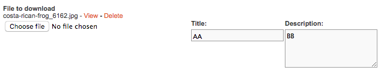

### API-output

```eval_rst
.. code-block:: json
   :linenos:

   {
     "pdf_for_download": {
       "slot": "pdf_for_download",
       "type": "file",
       "url": "https://demo.centracdn.net/client/dynamic/articles/costa-rican-frog_6162.jpg",
       "title": "AA",
       "text": "BB"
     }
   }
```

```eval_rst
.. _cms-files-property:
```
## Type: files

Same as <a href="#file">file</a> but with a list of files instead. Only supports a description.

### Example in config

```eval_rst
.. code-block:: php
   :linenos:

   [
    "name" => "files_for_download",
    "type" => "files",
    "desc" => "Files to list",
   ],
```

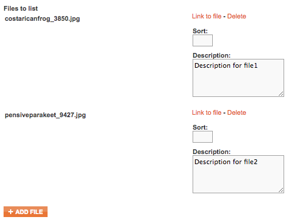

### API-output

```eval_rst
.. code-block:: json
   :linenos:

   {
     "files_for_download": {
       "slot": "files_for_download",
       "type": "files",
       "files": [
         {
           "url": "https://demo.centracdn.net/client/dynamic/articles/pensiveparakeet_9427.jpg",
           "description": "Description for file2"
         },
         {
           "url": "https://demo.centracdn.net/client/dynamic/articles/costaricanfrog_3850.jpg",
           "description": "Description for file1"
         }
       ]
     }
   }
```

```eval_rst
.. _cms-boolean-property:
```
## Type: boolean

Will create radio-buttons with Yes and No. You can use `default` to select which one should be selected per default.

### Example in config

```eval_rst
.. code-block:: php
   :linenos:

   [
     "name" => "image_in_top",
     "type" => "boolean",
     "desc" => "Image in top?",
     "default" => "1",
   ],
```

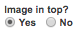

### API-output

```eval_rst
.. code-block:: json
   :linenos:

   {
     "image_in_top": {
       "slot": "image_in_top",
       "type": "boolean",
       "boolean": true
     },
   }
```

```eval_rst
.. _cms-option-property:
```
## Type: option

Create a dropdown of specified options. The `elements` array will make each element an option. The first key of each element is the value, and the second key is the description of each option. If `radio` is set to `true`, the list will be a bunch of radio-buttons instead of a dropdown.

### Example in config

```eval_rst
.. code-block:: php
   :linenos:

   [
     "name" => "background_selector",
     "type" => "option",
     "desc" => "Select Background",
     "elements" => [ ["blue","Blue"] , ["red","Red"] , ["yellow","Yellow"] , ["brown","Brown"] ],
     "default" => "red",
     "radio" => false,
   ],
```

If `radio` is set to `false` (default):

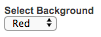

If `radio` is set to `true`:

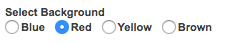

### API-output

```eval_rst
.. code-block:: json
   :linenos:

   {
     "background_selector": {
       "slot": "background_selector",
       "type": "option",
       "selected": "red"
     },
   }
```

```eval_rst
.. _cms-date-property:
```
## Type: date

The ability to make a field that will contain one date, or one "from" and "to". Setting `interval` to `true` means it will show two dates instead of only one.

### Example in config

```eval_rst
.. code-block:: php
   :linenos:

   [
     "name" => "date_of_event",
     "type" => "date",
     "desc" => "Pre image",
     "interval" => true,
   ],
```

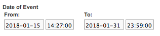

### API-output

```eval_rst
.. code-block:: json
   :linenos:

   {
     "date_of_event": {
       "slot": "date_of_event",
       "type": "date",
       "date": "2018-01-15 14:27:00",
       "date_end": "2018-01-31 23:59:00"
     }
   }
```

```eval_rst
.. _cms-campaign-property:
```
## Type: campaign

Enables you to select a specific campaign that will be referenced in the slot. Good to use if you want to make a link to a campaign or a list based on the campaign products.

### Example in config

```eval_rst
.. code-block:: php
   :linenos:

   [
     "name" => "campaign_list",
     "type" => "campaign",
     "desc" => "Select campaign to list",
   ],
```

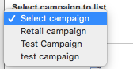

### API-output

```eval_rst
.. code-block:: json
   :linenos:

   {
     "campaign_list": {
       "slot": "campaign_list",
       "type": "campaign",
       "campaign": "2",
       "name": "Retail campaign"
     }
   }
```

```eval_rst
.. _cms-articlerelation-property:
```
## Type: articlerelation

Used to link to an article from a specific slot.

### Example in config

```eval_rst
.. code-block:: php
   :linenos:

   [
     "name" => "link_to_articles",
     "type" => "articlerelation",
     "desc" => "Link to articles",
   ],
```

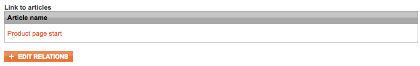

### API-output

```eval_rst
.. code-block:: json
   :linenos:

   {
     "link_to_articles": {
       "slot": "link_to_articles",
       "type": "articlerelation",
       "arts": [
         "20"
       ]
     }
   }
```

```eval_rst
.. _cms-origin-property:
```
## Type: origin

Used in combination with something else that needs a specific orientation. Visualized by 9 radio-buttons.

### Example in config

```eval_rst
.. code-block:: json
   :linenos:

   [
     "name" => "orientation",
     "type" => "origin",
     "desc" => "Position of image",
     "default" => "middle_left",
   ],
```

**Options:**<br />
`top_left`, `top_center`, `top_right`<br />
`middle_left`, `middle_center`, `middle_right`<br />
`bottom_left`, `bottom_center`, `bottom_right`<br />


### API-output

```eval_rst
.. code-block:: json
   :linenos:

   {
     "orientation": {
       "slot": "orientation",
       "type": "origin",
       "origin": "top_center"
     }
   }
```
