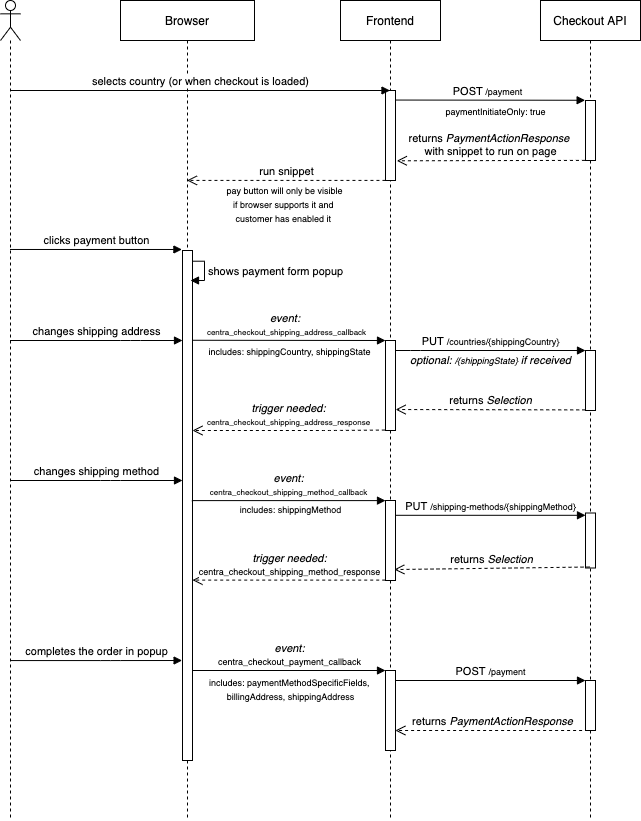
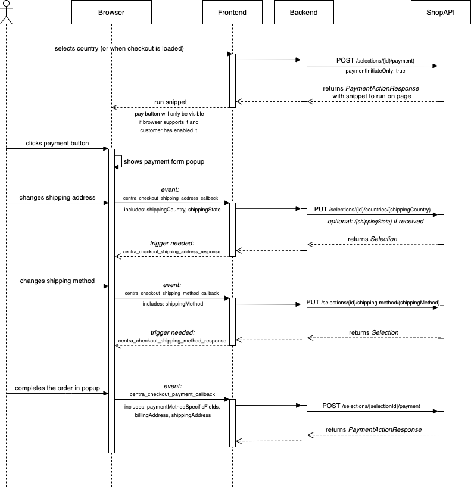

# Stripe Payment Intents

The Stripe Payment Intents-plugin is allowing you to render payment components on the checkout page that will bypass the checkout and use the browser's own Payment Request API. This allows you to use a Apple Pay and Google Pay button on your website for fast checkout.

Google Pay:


```eval_rst
.. image:: images/stripe-pi-google-pay.png
   :scale: 30 %
```

Apple Pay:

```eval_rst
.. image:: images/stripe-pi-apple-pay.png
   :scale: 30 %
```

### Limitations

The Payment Request API used for the payment buttons has a big limitation, when changing address information in the popup, it cannot switch the current currency of the order. This means that the code Centra uses to update the payment request will trigger a failure if the address and country selected in the browser popup results in a currency change.

When the address is changed in the browser popup an event will still be sent to the website to update the country against Centra, but as soon as it results in a currency change, the customer will see this:


```eval_rst
.. image:: images/stripe-pi-currency-change.png
   :scale: 30 %
```

**This makes it really important that the proper country is selected before the payment button is launched, as any address that requires the currency to change will get this error. We recommend always having the country selector as the first step in the checkout, to make sure the proper currency is set.**

This restriction might change in the future if the Payment Request API will support changing currency.

### Set up

To configure Stripe Payment Intents plugin in Centra go to store plugins, select desirable plugin and you should see similar screen to the screenshot below.


```eval_rst
.. image:: images/stripe-checkout-plugin.png
   :scale: 30 %
```

To connect your account just click `Connect with stripe` button and follow steps on Stripe page. This operation will bind your account with Centra's. After this you can start using Stripe Payments.

Depending on the "Test-Mode" selected, the connection will either be made to your Stripe Test account or your production account.

You can also restrict the Stripe Checkout to only work for specified markets, pricelists, countries or languages.

#### Payment option

The Stripe Checkout plugin will show up in the API as a payment method:

```json
"stripe-payment-intents": {
    "paymentMethod": "stripe-payment-intents",
    "paymentMethodType": "stripe-payment-intents",
    "name": "Stripe Checkout",
    "useForDigitalContent": true,
    "providesCustomerAddressAfterPayment": false,
    "addressRequiredFields": [
        "email",
        "firstName",
        "lastName",
        "address1",
        "city",
        "zipCode",
        "country"
    ],
    "hasTermsAndConditionsAgreement": false
},
```

If you're using it strictly for showing a Payment Button, you need to ignore showing this payment method in the list of payments you show to the customer. Since the complete payment flow is completed by clicking the button, there's no reason to select this payment method, you can just show the button directly above the other payment methods.

#### Apple Pay

To enable Apple Pay (both for Live and Test):

1. Add domain in [Stripe](https://dashboard.stripe.com/settings/payments/apple_pay)
2. Upload certificate to the domain that will host the checkout page to the following location: `.well-known/...`
3. Click on Validate inside Stripe to validate that the domain was verified with Apple.
4. Wait a few hours for it to kick in.

This will allow you to see the Apple Pay button if you have a supported device.

When you're using the Test-Mode in Centra connected to your Stripe Test account, no charges will be made when you pay through Apple Pay.


#### Configuration of Stripe Payment Intents

Make sure you have defined the Merchant-country in the Centra plugin which should be the same country as your business information in Stripe.


### Flow

The flow works like this:

1. Customer adds products to their cart. The country is either selected by the customer or selected by Geo-IP (based on the IP-address of the customer).
2. The website makes a `POST /payment` request with the country/state selected for the customer together with a `paymentInitiateOnly:true`-parameter. This tells Centra not to set the payment option as the selected one (since the payment button is selected opt-in by the customer when pressing it).
3. Centra will return a snippet that will try to launch the payment request button inside its own `<div>` provided in the snippet. You can also set the selector of the payment button by setting the `window.stripeRequestButtonSelector`-variable in the DOM.
4. If the browser of the customer allows a Payment Request button to launch, the button will show up. There are a few reasons why the button would not show up, so the design of the checkout needs to support the button not being initiated. When you're developing your checkout you can also see notifications in the developer-console in the browser why the payment button failed to launch.
5. If the customer changes anything in their selection, such as the quantity for a product, the `POST /payment` call needs to rerun and reload the payment button snippet with the proper amount.
6. If the customer clicks the button, there are certain selections the customer can do to modify the order. All of customer's actions trigger specific events that needs to be handled.

### Checkout API flow


```eval_rst
.. image:: images/stripe-pi-checkout-api.png
   :scale: 30 %
```

### Shop API flow

Whole flow for Shop API is really similar to Checkout API.


```eval_rst
.. image:: images/stripe-pi-shop-api.png
   :scale: 30 %
```

### Events

| Event to handle  | Parameters | Response event  |
|---|---|---|
| centra_checkout_shipping_address_callback  |  shippingCountry <br> shippingState <br> shippingZipCode | centra_checkout_shipping_address_response |
| centra_checkout_shipping_method_callback | shippingMethod  |  centra_checkout_shipping_method_response | 
| centra_checkout_payment_callback  | responseEventRequired <br> paymentMethod <br> billingAddress <br> shippingAddress <br> paymentMethodSpecificFields  | *(use if responseEventRequired == true )*<br> centra_checkout_payment_response |

Response event needs object like this to be provided:
```javascript
{
    country: location.country,
    currency: selection.currency,
    currencyDenominator: selection.currencyFormat.denominator,
    grandTotalPriceAsNumber: selection.totals.grandTotalPriceAsNumber,
    shippingMethod: selection.shippingMethod,
    shippingMethodsAvailable: Object.values(shippingMethods)
}
```

If error occurred while handling the event, response should be handled with following object:
```javascript
{
    error: true
}
```

### Testing

Before you start testing make sure that you have `Test-Mode: Yes` set in plugin configuration.

You can then use the [test-cards provided by Stripe](https://stripe.com/docs/testing#cards) to place test orders. For Apple Pay, you can use your regular card when making a purchase through the test-mode, but no charge will be made to your card. For Google Pay, you can add the test cards by going to `chrome://settings` and selecting `Payment Methods` and adding one of the test cards provided by Stripe. Test both the regular flow and the 3DS-flow.

### Example

We will now explain a regular checkout that includes the payment button.

When the customer goes to the checkout, you make a `GET /selection` call to fetch the current selection from Centra.

In this call, you will see that the payment button is available as a payment method:

```json
{
    "paymentMethod": "stripe-pi",
    "name": "Stripe Payments",
    "paymentMethodType": "stripe_payment_intents",
    "providesCustomerAddressAfterPayment": true,
    "handlingCost": "0.00 SEK",
    "handlingCostAsNumber": 0
}
```

Because you found a payment method in the `paymentMethods`-list, you will need to make an additional request to `POST /payment` to get the payment button snippet, like this:

```json
{
  "paymentMethod":"...",
  "paymentMethodInitiateOnly":true,
  "address":{"country":"SE"}
}
```

You need to provide the country to make sure Centra gives back a payment button with the proper currency, this is also why you need the country selector in the top of your checkout.

You will get back a snippet, like this:

```json
{
    "action": "form",
    "formHtml": "<script id=\"stripe_xrjiccsd3dxwbee7jgd...\"",
    "formType": "stripe-payment-intents",
    "formFields": {
        "sessionId": "cs_test_eiCyjbKKhib0n7Bf8ymS",
        "publishableKey": "pk_test_070RcVzmAMlxj",
        "externalScript": "https://js.stripe.com/v3/"
    }
}
```

You can decide here if you want either to initiate the Stripe Checkout by listening on the `formType`-field saying `stripe-payment-intents` and initiate your own Stripe Payment Button using the `formFields->externalScript` defined, or just render the `formHtml`. The `formHtml` will make it easy for you to get the proper events handled, and will support being reloaded multiple times.

The `formHTML` looks similar to this:

```html
<script id="stripe_eikqvgvwkdt545" data-publishable-key="pk_test_070RcVzmAMlxjQwtgLfaYXRZ00jVrZv4Va">
function loadStripeCheckout() {
    var newScript = document.createElement('script');
    newScript.async = true;
    newScript.src = 'https://js.stripe.com/v3/';
    newScript.onload = stripeCheckoutInit;
    document.children[0].appendChild(newScript);
}
var stripe;
function stripeCheckoutInit() {
    stripe = Stripe(
    document.getElementById("stripe_eikqvgvwkdt545").attributes["data-publishable-key"].nodeValue);
    stripe.redirectToCheckout({sessionId:"cs_test_eiCyjbKKhib0n7Bf8ymS"}).then(function (result) {
        alert(result.error.message);
    });
}
loadStripeCheckout();
</script>
```

The form will:

1. Initiate Stripe Payment Intents on the domain.
2. Initiate DOM-events whenever the customer changes shipping address or shipping method inside the Payment Request flow when clicking on the button. These events are made for you to listen to and to make additional API-calls from. The events might also need you to respond with a new DOM-event for the Payment Request flow to be reloaded.

If you will use the `formHtml`-snippet, you need to make sure you insert the HTML into your DOM, and also make sure you evaluate the javascript from the response. One solution to do this in React is to inject the HTML into the DOM, then run the following code on it:

Insert HTML into DOM
```js
const checkoutContainer = document.getElementById('stripeCheckoutContainer'); // Reference to element already on page
checkoutContainer.innerHTML = data.formHtml;
evaluate($checkoutContainer);
```

Execute Javascript
```js
export const evaluate = (subtree: any, context: {} = window) => {
  function getSnippetType(script: any) {
    return script.type || '';
  }
  function getRawSnippet(script: any) {
    return script.text || script.textContent || script.innerHTML || '';
  }

  if (subtree) {
    try {
      const scripts = subtree.getElementsByTagName('script');
      const scriptsAsArray = Array.from(scripts).filter(script => getSnippetType(script) !== 'application/json');

      scriptsAsArray.forEach((script) => {
        const unescaped = getRawSnippet(script).replace(/\\/gi, '');
        eval.call(context, unescaped);
      });
    } catch (error) {
      // tslint:disable-next-line:no-console
      console.error('Catched error in evaluate function:', error);
    }
  }
};
```

This will make sure that:

1. You do not evaluate `type=application/json` blobs from Centra.
2. The proper snippet will run after the DOM has changed.
