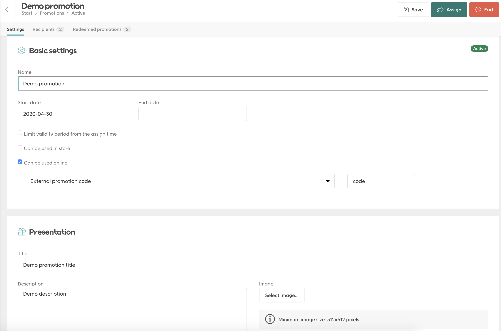

# How to use vouchers witch Voyado promotions?

## Prerequisites
In this scenario we assume that you already have an account in Voyado and configured `Voyado v2` in Centra.

## In Centra
First thing you need to do is add a new voucher to your store. The only thing that is required for this scenario is `Method: code`, `Max usage: 0` and `Start/stop date` set accordingly to your needs.

## In Voyado
It's time to add new promotion in Voyado.

1. Login to your account in Voyado
1. Go to Promotions > Active
1. Select New promotion > Multi-channel promotion
1. Create promotion
1. Fill `Start/end date` the same as in Centra
1. Check `Can be used online`
1. Select `External promotion code` and provide Centra's voucher code in the next field
1. It's up to you how you fill other fields - presentation part can be useful for frontend application
1. Save it, then Activate it
1. Assign contacts


```eval_rst
.. image:: images/voyado-promotions-with-voucher.png
   :scale: 30 %
```

## Front End
You can present active promotions from Voyado to your customer. 

Remember to query Voyado with additional header `apikey`.

If you don't have your customer's Voyado ID
1. Query `https://{{yourVoyadoDomain}}/api/v2/contactoverview?contactType={{type}}&email={{email}}`
1. In the response you'll get `promotions` list.


If you have your customer's Voyado ID use `https://{{yourVoyadoDomain}}/api/v2/contacts/{{customerVoyadoId}}/promotions?redemptionChannelType=ECOM` which will return list of promotions for this user.

Single promotion looks like this
```json
{
    "id": "12704681-e1d9-4861-9e75-abad00de9a6a",
    "externalId": null,
    "type": "Multichannel",
    "name": "Demo promotion",
    "expiresOn": null,
    "heading": "Demo promotion title",
    "description": "Demo description",
    "redeemed": true,
    "redeemedOn": "2020-05-07T13:14:48+02:00",
    "imageUrl": null,
    "link": null,
    "redemptionChannels": [
      {
        "type": "ECOM",
        "valueType": "EXTERNALOFFER",
        "value": "code",
        "instruction": null
      }
    ]
  }
```

You can use it to present available promotions to customer. Remember to show only promotions that have redemption channel with  value type `EXTERNALOFFER` and were not redeemed yet. As you can see in example above - your voucher code is in redemption channel under `value` key.
When customer selects the promotion, you should apply this code to the active selection.

When paying for an order remember to redeem Voyado's promotion so it won't be shown again.
Example payment query body:
```json
{
    "paymentMethod": ...,
    "termsAndConditions": ...,
    "paymentReturnPage": ...,
    "additionalFields": {
    	"voyado_promotion_id": "12704681-e1d9-4861-9e75-abad00de9a6a"
    },
    "address": {...
    }
}
```


## Security
Remember that you shouldn't reveal your Voyado's `apikey` to public. These queries should be done on backend.

Creating voucher like this will allow to use it for everyone, not only customers assigned in Voyado. 
