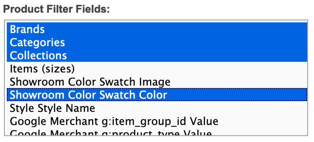
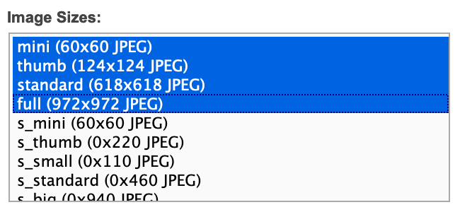
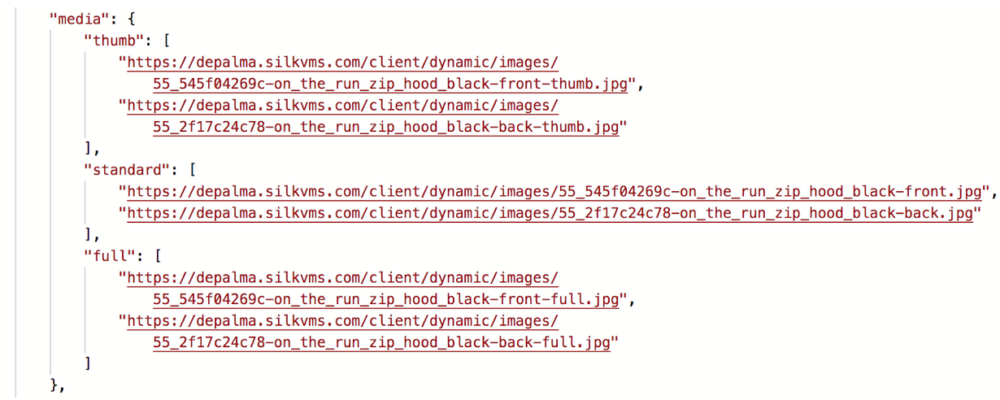
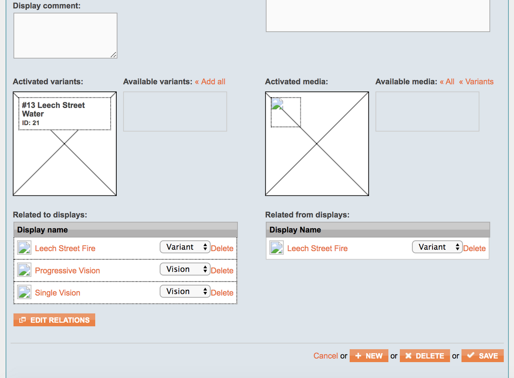
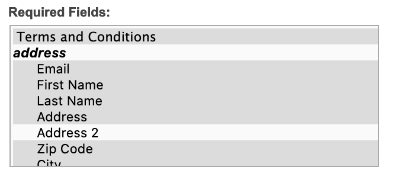

## Checkout API introduction

[Checkout API](/api-references/checkout-api) is a hybrid webshop API, built to operate both in client and server mode. In client mode it exposes all endpoints necessary to fetch products, filter categories, build a [selection](/glossary/glossary-basic#selection) (a.k.a. cart) and complete checkout process with a number of supported payment and shipping methods. In server (authenticated) mode it allows you to fetch details about all Markets, Pricelists and Warehouses, or explicitly set Market, Pricelist, Country or Language for current selection.

[notice-box=alert]
Server mode API calls made from a web browser will be blocked. Be careful to never expose your shared secret.
[/notice-box]
[notice-box=info]
You can further increase your store security by filtering allowed origins in the Checkout API plugin settings.
[/notice-box]

To read about and test the most commonly used endpoints, visit our [Swagger for Checkout API](https://docs.centra.com/swagger-ui/?api=CheckoutAPI). It also contains details of all data models used in Centra.

[notice-box=readMore]
Most of the concepts below are described in [Centra overview](/overview) chapters. It's worth reading before you dive into specifics of Checkout API implementation.
[/notice-box]

### How does it work?

When using Checkout API, the end-user's session context is controlled by three main aspects:
* **Market**, which allows you to segment your store and control which products will be shown or hidden. Each Market connects to a specific Warehouse group and serves stock from Warehouses in that group.
* **Pricelist**, which controls the which product prices in which currency will be displayed to the end user. The products with no price will be returned, but are not purchasable, meaning it's impossible to add them to the selection.
* **Language**, which affects whether or not product details and categories would be translated, with a fallback to default if no translation exists for a given language.

In standard operation those three variables are set based on the end-customer's country, which can either be set based on GeoIP location, or explicitly chosen with a country selector in your webshop. Once the country is changed, following things will change as well:
* If there is a Pricelist specific for this country, change to it and update the prices in current selection.
* If there is a Market specific for this country, change to it and update the products in current selection, removing the unavailable ones.
* If there is a Language specific for this country, and content (descriptions, category names, etc.) translations for this language are available, return translated content. Otherwise, fallback to the default language.

You can display the full list of countries to which your store can ship to by calling `GET /countries`. Alternatively, in authenticated server mode you can display a list of all countries using `GET /countries/all`, where shippable countries will be returned with `"shipTo": true` parameter. Shippable countries:
* Have at least one active Pricelist,
* Have at least one active Shipping list.

## Elements of the webshop

Here is how you can achieve a pleasant shopping and checkout experience for your customers.

### Product catalog

```text
Welcome to the store! Feel free to browse around.
```

[notice-box=info]
Whenever you use Centra API to fetch products, the product IDs used are actually the display IDs of the products. Like described in the [Product model chapter](/overview/products), the displays act as a presentation layer for your products.
[/notice-box]

There are a few ways to fetch products using Checkout API. To fetch a specific product, you can use the [GET /products/{product}](https://docs.centra.com/swagger-ui/?api=CheckoutAPI#/5.%20product%20catalog/get_products__product_) endpoint. The response object will contain the following data:

```json
{
  "token": "esf1p3tgchfg5ggtpqdpgqjtt6",
  "products": [...],
  "productCount": 344,
  "filter": [...]
}
```

* `token` is your session token,
* `products` is an array of products,
* `productCount` is the total number of products without paging. This way you can show “page 1 of 7” even if you only fetch 50 products at a time,
* `filter` are the filter values of the products you are viewing now, also without paging. This way you may know there are, for example, 35 red and 12 blue ones.

Another method is the [POST /products](https://docs.centra.com/swagger-ui/?api=CheckoutAPI#/5.%20product%20catalog/post_products) endpoint. An request with an empty body will return all active products. Results can be filtered using the following optional parameters:

```json
{
    "skipFirst": 5,
    "limit": 10,
    "categories": [1,2,3],
    "collections": [1,2,3],
    "silkProduct": 123,
    "search": "hello world",
    "products": [1,2,3],
    "relatedProducts": true,
    "brands": [1,2,3],
    "swatch.desc": ["Red", "Blue", "Green"],
    "items.name":["W24\/L30"],
    "onlyAvailable":true,
    "uri":{
        "uri":"jeans\/black",
        "for":["product", "category"]
    }
},
```

* `skipFirst` and `limit` can be used for paging.
* `categories`, `collections` and `brands` returns products in specified categories, collections and brands.
* `search` allows you to search for any text, e.g. product SKU.
* `relatedProducts` controls whether you get the complete data for those releated products. When `false`, you will only get a small subset of the data back: the media and related product ID, which is useful to present FE elements like "You may also like these products" or "".
* `swatch.desc` enables filtering based on the color swatch or any other custom attribute. The name of the attribute is a client specific.
* `items.name` filters on specific item names.
* `onlyAvailable`, when true, only returns products that are in stock or available for preorder. If you also specify `items.name`, those items must be available.
* `uri` filters on a product or category with a specific URI.

##### Examples

```json
POST products?pretty
{
  "limit": 2,
  "skipFirst": 5,
  "search": "som",
  "categories": [709],
  "swatch.desc": ["Red","Blue"]
}
```

This means return 2 products (while skipping first 5) which match:

```text
Free text search for "som" AND category = 709 AND swatch.desc = (Red OR Blue)
```

So how do you know about category 709? Or that swatch.desc can be Red or Blue? This is what the “filter” in the response is for. It contains all possible filtering values, and a count of how many products matches each filtering value in the current set of filtered products and for all products.

Full example responses can be found in Swagger for [POST /products](https://docs.centra.com/swagger-ui/?api=CheckoutAPI#/5.%20product%20catalog/post_products).

```json
  (...)
  "filter": [
    {
      "field": "swatch.desc",
      "values": [
        {
          "value": "Red",
          "count": 1,
          "totalCount": 35,
          "data": {
            "desc": "Red",
            "hex": "ff0000"
          }
        },
        {
          "value": "Blue",
          "count": 6,
          "totalCount": 12,
          "data": {
            "desc": "Blue",
            "hex": "0000ff"
          }
        }
      ]
    }
```

The `filter` object has values for the `swatch.desc` field at the end of this JSON blob. At the end of it value “Blue” shows `“count”:6`, which means there are 6 blue products in the current filtered set of products, `“totalCount”:12` means there are 12 blue products in total without filtering. The  `“data"` object contains the data the front end should use to display `“Blue”`, it is the same data as the `“swatch”` on the product itself.

In the filter object, the only thing that changes depending on what you filter on is the `“count”`. If you do not filter on anything, `count` will be equal to `totalCount`.

Finally, you can search products and categories by URI when using the [POST /uri](https://docs.centra.com/swagger-ui/?api=CheckoutAPI#/8.%20routing%20mechanism/post_uri) endpoint. You post a URI, and what the URI is for. Just like `POST /products`:

```json
POST /uri
{
    "uri":"jeans/slim-5-pocket-jeans-white",
    "for":["category", "product"],
    "limit":2,
    "skipFirst":0
}
```

Where:
* `uri` is the URI,
* `for` is what the URI is for, which can be `“product”`, `“category”` or both,
* `limit` + `skipFirst` are used for paging.

The response changes depending on what was found. Details and examples can be found in Swagger for [POST /uri](https://docs.centra.com/swagger-ui/?api=CheckoutAPI#/8.%20routing%20mechanism/post_uri) endpoint.

#### Category picker

In a product listing (a category page), you would usually list only the main products and perhaps indicate that a product has more versions when `relatedProducts` table is not empty. When you view a single product, you would usually display all the related products along with it.

`GET /categories` returns an array of categories like this:

```json
{
  "token": "esf1p3tgchfg5ggtpqdpgqjtt6",
  "categories": [
    {
      "category": "5",
      "name": [
        "Some category"
      ],
      "uri": "some_category"
    },
    {
      "category": "3",
      "name": [
        "V\u00e4xt"
      ],
      "uri": "vaxt"
    },
    {
      "category": "4",
      "name": [
        "V\u00e4xt",
        "Buske"
      ],
      "uri": "vaxt\/buske",
      "inCategory": "3"
    },
    {
      "category": "2",
      "name": [
        "V\u00e4xt",
        "Buske",
        "Nypon"
      ],
      "uri": "vaxt\/buske\/nypon",
      "inCategory": "4"
    }
  ]
}
```

This array is sorted in the order you set in the Centra admin panel. Notice that some categories in the array are sub-categories of another category. You see this on last two that have the field `inCategory` with the category ID of the category they are a subcategory of. Also notice the name array and uri of these, they contain the full name and uri, of the main category and under-categories.

#### Search and filtering

Checkout API allows you to filter on any of the pre-existing and custom product attributes. To do that, you need to select them in the Checkout API plugin configuration:



Remember to trigger ElasticSearch re-cache if you change the selected filters.

From now on you can use these filters in your `POST /products` calls. For example, if you're looking for a product with SKU "BB7112" and with swatch color "Red", simply run:

```
{
   "limit": 50,
   "skipFirst": 0,
   "search": "BB7112",
   "swatch.desc": "Red"
}

```

The precise filter name, `swatch.desc` in this example, depends on your custom attribute configuration. The attribute values will always be returned with the key `[attribute-name].[element-name]`, with the exception of elements called `text` - due to legacy reasons this element name will be omitted, and the value will be returned just as `[attribute-name]`.

#### Image galleries / carousels

To start with, in your Checkout API plugin configuration select all the image sizes that you would like the API to return:



If you would like to display multiple images on a product page, those will be served in a table inside the returned product model. Please note that the `standard` size is returned without any suffix.



If you would like to build a gallery of images of multiple products, it's easiest if the products are related to each other, otherwise you will need to make multiple product calls. By default two standard variant relations exist: for multiple product variants activated on the same display, and for variants activated on separate displays of the same product. You can also define your own relation types and configure them as ties between different products, for example to connect products that "go well together". In the example below there is one product related with "Variant" relation and two with "Vision" custom relation:



With that configuration, whenever you fetch a product, you will also receive info about all products related to it, together with the relation type. You can use the combination of the main product and the related products to build your image gallery / carousel.


### Country / language / market switcher

```text
Welcome! Välkommen! Witamy! ¡Bienvenida! Wilkommen! Üdvözöljük! Velkommen!
```

Both Markets and Pricelists can be configured to automatically apply to selections in specific countries. Because this needs to be deterministic, we have the following limitation to using countries as Geo-locations:
* One country can only be a geo-location for one Market per Store,
* One country can only be a geo-location for one Pricelist per currency per Store.

To fetch a list of shippable countries, you can call [GET /countries](https://docs.centra.com/swagger-ui/?api=CheckoutAPI#/1.%20general%20settings/get_countries). Alternatively, you can call [GET /countries/all](https://docs.centra.com/swagger-ui/?api=CheckoutAPI#/1.%20general%20settings/get_countries_all) in authenticated mode.

To switch the current selection to specific country, call [PUT /countries/{country}](https://docs.centra.com/swagger-ui/?api=CheckoutAPI#/3.%20selection%20handling%2C%20modify%20selection/put_countries__country_). If the country requires specifying a state as well, you should use [PUT /countries/{country}/states/{state}](https://docs.centra.com/swagger-ui/?api=CheckoutAPI#/3.%20selection%20handling%2C%20modify%20selection/put_countries__country__states__state_).

[notice-box=alert]
If you switch to a country which is not shippable (`"shipTo": false`), you will still be able to browse products and add them to selection, but you won't be able to complete the checkout process.
[/notice-box]

### Consents

```text
Here are the terms and conditions.
```

Don't forget that for a proper payment you need to add a Front End consent checkbox (or checkboxes). This needs to be verified by sending a boolean `"termsAndConditions": true` in your [POST /payment](https://docs.centra.com/swagger-ui/?api=CheckoutAPI#/4.%20selection%20handling%2C%20checkout%20flow/post_payment) call. Otherwise, you will receive the below error, which you should handle by displaying a message abount consents being required for checkout process to complete.

```json
{
    "token": "ca4c5e132179eaaa06a61e8c53a12500",
    "errors": {
        "termsAndConditions": "must be true"
    }
}
```

### My pages

```text
Would you like your usual?
```

### Newsletter sign-up form

```text
We have some cool stuff we'd love to show you now and in the future!
```

You can subscribe your customers for e-mail newsletter using [POST /newsletter-subscription/{email}](https://docs.centra.com/swagger-ui/?api=CheckoutAPI#/6.%20customer%20handling/post_newsletter_subscription__email_) endpoint. In it, you can choose to send `country` and `language` parameters, which can be used to control the newsletter language and to filter newsletter updates on products available in customer's Market. Registered newsletter e-mails can be found in Centra backend under Retail -> Customers -> Newsletter.

[notice-box=alert]
Be mindful to properly parse and encode the e-mail subscription field in your Front End. It's especially important characters like `@` and `+` are properly handled. Otherwise, for example, the plus `+` character can be wrongly replaced with a space, which can throw `Expected type e-mail` error.
[/notice-box]

### Newsletter sign-up for "Let me know when the product is back in stock"

If product which is out of stock shows "Notify me when back in stock", the customer can be registered under Customers > Newsletter with their e-mail address and the product that they wish to be notified about. This list  should automatically go to your audience ID or mailing list inside your ESP (E-mail Service Provider). However, there is no automation from Centra in terms of when stock is added, this is something that you would have to manually handle. So when the stock is back, you would go to the ESP and send e-mails to customers with that product and/or size.

To register products or specific product sizes for customer newsletter, you should call [POST /newsletter-subscription/{email}](https://docs.centra.com/swagger-ui/?api=CheckoutAPI#/6.%20customer%20handling/post_newsletter_subscription__email_) endpoint with optional parameters:  
* `country` - allows you to specify the country for the newsletter, which can affect the products availability you display based on the Market,
* `language` - allows you to specify the language of the newsletter, which helps you send a correct translation to specific customers,
* `product` - sent as `[displayID]` registers customer e-mail in the Newsletter list with a specific product,
* `item` - sent as `[displayID]-[sizeID]`, same as in [POST /items/{item}](https://docs.centra.com/swagger-ui/?api=CheckoutAPI#/2.%20selection%20handling%2C%20cart/post_items__item_) or [POST /items/{item}/quantity/{quantity}](https://docs.centra.com/swagger-ui/?api=CheckoutAPI#/2.%20selection%20handling%2C%20cart/post_items__item__quantity__quantity_), registers customer e-mail in the Newsletter list with a specific product size.

#### Sign-up voucher code

```text
Would you sign up if we offered you a discount?
```

[Automatic voucher on newsletter signup?]

### Basket / selection

```text
Sure you got everything you wanted?
```

At any point when you modify the selection (by adding items, changing payment method or filling address details), Centra will return the fully updated selection in the response. This way, unless you receive an error message, you can always make sure your changes were applied. You can also fetch the current selection at any time by calling [GET /selection](https://docs.centra.com/swagger-ui/?api=CheckoutAPI#/2.%20selection%20handling%2C%20cart/get_selection).

You can add products to the selection using one of the following API endpoints:
* [POST /items/{item}](https://docs.centra.com/swagger-ui/?api=CheckoutAPI#/2.%20selection%20handling%2C%20cart/post_items__item_), where `{item}` is the same as in `items.item` returned by the `/products` endpoint,
* [POST /items/{item}/quantity/{quantity}](https://docs.centra.com/swagger-ui/?api=CheckoutAPI#/2.%20selection%20handling%2C%20cart/post_items__item__quantity__quantity_), which allows you to add more items at once,
* [POST /items/bundles/{item}](https://docs.centra.com/swagger-ui/?api=CheckoutAPI#/2.%20selection%20handling%2C%20cart/post_items_bundles__item_), which is used to add a flexible bundle to the selection.

Remember, `item` specifies a product variant together with a specific size. Once an item is added to a selection, in the API reponse you will find a new **line ID**, under `selection.items.item.line`, e.g. `"line": "0416151f70083fe08677a929394a0351"`. A line ID defines a specific product variant in a specific size **for a specific selection/order**. This allows you to later remove the specific item from a selection using one of the API endpoints:
* [POST /lines/{line}](https://docs.centra.com/swagger-ui/?api=CheckoutAPI#/4.%20selection%20handling%2C%20checkout%20flow/post_lines__line_)
* [POST /lines/{line}/quantity/{quantity}](https://docs.centra.com/swagger-ui/?api=CheckoutAPI#/4.%20selection%20handling%2C%20checkout%20flow/post_lines__line__quantity__quantity_) to increase the quantity
* [PUT /lines/{line}/quantity/{quantity}](https://docs.centra.com/swagger-ui/?api=CheckoutAPI#/4.%20selection%20handling%2C%20checkout%20flow/put_lines__line__quantity__quantity_) to set specific quantity
* [DELETE /lines/{line}](https://docs.centra.com/swagger-ui/?api=CheckoutAPI#/4.%20selection%20handling%2C%20checkout%20flow/delete_lines__line_)
* [DELETE /lines/{line}/quantity/{quantity}](https://docs.centra.com/swagger-ui/?api=CheckoutAPI#/4.%20selection%20handling%2C%20checkout%20flow/delete_lines__line__quantity__quantity_)

The line ID is also necessary for creating returns for completed orders - you will need to specify exactly which order line should be added to the return.

### Shipping options

```text
How quickly you can get your stuff, and how much it would cost.
```

With every selection response, the API will include a `shippingMethods` table. In it you will receive all available shipping methods based on the current country of the selection. You can choose any of them using the [PUT /shipping-methods/{shippingMethod}](https://docs.centra.com/swagger-ui/?api=CheckoutAPI#/3.%20selection%20handling%2C%20modify%20selection/put_shipping_methods__shippingMethod_) call.

#### 'shipTo' parameter

While working on Centra setup, you may sometimes encounter an error saying the current country is not "shippable". You will see this in the API selection model, under `location.shipTo`. If this param is `false`, you will not be able to complete an order for this country. You should make sure this country is included in at least one active shipping in Centra -> Setup -> Shipping.

You can find out which countries are shippable with:
* [GET /countries](https://docs.centra.com/swagger-ui/?api=CheckoutAPI#/1.%20general%20settings/get_countries) - returns all shippable countries,
* [GET /countries/all](https://docs.centra.com/swagger-ui/?api=CheckoutAPI#/1.%20general%20settings/get_countries_all) (authorized mode) - returns all countries, each with a `shipTo` boolean.

### Checkout

```text
Let us know everything we need to know to deliver your stuff to you!
```

Your Checkout API plugin configuration allows you to specify which checkout fields (other than country) are required:



Even before completing the checkout and proceeding to payment, you can set some (or all) checkout fields using the [PUT /payment-fields](https://docs.centra.com/swagger-ui/?api=CheckoutAPI#/4.%20selection%20handling%2C%20checkout%20flow/put_payment_fields) endpoint. This endpoint can also be used to specify the checkout fields required for the [Cart Abandonment feature](/plugins/cartabandonment).

#### Newsletter sign-up 2

```text
Now that you've entered your e-mail, sure you wouldn't like to sign up for some promos?
```

### Payment

```text
Make it rain! / Pay up!
```

#### Payment plugins

#### Payment country

#### Payment steps

```text
POST /payment REQUEST
- paymentMethod: kco
- address: {...}
- shippingAddress: {...}
- paymentReturnPage: URL
- paymentFailedPage: URL

POST /payment RESPONSE
- action: redirect/success/failed
- formHTML
- formFields
- URL (for redirect)

POST /payment-results
- 201 success
  OrderCreatedModel

POST /payment:
- Checks payment methods
- Checks stock
- Checks shipping
- Checkout details (addres, e-mail, phone)
```

### Receipt page

```text
Thanks for your order!
```
