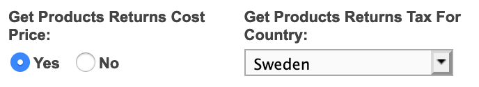
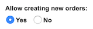

Connecting your Centra store with a Point of Sale system can be done using the Order API. It's relatively similar to how the WMS integrations work, with the main exception being that the sale is made outside of Centra. Some customers can even decide not to create the PoS orders in Centra at all.

### Overview

In general, PoS system integration will use Order API endpoints to fetch products and prices and update the existing stock accordingly. If you choose to create an order in Centra, stock will be updated automatically.

### Prerequisites

To implement a PoS integration using the Order API, you need access to Centra with a configured Order API endpoint. Please note that you would need to authorise with the secret key configured in the Centra Order API settings.

[notice-box=alert]Warning: Never use the integration you build towards a production Centra environment before it is thoroughly tested and verified to be working as intended![/notice-box]

### Initial configuration

For PoS system integration, the following Order API plugin configuration is recommended:



First setting will allow you to easily calculate profit. Second will apply a tax amount appropriate to the country of sale. Due to the difference in tax rules around the world, you will need to configure one API endpoint per every country in which you have points of sale.

### Fetching products

This API call allows you to look for products by their SKU, EAN or interal `productId`, with options to filter them by created/modified date and limit the amount of results. In response you will receive a list of products with details such as their name, brand, collection, categories, status (active or not) and product prices in each pricelist.

More information: [Order API - Get products](https://docs.centra.com/reference/stable/order-api/get-products)

#### Example request

```text
GET http://customer.centra.com/api/order-api/products/?ean=5901144123590
```

#### Example response

TBD

### Fetching stock

With the use of this endpoint you can fetch the amount of items available for purchase. You can search by `productId`, SKU or EAN, and in return you will get, among other details:

```json
"physicalStock": 499,
"allocatedStock": 7,
"availableStock": 492
```

You'll want to use `availableStock` value, since `allocatedStock` is already reserved to other existing orders, and will be deducted from `physicalStock` once those are shipped. To learn more about stock statuses, see [Example stock levels and definitions](/overview/stock/#example-stock-levels-and-definitions).

If a product has multiple sizes, the API will return the stock values for each of the product sizes separately.

More information: [Order API - Get stock](https://docs.centra.com/reference/stable/order-api/get-stock)

#### Example request

```text
GET http://customer.centra.com/api/order-api/stock/?ean=5901144123590
```

#### Example response

TBD

### Updating stock

Once the purchase is done, you need to update the physical stock levels in Centra so that you don't oversell your stock. **Remember**: This endpoint works by allowing you to set the stock amount of specific product to the **new** value, **not** deduct the amount that you're just now selling. In other words, if the `physicalStock` was 499, and the customer is buying 5 items, you'll want to update the stock to 494.

[notice-box=alert]Centra will not allow you to update the `physicalStock` below what's already reserved for other orders (`allocatedStock`). If you attempt to do that, Centra will set the quantity to the lowest possible value without affecting any other orders.[/notice-box]

The `product` in the call body needs to uniquely identify product, variant and size, so you can either use a combination of `productSku`, `variantSku` and `sizeSku`, or use EAN number instead.

More information: [Order API - Update stock](https://docs.centra.com/reference/stable/order-api/update-stock)

#### Example request

```text
POST http://customer.centra.com/api/order-api/stock/
```
```json
{
  "products": [
    {
      "product": "5901144123590",
      "quantity": 494
    }
  ]
}
```

#### Example response

TBD

<!--
### [Optional] Creating an order

[This chapter is work in progress]

If you wish, Centra can store the information about an order made in your Point of Sale. To enable this feature, you need to enable an additional function in the Order API plugin configuration:



!!!!! You can create orders which will be automatically saved and finalised as "Comleted" without the need to create shipment and complete payment capture, since there will be no shipment required, and payment already happened in your Point of Sale.

When creating order, the only required fields are customer's e-mail and country, amount of products that were purchased in that order. You can specify customer data either under `address`, or as `shippingAddress` and `billingAddress` separately.

!!!!! Is stock updated automatically?

More information: [Order API - Create order](https://docs.centra.com/reference/stable/order-api/create-order)

#### Example request

```text
POST http://customer.centra.com/api/order-api/order/
```
```json
{
   "address": {
       "email": "example@example.com",
       "country": "SE",
       "firstName": "John",
       "lastName": "Smith",
       "address": "Västra Rönneholmsvägen 62",
       "zipcode": "217 41",
       "city": "Malmö"
   },
   "products": [
       {
           "ean": "ABCDEFGHIJKL",
           "qty": 2
       }
   ]
 }
 ```

#### Example response

TBD
-->
