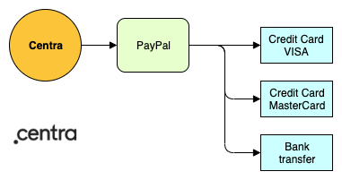
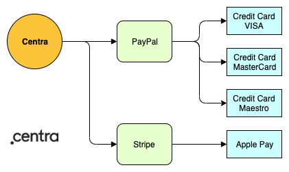
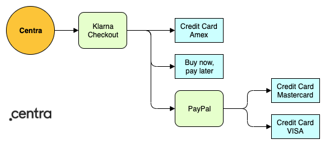

Centra does not integrate directly with any payment methods (like Mastercard). Instead, Centra integrates with Payment Service Providers (PSPs), who in turn integrates with payment methods. There are two advantages of this approach: as a client of Centra, you can support dozens of payment methods with only one or a few agreements with PSPs, while we at Centra don’t need to maintain integrations with dozens of payment methods. 

### Payment Service Providers and their supported payment methods

Key payment services providers supported by Centra are: Adyen, Klarna, PayPal and Stripe.

|  | Adyen | Klarna | PayPal | Stripe |
|---|---|---|---|---|
| Credit card - Mastercard | ✓ | ✓ | ✓ | ✓ |
| Credit card - Visa | ✓ | ✓ | ✓ | ✓ |
| Credit card - Maestro | ✓ | ✓ | ✓ | ✓ |
| Credit card - Amex | ✓ | ✓ | ✓ | ✓ |
| Bank transfer |  |  |  |  |
| Apple Pay |  |  |  | ✓ |
| Google Pay |  |  |  |  |
| Swish | ✓ |  |  |  |
| Buy now, pay later |  | ✓ |  |  |
| BLIK |  |  |  |  |
| Sofort | ✓ |  |  |  |
| Ideal NL |  | ✓ |  |  |

### Common PSP configurations

#### Scenario 1 - single PSP

In many cases it is sufficient to only use one PSP, as long as it covers all payment methods that will be used in your store. For example, PayPal will allow you to accept payments using each of the most popular credit cards or using a bank transfer.

#### Scenario 2 - multiple PSPs

In case a single PSP does not cover all required payment methods, it is often seen that two or more payment plugins are configured.

#### Scenario 3 - PSP in PSP

It is possible to configure PyaPal to work internally as an additional payment method inside Klarna Checkout.
