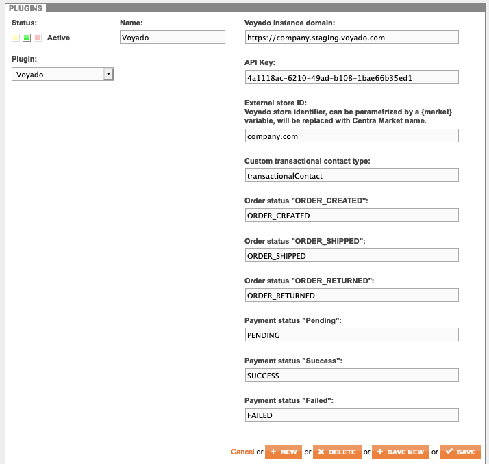

Voyado is a marketing automation platform with CRM and customer club features. You can set it up as the default mailer in your Centra by following these configuration steps.

### Configure your instance, store and API key in Voyado

TBD, we need an account to get an idea of how that looks in Voyado panel.

### Setup Voyado plugin in Centra

1. Log in to your Centra instance, then go to __'SYSTEM'__ > __'STORES'__ and select your store,
2. Store settings: make sure that order confirmation or order receipt, shipment and refund mails are all **turned on**,
3. Add a new Plugin Method, activate it, set the name (e.g. "Voyado"). Select __Voyado__ from under "E-mail triggers". Fill in the following fields:

    * __Voyado instance domain__ - e.g. `https://company.staging.voyado.com`,
    * __API Key__ - enter the API Key you got from Voyado,
    * __External store ID__ - enter the store ID you got from Voyado,
    * Other configs can be left default.

4. It should now look similar to this:  
    
5. Save. You've now connected Centra with Voyado and can place a test order to see if e-mail sending works as expected.
