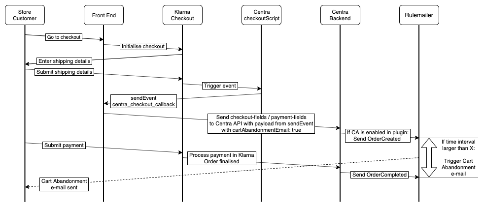
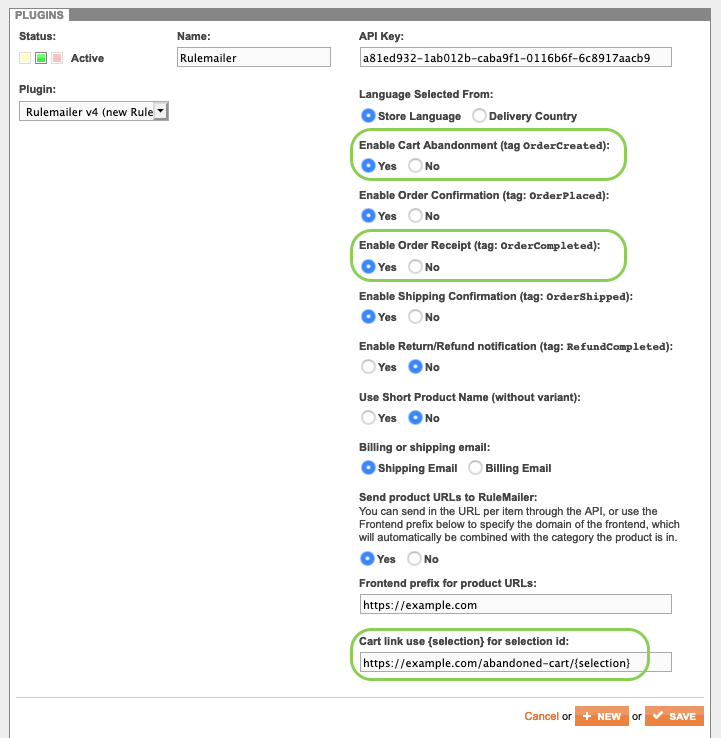

## What is required to enable Cart Abandonment?

If you're using Klarna Checkout for payment, you will need to configure the following items:
* [Klarna Checkout v3 plugin](/centra-sections/settings/plugins/klarnacheckoutv3),
* Rulemailer mailing plugin,
* Additional Front End changes to support event signalling between your webshop, Klarna plugin and Centra CheckoutScript,
* Additional Front End change to support recovering cart based on selection ID.

For any payment method other than Klarna Checkout, you will only need to configure:
* Rulemailer mailing plugin,
* Additional Front End change to support recovering cart based on selection ID.

## How does Cart Abandonment feature work?

In short, you need to have CA enabled in the Rulemailer plugin (see [Rulemailer plugin configuration](#rulemailer-plugin-configuration)), and you need to send a proper payload when submitting the payment - with customer's e-mail and `"cartAbandonmentEmail": true` parameter.

### Using Klarna Checkout



1. Store customer finishes selecting products, goes to checkout,
2. Your webshop initialises KCO plugin, which is returned together with Centra CheckoutScript that should be embedded on your website,
3. The customer enters shipping details and submits them,
4. KCO plugin receives the shipping details update and triggers `shipping_address_change` event, which is caught by the Centra CheckoutScipt,
5. CheckoutScript triggers `centra_checkout_callback` event, which needs to be caught and processed by your website (details below),
6. Your website calls `PUT /payment-fields` (when using Checkout API) or `PUT /checkout-fields` (when using Shop API) with updated values: `"email": "test@example.com"` and `"cartAbandonmentEmail": true`,
7. If Cart Abandonment is enabled in your Rule plugin, Centra will send an update to Rule with a tag `orderCreated`, that starts a countdown to a pre-defined time interval,
8. In the meantime, the store customer proceeds with selecting a payment method in Klarna and proceeds to payment,
9. Once payment is completed, Centra will send an update to Rule with a tag `orderCompleted`, that stops the countdown initialised in step 7,
10. Finally, depending on the timing:  
  a. If the time between `orderCreated` and `orderCompleted` is lower than the time interval set up in your Rule config, the order completes as normal and the store customer receives standard "Order receipt" e-mail.  
  b. Otherwise, after the pre-configured time internal is up, the store sends a "Cart abandoned" e-mail to the customer.

### Using other payment methods

With other payment methods you don't need to use the CheckoutScript, so the flow is slightly less complex.


1. Store customer finishes selecting products, goes to checkout,
2. The customer enters shipping details and submits them,
3. Your website calls `PUT /payment-fields` (when using Checkout API) or `PUT /checkout-fields` (when using Shop API) with updated values: `"email": "test@example.com"` and `"cartAbandonmentEmail": true`,
4. If Cart Abandonment is enabled in your Rule plugin, Centra will send an update to Rule with a tag `orderCreated`, that starts a countdown to a pre-defined time interval,
5. In the meantime, the store customer proceeds with selecting a payment method and proceeds to payment,
6. Once payment is completed, Centra will send an update to Rule with a tag `orderCompleted`, that stops the countdown initialised in step 4,
7. Finally, depending on the timing:  
  a. If the time between `orderCreated` and `orderCompleted` is lower than the time interval set up in your Rule config, the order completes as normal and the store customer receives standard "Order receipt" e-mail.  
  b. Otherwise, after the pre-configured time internal is up, the store sends a "Cart abandoned" e-mail to the customer.

## Rulemailer plugin configuration

The only additional configuration required for `Rulemailer v4` is to:
* Enable Cart Abandonment (tag `orderCreated`): should be set to `Yes`,
* Cart link: should be set to the URL your webshop uses for cart abandonment, e.g. `https://example.com/abandoned-cart/{selection}`.



Additionally, in your Rule configuration panel you should set the time interval it takes for CA e-mail to be triggered after receiving `orderCreated` tag, if `orderCompleted` is not received. Make sure this interval is not "immediate", but the specific time is up to you - it might be one hour, six hours or even one day.

## Klarna Checkout v3 configuration

KCOv3 plugin should be configured according to the instructions found in [Configure Klarna Checkout](/centra-sections/settings/plugins/klarnacheckoutv3).

## Additional Front End configuration

### Recovering customer cart using the selection ID

To properly recover customer's selection, the following logic should be added to your web shop.

1. CA link in Rule plugin configuration should point to, for example: `https://example.com/abandoned-cart/{selection}`
2. When visited, the given selection ID should be fetched from Centra and attached to the current customer session,
3. User should then be redirected to `https://example.com/checkout` (or `https://example.com/selection`, or whichever is your standard checkout page) with a proper list of products.

It is possible that the original products are out of stock, but that should be handled as usual during the checkout step, when `POST /payment` call does stock check and updates the selection accordingly.

[notice-box=info]
We recommend that the `.../abandoned-cart/` page should not be tracked by robots, so that the selection IDs are not exposed.
[/notice-box]

### Centra CheckoutScript - what is it?

[notice-box=info]
This is only required when using Klarna Checkout. If you're using another payment method, you can stop here.
[/notice-box]

In the selection response, if Klarna Checkout is active on the selection, Centra will return an element called `centraCheckoutScript`. It registers an event for events triggered by the widgets which need to be passed down to Centra, and convenience functions for suspension and resume of the widgets.

If you get the `centraCheckoutScript` in the selection response, you should add it to your page so that it is picked up.

### Centra CheckoutScript Events

Embed the script onto your page. You will also need to add an eventlistener for `centra_checkout_callback`, the job of that is to send the events it picks up back to Centra.

Below is an example of how the EventListener can look, where `var url` is your endpoint which sends the data as `PUT {api-url}/selections/{selection}/checkout-fields` (in Shop API) or `PUT {api-url}/payment-fields` (in Checkout API):

```js
document.addEventListener('centra_checkout_callback', function(origdata) {
    var url = '{your-endpoint-which-does-PUT-checkout/payment-fields}'
    $.ajax(url, {
        method:"POST",
        data: origdata.detail,
        success: function(data) {
            // Ajax update data from response
            CentraCheckout.resume(origdata.detail.additionalFields.suspendIgnore);
        }
    });
});
```
